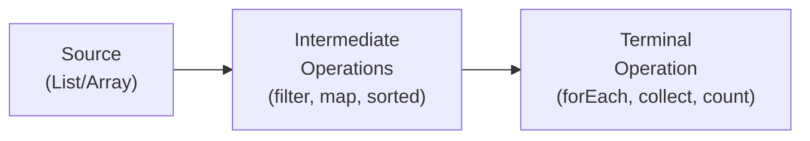

## What Versus How

There are two fundamental ways to express a computation:

1. **Imperative:** Describe the exact steps the computer must execute, in order.
2. **Declarative:** Describe the result you want, and let the system figure out how to produce it.

**Real-world analogy:** 

- **Imperative (taxi):** "Turn left at the traffic light. Drive 500 metres. Turn right at the junction. Stop at the third building on the left."
- **Declarative (Uber):** "Take me to 15 Broad Street." You describe the *destination*, not the route.

Both get you there. Declarative is often shorter, more readable, and lets the system optimise the path.

---

## Imperative vs. Declarative — Side by Side

**Task:** Find all students whose score is at least 50, sorted by score descending.

**Imperative (telling the computer HOW):**

```java
import java.util.*;

public class ImperativeSort {
    public static void main(String[] args) {
        String[][] students = {
            {"Chidi", "62"},
            {"Ngozi", "45"},
            {"Emeka", "78"},
            {"Amara", "55"},
            {"Babajide", "39"}
        };
        
        // Step 1: filter — manually check each student
        List<String[]> passing = new ArrayList<>();
        for (String[] student : students) {
            if (Integer.parseInt(student[1]) >= 50) {
                passing.add(student);
            }
        }
        
        // Step 2: sort — manually implement comparison-based sort
        passing.sort((a, b) -> Integer.parseInt(b[1]) - Integer.parseInt(a[1]));
        
        // Step 3: print — manually iterate and format
        for (String[] student : passing) {
            System.out.println(student[0] + ": " + student[1]);
        }
    }
}
```

**Declarative (Java Streams — describing WHAT):**

```java
import java.util.*;
import java.util.stream.*;

public class DeclarativeSort {
    public static void main(String[] args) {
        String[][] students = {
            {"Chidi", "62"},
            {"Ngozi", "45"},
            {"Emeka", "78"},
            {"Amara", "55"},
            {"Babajide", "39"}
        };
        
        // Describe WHAT: students with score >= 50, sorted descending, printed
        Arrays.stream(students)
              .filter(s -> Integer.parseInt(s[1]) >= 50)   // WHAT: keep scores >= 50
              .sorted((a, b) -> Integer.parseInt(b[1]) - Integer.parseInt(a[1]))  // WHAT: sort desc
              .forEach(s -> System.out.println(s[0] + ": " + s[1]));              // WHAT: print each
    }
}
```

**Output (both versions):**
```
Emeka: 78
Chidi: 62
Amara: 55
```

Notice: the declarative version reads like a description ("filter students, sort them, print them") rather than a procedure.

---

## SQL: The Classic Declarative Language

SQL (Structured Query Language) is the most widely used declarative language. You describe what data you want, not how to retrieve it.

**Example:** Find all students who passed (score ≥ 50), sorted by score:

```sql
SELECT name, score
FROM   students
WHERE  score >= 50
ORDER  BY score DESC;
```

**Equivalent Java (imperative):**

```java
// Step 1: get all rows
// Step 2: filter
// Step 3: sort
// Step 4: format output
// ... (8+ lines)
```

Four lines of SQL replaces many lines of imperative code. More importantly, the SQL *says what you want* — the database engine optimises *how* to retrieve it (choosing indexes, join order, etc.).

---

## HTML: Declarative Document Description

HTML is declarative — you describe the structure of a document, not the steps to display it.

```html
<!-- Declarative: what the page contains -->
<h1>Student Results</h1>
<p>The following students passed:</p>
<ul>
  <li>Emeka - 78</li>
  <li>Chidi - 62</li>
</ul>
```

You are not telling the browser: "draw a rectangle at coordinates (50, 100), write letters E, m, e, k, a in Arial 16pt..." — you describe *what* to show, and the browser decides *how* to render it.

---

## Declarative in Java: The Stream API

Java is primarily imperative, but the **Stream API** (Java 8+) adds declarative capabilities.

**Stream pipeline structure:**



**Common stream operations:**

| Operation | Type | What it does |
|---|---|---|
| `filter(predicate)` | Intermediate | Keep elements matching a condition |
| `map(function)` | Intermediate | Transform each element |
| `sorted()` | Intermediate | Sort elements |
| `distinct()` | Intermediate | Remove duplicates |
| `limit(n)` | Intermediate | Keep only first $n$ elements |
| `forEach(action)` | Terminal | Do something with each element |
| `collect(collector)` | Terminal | Gather into a List, Set, etc. |
| `count()` | Terminal | Count elements |
| `average()` | Terminal | Compute average |

### Worked Example 1: Student Average

```java
import java.util.Arrays;
import java.util.List;

public class StudentAverage {
    public static void main(String[] args) {
        List<Integer> scores = Arrays.asList(72, 45, 88, 61, 53, 90, 38, 76);
        
        // DECLARATIVE: describe the computation, not the steps
        double average = scores.stream()
                               .filter(score -> score >= 50)    // only passing scores
                               .mapToInt(Integer::intValue)      // convert to IntStream
                               .average()                        // compute average
                               .getAsDouble();                   // extract result
        
        System.out.printf("Average of passing scores: %.2f%n", average);
        // Output: Average of passing scores: 73.20
    }
}
```

### Worked Example 2: Transform and Collect

```java
import java.util.Arrays;
import java.util.List;
import java.util.stream.Collectors;

public class TransformDemo {
    public static void main(String[] args) {
        List<String> names = Arrays.asList("chidi", "ngozi", "emeka", "amara");
        
        // DECLARATIVE: transform all names to uppercase, then collect to list
        List<String> upperNames = names.stream()
                                       .map(name -> name.toUpperCase()) // transform each
                                       .collect(Collectors.toList());   // gather into list
        
        System.out.println(upperNames);
        // Output: [CHIDI, NGOZI, EMEKA, AMARA]
        System.out.println(names);
        // Output: [chidi, ngozi, emeka, amara] — ORIGINAL UNCHANGED
    }
}
```

---

## When Declarative is Better (and When It Is Not)

**Declarative wins when:**
- The "what" is clear and the "how" is complex (database queries, transformations)
- You want concise, readable code
- The system can optimise the implementation (e.g., SQL query planner)

**Imperative wins when:**
- You need precise control over performance
- The algorithm is inherently sequential with state
- You are doing low-level operations

**In practice — Java's hybrid approach:**

Java lets you choose. Write a `for` loop (imperative) when you need step-by-step control. Use Streams (declarative) when you are transforming collections.

---

## Common Mistake to Avoid

**Wrong:** Using a stream when you need to modify a loop variable.

```java
// WRONG — trying to mutate a variable inside a stream
int total = 0;
scores.stream().forEach(score -> total += score); // COMPILE ERROR — total must be final!
```

Streams are built for declarative, side-effect-free operations. For accumulation, use `reduce` or `sum`:

```java
// CORRECT — use the declarative sum operation
int total = scores.stream()
                  .mapToInt(Integer::intValue)
                  .sum();
```

---

## Key Takeaway

> Declarative programming describes *what* the result should be, not *how* to produce it. SQL, HTML, and Java Streams are all declarative. Declarative code is often shorter, clearer, and easier to extend — but requires understanding the abstractions involved. In Java, you can mix imperative (loops, if-statements) with declarative (Streams) depending on the problem.

---

## Exam Tips

**What lecturers test:**
- Define declarative programming and contrast with imperative
- Give examples of declarative languages (SQL, HTML, Java Streams)
- Write a Java Stream pipeline to filter and sort a list
- Explain why streams cannot easily use mutable local variables

**Common mistakes:**
- Saying "Java is declarative" without qualification — Java is primarily imperative, with declarative features (Streams) added in Java 8
- Trying to mutate external variables inside a `.forEach()` or `.map()` — this will not compile (variables captured in lambdas must be effectively final)

**Likely question:**
> "Distinguish between imperative and declarative programming. Write an imperative Java program to find all scores above 60, and then rewrite it using Java Streams (declarative style)." (10 marks)
