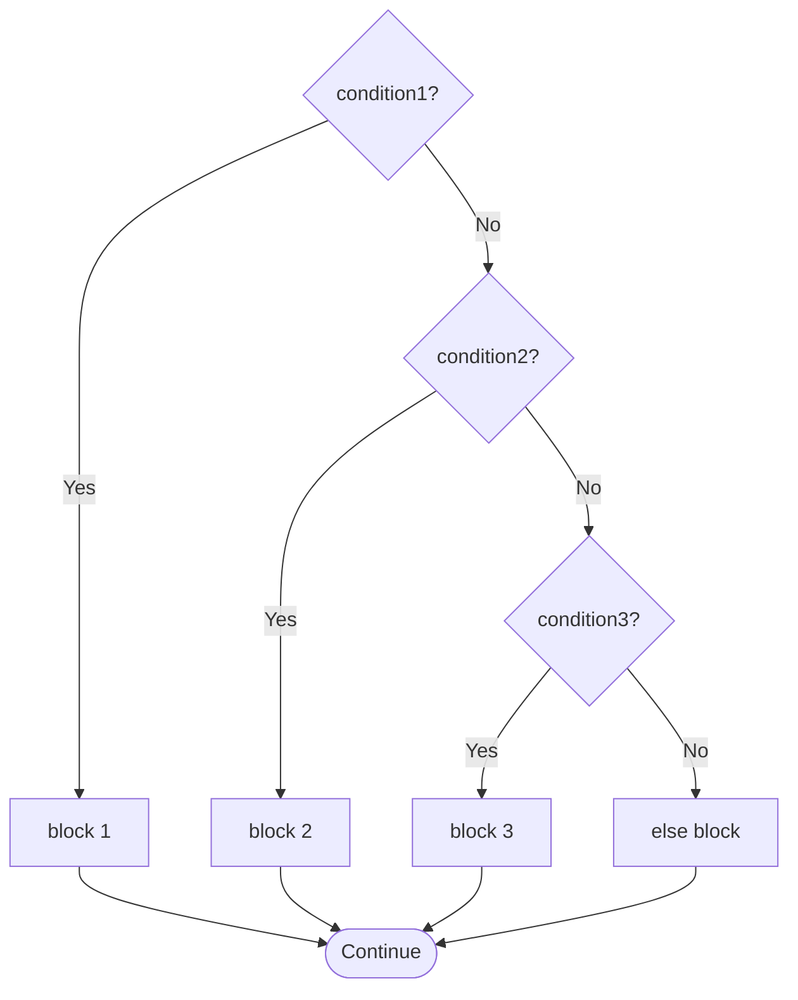

## Beyond Two Paths

`if-else` handles two outcomes: true or false. But many real problems have more than two cases:

- Grading: A, B, C, D, E, F
- Day of week: Monday through Sunday
- Menu: option 1, option 2, option 3, option 4

Java provides two tools: the **else-if ladder** (for complex conditions and ranges) and the **switch statement** (for exact value matching).

---

## The else-if Ladder

Chain multiple `if-else` blocks to check conditions sequentially. Only the **first** matching block executes; the rest are skipped.

**Syntax:**
```java
if (condition1) {
    // runs if condition1 is true
} else if (condition2) {
    // runs if condition1 is false AND condition2 is true
} else if (condition3) {
    // runs if 1 and 2 are false AND condition3 is true
} else {
    // runs if ALL previous conditions are false
}
```



---

## Complete Example: Grade Classifier

```java
import java.util.Scanner;

public class GradeClassifier {
    public static void main(String[] args) {
        Scanner sc = new Scanner(System.in);
        
        System.out.print("Enter student score (0-100): ");
        int score = sc.nextInt();
        
        // Conditions checked from MOST RESTRICTIVE to LEAST
        // (order matters — always put higher ranges first)
        String grade;
        
        if (score >= 70) {
            grade = "A";
        } else if (score >= 60) {
            grade = "B";
        } else if (score >= 50) {
            grade = "C";
        } else if (score >= 45) {
            grade = "D";
        } else if (score >= 40) {
            grade = "E";
        } else if (score >= 0) {
            grade = "F";
        } else {
            grade = "Invalid score";
        }
        
        System.out.println("Score: " + score);
        System.out.println("Grade: " + grade);
    }
}
```

**Sample runs:**
```
Score: 85  → Grade: A
Score: 63  → Grade: B
Score: 52  → Grade: C
Score: 47  → Grade: D
Score: 41  → Grade: E
Score: 30  → Grade: F
Score: -1  → Grade: Invalid score
```

### Why Order Matters in else-if

```java
// WRONG ORDER — gives wrong grades:
if (score >= 40) {       // catches everything from 40 upward!
    grade = "E";
} else if (score >= 50) { // NEVER reached — >= 40 already caught it
    grade = "C";
}

// RIGHT ORDER — highest range first:
if (score >= 70) {       // only 70+ reaches this
    grade = "A";
} else if (score >= 50) { // 50-69 reaches this
    grade = "C";
} else if (score >= 40) { // 40-49 reaches this
    grade = "E";
}
```

**Rule:** In an else-if ladder checking ranges, always check the **highest range first**.

---

## The switch Statement

`switch` is designed for **exact value matching** — when you have a variable and want to compare it to several specific values.

**Syntax:**
```java
switch (variable) {
    case value1:
        // code for value1
        break;    // EXIT the switch — do not fall through to next case!
    case value2:
        // code for value2
        break;
    default:
        // code if no case matched
        break;
}
```

**Complete Example: Day of Week**

```java
import java.util.Scanner;

public class DayOfWeek {
    public static void main(String[] args) {
        Scanner sc = new Scanner(System.in);
        
        System.out.print("Enter day number (1-7): ");
        int day = sc.nextInt();
        
        switch (day) {
            case 1:
                System.out.println("Monday");
                break;     // REQUIRED — exits the switch
            case 2:
                System.out.println("Tuesday");
                break;
            case 3:
                System.out.println("Wednesday");
                break;
            case 4:
                System.out.println("Thursday");
                break;
            case 5:
                System.out.println("Friday");
                break;
            case 6:
                System.out.println("Saturday");
                break;
            case 7:
                System.out.println("Sunday");
                break;
            default:
                System.out.println("Invalid day number");
                break;
        }
    }
}
```

**Sample runs:**
```
Day 1 → Monday
Day 5 → Friday
Day 8 → Invalid day number
```

---

## Fall-Through Behaviour — The break Trap

**What happens without `break`?** The code "falls through" to the next case and executes it too, even if that case did not match!

```java
int day = 3;

switch (day) {
    case 1:
        System.out.println("Monday");
        // NO break here!
    case 2:
        System.out.println("Tuesday");
        // NO break here!
    case 3:
        System.out.println("Wednesday");  // matches day=3
        // NO break here — falls through to case 4!
    case 4:
        System.out.println("Thursday");   // also runs! (fall-through)
        break;                             // stops here
    case 5:
        System.out.println("Friday");      // does NOT run (break stopped it)
        break;
}
```

**Output (day=3):**
```
Wednesday
Thursday
```

Wednesday matched correctly, but Thursday ran too because there was no `break` after Wednesday's case.

### Intentional Fall-Through (When It's Useful)

Sometimes you *want* multiple cases to share the same action:

```java
int day = 3;

switch (day) {
    case 1:
    case 2:
    case 3:
    case 4:
    case 5:
        System.out.println("Weekday");   // runs for days 1, 2, 3, 4, OR 5
        break;
    case 6:
    case 7:
        System.out.println("Weekend");   // runs for days 6 OR 7
        break;
    default:
        System.out.println("Invalid");
        break;
}
```

**Output (day=3):** `Weekday`

The cases 1–5 all fall through to the same print statement. This is intentional and clean.

---

## switch with Strings (Java 7+)

```java
import java.util.Scanner;

public class SeasonCheck {
    public static void main(String[] args) {
        Scanner sc = new Scanner(System.in);
        System.out.print("Enter month (e.g., January): ");
        String month = sc.next();
        
        switch (month) {
            case "December":
            case "January":
            case "February":
                System.out.println("Dry Season (harmattan)");
                break;
            case "March":
            case "April":
            case "May":
                System.out.println("Early Rains");
                break;
            case "June":
            case "July":
            case "August":
            case "September":
                System.out.println("Peak Rainy Season");
                break;
            case "October":
            case "November":
                System.out.println("Late Rains / Transition");
                break;
            default:
                System.out.println("Unknown month: " + month);
                break;
        }
    }
}
```

---

## else-if vs. switch — When to Use Each

| Use else-if | Use switch |
|---|---|
| Range comparisons (`score >= 70`) | Exact value matching |
| Complex boolean conditions | Integer, `char`, or `String` values |
| Multiple variables in condition | Fixed set of constant cases |
| Conditions that are not mutually exclusive | Clean multi-way branch |

```java
// SUITABLE FOR switch — exact int/String values:
switch (menuChoice) {
    case 1: ...
    case 2: ...
    case 3: ...
}

// NOT SUITABLE for switch — requires range comparison:
// switch(score) { case >= 70: ... }  ← ILLEGAL, switch needs exact values

// Must use else-if for ranges:
if (score >= 70) { grade = "A"; }
else if (score >= 60) { grade = "B"; }
```

---

## Worked Example: Chinese Zodiac (switch + modulus)

From the course materials:

```java
import java.util.Scanner;

public class ChineseZodiac {
    public static void main(String[] args) {
        Scanner sc = new Scanner(System.in);
        System.out.print("Enter your birth year: ");
        int year = sc.nextInt();
        
        // Zodiac cycle repeats every 12 years
        // year % 12 gives a value 0-11 that identifies the animal
        switch (year % 12) {
            case 0:  System.out.println("Monkey");  break;
            case 1:  System.out.println("Rooster"); break;
            case 2:  System.out.println("Dog");     break;
            case 3:  System.out.println("Pig");     break;
            case 4:  System.out.println("Rat");     break;
            case 5:  System.out.println("Ox");      break;
            case 6:  System.out.println("Tiger");   break;
            case 7:  System.out.println("Rabbit");  break;
            case 8:  System.out.println("Dragon");  break;
            case 9:  System.out.println("Snake");   break;
            case 10: System.out.println("Horse");   break;
            case 11: System.out.println("Sheep");   break;
        }
    }
}
```

**Sample runs:**
```
Year 2000: 2000 % 12 = 8 → Dragon
Year 1990: 1990 % 12 = 10 → Horse
Year 1985: 1985 % 12 = 1 → Rooster
```

---

## Key Takeaway

> The `else-if` ladder evaluates conditions in sequence — the first true condition's block executes and the rest are skipped. Always put the most specific/highest range first. The `switch` statement matches a variable to constant cases cleanly — always add `break` to prevent fall-through (unless fall-through is intentional). Use `else-if` for ranges and complex conditions; use `switch` for exact values.

---

## Exam Tips

**What lecturers test:**
- Trace an else-if ladder and predict which block executes for a given value
- Trace a switch statement — especially fall-through behaviour when `break` is missing
- Explain when to use switch vs. else-if with examples
- Write the Chinese Zodiac or day-of-week program

**Common mistakes:**
- Forgetting `break` in switch cases — causes unintended fall-through
- Putting conditions in wrong order in else-if (lower range checked before higher range)
- Trying to use `>=` or ranges in `case` values — switch only accepts exact values

**Likely question:**
> "Trace the following switch statement for input value 3, showing which cases execute and why: [switch code without all break statements]." (6 marks)  
> "Write a Java program using a switch statement that takes an integer (1–7) and prints the corresponding day of the week. Include a default case." (8 marks)
