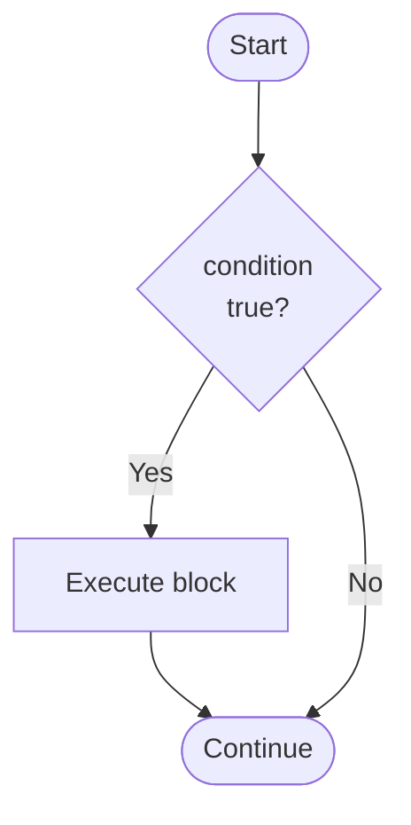
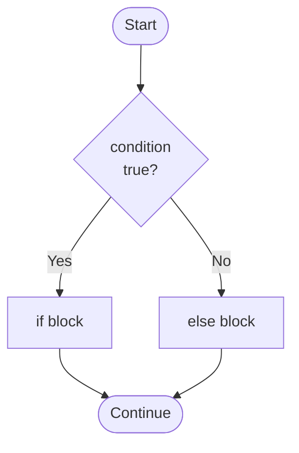

## Why Programs Need to Make Decisions

A program that executes the same instructions every time, regardless of input, is not very useful. Real programs need to respond differently based on conditions:

- "If the student scored ≥ 50, print PASS; otherwise print FAIL."
- "If the user entered a valid password, allow access; otherwise show an error."
- "If the temperature exceeds 100°C, activate the alarm."

This is called **selection** or **conditional execution** — and in Java, the primary tools are `if` and `if-else`.

---

## The `if` Statement (One-Way Decision)

The `if` statement executes a block of code only if a condition is `true`. If the condition is `false`, the block is skipped entirely.

**Syntax:**
```java
if (condition) {
    // This block runs ONLY if condition is true
    // statements here...
}
// Execution continues here regardless
```



**Complete example:**

```java
public class IfDemo {
    public static void main(String[] args) {
        int score = 75;
        
        System.out.println("Checking score...");
        
        // Condition: is score >= 50?
        if (score >= 50) {
            // This block runs because 75 >= 50 is true
            System.out.println("You passed the exam!");
            System.out.println("Well done.");
        }
        
        // This line always runs
        System.out.println("Processing complete.");
    }
}
```

**Output:**
```
Checking score...
You passed the exam!
Well done.
Processing complete.
```

**Now change `score` to `35`:**

```java
int score = 35;
// if (35 >= 50) → false → the block is skipped
```

**Output with score = 35:**
```
Checking score...
Processing complete.
```

The `if` block was skipped because the condition was false.

---

## The `if-else` Statement (Two-Way Decision)

The `if-else` statement handles two mutually exclusive outcomes: when the condition is true, do one thing; when it is false, do another.

**Syntax:**
```java
if (condition) {
    // Runs when condition is TRUE
} else {
    // Runs when condition is FALSE
}
```



**Complete example:**

```java
public class IfElseDemo {
    public static void main(String[] args) {
        int score = 45;
        
        if (score >= 50) {
            System.out.println("Result: PASS");     // runs if score >= 50
            System.out.println("Proceed to next level.");
        } else {
            System.out.println("Result: FAIL");     // runs if score < 50
            System.out.println("Please retake the exam.");
        }
        
        System.out.println("Examination report complete.");
    }
}
```

**Output (with score = 45):**
```
Result: FAIL
Please retake the exam.
Examination report complete.
```

**Output (with score = 78):**
```
Result: PASS
Proceed to next level.
Examination report complete.
```

---

## Curly Braces for Multiple Statements

The `{}` braces define the block that belongs to the `if` or `else`. Without braces, only the **next single statement** belongs to the condition.

```java
int x = 5;

// WITHOUT braces — DANGER:
if (x > 3)
    System.out.println("x is greater than 3");  // part of if
    System.out.println("This always runs!");     // NOT part of if (even though indented!)

// WITH braces — SAFE (always use braces):
if (x > 3) {
    System.out.println("x is greater than 3");
    System.out.println("This also only runs when x > 3");
}
```

**Rule:** **Always use curly braces** even for a single statement. Omitting them is a common source of bugs.

---

## Wrong Way vs. Right Way

### Mistake 1: Using `=` Instead of `==`

```java
int age = 18;

// WRONG — assigns 18 to age (which it already is), doesn't compare
// if (age = 18) { ... }  // COMPILE ERROR in Java (good protection!)

// RIGHT — compares age to 18
if (age == 18) {
    System.out.println("You are 18 years old.");
}
```

### Mistake 2: Condition Outside Parentheses

```java
// WRONG:
if age > 18 { System.out.println("Adult"); }  // COMPILE ERROR — needs ()

// RIGHT:
if (age > 18) { System.out.println("Adult"); }
```

### Mistake 3: Semicolon After if

```java
// WRONG — the semicolon ends the if statement, making the block unconditional!
if (age > 18);
{
    System.out.println("This ALWAYS runs regardless of age!");
}

// RIGHT:
if (age > 18) {
    System.out.println("Adult");
}
```

---

## Nested `if` Statements

An `if` can contain another `if` inside it — this is called **nesting**. Use it for multi-level decisions.

```java
public class AdmissionCheck {
    public static void main(String[] args) {
        int jambScore = 250;
        boolean hasSittingResults = true;
        
        // Outer check: does the score qualify?
        if (jambScore >= 200) {
            System.out.println("JAMB score qualifies.");
            
            // Inner check: only reached if outer condition is true
            if (hasSittingResults) {
                System.out.println("Documents verified.");
                System.out.println("Status: ADMITTED");
            } else {
                System.out.println("Missing O-Level results.");
                System.out.println("Status: PENDING DOCUMENTS");
            }
            
        } else {
            System.out.println("JAMB score too low.");
            System.out.println("Status: NOT ADMITTED");
        }
    }
}
```

**Output (jambScore=250, hasSittingResults=true):**
```
JAMB score qualifies.
Documents verified.
Status: ADMITTED
```

---

## Worked Example 1: Positive, Negative, or Zero

```java
import java.util.Scanner;

public class CheckSign {
    public static void main(String[] args) {
        Scanner sc = new Scanner(System.in);
        System.out.print("Enter a number: ");
        int number = sc.nextInt();
        
        if (number > 0) {
            System.out.println(number + " is POSITIVE");
        } else {
            if (number < 0) {
                System.out.println(number + " is NEGATIVE");
            } else {
                System.out.println("The number is ZERO");
            }
        }
    }
}
```

**Sample runs:**
```
Enter a number: 7   → 7 is POSITIVE
Enter a number: -3  → -3 is NEGATIVE
Enter a number: 0   → The number is ZERO
```

---

## Worked Example 2: Electricity Bill

```java
import java.util.Scanner;

public class ElectricBill {
    public static void main(String[] args) {
        Scanner sc = new Scanner(System.in);
        
        System.out.print("Enter units consumed: ");
        int units = sc.nextInt();
        
        double bill;
        
        // Tiered pricing:
        // First 100 units: ₦50/unit
        // Above 100 units: ₦80/unit for excess
        
        if (units <= 100) {
            bill = units * 50.0;
        } else {
            bill = (100 * 50.0) + ((units - 100) * 80.0);
        }
        
        System.out.println("Units consumed: " + units);
        System.out.printf("Total bill: ₦%.2f%n", bill);
    }
}
```

**Sample runs:**
```
Units: 80    → Total bill: ₦4000.00
Units: 150   → Total bill: ₦9000.00   (100×50 + 50×80 = 5000 + 4000)
```

---

## Key Takeaway

> The `if` statement executes a block only when a condition is true. `if-else` handles exactly two paths — true or false. Always use curly braces `{}` to clearly define which statements belong to each branch. Never use `=` in conditions (that is assignment) — always use `==` for equality. Nested `if` statements handle multi-level decisions.

---

## Exam Tips

**What lecturers test:**
- Trace `if-else` code and predict output for a given value
- Write a complete Java program with `if-else` for a grade or classification
- Identify the error in code with a missing semicolon or `=` vs `==` mistake
- Explain what happens when braces are omitted

**Common mistakes:**
- Semicolon after `if (condition);` — makes the block always execute
- Using `=` inside `if` — Java throws a compile error (different from C/C++ where it is a silent bug)
- Writing the condition without parentheses: `if score > 50` — compile error

**Likely question:**
> "Write a complete Java program that reads a student's exam score from input and prints the corresponding grade: A (70–100), B (60–69), C (50–59), D (45–49), E (40–44), F (0–39). Use `if-else` statements." (10 marks)
