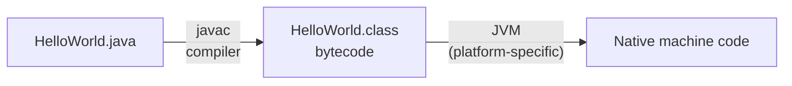
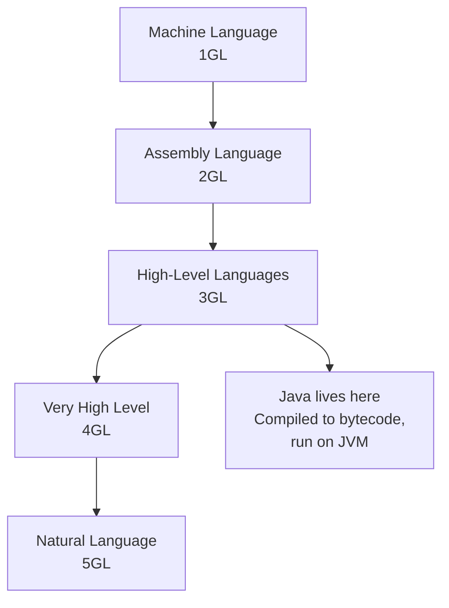

## The Evolution of Languages

Programming languages did not spring into existence fully formed. They evolved over decades, with each generation solving the problems of the previous one. Understanding this progression helps you understand *why* Java works the way it does.

**Real-world analogy:** Think of how we communicate instructions. At the most basic level, you could use hand signals (binary signals — 0 or 1). Then you develop a simple code (assembly mnemonics). Then you write in structured sentences (high-level languages). Then you write in natural paragraphs (4th/5th generation). Each level is more expressive but further from the raw reality.

---

## The Five Generations at a Glance

| Generation | Name | Examples | Who uses it | Distance from hardware |
|---|---|---|---|---|
| **1GL** | Machine Language | Binary / Hex | Almost nobody now | Directly executable |
| **2GL** | Assembly Language | x86 ASM, ARM ASM | Systems programmers | Very close |
| **3GL** | High-Level Language | Java, C, Python, C++ | Most developers | Far |
| **4GL** | Very High-Level | SQL, MATLAB, R | Analysts, DBAs | Very far |
| **5GL** | Natural/AI-Based | Prolog, Mercury | AI researchers | Conceptual |

---

## 1GL: Machine Language

Machine language is the binary instructions that a CPU directly executes. There is no translation step — the CPU reads the bits and executes them.

**Example:** The instruction "move the value 97 into register AX" in x86 machine code:

```
Binary:       10110000 01100001
Hexadecimal:  B0       61
```

**Characteristics:**
- The only language the CPU *actually* understands
- Executes at maximum speed — no translation overhead
- Different for every CPU architecture (x86, ARM, RISC-V are completely incompatible)
- Virtually impossible for humans to write or read for any non-trivial program

**Why it was used:** Before higher-level tools existed, it was the only option. Early computer programmers wrote in binary.

---

## 2GL: Assembly Language

Assembly language uses human-readable **mnemonics** (short abbreviations) to represent machine instructions. A program called an **assembler** translates assembly to machine code.

**Example:** Add two numbers in x86 assembly:

```assembly
; This is x86 assembly language
; Each line is ONE machine instruction

MOV AX, 5       ; Move the value 5 into register AX
MOV BX, 3       ; Move the value 3 into register BX
ADD AX, BX      ; Add BX to AX, result stored in AX (AX = 8)
```

**Equivalent Java (3GL):**
```java
// The same logic in Java — one line replaces three assembly lines
int result = 5 + 3;
```

**Characteristics:**
- One assembly instruction = one machine instruction (1-to-1 relationship)
- Readable enough for humans to write and debug
- Still hardware-specific — x86 assembly will not run on ARM
- Used today in: device drivers, operating system kernels, embedded systems, performance-critical inner loops

**Why it matters:** Understanding that your Java `int result = 5 + 3` eventually becomes multiple assembly instructions (load, add, store) helps you understand why computation has a cost.

---

## 3GL: High-Level Languages

High-level languages (3GLs) are designed around human thinking patterns rather than CPU instruction sets. One line of 3GL code might become 10–100 machine instructions.

**Example:** The same addition in three 3GLs:

```java
// Java
int sum = 5 + 3;
System.out.println("Sum = " + sum);
```

```python
# Python
sum = 5 + 3
print(f"Sum = {sum}")
```

```c
// C
int sum = 5 + 3;
printf("Sum = %d\n", sum);
```

All produce `Sum = 8`. The logic is clear; the machine details are hidden.

### Compiled vs. Interpreted 3GLs

3GLs are translated to machine code in two ways:

| Translation | How | Examples | Speed | Portability |
|---|---|---|---|---|
| **Compiled** | Entire program translated before running | C, C++, Rust | Fast (no runtime translation) | Must recompile per platform |
| **Interpreted** | Translated line by line at runtime | Python, JavaScript | Slower | Runs anywhere with an interpreter |
| **Hybrid (Java)** | Compiled to bytecode, then JVM interprets/JIT-compiles | Java, C# | Good balance | True platform independence |

**Java's hybrid model:**



The `.class` bytecode is the same on every platform. Only the JVM is different per platform.

---

## 4GL: Very High-Level Languages

4GLs are designed for **specific domains** — they express *what* you want, not *how* to do it.

**Example: SQL (for databases)**

```sql
-- 4GL: Describe what you want
SELECT name, grade
FROM   students
WHERE  grade >= 50
ORDER  BY grade DESC;
```

**Java 3GL equivalent** of the same logic — much more verbose:

```java
// 3GL: Describe how to do it step by step
List<String[]> results = new ArrayList<>();
for (String[] student : students) {
    if (Integer.parseInt(student[1]) >= 50) {
        results.add(student);
    }
}
results.sort((a, b) -> Integer.parseInt(b[1]) - Integer.parseInt(a[1]));
for (String[] row : results) {
    System.out.println(row[0] + ", " + row[1]);
}
```

Four lines of SQL vs. eight lines of Java — and the SQL is far more readable.

**Other 4GL examples:**
- MATLAB / R: mathematical and statistical analysis
- HTML: describing document structure (what to show, not how to render)
- RPG: report generation for business systems

---

## 5GL: Natural Language / AI-Based Languages

5GLs aim to let you express a problem in terms close to human language or logic, and have the system figure out how to solve it.

**Prolog example:**

```prolog
% Define facts
parent(tom, bob).   % tom is parent of bob
parent(bob, ann).   % bob is parent of ann

% Define rule: grandparent
grandparent(X, Z) :- parent(X, Y), parent(Y, Z).

% Query
?- grandparent(tom, ann).
% Answer: true
```

You declare relationships and rules; the Prolog engine finds the solution automatically. There is no explicit loop or search — you just state what is true and ask questions.

**Modern relevance:** AI-assisted programming tools (like GitHub Copilot) are a form of 5GL — you describe what you want in natural language, and the AI generates the code.

---

## Where Java Fits

Java is a **3rd generation, compiled-then-interpreted, object-oriented high-level language**.



**Why 3GL and not 4GL?** Java still requires you to specify *how* to do things (loops, conditions, method calls). 4GLs abstract away the "how."

---

## Wrong Way vs. Right Way

**Wrong way:** Think you need to know assembly to program.

Assembly knowledge helps, but Java fully hides CPU details. Your job is to write clear, correct Java — the JVM handles everything below.

**Wrong way:** Think Java is a scripting language that "runs slowly."

Java code is compiled (javac) and then JIT (Just-in-Time) compiled by the JVM to native machine code. Modern Java runs at 80–90% of the speed of C++ for most tasks.

---

## Key Takeaway

> Programming languages evolved through five generations: machine code (1GL), assembly (2GL), high-level languages (3GL), domain-specific languages (4GL), and natural/AI-based languages (5GL). Each generation adds abstraction, making programs easier to write but further from the hardware. Java is a 3GL that compiles to portable bytecode, which the JVM translates to machine code — combining portability with performance.

---

## Exam Tips

**What lecturers test:**
- List the five generations with examples of each
- Explain the difference between compiled and interpreted languages, with examples
- Describe Java's compilation model (source → bytecode → JVM)
- Compare 3GL and 4GL: what does "abstraction" add at each level?

**Common mistakes:**
- Saying Java is "interpreted" — it is compiled to bytecode first, then JVM interprets/JIT-compiles it
- Confusing 4GL with 5GL: 4GL (SQL) is domain-specific but still formal; 5GL (Prolog) is logic/natural language-based

**Likely question:**
> "List and describe the five generations of programming languages. For each generation, give one example and state whether it is closer to or further from hardware compared to the previous generation." (15 marks)
