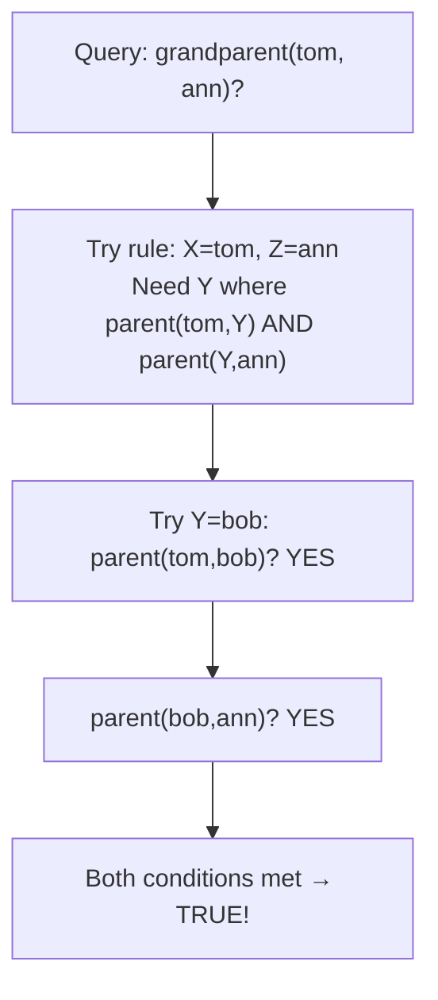

## A Third Way to Think About Programs

So far you have seen:
- **Imperative:** give step-by-step instructions
- **Functional:** describe mathematical functions
- **Declarative:** describe what you want

**Logic programming** is a special case of declarative programming, based on formal logic. You describe:
1. **Facts:** things that are unconditionally true
2. **Rules:** if this is true, then that is also true
3. **Queries:** what do you want to know?

The program *does not tell the computer how to find the answer*. You just state what is known, and the system uses logical inference to answer your questions.

**Real-world analogy:** Think of a court of law. The judge does not tell the jury *how* to reason step by step. The jury receives:
- **Facts:** "The defendant was seen at the location."
- **Rules:** "If someone was at a location at the time of a crime, they are a suspect."
- **Query:** "Is the defendant a suspect?"

Logic programming works the same way — you provide facts and rules, then ask questions.

---

## The Language of Logic Programming: Prolog

**Prolog** (PROgramming in LOGic) is the most well-known logic programming language. It was developed in the 1970s and is still used in AI, natural language processing, and expert systems.

### Facts

A fact is something that is simply true:

```prolog
% Who is a parent of whom?
parent(tom, bob).    % "tom is a parent of bob"
parent(tom, liz).    % "tom is a parent of liz"
parent(bob, ann).    % "bob is a parent of ann"
parent(bob, pat).    % "bob is a parent of pat"
```

### Rules

A rule says: "X is true IF Y is true."

```prolog
% Define "grandparent" in terms of "parent"
% X is a grandparent of Z IF X is a parent of Y AND Y is a parent of Z
grandparent(X, Z) :- parent(X, Y), parent(Y, Z).

% Define "sibling": X and Y are siblings IF they share the same parent
sibling(X, Y) :- parent(P, X), parent(P, Y), X \= Y.
% X \= Y means "X is not equal to Y"
```

### Queries

You ask the system questions, and it deduces the answer:

```prolog
% Is tom the grandparent of ann?
?- grandparent(tom, ann).
% Answer: true

% Who are all of bob's children?
?- parent(bob, X).
% Answer: X = ann ;  X = pat

% Who are liz's siblings?
?- sibling(liz, X).
% Answer: X = bob
```

The system does all the reasoning for you.

---

## How Logic Programming Inference Works

When you ask a query, the logic programming system uses **unification** and **backtracking** to find answers.

**Example:** Query `grandparent(tom, ann).`

The system looks for a rule for `grandparent`. It finds:
```
grandparent(X, Z) :- parent(X, Y), parent(Y, Z).
```

It tries to match: `X = tom`, `Z = ann`.

Now it needs to find a `Y` such that `parent(tom, Y)` AND `parent(Y, ann)` are true.

- Try `Y = bob` (since `parent(tom, bob)` is a fact): is `parent(bob, ann)` a fact? Yes! → **Answer: true**



---

## Logic Programming in Java — Connections

Java does not have built-in logic programming, but the *thinking* applies:

**Using Java to simulate logic-style queries:**

```java
import java.util.*;
import java.util.stream.*;

public class LogicStyleDemo {
    
    // FACTS stored as data
    static List<String[]> parents = Arrays.asList(
        new String[]{"tom", "bob"},
        new String[]{"tom", "liz"},
        new String[]{"bob", "ann"},
        new String[]{"bob", "pat"}
    );
    
    // RULE: grandparent(X, Z) if parent(X, Y) and parent(Y, Z)
    static List<String[]> grandparents() {
        List<String[]> result = new ArrayList<>();
        for (String[] p1 : parents) {
            for (String[] p2 : parents) {
                if (p1[1].equals(p2[0])) {  // p1's child is p2's parent
                    result.add(new String[]{p1[0], p2[1]});
                }
            }
        }
        return result;
    }
    
    public static void main(String[] args) {
        // QUERY: who are all grandparents?
        System.out.println("Grandparent relationships:");
        for (String[] gp : grandparents()) {
            System.out.println(gp[0] + " is grandparent of " + gp[1]);
        }
        // Output:
        // tom is grandparent of ann
        // tom is grandparent of pat
    }
}
```

---

## Why Learn Logic Programming Concepts?

Even if you never write Prolog professionally, logic programming teaches you:

1. **Declarative thinking:** describe relationships, not procedures
2. **Separation of knowledge from execution:** the "rules" are data, not code
3. **Pattern matching:** matching structures against rules is fundamental in AI
4. **Database design:** SQL's foundation is relational algebra, which is closely related to logic programming
5. **Expert systems:** medical diagnosis systems, legal reasoning systems are built on logic rules

---

## Comparison of Paradigms

| Aspect | Imperative (Java) | Functional (Java Streams) | Logic (Prolog) |
|---|---|---|---|
| Primary construct | Statements and loops | Function composition | Facts and rules |
| Control flow | Explicit (programmer controls) | Implicit (hidden in functions) | None (system infers) |
| State | Mutable | Immutable | None (no variables in traditional sense) |
| How to solve "find all grandparents" | Write nested loops | Filter + map + collect | State rule, query |
| Strengths | Direct control, performance | Concise transformations | Complex reasoning, AI |

---

## Key Takeaway

> Logic programming expresses programs as a set of facts and rules, then answers queries through logical inference. Prolog is the canonical example. You do not tell the computer *how* to find the answer — you state what is known and ask what can be deduced. Logic programming is foundational for AI, expert systems, and reasoning engines, and teaches a different way of thinking about data relationships that every programmer benefits from knowing.

---

## Exam Tips

**What lecturers test:**
- Distinguish logic programming from imperative and functional programming
- Identify facts, rules, and queries in a Prolog-style example
- Trace a simple logical inference (how does the system answer a query?)
- Give examples of where logic programming is used (AI, expert systems, NLP)

**Common mistakes:**
- Saying "Prolog is not used anymore" — it is used in AI research, NLP, and knowledge representation
- Confusing "logic programming" with "using if-else" — imperative `if` is not logic programming

**Likely question:**
> "Explain logic programming, distinguishing it from imperative and declarative programming. Using Prolog-style notation, write facts and rules to represent a family relationship and show how a query would be answered." (10 marks)
