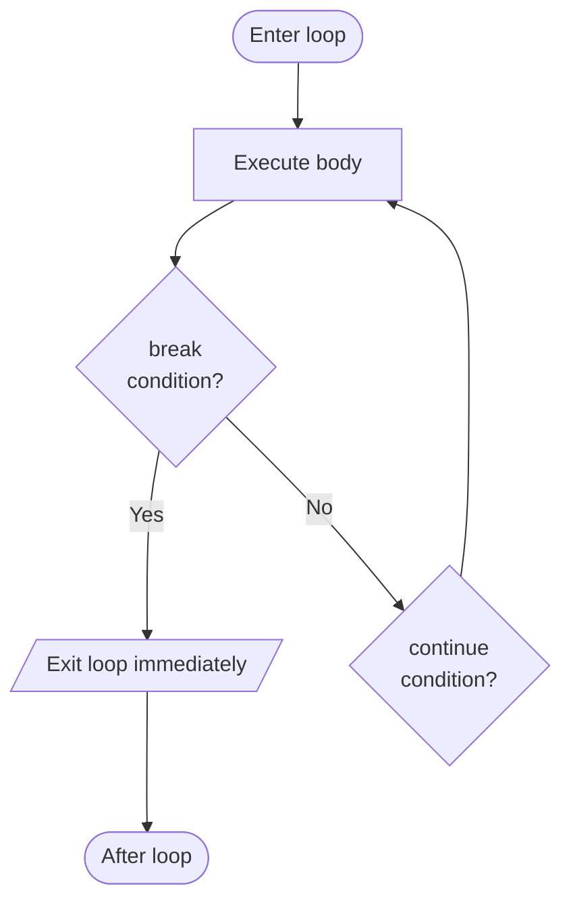

## Beyond Basic Loops

Sometimes a loop needs to be interrupted before its natural end:
- Stop immediately when a specific condition is met (`break`)
- Skip the rest of the current iteration and go to the next (`continue`)

These are the loop interrupt statements. Additionally, the **enhanced `for-each`** loop provides a cleaner way to iterate over arrays and collections.

---

## The `break` Statement

`break` **immediately exits** the loop — execution continues at the first statement after the loop.



```java
public class BreakDemo {
    public static void main(String[] args) {
        // Without break: prints 1 to 10
        // With break: stops at 5
        
        for (int i = 1; i <= 10; i++) {
            if (i == 5) {
                break;   // EXIT the loop when i equals 5
            }
            System.out.print(i + " ");
        }
        
        System.out.println("\nAfter loop.");
    }
}
```

**Output:**
```
1 2 3 4 
After loop.
```

When `i = 5`, `break` executes and the loop ends. 5, 6, 7, 8, 9, 10 are never printed.

---

## break for Early Termination — Real Use Case

**Problem:** Search through scores. Stop as soon as you find a perfect score (100).

```java
public class FindPerfect {
    public static void main(String[] args) {
        int[] scores = {72, 85, 91, 100, 65, 88, 100};
        int foundAt = -1;
        
        for (int i = 0; i < scores.length; i++) {
            if (scores[i] == 100) {
                foundAt = i;
                break;   // found it — no need to check the rest!
            }
        }
        
        if (foundAt >= 0) {
            System.out.println("First perfect score at index: " + foundAt);
            System.out.println("Score: " + scores[foundAt]);
        } else {
            System.out.println("No perfect score found.");
        }
        // Output: First perfect score at index: 3
    }
}
```

Without `break`, the loop would check all 7 elements even after finding the answer at index 3.

---

## break with While Loop (from Course Materials)

```java
import javax.swing.JOptionPane;

public class SumBreak {
    public static void main(String[] args) {
        int num, iter = 0, sum = 0;
        
        num = Integer.parseInt(
            JOptionPane.showInputDialog("Enter a non-negative integer"));
        iter++;  // iter becomes 1
        
        // Keep reading up to 10 non-negative integers
        // Stop if a negative number is entered
        while (iter < 10 && num >= 0) {
            sum += num;
            num = Integer.parseInt(
                JOptionPane.showInputDialog("Enter a non-negative integer"));
            if (num < 0)
                break;   // break out of the loop when negative number entered
            iter++;
        }
        
        JOptionPane.showMessageDialog(null,
            "Sum of the non-negative numbers is: " + sum);
        System.exit(0);
    }
}
```

The `break` terminates the loop early when the user enters a negative number.

---

## The `continue` Statement

`continue` **skips the rest of the current iteration** and jumps to the next iteration's condition check (for `while`) or update step (for `for`).

```java
public class ContinueDemo {
    public static void main(String[] args) {
        // Print odd numbers 1 to 10 (skip evens)
        for (int i = 1; i <= 10; i++) {
            if (i % 2 == 0) {
                continue;   // skip even numbers — go to next iteration
            }
            System.out.print(i + " ");
        }
        System.out.println();
    }
}
```

**Output:**
```
1 3 5 7 9 
```

When `i = 2`, `i % 2 == 0` is true, `continue` executes — the `System.out.print` is skipped. Loop jumps to `i++` and checks `i = 3`.

---

## continue — Printing Even Numbers (from Course Materials)

```java
import javax.swing.JOptionPane;

public class EvenPrinter {
    public static void main(String[] args) {
        for (int num = 10; num <= 25; num++) {
            if (num % 2 != 0)
                continue;   // will not print 11, 13, 15, 17, 19, 21, 23, 25
            JOptionPane.showMessageDialog(null, "" + num);
        }
        System.exit(0);
    }
}
```

Prints even numbers between 10 and 25: 10, 12, 14, 16, 18, 20, 22, 24.

---

## break vs. continue — Side by Side

```java
public class BreakVsContinue {
    public static void main(String[] args) {
        System.out.print("break: ");
        for (int i = 1; i <= 8; i++) {
            if (i == 5) break;       // stop completely at 5
            System.out.print(i + " ");
        }
        // Output: break: 1 2 3 4
        
        System.out.println();
        System.out.print("continue: ");
        for (int i = 1; i <= 8; i++) {
            if (i == 5) continue;    // skip 5, continue to 6
            System.out.print(i + " ");
        }
        // Output: continue: 1 2 3 4 6 7 8
    }
}
```

| Statement | Effect | Loop continues? |
|---|---|---|
| `break` | Exit the loop entirely | No — jumps past the loop |
| `continue` | Skip current iteration only | Yes — next iteration runs |

---

## The Enhanced for (for-each) Loop

The **enhanced for** loop — also called the **for-each** loop — provides a clean way to iterate over all elements of an array or collection, without needing an index variable.

**Syntax:**
```java
for (Type element : arrayOrCollection) {
    // use element — it holds the current value
}
```

```java
public class ForEachDemo {
    public static void main(String[] args) {
        int[] scores = {72, 85, 91, 60, 78};
        
        // Traditional for loop (with index):
        System.out.print("Traditional: ");
        for (int i = 0; i < scores.length; i++) {
            System.out.print(scores[i] + " ");
        }
        System.out.println();
        
        // Enhanced for-each (no index needed):
        System.out.print("Enhanced: ");
        for (int score : scores) {    // read as: "for each score in scores"
            System.out.print(score + " ");
        }
        System.out.println();
        
        // Both output: 72 85 91 60 78
    }
}
```

---

## Computing Sum with Enhanced for

```java
public class SumWithForEach {
    public static void main(String[] args) {
        int[] scores = {72, 85, 91, 60, 78};
        
        int total = 0;
        for (int score : scores) {
            total += score;           // cleaner than: total += scores[i]
        }
        
        double average = (double) total / scores.length;
        System.out.printf("Sum: %d, Average: %.2f%n", total, average);
        // Output: Sum: 386, Average: 77.20
    }
}
```

---

## When to Use Each Loop Form

| Scenario | Best loop |
|---|---|
| Known iteration count, need the index | Traditional `for` |
| Iterating all elements, no index needed | Enhanced `for-each` |
| Unknown count, check first | `while` |
| Must run at least once | `do-while` |
| Need to exit early | Any loop + `break` |
| Need to skip some iterations | Any loop + `continue` |

---

## Complete Example: Student Score Processor

```java
import java.util.Scanner;

public class ScoreProcessor {
    public static void main(String[] args) {
        Scanner sc = new Scanner(System.in);
        int[] scores = new int[5];
        
        // Read 5 scores with validation
        System.out.println("Enter 5 exam scores (0-100):");
        for (int i = 0; i < 5; i++) {
            int score;
            do {
                System.out.print("Score " + (i + 1) + ": ");
                score = sc.nextInt();
            } while (score < 0 || score > 100);  // validate each score
            scores[i] = score;
        }
        
        // Process: sum, highest, count of passes using for-each
        int sum = 0, highest = scores[0], passCount = 0;
        for (int s : scores) {
            sum += s;
            if (s > highest) highest = s;
            if (s >= 50) passCount++;
        }
        
        // Print report
        System.out.println("\n--- Report ---");
        System.out.printf("Average: %.1f%n", (double) sum / scores.length);
        System.out.println("Highest: " + highest);
        System.out.println("Passes: " + passCount + " out of " + scores.length);
        
        // Find first failing score using break
        System.out.print("First failure: ");
        boolean found = false;
        for (int s : scores) {
            if (s < 50) {
                System.out.println(s);
                found = true;
                break;
            }
        }
        if (!found) System.out.println("none");
    }
}
```

---

## Key Takeaway

> `break` immediately exits a loop — use it to stop when a condition is met. `continue` skips the rest of the current iteration — use it to filter out certain values. The enhanced `for-each` loop iterates cleanly over all elements without needing index variables — use it when you do not need the index. Together, these tools give you precise control over loop execution.

---

## Exam Tips

**What lecturers test:**
- Trace a loop with `break` or `continue` and predict the output
- Write a loop that searches an array and stops early with `break`
- Rewrite a traditional `for` loop using enhanced `for-each`
- Explain the difference between `break` (exits loop) and `continue` (skips iteration)

**Common mistakes:**
- Using `break` when `continue` is needed (or vice versa) — `break` exits entirely; `continue` only skips one iteration
- Forgetting that `continue` in a `for` loop jumps to the update step (`i++`), not the condition — this is important for counting correctly
- Trying to modify the array element through a `for-each` variable: `for (int s : scores) { s = 0; }` — this does NOT modify the array; you need a regular `for` with index

**Likely question:**
> "Write a Java program that reads 10 integers. Use `continue` to skip negative numbers and use `break` to stop when a zero is entered. Print the sum of all positive numbers processed." (10 marks)
