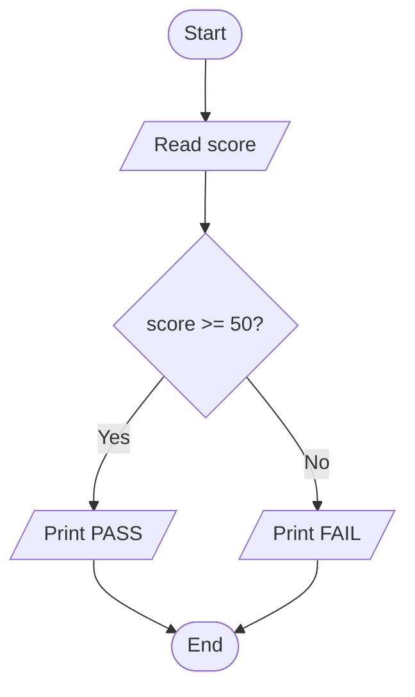
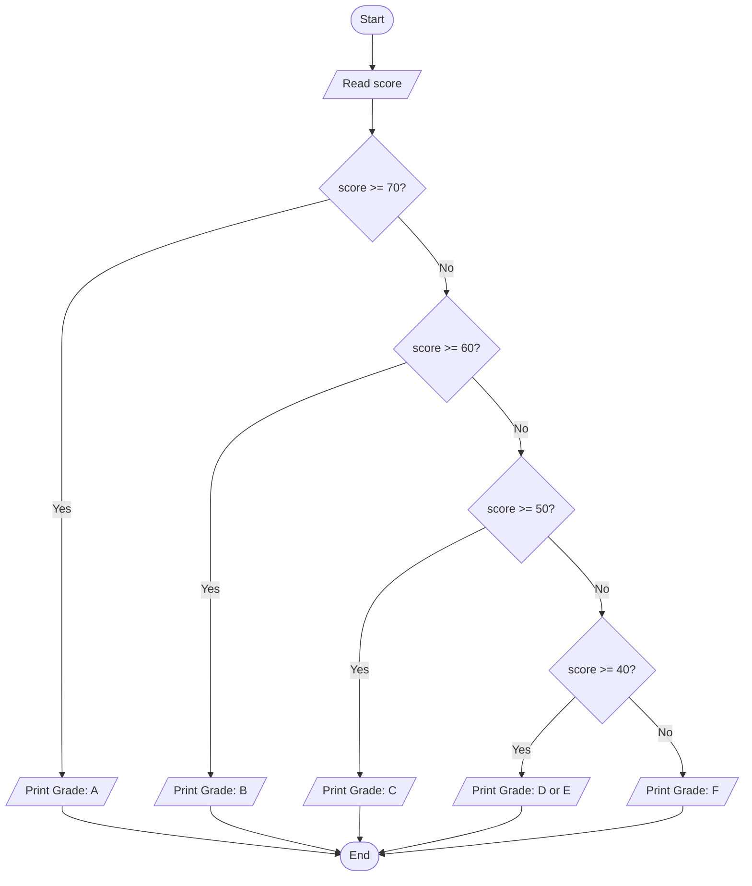
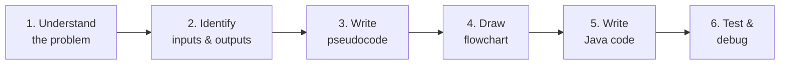
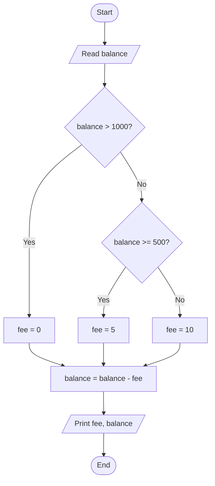

## Why Plan Before Coding?

Beginning programmers often jump straight to typing code. This leads to:
- Logic errors that are hard to find
- Programs that partially work but miss edge cases
- Spaghetti code that is impossible to fix later

**Professional programmers always design first.** The plan — written as pseudocode or drawn as a flowchart — is the blueprint. The Java code is just the construction.

**Real-world analogy:** An architect draws detailed building plans before anyone picks up a brick. The plans catch structural problems cheaply (on paper), before they become expensive (in construction). Your pseudocode is the blueprint; your Java is the construction.

---

## What Is Pseudocode?

**Pseudocode** is a way of describing an algorithm using plain English structured like code — but without Java syntax, without semicolons, without import statements.

It sits between "human thought" and "Java code":

```
Human thought:        "add up all the numbers"
Pseudocode:           FOR each number in list, total = total + number
Java:                 for (int n : numbers) { total += n; }
```

There is no single correct pseudocode format — what matters is clarity and logic.

### Pseudocode Conventions

| Concept | Pseudocode style | Java equivalent |
|---|---|---|
| Input | `READ variableName` | `sc.nextInt()` / `sc.nextLine()` |
| Output | `PRINT value` or `DISPLAY value` | `System.out.println()` |
| Assignment | `SET variable TO value` or `variable ← value` | `variable = value;` |
| If | `IF condition THEN ... END IF` | `if (condition) { }` |
| If-else | `IF ... THEN ... ELSE ... END IF` | `if { } else { }` |
| While loop | `WHILE condition DO ... END WHILE` | `while (condition) { }` |
| For loop | `FOR i FROM 1 TO n DO ... END FOR` | `for (int i=1; i<=n; i++) { }` |

---

## Pseudocode Example 1: Pass/Fail

```
BEGIN
  READ score
  IF score >= 50 THEN
    PRINT "PASS"
  ELSE
    PRINT "FAIL"
  END IF
END
```

**Converting to Java:**

```java
import java.util.Scanner;

public class PassFail {
    public static void main(String[] args) {
        Scanner sc = new Scanner(System.in);
        System.out.print("Enter score: ");
        int score = sc.nextInt();
        
        if (score >= 50) {
            System.out.println("PASS");
        } else {
            System.out.println("FAIL");
        }
    }
}
```

---

## Pseudocode Example 2: Grade Classification

```
BEGIN
  READ score
  IF score >= 70 THEN
    SET grade TO "A"
  ELSE IF score >= 60 THEN
    SET grade TO "B"
  ELSE IF score >= 50 THEN
    SET grade TO "C"
  ELSE IF score >= 45 THEN
    SET grade TO "D"
  ELSE IF score >= 40 THEN
    SET grade TO "E"
  ELSE
    SET grade TO "F"
  END IF
  PRINT "Grade:", grade
END
```

---

## What Is a Flowchart?

A **flowchart** is a diagram that shows an algorithm visually, using standardised shapes connected by arrows.

### Standard Flowchart Symbols

| Shape | Name | Purpose |
|---|---|---|
| Oval | Terminal | Start / End |
| Rectangle | Process | Computation or action |
| Diamond | Decision | Yes/No question (branching) |
| Parallelogram | Input/Output | Read input or print output |
| Arrow | Flow line | Shows direction of execution |
| Small circle | Connector | Connect distant parts |

---

## Flowchart Example 1: Pass/Fail



---

## Flowchart Example 2: Grade Classification



---

## The Design Process: Step by Step

Before writing Java, follow these five steps:



---

## Worked Design: Bank Charge Calculator

**Problem statement:** A bank charges fees based on account balance:
- If balance > ₦1000: no fee
- If ₦500 ≤ balance ≤ ₦1000: ₦5 fee
- If balance < ₦500: ₦10 fee

**Step 1: Understand the problem**
Input: balance (a decimal number)
Output: fee amount and final balance after fee

**Step 2: Identify inputs and outputs**
- Input: `balance` (double)
- Output: `fee`, new `balance`

**Step 3: Write pseudocode**

```
BEGIN
  READ balance
  IF balance > 1000 THEN
    SET fee TO 0
  ELSE IF balance >= 500 THEN
    SET fee TO 5
  ELSE
    SET fee TO 10
  END IF
  SET balance TO balance - fee
  PRINT "Fee:", fee
  PRINT "New balance:", balance
END
```

**Step 4: Draw flowchart**



**Step 5: Write Java code**

```java
import java.util.Scanner;

public class BankCharge {
    public static void main(String[] args) {
        Scanner sc = new Scanner(System.in);
        
        System.out.print("Enter account balance (₦): ");
        double balance = sc.nextDouble();
        
        double fee;
        
        if (balance > 1000) {
            fee = 0;
        } else if (balance >= 500) {
            fee = 5;
        } else {
            fee = 10;
        }
        
        balance = balance - fee;
        
        System.out.printf("Service fee: ₦%.2f%n", fee);
        System.out.printf("New balance: ₦%.2f%n", balance);
    }
}
```

**Step 6: Test**
```
Input: 1500 → fee=0, balance=1500.00 ✓
Input:  750 → fee=5, balance=745.00 ✓
Input:  300 → fee=10, balance=290.00 ✓
```

---

## Common Pseudocode Mistakes

### Mistake 1: Skipping edge cases

```
IF score >= 50 THEN
  PRINT "Pass"
IF score < 50 THEN
  PRINT "Fail"
```

This uses two separate `IF` statements. What if score is exactly 50? Both conditions are checked independently. Use `IF-ELSE`:

```
IF score >= 50 THEN
  PRINT "Pass"
ELSE
  PRINT "Fail"
END IF
```

### Mistake 2: Ambiguous variable names

```
IF x > y THEN
  SET z TO x
```

What are x, y, z? Name them clearly:

```
IF highestScore > passMark THEN
  SET result TO "PASS"
```

---

## Key Takeaway

> Pseudocode expresses an algorithm in structured plain English before writing code. Flowcharts visualise the same algorithm using standard shapes. Together, they are the blueprint that makes coding faster, clearer, and less error-prone. Always design with pseudocode/flowchart first, then translate to Java. The five-step process: understand → identify inputs/outputs → pseudocode → flowchart → code → test.

---

## Exam Tips

**What lecturers test:**
- Write pseudocode for a given problem (grade classifier, menu system, etc.)
- Draw a flowchart for a given algorithm (with correct symbols)
- Convert pseudocode to Java code
- Identify errors in pseudocode (wrong order of conditions, missing edge cases)

**Common mistakes:**
- Using Java syntax in pseudocode (semicolons, curly braces) — pseudocode should be language-agnostic
- Wrong flowchart shapes: decisions must be in diamonds, not rectangles; start/end must be ovals
- Skipping the pseudocode step and going straight to Java — lecturers often award marks for pseudocode even if the Java is wrong

**Likely question:**
> "Design a solution using pseudocode and a flowchart for the following problem: A university awards scholarships to students with GPA >= 3.5 AND who have completed at least 60 credit hours. Write the pseudocode and draw the flowchart. Then implement it in Java." (14 marks)
