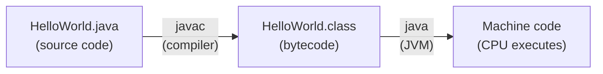

## Before We Write a Single Line of Code

Before you write your first Java program, you need to understand what you are actually doing when you write code — and why programming languages exist in the first place.

Computers are machines made of transistors that can only understand two things: electric charge present (1) and electric charge absent (0). Every movie, message, game, and app that runs on a computer ultimately comes down to patterns of 0s and 1s flying through circuits at billions of times per second.

So how does a human being — who thinks in concepts like "calculate the student's average" or "display a menu" — communicate instructions to a machine that only understands 0s and 1s?

**The answer: programming languages.**

---

## What Is a Programming Language?

A **programming language** is a formal, structured notation for expressing instructions that a computer can execute.

The key word is *formal*: unlike human languages (which can be ambiguous, contextual, and emotional), a programming language has:

- **Syntax** — a precise set of rules governing what sequences of symbols are valid
- **Semantics** — a precise definition of what those valid sequences *mean* (what they cause the computer to do)

**A simple analogy:** Think of a programming language like a very strict cooking recipe format. In everyday life, a recipe might say "add a pinch of salt" — how much is a "pinch"? A programming language is like a recipe format where every instruction must be exactly quantified: "add 2.5 grams of NaCl." There is no room for interpretation.

---

## Why Programming Languages Exist

Computers execute machine code — sequences of binary numbers that directly correspond to CPU operations. Writing machine code by hand looks like this:

```
10110000 01100001 10001001 11000011
```

This moves the number 97 into a CPU register. Readable? No. Writable? Painfully slowly. Maintainable? Virtually impossible for any real program.

Programming languages solve three fundamental problems:

| Problem | Solution |
|---|---|
| Binary is unreadable | Languages use words and symbols humans understand |
| Machine code is hardware-specific | Languages are translated to run on any machine |
| Logic is complex | Languages provide abstractions (loops, functions, objects) |

---

## The Key Characteristics of a Programming Language

### 1. Syntax
The grammar rules of the language — what is allowed to be written.

**Example:** In Java, you must end every statement with a semicolon:

```java
// Correct syntax
System.out.println("Hello");

// Wrong syntax — missing semicolon
System.out.println("Hello")
```

The second line is a **syntax error** — the Java compiler will refuse to process it, just like a recipe format that requires "teaspoons" and you wrote "tea spoons" (invalid).

### 2. Semantics
What the syntax *means* — what actually happens when the code runs.

Same syntax, different semantics depending on data types:

```java
int result = 5 + 3;      // result = 8    (integer addition)
String s = "5" + "3";    // s = "53"      (string concatenation!)
```

Understanding semantics is understanding what your code *actually does*.

### 3. Abstraction
Programming languages hide low-level complexity behind high-level constructs.

```java
// What you write (high level — clear intent):
int sum = a + b;

// What the CPU actually executes (low level — complex):
// Load a from memory → Load b from memory → Execute ADD instruction
// → Store result in register → Copy register to memory location "sum"
```

You write the intent; the language handles the mechanics.

### 4. Portability
Well-designed programming languages allow code to run on many different machines.

Java's famous promise: **"Write once, run anywhere."** A Java program written on a Windows laptop can run on a Linux server, an Android phone, or a macOS computer — without changing a single line of code.

---

## Why We Use Java in This Course

This course uses **Java** as its teaching language. Here is why Java is an excellent first serious programming language:

| Feature | Why It Helps You Learn |
|---|---|
| Strong typing | Forces you to be precise about data — builds good habits |
| Clear syntax | Error messages are specific and helpful |
| Object-oriented | The dominant paradigm in industry software |
| Platform-independent | Write once, run anywhere (JVM) |
| Huge community | Endless resources, tutorials, libraries |
| Industry standard | Used in Android, enterprise software, financial systems |

---

## Your First Java Program

Let us see what a programming language looks like in practice:

```java
// This is a complete Java program
// Every single line is explained below

public class HelloWorld {
    // 'public class HelloWorld' declares a class named HelloWorld
    // The filename must be HelloWorld.java — they must match!

    public static void main(String[] args) {
        // 'main' is the entry point — where the program starts
        // 'String[] args' allows command-line arguments (ignore for now)

        System.out.println("Hello, World!");
        // 'System.out' is the standard output stream (the screen)
        // '.println()' prints text followed by a newline
        // "Hello, World!" is the text to print — called a String literal
    }
    // The closing } ends the main method
}
// The closing } ends the class
```

**Expected output when you run this:**
```
Hello, World!
```

**How to compile and run:**
1. Save as `HelloWorld.java`
2. Compile: `javac HelloWorld.java`
3. Run: `java HelloWorld`

---

## What Happens When Java Runs?

Java has a two-stage execution model that gives it portability:



1. **Compilation:** `javac` translates your `.java` source into **bytecode** — a platform-neutral intermediate format stored in `.class` files
2. **Execution:** The **Java Virtual Machine (JVM)** translates bytecode to native machine code at runtime

The bytecode is the same on every platform. Each platform has its own JVM that handles the final translation. This is what "write once, run anywhere" means.

---

## Wrong Way vs. Right Way

**Wrong way:** Think of programming as memorising syntax.

```java
// Memorised: "I need this line to print"
System.out.println("hello");
// No understanding of what System, out, or println mean
```

**Right way:** Understand the meaning of each part.

```java
System.out.println("hello");
// System = the Java class representing the running system
// out = the standard output stream (connected to your screen)
// println = "print line" — print the text and move to new line
// "hello" = the String to print
```

Every piece of syntax in Java means something. Understanding the *why* is what separates a programmer from someone who just copies code.

---

## Key Takeaway

> A programming language is a precise, formal notation for expressing computational instructions. It bridges human-readable logic and machine-executable binary. Java uses a two-stage compilation model — source code compiles to portable bytecode, which the JVM runs on any platform. Understanding syntax (the rules) and semantics (the meaning) is the foundation of everything you will learn in this course.

---

## Exam Tips

**What lecturers test:**
- Define "programming language" in your own words
- List and explain the key characteristics: syntax, semantics, abstraction, portability
- Explain the difference between syntax errors (wrong form) and semantic errors (wrong meaning)
- Describe Java's compilation and execution model (source → bytecode → JVM → execution)

**Common mistakes:**
- Saying "a programming language is just code" — it is a formal notation system, not the code itself
- Confusing syntax with semantics: syntax is structure, semantics is meaning

**Likely question:**
> "What is a programming language? Identify and explain three key characteristics, giving a Java example for each." (9 marks)
