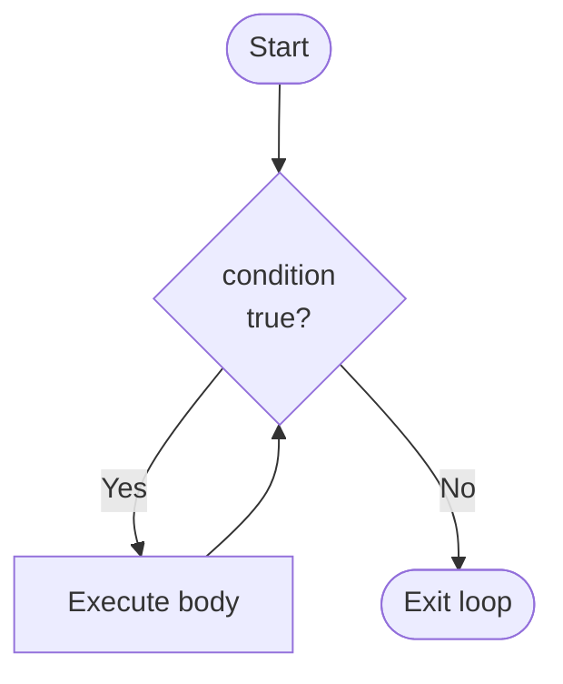
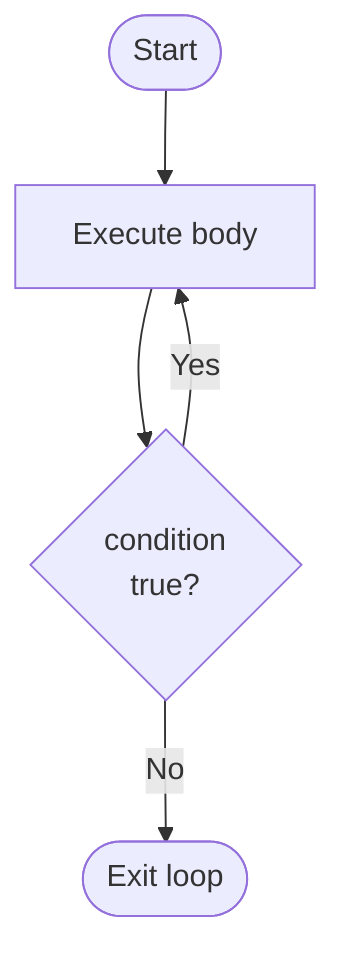

## When You Don't Know the Count

The `for` loop is ideal when you know the number of iterations in advance. But many real problems do not have a fixed count:

- Keep asking for input until a valid score is entered
- Keep processing payments until the balance is zero
- Keep showing a menu until the user chooses "Exit"

For these, use the `while` loop (or `do-while`).

---

## The `while` Loop

The `while` loop keeps executing as long as a condition is `true`. The condition is checked **before** each iteration.

**Syntax:**
```java
while (condition) {
    // loop body
    // MUST eventually make condition false, or this loops forever!
}
```



**Key difference from `for`:** The condition is checked at the top, before the body runs. If the condition is false initially, the body never runs (zero iterations).

---

## Basic while Loop — Count to 5

```java
public class WhileBasic {
    public static void main(String[] args) {
        int count = 1;           // initialise before loop
        
        while (count <= 5) {     // check condition
            System.out.println("Count: " + count);
            count++;             // update — MUST change condition toward false!
        }
        
        System.out.println("Done. Final count: " + count);  // count = 6 here
    }
}
```

**Output:**
```
Count: 1
Count: 2
Count: 3
Count: 4
Count: 5
Done. Final count: 6
```

---

## Input Validation with while

A very common `while` loop use case: keep asking until valid input is entered.

```java
import java.util.Scanner;

public class ValidatedInput {
    public static void main(String[] args) {
        Scanner sc = new Scanner(System.in);
        int score = -1;  // initialise to invalid value
        
        // Keep asking as long as score is out of valid range
        while (score < 0 || score > 100) {
            System.out.print("Enter a valid score (0-100): ");
            score = sc.nextInt();
            
            if (score < 0 || score > 100) {
                System.out.println("Invalid! Score must be 0-100.");
            }
        }
        
        System.out.println("Valid score entered: " + score);
    }
}
```

**Sample run:**
```
Enter a valid score (0-100): -5
Invalid! Score must be 0-100.
Enter a valid score (0-100): 150
Invalid! Score must be 0-100.
Enter a valid score (0-100): 72
Valid score entered: 72
```

---

## Sentinel-Controlled Loop

A **sentinel** is a special value that signals "stop the loop." Common in reading sequences of unknown length.

```java
import java.util.Scanner;

public class SentinelLoop {
    public static void main(String[] args) {
        Scanner sc = new Scanner(System.in);
        int sum = 0;
        int count = 0;
        
        System.out.println("Enter scores. Enter -1 to stop.");
        System.out.print("Score: ");
        int score = sc.nextInt();
        
        // Sentinel = -1 means "stop"
        while (score != -1) {
            sum += score;
            count++;
            System.out.print("Score: ");
            score = sc.nextInt();
        }
        
        if (count > 0) {
            System.out.println("Count: " + count);
            System.out.println("Sum: " + sum);
            System.out.printf("Average: %.2f%n", (double) sum / count);
        } else {
            System.out.println("No scores entered.");
        }
    }
}
```

**Sample run:**
```
Enter scores. Enter -1 to stop.
Score: 70
Score: 85
Score: 62
Score: -1
Count: 3
Sum: 217
Average: 72.33
```

---

## Printing Numbers 1 to 60 (from Course Materials)

```java
import javax.swing.JOptionPane;

public class WhileList {
    public static void main(String[] args) {
        int count = 1;
        String output = "";
        
        while (count <= 60) {
            output += " " + count;  // append the current iteration number
            count++;
        }
        
        JOptionPane.showMessageDialog(null, output);
        System.exit(0);
    }
}
```

Same result as the `for` loop version — prints 1 through 60.

---

## The `do-while` Loop

The `do-while` loop is a variant where the condition is checked **after** the body — so the body always runs **at least once**.

**Syntax:**
```java
do {
    // loop body — executes at LEAST once
} while (condition);  // ← note the semicolon here!
```



**The critical difference:**

| Loop | Condition check | Body runs if condition is initially false? |
|---|---|---|
| `while` | Before body | Never — 0 iterations |
| `do-while` | After body | Yes — always at least 1 iteration |

---

## do-while for Menu Systems

The classic use case: a menu must always show at least once before checking if the user wants to exit.

```java
import java.util.Scanner;

public class MenuSystem {
    public static void main(String[] args) {
        Scanner sc = new Scanner(System.in);
        int choice;
        
        do {
            // Menu shown at least once before checking if user wants to exit
            System.out.println("\n=== MAIN MENU ===");
            System.out.println("1. View student list");
            System.out.println("2. Add student");
            System.out.println("3. Calculate average");
            System.out.println("0. Exit");
            System.out.print("Enter choice: ");
            choice = sc.nextInt();
            
            // Handle the choice
            switch (choice) {
                case 1:
                    System.out.println("Displaying student list...");
                    break;
                case 2:
                    System.out.println("Adding student...");
                    break;
                case 3:
                    System.out.println("Calculating average...");
                    break;
                case 0:
                    System.out.println("Goodbye!");
                    break;
                default:
                    System.out.println("Invalid choice. Try again.");
            }
        } while (choice != 0);   // continue until user enters 0
    }
}
```

**Sample interaction:**
```
=== MAIN MENU ===
1. View student list
2. Add student
3. Calculate average
0. Exit
Enter choice: 1
Displaying student list...

=== MAIN MENU ===
...
Enter choice: 0
Goodbye!
```

---

## Countdown with do-while (from Course Materials)

```java
import java.util.Scanner;

public class WhileDemo {
    public static void main(String[] args) {
        Scanner sc = new Scanner(System.in);
        int count = 5;
        
        do {
            System.out.print(count + " ");
            count--;              // decrement
        } while (count > 0);     // check AFTER body runs
        
        System.out.println("Go!");
    }
}
```

**Output:** `5 4 3 2 1 Go!`

---

## Comparing All Three Loops

| Loop | Condition check | Min iterations | Best used when |
|---|---|---|---|
| `for` | Before body | 0 | Count known in advance |
| `while` | Before body | 0 | Condition-controlled, check first |
| `do-while` | After body | 1 | Must run at least once (menus, prompts) |

```java
// All three produce the same output (1 2 3 4 5):

// for:
for (int i = 1; i <= 5; i++) { System.out.print(i + " "); }

// while:
int i = 1;
while (i <= 5) { System.out.print(i + " "); i++; }

// do-while:
int j = 1;
do { System.out.print(j + " "); j++; } while (j <= 5);
```

---

## Fibonacci Sequence with do-while (from Course Materials)

```java
public class FibonacciDoWhile {
    public static void main(String[] args) {
        int first = 0, second = 1, next;
        int count = 0;
        int terms = 10;  // print first 10 Fibonacci numbers
        
        System.out.print("Fibonacci: ");
        
        do {
            System.out.print(first + " ");
            next = first + second;   // next = sum of previous two
            first = second;          // shift: first becomes second
            second = next;           // shift: second becomes next
            count++;
        } while (count < terms);
        
        System.out.println();
        // Output: Fibonacci: 0 1 1 2 3 5 8 13 21 34
    }
}
```

---

## Key Takeaway

> The `while` loop checks its condition first — if false initially, the body never runs. Use it for unknown iteration counts, input validation, and sentinel loops. The `do-while` checks after the body — guaranteed at least one execution. Use it for menus, prompts, and anything that must run at least once. For both, ensure the loop body eventually makes the condition false to avoid infinite loops.

---

## Exam Tips

**What lecturers test:**
- Distinguish while vs. do-while: "which one always runs at least once?"
- Trace a while loop — show the variable value at each iteration and when the loop terminates
- Write a do-while menu system
- Write a sentinel-controlled while loop that stops on a specific input value

**Common mistakes:**
- Infinite loop: forgetting to update the loop variable inside the body (`count++` missing)
- Wrong semicolon placement: `do { ... } while(condition);` — the semicolon is needed after do-while but NOT after while
- Using a do-while when you actually want 0 iterations for false initial conditions — should use while instead

**Likely question:**
> "Write a Java program using a `do-while` loop that displays a menu (View score, Add score, Exit). The menu should keep displaying until the user selects Exit. Use `while` for input validation to ensure the score entered is between 0 and 100." (12 marks)
