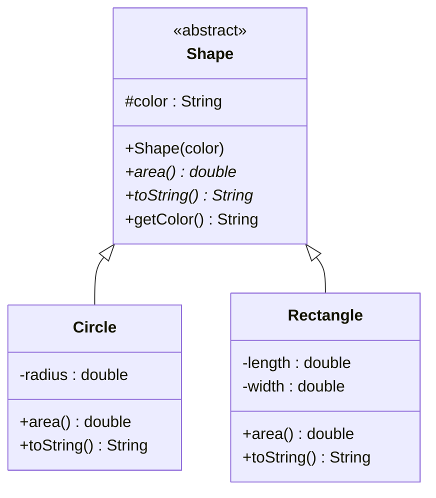

## What Is Abstraction?

> **Definition:** **Abstraction** is the process of **hiding internal implementation details and showing only the essential functionality** to the user. It focuses on **what** an object does rather than **how** it does it.

- **Hides complex details**; shows only essential features.
- **Abstract classes may declare methods without implementation** — subclasses must implement them.
- **Changes to the implementation do not affect code that depends only on the abstraction.**
- Achieved via **abstract classes** or **interfaces**.

### Real-Life Examples

| Example | What you use (the abstraction) | What's hidden (the implementation) |
|---|---|---|
| **ATM** | Insert card, enter PIN, choose amount, take cash | Network messages to the bank, account ledgers, cash dispensing mechanics |
| **Coffee machine** | Press "Cappuccino" | Water heating, pressure, milk frothing |
| **TV remote** | Press ON / OFF / volume | Infrared signals, the TV's circuits |
| **Car** | Steering wheel, pedals, gear lever | Engine timing, fuel injection, transmission |

<Analogy>
When you **send money on a banking app**, you enter an account number and amount, then tap "Send". You don't know — and don't need to know — how the app talks to NIBSS, checks fraud rules or updates two banks' ledgers. The app shows you **what** it does and hides **how**. If the bank rewrites its internal systems tomorrow, your "Send" button works the same. That's abstraction.
</Analogy>

### The TV Remote in Code

```java
abstract class TV {
    abstract void turnOn();
    abstract void turnOff();
}

class TVRemote extends TV {
    @Override void turnOn()  { System.out.println("TV is turned ON."); }
    @Override void turnOff() { System.out.println("TV is turned OFF."); }
}

public class Geeks {
    public static void main(String[] args) {
        TV remote = new TVRemote();
        remote.turnOn();
        remote.turnOff();
    }
}
```

```text
TV is turned ON.
TV is turned OFF.
```

Code using `remote` only knows the **abstract type `TV`** and its operations — not how `TVRemote` performs them.

---

## Two Ways to Achieve Abstraction

| | **Abstract classes** | **Interfaces** |
|---|---|---|
| Level | **Partial abstraction** — can mix abstract and fully implemented (concrete) methods | Abstraction of **behaviour** — traditionally **100%** abstract; since Java 8 may also contain `default` and `static` methods |
| Keyword | `abstract class` … `extends` | `interface` … `implements` |
| State (fields) | ✅ instance variables | ❌ only constants (`public static final`) |
| Constructors | ✅ | ❌ |
| How many per class | **One** (single inheritance) | **Many** |

The lecture's picture: an **abstract class** like `Shape` defines a **common base** for related classes through inheritance, while an **interface** like `Drawable` defines a **behaviour** that many (even unrelated) classes can implement. Interfaces get their own lesson next.

---

## Abstract Classes

> **Definition:** An **abstract class** is declared with the **`abstract`** keyword and **cannot be instantiated directly**. It may contain both **abstract methods (no body)** and **concrete methods (with a body)**, providing **common functionality while leaving some behaviour to subclasses**.

- Can contain **abstract and concrete methods**.
- Can have **constructors, instance variables and static members**.
- It's a **restricted class**: `new Shape(...)` is a compile error — you create objects of its **concrete subclasses**.

> **Definition:** An **abstract method** can **only be declared in an abstract class** (or interface). **It has no body** — just a signature ending in `;` — and **the body is supplied by the subclass**: `abstract double area();`

### The Rules

| Rule | Consequence |
|---|---|
| A class with **at least one abstract method must be declared `abstract`** | Otherwise: *"Circle is not abstract and does not override abstract method area() in Shape"* |
| An abstract class **cannot be instantiated** | `new Animal()` → *"Animal is abstract; cannot be instantiated"* |
| A concrete subclass **must implement every** inherited abstract method | Or be declared `abstract` itself, passing the job further down |
| An abstract method **can't be `private`, `static` or `final`** | It must be overridable by the subclass |
| An abstract class **may have no abstract methods at all** | Used purely to prevent instantiation of a general base class |
| Abstract class **constructors** run when a subclass object is created | Via `super(...)` — they initialise the shared fields |

---

## Real-World Example: Shape



*`Shape` defines the common property (`color`) and methods; `Circle` and `Rectangle` extend it and add their own properties. `area()` and `toString()` are **abstract** (marked `*`), so each concrete subclass supplies its own version.*

```java
abstract class Shape {
    String color;

    abstract double area();                    // abstract: no body
    public abstract String toString();         // abstract: no body

    public Shape(String color) {               // an abstract class CAN have a constructor
        System.out.println("Shape constructor called");
        this.color = color;
    }

    public String getColor() { return color; } // concrete method, inherited as-is
}

class Circle extends Shape {
    double radius;

    public Circle(String color, double radius) {
        super(color);                          // run Shape's constructor
        this.radius = radius;
    }

    @Override double area() { return Math.PI * Math.pow(radius, 2); }

    @Override public String toString() {
        return "Circle color is " + super.getColor() + " and area is : " + area();
    }
}

class Rectangle extends Shape {
    double length, width;

    public Rectangle(String color, double length, double width) {
        super(color);
        this.length = length;
        this.width = width;
    }

    @Override double area() { return length * width; }

    @Override public String toString() {
        return "Rectangle color is " + super.getColor() + " and area is : " + area();
    }
}

public class Test {
    public static void main(String[] args) {
        Shape s1 = new Circle("Red", 2.2);
        Shape s2 = new Rectangle("Yellow", 2, 4);
        System.out.println(s1.toString());
        System.out.println(s2.toString());
    }
}
```

**Output:**

```text
Shape constructor called
Shape constructor called
Circle color is Red and area is : 15.205308443374602
Rectangle color is Yellow and area is : 8.0
```

**Notice:**
1. **"Shape constructor called" prints twice** — once for **each object**, during `new Circle(...)` and `new Rectangle(...)`, because each subclass constructor calls **`super(color)`**. The abstract class's constructor **does** run, even though you can't write `new Shape(...)`.
2. The circle's area is π × 2.2² — printed with all of `double`'s digits because the value isn't formatted (`String.format("%.2f", area())` would give `15.21`).
3. `s1` and `s2` have type **`Shape`**, yet each `toString()` and `area()` call runs the **subclass's** version — abstraction and polymorphism working together.

---

## Abstract and Concrete Methods Together

**An abstract class can mix abstract and regular (concrete) methods:**

```java
abstract class Animal {
    public abstract void animalSound();                    // abstract: subclasses decide
    public void sleep() { System.out.println("Zzz"); }     // concrete: shared by all
}

class Pig extends Animal {
    public void animalSound() {
        System.out.println("The pig says: wee wee");
    }
}

class Main {
    public static void main(String[] args) {
        Pig myPig = new Pig();
        myPig.animalSound();
        myPig.sleep();
    }
}
```

```text
The pig says: wee wee
Zzz
```

**`Animal myObj = new Animal();` would generate a compile error** — an abstract class cannot be instantiated directly.

| | **Abstract method** | **Concrete method** |
|---|---|---|
| Body | **None** — ends with `;` | **Has a body** `{ … }` |
| Declared in | Only an **abstract class** (or interface) | Any class |
| Subclass must… | **Implement (override)** it | May use it as-is or override it |
| Purpose | Forces subclasses to supply behaviour that **varies** | Provides behaviour that's **shared** |

---

## Why Use Abstraction?

### Advantages

- **Makes complex systems easier to understand** by hiding implementation detail.
- **Keeps different parts of a system separated** — code depends on the abstraction, not the details.
- **Maintains code more efficiently** — change an implementation without touching the code that uses it.
- **Increases security** by exposing only the necessary detail.

### Limitations

- **Unnecessary abstraction adds complexity.**
- **Can make debugging harder** — the implementation is hidden behind layers.
- **May require extra classes/interfaces**, increasing code volume.
- **Too many abstraction layers hurt comprehension.**
- **Designing good abstractions requires careful planning.**
- **Adds little benefit in small or simple programs.**

<ExamTip>
Know **when** to use an abstract class: when several related classes **share code and fields** (so a common base avoids repetition) **and** each must supply its **own version** of some operation (so abstract methods force them to). If there's no shared code, an **interface** is usually the better fit.
</ExamTip>

---

## Exercises (Week 8)

<Reveal question="Exercise 1: Explain, from the compiler's perspective, why new Animal() fails when Animal is abstract.">
The compiler knows `Animal` declares at least one **abstract method with no body** (e.g. `animalSound()`). If it allowed an `Animal` object, a call like `a.animalSound()` would have **no code to run**. So Java forbids instantiating abstract classes at compile time: *"Animal is abstract; cannot be instantiated"*. Objects must be created from **concrete subclasses**, which the compiler has verified implement **every** abstract method.
</Reveal>

<Reveal question="Exercise 2: An abstract Employee with calculateSalary(), implemented by FullTimeEmployee and PartTimeEmployee.">
```java
abstract class Employee {
    protected String name;
    Employee(String name) { this.name = name; }

    abstract double calculateSalary();            // each type computes pay differently

    void printPayslip() {                          // shared concrete method
        System.out.printf("%-10s N%,.2f%n", name, calculateSalary());
    }
}

class FullTimeEmployee extends Employee {
    private double monthlySalary;
    FullTimeEmployee(String name, double monthlySalary) {
        super(name);
        this.monthlySalary = monthlySalary;
    }
    @Override double calculateSalary() { return monthlySalary; }
}

class PartTimeEmployee extends Employee {
    private double hourlyRate;
    private int hoursWorked;
    PartTimeEmployee(String name, double hourlyRate, int hoursWorked) {
        super(name);
        this.hourlyRate = hourlyRate;
        this.hoursWorked = hoursWorked;
    }
    @Override double calculateSalary() { return hourlyRate * hoursWorked; }
}

public class Payroll {
    public static void main(String[] args) {
        Employee[] staff = { new FullTimeEmployee("Ada", 350000), new PartTimeEmployee("Musa", 2500, 64) };
        for (Employee e : staff) e.printPayslip();
    }
}
```
```text
Ada        N350,000.00
Musa       N160,000.00
```
</Reveal>

<Reveal question="Exercise 3: Add a Triangle subclass to the Shape example.">
```java
class Triangle extends Shape {
    double base, height;

    public Triangle(String color, double base, double height) {
        super(color);
        this.base = base;
        this.height = height;
    }

    @Override double area() { return 0.5 * base * height; }

    @Override public String toString() {
        return "Triangle color is " + super.getColor() + " and area is : " + area();
    }
}
// new Triangle("Green", 6, 4) → "Triangle color is Green and area is : 12.0"
```
It must implement **both** abstract methods, `area()` and `toString()`, or the compiler rejects it.
</Reveal>

<Reveal question="Exercise 4: An abstract PaymentMethod with a concrete printReceipt() and an abstract processPayment(double), for CardPayment and CashPayment.">
```java
abstract class PaymentMethod {
    abstract boolean processPayment(double amount);

    void printReceipt(double amount) {                        // concrete, shared
        System.out.printf("Receipt: N%,.2f paid by %s%n", amount, getClass().getSimpleName());
    }
}

class CardPayment extends PaymentMethod {
    private String last4;
    CardPayment(String last4) { this.last4 = last4; }

    @Override boolean processPayment(double amount) {
        System.out.println("Charging card ending " + last4 + "...");
        return true;                                          // a real app would call the payment gateway
    }
}

class CashPayment extends PaymentMethod {
    private double tendered;
    CashPayment(double tendered) { this.tendered = tendered; }

    @Override boolean processPayment(double amount) {
        if (tendered < amount) {
            System.out.println("Insufficient cash");
            return false;
        }
        System.out.printf("Change: N%,.2f%n", tendered - amount);
        return true;
    }
}

public class Checkout {
    public static void main(String[] args) {
        PaymentMethod[] payments = { new CardPayment("4821"), new CashPayment(10000) };
        for (PaymentMethod p : payments) {
            if (p.processPayment(7500)) p.printReceipt(7500);
        }
    }
}
```
```text
Charging card ending 4821...
Receipt: N7,500.00 paid by CardPayment
Change: N2,500.00
Receipt: N7,500.00 paid by CashPayment
```
</Reveal>

---

## Check Your Understanding

<MCQ question="Which statement about abstract classes is FALSE?">
<Option>They can have constructors.</Option>
<Option>They can contain concrete methods.</Option>
<Option correct>They can be instantiated with new if they have no abstract methods.</Option>
<Option>A concrete subclass must implement all inherited abstract methods.</Option>
<Explain>
**Any** class declared `abstract` cannot be instantiated — even if it has zero abstract methods. The other statements are all true: abstract classes may have constructors (run via `super(...)`), concrete methods and fields.
</Explain>
</MCQ>

<MCQ question="A class Square extends the abstract class Shape but does not implement Shape's abstract method area(). What must be true for it to compile?">
<Option>Nothing — it compiles anyway.</Option>
<Option correct>Square must itself be declared abstract.</Option>
<Option>Square must be declared final.</Option>
<Option>area() must be made private.</Option>
<Explain>
A class that inherits an abstract method without implementing it **still has an abstract method**, so it **must be abstract** too. Only when some subclass implements every abstract method can objects be created.
</Explain>
</MCQ>

## Practice Questions

<Reveal question="Define abstraction and explain how it is achieved in Java.">
Abstraction is **hiding internal implementation details and exposing only essential functionality** — focusing on **what** an object does, not **how**. In Java it's achieved with **abstract classes** (partial abstraction: a mix of abstract and concrete methods, plus fields and constructors) and **interfaces** (abstraction of behaviour: method contracts that classes implement; since Java 8 also default/static methods).
</Reveal>

<Reveal question="What is an abstract class? State four of its features.">
A class declared with **`abstract`** that **cannot be instantiated** and serves as a base for subclasses. Features: may contain **abstract methods** (no body) and **concrete methods**; can have **constructors** (run when subclass objects are created); can have **instance variables and static members**; **subclasses must implement all abstract methods** (or be abstract themselves); a class can extend **only one** abstract class.
</Reveal>

<Reveal question="Give three advantages and three limitations of abstraction.">
**Advantages:** easier to understand complex systems; separation of parts of a system (loose coupling); easier maintenance (implementations change without affecting users); security (only necessary detail exposed). **Limitations:** unnecessary abstraction adds complexity; harder debugging; extra classes/interfaces increase code volume; too many layers hurt comprehension; needs careful design; little benefit in small programs.
</Reveal>

<Takeaway>
**Abstraction** shows **what** an object does and hides **how** (ATM, TV remote, banking app); code that depends only on the abstraction is unaffected when implementations change. Java achieves it with **abstract classes** (**partial**) and **interfaces** (behaviour contracts). An **abstract class** (`abstract`) **cannot be instantiated**, may contain **abstract methods** (no body, `;`) **and concrete methods**, **constructors**, fields and static members. A class with an abstract method **must be abstract**; a **concrete subclass must implement every abstract method**; abstract methods can't be `private`/`static`/`final`. The abstract class's constructor runs via `super(...)` for each subclass object (hence "Shape constructor called" twice). Benefits: simplicity, separation, maintainability, security; costs: complexity, harder debugging, more classes — don't over-abstract small programs.
</Takeaway>

## Exam Tips

**What lecturers test:**
- Definition of abstraction; real-life examples
- Abstract class vs abstract method; rules; `new` on an abstract class
- The **Shape** example — write it and give the **output** (including the constructor messages)
- Advantages and limitations
- Designing an abstract class with abstract and concrete methods (Employee, PaymentMethod)

**Common mistakes:**
- Giving an abstract method a body `{ }`
- Forgetting a subclass must implement **all** abstract methods
- Saying abstract classes can't have constructors

**Likely question:**
> "Define abstraction. Write an abstract class Employee with an abstract method calculateSalary() and two concrete subclasses. Explain why an abstract class cannot be instantiated and state two advantages of abstraction." (15 marks)
