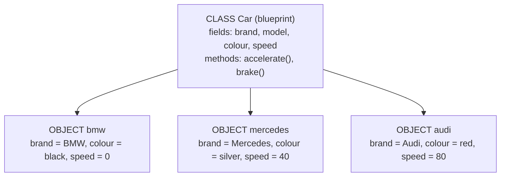

## Object-Oriented Programming

> **Definition:** **Object-Oriented Programming (OOP)** is a programming paradigm based on **objects** that bundle **data (fields)** and **behaviour (methods)**, closely modelling **real-world entities**.

**Why OOP?**
- **Improves code reusability** — write a class once, create many objects
- **Enhances maintainability and scalability** — changes stay inside the class
- **Makes programs easier to understand and manage** — code is organised around things in the problem (Student, Course, Account)
- **Closely models real-world entities**

The four pillars you'll study this semester: **encapsulation**, **inheritance**, **polymorphism** and **abstraction**. They all start with **classes and objects**.

---

## Classes and Objects

> **A class is a blueprint for creating objects.** It encapsulates **fields (state)** and **methods (behaviour)** common to all objects of that type. **An object is an instance of a class.**



*`Car` is the class; `bmw`, `mercedes` and `audi` are objects (instances) of it. Similarly, `Dog` is a class and **Tommy** is an object of that class.*

### Every Object Has State, Behaviour and Identity

| Characteristic | Meaning | Dog example |
|---|---|---|
| **State** | The **current data / attribute values** | name = Tommy, breed = Alsatian, age = 3 |
| **Behaviour** | The **actions** it can perform (its methods) | bark(), eat(), sleep() |
| **Identity** | A **unique identity in memory** that distinguishes it from other objects — **even if they contain the same data** | Two dogs both named Tommy are still two different dogs |

<Analogy>
A **class is like an admission form template** printed by the university: it has boxes for name, matric number and department. Each **filled-in form** is an **object** — same boxes, different values. Two students called "Ada Obi" fill in two separate forms: same data, **different identity**.
</Analogy>

---

## Defining a Class and Creating Objects

```java
public class ClassDemo {
    int x = 5;                                  // an attribute (field)

    public static void main(String[] args) {
        ClassDemo myObj = new ClassDemo();      // create an object
        System.out.println(myObj.x);            // 5
    }
}
```

- **Attributes** (also called **fields**) are **variables declared inside a class**.
- **Objects are created with the `new` keyword**: `new ClassDemo()` builds the object on the heap and returns a **reference** to it, stored in `myObj`.
- **Attributes are accessed with dot notation**: `myObj.x`.

> **File rule:** a `.java` file may contain several classes, but **at most one `public` class**, and the file must be **named after it** — `public class ClassDemo` lives in **`ClassDemo.java`**.

### Modifying and Overriding Attribute Values

```java
public class Main {
    int x = 10;

    public static void main(String[] args) {
        Main myObj = new Main();
        myObj.x = 25;                 // x is now 25
        System.out.println(myObj.x);  // 25
    }
}
```

### Default Values and Independent Objects

Fields you don't initialise get **default values** (`0`, `0.0`, `false`, `null`) — just like array elements. Each object has **its own copy** of the fields:

```java
class Student {
    int matricNum;       // instance variable
    String name;         // instance variable

    public static void main(String[] args) {
        Student new_student_1 = new Student();
        Student new_student_2 = new Student();
        System.out.println(new_student_1.matricNum);   // 0
        System.out.println(new_student_1.name);        // null
        System.out.println(new_student_2.matricNum);   // 0
        System.out.println(new_student_2.name);        // null
    }
}
```

Step through two objects getting their own state:

<CodeTrace title="Two objects, separate state">

```java
class Car {
    String brand;
    int speed;
}

public class Main {
    public static void main(String[] args) {
        Car a = new Car();
        Car b = new Car();
        a.brand = "Toyota";
        b.brand = "Kia";
        a.speed = 80;
        System.out.println(a.brand + " " + a.speed);
        System.out.println(b.brand + " " + b.speed);
    }
}
```

```trace
8 | a=→ Car(brand=null; speed=0) | | main | new Car() creates an object with default values: brand = null, speed = 0.
9 | a=→ Car(brand=null; speed=0), b=→ Car(brand=null; speed=0) | | main | A second, completely separate object.
10 | a=→ Car(brand=Toyota; speed=0), b=→ Car(brand=null; speed=0) | | main | Dot notation sets a's brand only.
11 | a=→ Car(brand=Toyota; speed=0), b=→ Car(brand=Kia; speed=0) | | main | b's brand is its own.
12 | a=→ Car(brand=Toyota; speed=80), b=→ Car(brand=Kia; speed=0) | | main | Changing a.speed does not touch b.speed.
13 | a=→ Car(brand=Toyota; speed=80), b=→ Car(brand=Kia; speed=0) | Toyota 80\n | main | 
14 | a=→ Car(brand=Toyota; speed=80), b=→ Car(brand=Kia; speed=0) | Kia 0\n | main | b still has the default speed 0.
```

</CodeTrace>

### null and NullPointerException

A reference variable that doesn't point to any object holds **`null`**. Using it to reach a field or method throws a **`NullPointerException`** at run time:

```java
Student s = null;                 // no object yet
System.out.println(s.name);       // ✗ NullPointerException
s = new Student();                // now s refers to an object
System.out.println(s.name);       // null (the field's default) — no exception
```

*(This is the course's Week 5 Assignment 6.)* Always create the object with `new` before using it.

---

## Constructors

> **A constructor is a special member of a class that is automatically invoked when an object is created.** It is primarily used to **initialise the object's data members** — to set up its **initial state**.

**Rules:**
1. The **constructor's name must be the same as the class name**.
2. It has **no return type — not even `void`**.
3. It is **called automatically** when an object is created with **`new`**.

```java
public class Main {
    int x;                            // an attribute

    public Main() {                   // the constructor
        x = 5;                        // set the initial value
    }

    public static void main(String[] args) {
        Main myObj = new Main();      // creating the object calls the constructor
        System.out.println(myObj.x);  // 5
    }
}
```

> **All classes have constructors.** If you don't write one, **Java creates a default constructor for you** (with no parameters, leaving fields at their default values). But the moment you write **any** constructor yourself, Java **no longer** provides the default one — so `new Main()` stops compiling if you only defined `Main(int y)`.

### Constructor Parameters

Constructors can take parameters to initialise attributes with specific values:

```java
public class Main {
    int x;

    public Main(int y) {
        x = y;
    }

    public static void main(String[] args) {
        Main myObj = new Main(5);
        System.out.println(myObj.x);  // 5
    }
}
```

With several parameters:

```java
public class Main {
    int modelYear;
    String modelName;

    public Main(int year, String name) {
        modelYear = year;
        modelName = name;
    }

    public static void main(String[] args) {
        Main myCar = new Main(2024, "ML350");
        System.out.println(myCar.modelYear + " " + myCar.modelName);
    }
}
```

```text
2024 ML350
```

*(The slide's comment says `2023 ML350`, but the object is created with 2024 — the output is whatever values were passed.)*

### Types of Constructors

| Type | Description | Example |
|---|---|---|
| **Default constructor** | **No parameters**; initialises with default values. Provided automatically by Java if you write no constructor | `public Student() { }` |
| **No-argument constructor** (user-written) | No parameters, but **your own** starting values | `public Student() { department = "Undeclared"; }` |
| **Parameterised constructor** | **Accepts parameters** to set specific values | `public Student(String name, String id)` |
| **Copy constructor** | **Creates a new object by copying another object's data** | `public Student(Student other)` |
| **Private constructor** | **Private access; prevents creating objects from outside the class** — used for utility classes and the Singleton pattern | `private Config() { }` |

### The this Keyword

Inside a constructor or method, **`this`** refers to **the current object**. It's needed when a **parameter has the same name as a field** — the parameter "shadows" the field:

```java
public class Student {
    String name;
    String matricNo;

    public Student(String name, String matricNo) {
        this.name = name;              // this.name = the field; name = the parameter
        this.matricNo = matricNo;
    }
}
```

Without `this`, `name = name;` just assigns the parameter to itself, and the field stays `null` — a classic bug.

### Constructor Overloading and Chaining

A class can have **several constructors** with different parameter lists (overloading, as with methods). One constructor can **call another** with **`this(...)`** — which must be the **first statement**:

<CodeTrace title="Constructor overloading, this(...) and a copy constructor">

```java
public class Student {
    String name;
    String department;

    public Student(String name, String department) {
        this.name = name;
        this.department = department;
    }

    public Student(String name) {
        this(name, "Undeclared");
    }

    public Student(Student other) {
        this(other.name, other.department);
    }

    public static void main(String[] args) {
        Student s1 = new Student("Ada", "Computer Science");
        Student s2 = new Student("Musa");
        Student s3 = new Student(s1);
        System.out.println(s2.name + ", " + s2.department);
        System.out.println(s3.name + ", " + s3.department + ", same object? " + (s3 == s1));
    }
}
```

```trace
19 | | | main > Student(String, String) | new Student("Ada", "Computer Science") calls the two-parameter constructor.
6 | this.name=Ada | | main > Student(String, String) | this.name is the field; name is the parameter.
7 | this.name=Ada, this.department=Computer Science | | main > Student(String, String) | The object is fully set up.
19 | s1=→ Student(Ada; Computer Science) | | main | s1 refers to the new object.
20 | s1=→ Student(Ada; Computer Science) | | main > Student(String) | Only one argument, so the one-parameter constructor runs…
11 | s1=→ Student(Ada; Computer Science) | | main > Student(String) > Student(String, String) | …which chains to the two-parameter one with a default department.
20 | s1=→ Student(Ada; Computer Science), s2=→ Student(Musa; Undeclared) | | main | s2 is Musa, Undeclared.
21 | s1=→ Student(Ada; Computer Science), s2=→ Student(Musa; Undeclared) | | main > Student(Student) | The copy constructor receives s1…
15 | s1=→ Student(Ada; Computer Science), s2=→ Student(Musa; Undeclared) | | main > Student(Student) > Student(String, String) | …and copies its fields into a NEW object.
21 | s1=→ Student(Ada; Computer Science), s2=→ Student(Musa; Undeclared), s3=→ Student(Ada; Computer Science) (new object) | | main | s3 has the same data as s1 but a different identity.
22 | s1=→ Student(Ada; Computer Science), s2=→ Student(Musa; Undeclared), s3=→ Student(Ada; Computer Science) (new object) | Musa, Undeclared\n | main | 
23 | s1=→ Student(Ada; Computer Science), s2=→ Student(Musa; Undeclared), s3=→ Student(Ada; Computer Science) (new object) | Ada, Computer Science, same object? false\n | main | == compares references: two different objects, so false.
```

</CodeTrace>

> **`==` vs `equals()`:** for objects, `==` asks "**same object** (identity)?"; comparing **contents** needs a method such as `equals()` — which is why you compare Strings with `s1.equals(s2)`, not `s1 == s2`.

### A Private Constructor: the Singleton

```java
public class DatabaseConnection {
    private static DatabaseConnection instance;

    private DatabaseConnection() { }             // nobody outside can call new DatabaseConnection()

    public static DatabaseConnection getInstance() {
        if (instance == null) instance = new DatabaseConnection();
        return instance;                          // always the same single object
    }
}
```

---

## Methods on Objects

Objects also have **behaviour**. Instance methods (no `static`) work on **the object they're called on**, using its fields:

```java
public class BankAccount {
    String owner;
    double balance;

    public BankAccount(String owner, double balance) {
        this.owner = owner;
        this.balance = balance;
    }

    void deposit(double amount) {
        balance += amount;                     // this object's balance
    }

    void printStatement() {
        System.out.printf("%s: N%,.2f%n", owner, balance);
    }

    public static void main(String[] args) {
        BankAccount acct = new BankAccount("Ada", 5000);
        acct.deposit(2500);
        acct.printStatement();                 // Ada: N7,500.00
    }
}
```

(`%,.2f` formats with thousands separators and two decimals.)

---

## Exercises (Week 5)

<Reveal question="Exercise 2: A Book class with title, author and price; create two books and print them.">
```java
public class Book {
    String title;
    String author;
    double price;

    Book(String title, String author, double price) {
        this.title = title;
        this.author = author;
        this.price = price;
    }

    public static void main(String[] args) {
        Book b1 = new Book("Things Fall Apart", "Chinua Achebe", 4500.00);
        Book b2 = new Book("Purple Hibiscus", "Chimamanda Ngozi Adichie", 5200.00);
        System.out.println(b1.title + " by " + b1.author + " - N" + b1.price);
        System.out.println(b2.title + " by " + b2.author + " - N" + b2.price);
    }
}
```
```text
Things Fall Apart by Chinua Achebe - N4500.0
Purple Hibiscus by Chimamanda Ngozi Adichie - N5200.0
```
</Reveal>

<Reveal question="Exercise 4: Given class Car with int speed = 0, create a Car and change its speed to 80.">
```java
class Car {
    int speed = 0;
}

public class Main {
    public static void main(String[] args) {
        Car myCar = new Car();
        myCar.speed = 80;
        System.out.println("Speed: " + myCar.speed);   // Speed: 80
    }
}
```
</Reveal>

<Reveal question="Assignment 5: An Employee class with four attributes, an array of five employees, printed as a formatted table.">
```java
public class Employee {
    String staffId, name, department;
    double salary;

    Employee(String staffId, String name, String department, double salary) {
        this.staffId = staffId;
        this.name = name;
        this.department = department;
        this.salary = salary;
    }

    public static void main(String[] args) {
        Employee[] staff = {
            new Employee("UI/001", "Ada Obi", "ICT", 250000),
            new Employee("UI/002", "Musa Bello", "Bursary", 310000),
            new Employee("UI/003", "Chioma Eze", "Library", 198500),
            new Employee("UI/004", "Tunde Ade", "Registry", 275000),
            new Employee("UI/005", "Fatima Yusuf", "ICT", 402750)
        };
        System.out.printf("%-8s %-14s %-10s %12s%n", "ID", "Name", "Dept", "Salary");
        for (Employee e : staff) {
            System.out.printf("%-8s %-14s %-10s %,12.2f%n", e.staffId, e.name, e.department, e.salary);
        }
    }
}
```
`%-14s` prints a string **left-aligned** in 14 characters; `%12.2f` right-aligns a number in 12 characters with 2 decimals — producing neat columns.
</Reveal>

---

## Check Your Understanding

<MCQ question="Which is a valid constructor for a class named Course?">
<Option>public void Course(String code)</Option>
<Option correct>public Course(String code)</Option>
<Option>public course(String code)</Option>
<Option>public Course String(code)</Option>
<Explain>
A constructor has **exactly the class name** (case-sensitive: `Course`, not `course`) and **no return type** — not even `void`. `public void Course(...)` compiles, but it's an ordinary **method** that happens to share the class name, so it isn't called by `new`.
</Explain>
</MCQ>

<MCQ question="A class defines only the constructor Point(int x, int y). What happens with new Point()?">
<Option>It creates a point at (0, 0).</Option>
<Option correct>Compile error: no constructor Point() exists.</Option>
<Option>A NullPointerException at run time.</Option>
<Option>Java calls Point(int x, int y) with default values.</Option>
<Explain>
Java supplies a default no-argument constructor **only when a class declares no constructors at all**. Once `Point(int, int)` is written, `new Point()` has nothing to call — a **compile-time** error. Add `public Point() { }` (or `this(0, 0)`) if you need it.
</Explain>
</MCQ>

<MCQ question="In a constructor Student(String name) the body is name = name; — what is the value of the object's name field afterwards?">
<Option>The argument that was passed</Option>
<Option correct>null (unchanged)</Option>
<Option>An empty string</Option>
<Option>It doesn't compile</Option>
<Explain>
Inside the constructor, `name` refers to the **parameter**, which **shadows** the field; `name = name` assigns the parameter to itself. The field keeps its default **`null`**. Write **`this.name = name;`**.
</Explain>
</MCQ>

## Practice Questions

<Reveal question="Differentiate between a class and an object, with a real-world analogy.">
A **class** is a **blueprint/template** that defines the fields and methods common to a type of object; an **object** is a concrete **instance** of the class, created with `new`, with its own state. Analogy: the **architectural plan** of a house (class) vs the **actual houses** built from it (objects) — same design, different occupants and paint colours.
</Reveal>

<Reveal question="State three rules of constructors and the purpose of a constructor.">
A constructor **initialises** a new object's state. Rules: its **name matches the class name**; it has **no return type (not even void)**; it is **invoked automatically** when an object is created with `new`. (Also: it can be overloaded; if none is written, Java provides a default no-argument constructor.)
</Reveal>

<Reveal question="Explain the default, parameterised, copy and private constructors.">
**Default:** no parameters; sets default values; auto-provided by Java if no constructor is written. **Parameterised:** takes arguments to initialise fields with specific values. **Copy:** takes an object of the same class and creates a new object with a copy of its data. **Private:** cannot be called from outside the class, preventing outside object creation (e.g. Singleton, utility classes).
</Reveal>

<Reveal question="Class P has one field, int v = 1. What does this print: P a = new P(); P b = a; b.v = 9; System.out.println(a.v);">
**9.** `b = a` copies the **reference**, so `a` and `b` point to the **same object**; setting `b.v` changes the object that `a` also sees. (To get independent objects, create a new one — e.g. with a copy constructor.)
</Reveal>

<Takeaway>
**OOP** models programs as **objects** that bundle **data (fields/attributes)** and **behaviour (methods)**, improving reuse and maintainability. A **class** is a **blueprint**; an **object** is an **instance** created with **`new`**, with **state, behaviour and identity**; access members with **dot notation**. Unset fields take **default values**; each object has its **own copy**; a `null` reference used with `.` throws **`NullPointerException`**. A **constructor** has the **class's name**, **no return type**, and runs **automatically on `new`** to initialise the object. Types: **default** (auto-provided only if you write none), **no-arg**, **parameterised**, **copy**, **private**. Use **`this.field = param`** when names clash, **`this(...)`** to chain constructors (first statement), and overload constructors for flexible creation. `==` compares **identity**, not contents.
</Takeaway>

## Exam Tips

**What lecturers test:**
- Definitions: OOP, class, object (state, behaviour, identity), attribute
- Creating objects and accessing/modifying attributes (write the output)
- **Constructors**: definition, rules, types, examples
- Writing a class with a constructor and creating several objects (Book, Student, Employee)

**Common mistakes:**
- Giving a constructor a return type (`void`)
- `name = name;` instead of `this.name = name;`
- Expecting `new ClassName()` to work after defining only parameterised constructors
- Using an object reference before `new`

**Likely question:**
> "Explain the terms class, object and constructor. Write a Java class Student with attributes matricNo, name and department, a parameterised constructor and a method display(). Create three Student objects and display them." (15 marks)
