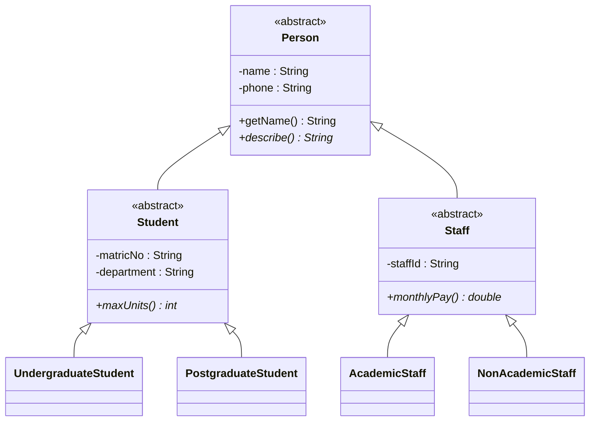

## Encapsulation

> **Definition:** **Encapsulation** **wraps data and the methods that operate on it into a single unit (a class)** and **restricts direct access to the data**.

- **Data members are hidden** using the **`private`** modifier.
- **Access is provided through public getter and setter methods.**
- Benefits: **data security**, **maintainability** and **controlled access**.

<Analogy>
Your **bank account balance** is encapsulated. You can't open the bank's database and type a new number; you can only use **controlled operations** — deposit, withdraw, check balance — and each one **checks the rules** (enough funds? daily limit? correct PIN?). The data is hidden; the methods guard it.
</Analogy>

### Without Encapsulation

```java
class Student {
    public String name;
    public double cgpa;
}

Student s = new Student();
s.cgpa = 9.7;          // nonsense on a 5-point scale — but nothing stops it
s.name = "";           // an empty name — also accepted
```

Any code anywhere can put the object into an **invalid state**.

### With Encapsulation: Private Fields, Getters and Setters

```java
public class Student {
    private String name;
    private final String matricNo;          // read-only: set once, no setter
    private double cgpa;

    public Student(String name, String matricNo) {
        setName(name);                      // reuse the validation
        this.matricNo = matricNo;
    }

    // Getters ("accessors") — read access
    public String getName()     { return name; }
    public String getMatricNo() { return matricNo; }
    public double getCgpa()     { return cgpa; }

    // Setters ("mutators") — write access, WITH rules
    public void setName(String name) {
        if (name == null || name.isBlank())
            throw new IllegalArgumentException("Name cannot be empty");
        this.name = name.trim();
    }

    public void setCgpa(double cgpa) {
        if (cgpa < 0.0 || cgpa > 5.0)
            throw new IllegalArgumentException("CGPA must be between 0.00 and 5.00");
        this.cgpa = cgpa;
    }
}
```

<CodeTrace title="A setter guarding the object's data">

```java
Student s = new Student("Ada Obi", "UI/CSC/2026/001");
s.setCgpa(4.35);
System.out.println(s.getName() + ": " + s.getCgpa());
try {
    s.setCgpa(9.7);
} catch (IllegalArgumentException e) {
    System.out.println("Rejected: " + e.getMessage());
}
System.out.println("CGPA is still " + s.getCgpa());
```

```trace
1 | s=→ Student(name=Ada Obi; matricNo=UI/CSC/2026/001; cgpa=0.0) | | main | The constructor calls setName, so even construction is validated.
2 | s=→ Student(name=Ada Obi; matricNo=UI/CSC/2026/001; cgpa=4.35) | | main > setCgpa(4.35) | 4.35 is within 0.0–5.0, so the setter stores it.
3 | s=→ Student(name=Ada Obi; matricNo=UI/CSC/2026/001; cgpa=4.35) | Ada Obi: 4.35\n | main | Reading goes through getters.
5 | s=→ Student(name=Ada Obi; matricNo=UI/CSC/2026/001; cgpa=4.35) | | main > setCgpa(9.7) | 9.7 > 5.0: the setter throws instead of storing it.
7 | s=→ Student(name=Ada Obi; matricNo=UI/CSC/2026/001; cgpa=4.35) | Rejected: CGPA must be between 0.00 and 5.00\n | main | The exception is caught; the field was never changed.
9 | s=→ Student(name=Ada Obi; matricNo=UI/CSC/2026/001; cgpa=4.35) | CGPA is still 4.35\n | main | The object stays valid — that's the point of encapsulation.
```

</CodeTrace>

### Getter and Setter Conventions

| Field | Getter | Setter |
|---|---|---|
| `private String name` | `getName()` | `setName(String name)` |
| `private double cgpa` | `getCgpa()` | `setCgpa(double cgpa)` |
| `private boolean graduated` | **`isGraduated()`** (booleans use `is`) | `setGraduated(boolean graduated)` |

**You don't need a setter for every field.** Leave it out to make a field **read-only** (like `matricNo`), or compute values instead of storing them (`getLevel()` could be derived from the matric year).

### Encapsulation vs Abstraction

| Encapsulation | Abstraction |
|---|---|
| **Protects "what"** — the **data** | **Hides "how"** — the **implementation** |
| Achieved with **`private` fields + public methods** | Achieved with **abstract classes and interfaces** |
| Question it answers: *who may change this data, and under what rules?* | Question it answers: *what can this object do, regardless of how?* |
| Example: `balance` is private; `withdraw()` checks funds | Example: `PaymentMethod.processPayment()` works for card or cash |

They work together: an abstract type hides **how**; each implementing class encapsulates **its own** data.

---

## Class Hierarchies

A **class hierarchy** is the **tree of classes connected by inheritance**, from the **most general** at the top to the **most specific** at the bottom. Every Java hierarchy is rooted at **`java.lang.Object`**.

### Designing a Hierarchy: A University Model



**Guidelines:**

| Guideline | In the model |
|---|---|
| **Generalise upwards:** put what **all** subclasses share in the **superclass** | `name`, `phone`, `getName()` live in `Person` — written once |
| **Specialise downwards:** put what's **unique** in the **subclass** | `matricNo` only in `Student`; `staffId` only in `Staff` |
| Use **abstract** classes for levels you never instantiate | Nobody is "just a Person" or "just a Student" |
| Use **abstract methods** for behaviour each subclass must define differently | `maxUnits()`: 24 for undergraduates, different for postgraduates |
| **Pass the IS-A test** at every link | A PostgraduateStudent **is a** Student ✓ — a Department **is a** Student ✗ (use a field) |
| A subclass must be **usable anywhere its superclass is** | Code that prints any `Person`'s `describe()` works for all six kinds |
| Keep it **shallow** | Two or three levels are usually enough; deep chains are hard to follow |

### Overriding Object's Methods

Since every class inherits from `Object`, it's good practice to override its key methods in your own classes:

| Method from `Object` | Default behaviour | Override to… |
|---|---|---|
| `toString()` | `Student@1b6d3586` (class name + hash) | Return a readable description — used automatically by `println` and `+` |
| `equals(Object o)` | Same as `==` (same object?) | Compare **meaningful content** — e.g. two Students are equal if their `matricNo` matches |
| `hashCode()` | Based on identity | Must be overridden **together with `equals`** so equal objects give equal hash codes (needed by `HashMap`/`HashSet`) |

```java
@Override
public String toString() {
    return matricNo + " — " + getName();
}

@Override
public boolean equals(Object o) {
    if (this == o) return true;
    if (!(o instanceof Student)) return false;
    Student other = (Student) o;
    return matricNo.equals(other.matricNo);
}

@Override
public int hashCode() {
    return matricNo.hashCode();
}
```

---

## Packages (Namespaces)

> A **package** is a **namespace that groups related classes and interfaces** — like a folder for code. It **organises** large programs and **prevents naming conflicts**: two classes may share a name if they're in different packages.

### Java's Built-in Packages

The **Java API** is organised into packages:

| Package | Contains | Examples |
|---|---|---|
| **`java.lang`** | Core classes — **imported automatically** | `String`, `Math`, `Integer`, `System`, `Object`, `Thread` |
| **`java.util`** | Collections and utilities | `ArrayList`, `Scanner`, `Arrays`, `HashMap`, `Random` |
| **`java.io`** / **`java.nio.file`** | Input/output, files | `File`, `BufferedReader`, `Files`, `Path` |
| **`java.time`** | Dates and times | `LocalDate`, `LocalDateTime`, `Duration` |
| **`javax.swing`**, **`java.awt`**, **`java.awt.event`** | GUI components and events | `JFrame`, `JButton`, `ActionListener` |
| **`java.util.function`** | Functional interfaces | `Predicate`, `Function` |
| **`java.sql`** | Database access (JDBC) | `Connection`, `PreparedStatement` |

### Using Classes from Packages: import

| Form | Example | Effect |
|---|---|---|
| **Single-type import** *(preferred)* | `import java.util.ArrayList;` | Use `ArrayList` by its simple name |
| **On-demand import** | `import java.util.*;` | Every class in `java.util` (not sub-packages) |
| **Fully qualified name** | `java.util.ArrayList<String> list = new java.util.ArrayList<>();` | No import needed — useful when two names clash |
| **Static import** | `import static java.lang.Math.PI;` | Use `PI` without `Math.` |

`import` statements go **after** the `package` line and **before** the class. Importing doesn't copy code or slow the program — it only tells the compiler where to find names.

### Creating Your Own Package

The **`package` declaration must be the first statement** in the file, and the **folder structure must match the package name**:

```java
// File: src/ng/edu/ui/srms/model/Student.java
package ng.edu.ui.srms.model;

public class Student {
    // …
}
```

```java
// File: src/ng/edu/ui/srms/Main.java
package ng.edu.ui.srms;

import ng.edu.ui.srms.model.Student;

public class Main {
    public static void main(String[] args) {
        Student s = new Student("Ada Obi", "UI/CSC/2026/001");
        System.out.println(s);
    }
}
```

```text
src/
└── ng/edu/ui/srms/
    ├── Main.java
    ├── model/
    │   ├── Student.java
    │   └── Course.java
    └── gui/
        └── RegistrationForm.java
```

**Compiling and running** from the `src` folder (IDEs like VS Code, IntelliJ and Eclipse do this for you):

```bash
javac -d ../out ng/edu/ui/srms/Main.java ng/edu/ui/srms/model/*.java
java -cp ../out ng.edu.ui.srms.Main
```

Note that you run the class by its **fully qualified name**, `ng.edu.ui.srms.Main`.

### Naming Conventions

- Package names are **all lower-case**.
- Organisations use their **domain name reversed** to guarantee uniqueness: `ui.edu.ng` → **`ng.edu.ui`**, then the project and layer: `ng.edu.ui.srms.model`.
- Group by **purpose**: `model` (data classes), `gui` (Swing forms), `service` (business logic), `util`.

### Packages and Access

Remember the **default (package-private)** access level: a member with **no modifier** is visible **only within its package**. Packages are therefore also an **encapsulation boundary** — helper classes can stay package-private, and only the classes other packages need are made `public`.

### Resolving Name Clashes

`java.util.Date` and `java.sql.Date` are different classes with the **same simple name**. Import one and **fully qualify** the other:

```java
import java.util.Date;

Date today = new Date();                           // java.util.Date
java.sql.Date dbDate = java.sql.Date.valueOf("2026-09-30");  // fully qualified
```

> **Beyond packages:** compiled packages are shipped as **JAR files** (Java ARchives — zipped `.class` files), and since Java 9 larger systems can group packages into **modules** (`module-info.java`) that declare which packages they export.

---

## Check Your Understanding

<MCQ question="Which best describes encapsulation?">
<Option>Hiding how a method works behind an abstract class</Option>
<Option correct>Keeping fields private and allowing access only through methods that enforce rules</Option>
<Option>Inheriting fields from a superclass</Option>
<Option>Grouping classes into packages</Option>
<Explain>
Encapsulation **bundles data with its methods and restricts direct access** — `private` fields with public getters/setters that validate. Hiding *how* is **abstraction**; inheriting is **inheritance**; packages organise code (and are a related but separate idea).
</Explain>
</MCQ>

<MCQ question="Where must the package declaration appear in a Java source file?">
<Option>Anywhere before main()</Option>
<Option correct>As the first statement, before any imports and classes</Option>
<Option>After the import statements</Option>
<Option>Inside the class body</Option>
<Explain>
`package ng.edu.ui.srms;` must be the **first statement** (only comments may come before it), followed by `import` statements, then the class declarations.
</Explain>
</MCQ>

<MCQ question="A class uses ArrayList and Scanner. Which package must it import, and which is automatic?">
<Option>Both come from java.lang, which is automatic.</Option>
<Option correct>Both are in java.util and must be imported; java.lang (String, Math) is automatic.</Option>
<Option>ArrayList is automatic; Scanner must be imported.</Option>
<Option>Neither can be imported.</Option>
<Explain>
`ArrayList` and `Scanner` live in **`java.util`** — import them (`import java.util.ArrayList;` etc.). Only **`java.lang`** is imported automatically.
</Explain>
</MCQ>

## Practice Questions

<Reveal question="Define encapsulation and write a BankAccount class that encapsulates its balance.">
Encapsulation **wraps data and methods in one class and restricts direct access to the data**, exposing controlled public methods.
```java
public class BankAccount {
    private double balance;                          // hidden

    public double getBalance() { return balance; }   // read access

    public void deposit(double amount) {
        if (amount <= 0) throw new IllegalArgumentException("Deposit must be positive");
        balance += amount;
    }

    public void withdraw(double amount) {
        if (amount > balance) throw new IllegalArgumentException("Insufficient funds");
        balance -= amount;
    }
}
```
There's deliberately **no `setBalance()`** — the balance can only change through the rule-checking operations.
</Reveal>

<Reveal question="State three benefits of encapsulation.">
**Data security/integrity** — objects can't be put into invalid states because every change passes through validation; **maintainability** — the internal representation can change without affecting code that uses the public methods; **controlled access** — read-only or write-only fields, logging or permissions can be added in one place.
</Reveal>

<Reveal question="What is a package? Give three reasons for using packages and three built-in Java packages.">
A package is a **namespace grouping related classes and interfaces**. Reasons: **organisation** of large projects; **avoiding name conflicts** (e.g. `java.util.Date` vs `java.sql.Date`); **access control** (package-private members); easier **reuse and distribution** (JARs). Built-in examples: **`java.lang`**, **`java.util`**, **`java.io`**, `javax.swing`, `java.time`.
</Reveal>

<Takeaway>
**Encapsulation** wraps data and methods in a class and **restricts direct access**: fields **`private`**, access through public **getters** (`getX`, `isX` for booleans) and **setters** that **validate**; omit setters for **read-only** fields. It **protects what (the data)**, while abstraction **hides how**. A **class hierarchy** runs from general to specific (rooted at `Object`): **generalise** shared members upwards, **specialise** unique ones downwards, use abstract classes/methods for levels you don't instantiate, keep it shallow and pass IS-A at every link; override `toString`, `equals` and `hashCode`. **Packages** are **namespaces** that organise classes and prevent name clashes: `java.lang` is automatic; use `import` (single-type preferred), fully qualified names, or static imports; `package ng.edu.ui.srms.model;` must be **first**, the **folders must match**, names are **lower-case reversed domains**; default access is **package-private**.
</Takeaway>

## Exam Tips

**What lecturers test:**
- Definition of **encapsulation**; private fields + getters/setters; benefits
- Encapsulation vs abstraction
- **Packages**: definition, purpose, `package` and `import` statements, built-in packages
- Designing a small hierarchy and justifying where members go

**Common mistakes:**
- Public fields with getters/setters that do no checking (encapsulation in name only)
- Putting `package` after `import`
- Folder structure not matching the package name

**Likely question:**
> "Define encapsulation and explain how it is implemented in Java. Write a class Course with private fields code, title and creditUnit (1–6) and appropriate getters and setters. What are packages and why are they used?" (15 marks)
