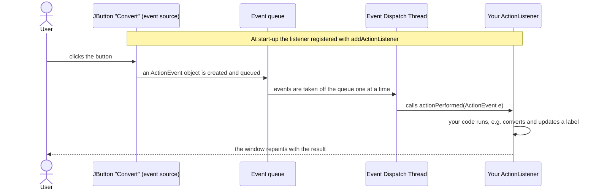
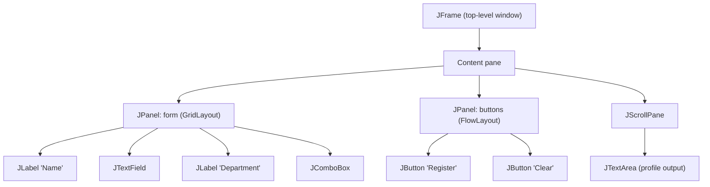

## Event-Driven Programming

Every program you've written so far is **sequential**: it runs from the top of `main` to the bottom, asking for input in a **fixed order** that the **program** controls.

**Event-driven programming** turns this around: the program **sets itself up, then waits**. Its flow is determined by **events** — **things that happen**, usually caused by the **user** (clicking a button, typing, choosing from a list, moving the mouse, closing a window) or by the system (a timer firing, data arriving). When an event occurs, the code **registered to handle it** runs. **The user is in control of the order.**

| Sequential (console) program | Event-driven (GUI) program |
|---|---|
| The **program** decides what happens next | The **user's actions** decide what happens next |
| "Enter name: … Enter score: …" in a fixed order | Fill the form's fields in any order, click any button |
| Runs from start to finish, then ends | Sets up the window, then **waits in an event loop** until closed |
| `Scanner.nextLine()` blocks until input | **Listener methods** are called when events arrive |

### The Vocabulary

| Term | Meaning | Example |
|---|---|---|
| **Event** | Something that happened | A button was clicked |
| **Event source** | The component where it happened | The `JButton` "Convert" |
| **Event object** | An object **describing** the event, passed to your code | An `ActionEvent` (which source? what command? when?) |
| **Listener** (event handler) | An object with a method that **responds** to the event | An `ActionListener` whose `actionPerformed(e)` converts the temperature |
| **Registration** | **Connecting** a listener to a source | `convertButton.addActionListener(listener);` |

### Java's Delegation Event Model

Java uses the **delegation model**: the source **delegates** handling to the listeners that registered with it.



1. At start-up, your code **registers** a listener with each source.
2. When the user acts, the source **creates an event object**, which goes into the **event queue**.
3. A single background thread — the **Event Dispatch Thread (EDT)** — takes events off the queue **one at a time** and **calls the listener method** of every listener registered for that event.
4. Your method runs; then the EDT goes back to **waiting** for the next event. That repeated "wait for an event → dispatch it" is the **event loop**.

### Event Handling and Propagation

- **Which component receives an event?** A **mouse** event goes to the component **under the pointer**; if that component isn't listening for mouse events, Swing **re-targets** it to its **parent container** — so events effectively travel up the containment hierarchy until something handles them. **Keyboard** events go to the component that has the **keyboard focus**.
- **One source, many listeners:** several listeners can register on the same button; all are called.
- **No listener, no code:** events such as the mouse entering a button happen constantly; they only run your code if a listener is registered for them.
- **Exceptions inside listeners:** if a listener throws an uncaught exception, it **propagates up to the EDT**, which prints the stack trace — the current event's handling is abandoned, but the window **stays open and keeps processing events**. That's why every listener that parses input should **catch** `NumberFormatException` and tell the user.
- **Keep listeners short:** the EDT runs one listener at a time, so a slow task in a listener (a big calculation, a network download) **freezes the whole window**. Long work belongs on another thread — see the Multithreading lesson (`SwingWorker`).

**Try it** — every action on this window is an event. Watch which listener runs and what the event object contains:

<SwingEventDemo />

---

## Java GUI Libraries: AWT, Swing and JavaFX

| | **AWT** (Abstract Window Toolkit) | **Swing** | **JavaFX** |
|---|---|---|---|
| Package | `java.awt` | **`javax.swing`** | `javafx.*` (separate download since Java 11) |
| Components | **Heavyweight** — drawn by the operating system | **Lightweight** — drawn by Java itself, look the same everywhere | Scene graph, CSS styling, FXML |
| Look | The OS's native widgets | **Pluggable look-and-feel** (Metal, Nimbus, Windows…) | Modern, styleable |
| Status | Foundation (events, layouts, colours still come from AWT) | **Part of the JDK; used in this course** | Newer alternative for rich desktop apps |

Swing builds **on top of** AWT: component classes start with **`J`** (`JButton`, `JFrame`), while the event classes and layout managers come from `java.awt` and `java.awt.event`.


*Figure: Real Swing components in the default **Metal** look and feel. Left, **JRadioButtons** in a group ("Choose the look"); right, a **JCheckBox**, **JSpinner**, **JComboBox**, **JTextField** ("input field"), **JTextArea** ("multi-line input area") in a **JScrollPane**, a **JButton**, a **JToggleButton** and a **JTable**. Screenshot: DavidL, CC BY-SA 4.0, via Wikimedia Commons.*

---

## Swing Components

| Component | Purpose | Key methods |
|---|---|---|
| **`JFrame`** | The **main window** (title bar, borders, close button) | `setTitle`, `setSize`/`pack`, `setDefaultCloseOperation`, `setVisible(true)` |
| **`JPanel`** | A **container** for grouping components; has its own layout | `add(component)`, `setLayout(...)` |
| **`JLabel`** | Displays **text** (or an icon) the user can't edit | `setText`, `getText` |
| **`JTextField`** | A **single-line** text input | `getText()`, `setText()` — fires an ActionEvent on **Enter** |
| **`JPasswordField`** | Text field that hides characters | `getPassword()` (returns `char[]`) |
| **`JTextArea`** | **Multi-line** text; put it in a **`JScrollPane`** to scroll | `append`, `setText`, `setEditable(false)` |
| **`JButton`** | A push **button** | `addActionListener` |
| **`JCheckBox`** | On/off option (several may be ticked) | `isSelected()` |
| **`JRadioButton`** + **`ButtonGroup`** | **One choice** from a group | `isSelected()`; add all to one `ButtonGroup` |
| **`JComboBox<E>`** | **Drop-down** list | `getSelectedItem()`, `getSelectedIndex()` |
| **`JList<E>`**, **`JTable`** | Lists and tables of data | selection listeners |
| **`JOptionPane`** | Ready-made **dialog boxes** | `showMessageDialog`, `showInputDialog`, `showConfirmDialog` |
| **`JMenuBar`**, **`JMenu`**, **`JMenuItem`** | Menus | `addActionListener` on items |

### The Containment Hierarchy

A Swing GUI is a **tree of containers and components**:



`frame.add(panel)` actually adds to the frame's **content pane**. Nesting **panels**, each with its own layout, is how you build complex forms.

### Layout Managers

A **layout manager** decides the **size and position** of the components in a container, so the GUI adapts when the window is resized — no hard-coded pixel positions.

| Layout | Arranges components… | Typical use |
|---|---|---|
| **`FlowLayout`** | **Left to right in a row**, wrapping to the next row — default for `JPanel` | A row of buttons |
| **`BorderLayout`** | In **five regions**: `NORTH`, `SOUTH`, `EAST`, `WEST`, `CENTER` — default for `JFrame`'s content pane | Title at the top, form in the centre, buttons at the bottom |
| **`GridLayout(rows, cols)`** | In a **grid of equal-sized cells**, filled row by row | Label–field pairs in a form, a calculator keypad |
| `GridBagLayout` | A flexible grid where cells can span rows/columns | Complex, professional forms |
| `BoxLayout` | In a single column or row | Stacked panels |

```text
BorderLayout                     GridLayout(3, 2)            FlowLayout
+-----------------------+        +-----------+-----------+   [ OK ] [ Cancel ] [ Help ]
|         NORTH         |        | Name:     | [_______] |
+------+--------+-------+        +-----------+-----------+
| WEST | CENTER | EAST  |        | Dept:     | [ v     ] |
+------+--------+-------+        +-----------+-----------+
|         SOUTH         |        | [Save]    | [Clear]   |
+-----------------------+        +-----------+-----------+
```

```java
frame.setLayout(new BorderLayout());
frame.add(new JLabel("Student Registration"), BorderLayout.NORTH);
frame.add(formPanel, BorderLayout.CENTER);
frame.add(buttonPanel, BorderLayout.SOUTH);
```

---

## Handling Events: Writing Listeners

To respond to a button click you need an object implementing the **`ActionListener`** interface, whose single method is `void actionPerformed(ActionEvent e)`. There are three common ways to write it:

<Tabs>
<Tab label="Lambda (Java 8) ✓">

`ActionListener` has **exactly one abstract method**, so it's a **functional interface** — a **lambda** is the shortest way:

```java
button.addActionListener(e -> label.setText("Clicked!"));
```

</Tab>
<Tab label="Anonymous inner class">

A class with no name, defined and instantiated on the spot — the classic pre-Java-8 style:

```java
button.addActionListener(new ActionListener() {
    @Override
    public void actionPerformed(ActionEvent e) {
        label.setText("Clicked!");
    }
});
```

</Tab>
<Tab label="Separate class">

A named class that implements the interface — useful when the same handling is reused:

```java
class ClickHandler implements ActionListener {
    private final JLabel label;
    ClickHandler(JLabel label) { this.label = label; }

    @Override
    public void actionPerformed(ActionEvent e) {
        label.setText("Clicked: " + e.getActionCommand());   // the button's text
    }
}

button.addActionListener(new ClickHandler(label));
```

Or the frame itself `implements ActionListener`, and `actionPerformed` checks `e.getSource()` to see which button fired.

</Tab>
</Tabs>

### Listener Types

| Listener interface | Method(s) | Fired by |
|---|---|---|
| **`ActionListener`** | `actionPerformed(ActionEvent)` | **Button click**, **Enter** in a text field, menu item, combo selection |
| **`ItemListener`** | `itemStateChanged(ItemEvent)` | Checkbox, radio button, combo box selection changes |
| **`KeyListener`** | `keyPressed`, `keyReleased`, `keyTyped` | Keyboard keys (on the focused component) |
| **`MouseListener`** | `mouseClicked`, `mousePressed`, `mouseReleased`, `mouseEntered`, `mouseExited` | Mouse buttons and the pointer entering/leaving |
| **`MouseMotionListener`** | `mouseMoved`, `mouseDragged` | Pointer movement |
| **`WindowListener`** | `windowClosing`, `windowOpened`, … (7 methods) | The window's life cycle |
| **`DocumentListener`** | `insertUpdate`, `removeUpdate`, `changedUpdate` | Text in a field changing as the user types |
| **`ListSelectionListener`** | `valueChanged` | Selecting rows in a `JList`/`JTable` |

> **Adapter classes:** interfaces with many methods (`MouseListener` has five) are tedious to implement fully. **`MouseAdapter`**, **`KeyAdapter`** and **`WindowAdapter`** implement every method with an empty body, so you **override only the one you need**:
> ```java
> label.addMouseListener(new MouseAdapter() {
>     @Override public void mouseClicked(MouseEvent e) { label.setText("Clicked at " + e.getX()); }
> });
> ```

---

## A Complete Example: Temperature Converter

This is the program behind the interactive window above.

```java
import javax.swing.*;
import java.awt.*;

public class TemperatureConverter extends JFrame {
    private final JTextField celsiusField = new JTextField(8);
    private final JComboBox<String> unitBox = new JComboBox<>(new String[] {"Fahrenheit", "Kelvin"});
    private final JLabel resultLabel = new JLabel("Result: ");

    public TemperatureConverter() {
        super("Temperature Converter");                 // the window title
        setLayout(new GridLayout(4, 2, 8, 8));          // 4 rows, 2 columns, 8px gaps

        JButton convertButton = new JButton("Convert");
        JButton clearButton = new JButton("Clear");

        add(new JLabel("Celsius:"));     add(celsiusField);
        add(new JLabel("Convert to:"));  add(unitBox);
        add(convertButton);              add(clearButton);
        add(resultLabel);

        // Register the listeners (event handling)
        convertButton.addActionListener(e -> convert());
        celsiusField.addActionListener(e -> convert());           // pressing Enter in the field
        clearButton.addActionListener(e -> {
            celsiusField.setText("");
            resultLabel.setText("Result: ");
        });

        setDefaultCloseOperation(JFrame.EXIT_ON_CLOSE);         // closing the window ends the program
        pack();                                                 // size the window to fit its contents
        setLocationRelativeTo(null);                            // centre it on the screen
    }

    private void convert() {
        try {
            double c = Double.parseDouble(celsiusField.getText().trim());
            double result = unitBox.getSelectedItem().equals("Fahrenheit") ? c * 9 / 5 + 32 : c + 273.15;
            resultLabel.setText(String.format("Result: %.2f", result));
        } catch (NumberFormatException ex) {
            JOptionPane.showMessageDialog(this, "Please enter a number.",
                    "Invalid input", JOptionPane.WARNING_MESSAGE);
        }
    }

    public static void main(String[] args) {
        SwingUtilities.invokeLater(() -> new TemperatureConverter().setVisible(true));
    }
}
```

**Walk-through:**

<FlowDiagram title="From main() to responding to a click">
<FlowStep title="1. main starts the GUI on the EDT">
`SwingUtilities.invokeLater(...)` asks the **Event Dispatch Thread** to create the window. **All Swing work should happen on the EDT**, because Swing components aren't thread-safe.
</FlowStep>
<FlowStep title="2. The constructor builds the window">
`super("…")` sets the title; `setLayout(new GridLayout(4, 2, 8, 8))` chooses a layout; `add(...)` places the labels, field, combo box, buttons and result label **in order**, filling the grid row by row.
</FlowStep>
<FlowStep title="3. Listeners are registered">
`addActionListener(e -> convert())` connects each source to its handler. Nothing runs yet — the program is only saying *"when this happens, do that"*.
</FlowStep>
<FlowStep title="4. The window appears and waits">
`setVisible(true)` shows it. `main` has already finished, but the program keeps running: the **EDT waits** in its event loop.
</FlowStep>
<FlowStep title="5. The user clicks Convert">
The button creates an **ActionEvent**; the EDT calls the lambda, which calls `convert()`.
</FlowStep>
<FlowStep title="6. The handler runs — safely">
`Double.parseDouble` reads the field. If it holds "abc", it throws **NumberFormatException**, which the `catch` turns into a **JOptionPane** warning — the program doesn't crash. Otherwise `setText` shows the result, e.g. 37 °C → **98.60** °F.
</FlowStep>
<FlowStep title="7. Back to waiting">
The EDT returns to the event loop until the next event — or until the window is closed, when `EXIT_ON_CLOSE` ends the program.
</FlowStep>
</FlowDiagram>

### Dialog Boxes with JOptionPane

| Method | Shows | Returns |
|---|---|---|
| `showMessageDialog(parent, message)` | A message with an OK button | nothing |
| `showMessageDialog(parent, msg, title, JOptionPane.ERROR_MESSAGE)` | …with a title and icon (`ERROR_MESSAGE`, `WARNING_MESSAGE`, `INFORMATION_MESSAGE`) | nothing |
| `showInputDialog(parent, question)` | A text box | the **String** typed, or `null` if cancelled |
| `showConfirmDialog(parent, question)` | Yes / No / Cancel | `JOptionPane.YES_OPTION`, `NO_OPTION`, … |

```java
int answer = JOptionPane.showConfirmDialog(this, "Delete this course?");
if (answer == JOptionPane.YES_OPTION) {
    // delete it
}
```

Dialogs are **modal**: the rest of the window is blocked until the user responds.

---

## Check Your Understanding

<MCQ question="In Java's delegation event model, what is the role of the ActionListener?">
<Option>It creates the button on the screen.</Option>
<Option>It is the object where the event happened.</Option>
<Option correct>It is the object whose actionPerformed method responds when the event occurs.</Option>
<Option>It stores the event queue.</Option>
<Explain>
The **button** is the **event source**; the **ActionEvent** is the **event object**; the **listener** is registered with the source and its **`actionPerformed(e)`** method is called to **handle** the event.
</Explain>
</MCQ>

<MCQ question="Which layout arranges components in five regions called NORTH, SOUTH, EAST, WEST and CENTER?">
<Option>FlowLayout</Option>
<Option correct>BorderLayout</Option>
<Option>GridLayout</Option>
<Option>BoxLayout</Option>
<Explain>
**BorderLayout** has five regions and is the default for a JFrame's content pane. **FlowLayout** places components in a row (default for JPanel); **GridLayout** makes a grid of equal cells.
</Explain>
</MCQ>

<MCQ question="A button's listener runs a calculation that takes 20 seconds. What does the user experience?">
<Option>The calculation runs while the window stays responsive.</Option>
<Option correct>The whole window freezes until the listener finishes.</Option>
<Option>Swing automatically moves the work to another thread.</Option>
<Option>The program crashes with an exception.</Option>
<Explain>
Listeners run **on the Event Dispatch Thread**, which handles events **one at a time**. While it's busy, it can't repaint or respond to clicks, so the window **freezes**. Long tasks must run on a **background thread** (e.g. `SwingWorker`).
</Explain>
</MCQ>

## Practice Questions

<Reveal question="Define event-driven programming and explain the terms event, event source, event object and listener.">
**Event-driven programming** is a style in which the program's flow is determined by **events** — mainly user actions — handled by code registered to respond to them, rather than by a fixed sequence of statements. An **event** is an occurrence (a click, a key press); the **event source** is the component where it occurs (a `JButton`); the **event object** describes it and is passed to the handler (`ActionEvent`); a **listener** is an object implementing a listener interface (`ActionListener`) whose method (`actionPerformed`) is called to handle the event after being **registered** with the source (`addActionListener`).
</Reveal>

<Reveal question="Distinguish between AWT and Swing.">
**AWT** (`java.awt`) is Java's original GUI toolkit; its components are **heavyweight** — drawn by the operating system, so they look different on each platform. **Swing** (`javax.swing`) builds on AWT but its components (`JButton`, `JFrame`…) are **lightweight** — drawn by Java itself — offering **more components**, a **pluggable look-and-feel** and a consistent appearance across platforms. Swing still uses AWT's event classes and layout managers.
</Reveal>

<Reveal question="Write a Swing program with a text field, a button and a label that greets the name typed when the button is clicked.">
```java
import javax.swing.*;
import java.awt.*;

public class Greeter {
    public static void main(String[] args) {
        SwingUtilities.invokeLater(() -> {
            JFrame frame = new JFrame("Greeter");
            JTextField nameField = new JTextField(12);
            JButton greetButton = new JButton("Greet");
            JLabel message = new JLabel(" ");

            greetButton.addActionListener(e -> {
                String name = nameField.getText().trim();
                message.setText(name.isEmpty() ? "Please type your name." : "Welcome, " + name + "!");
            });

            frame.setLayout(new FlowLayout());
            frame.add(new JLabel("Name:"));
            frame.add(nameField);
            frame.add(greetButton);
            frame.add(message);
            frame.setDefaultCloseOperation(JFrame.EXIT_ON_CLOSE);
            frame.setSize(320, 120);
            frame.setVisible(true);
        });
    }
}
```
</Reveal>

<Reveal question="What is the Event Dispatch Thread and why must long tasks not run in listeners?">
The **Event Dispatch Thread (EDT)** is the single thread on which Swing **dispatches events** (calls listener methods) and **paints** the GUI, taking events from the event queue **one at a time**. A long task in a listener occupies the EDT, so no other events are handled and nothing repaints — the GUI **freezes**. Long work should run on a background thread (e.g. with `SwingWorker`), with GUI updates passed back to the EDT.
</Reveal>

<Takeaway>
**Event-driven programming**: the program sets up, then **waits**; **events** (mostly user actions) decide what runs. An **event source** (e.g. `JButton`) creates an **event object** (`ActionEvent`) placed on the **event queue**; the **Event Dispatch Thread** takes events **one at a time** and calls the **listener** registered with **`addActionListener`** (`actionPerformed(e)`) — the **delegation model**. Mouse events go to the component under the pointer (re-targeted to the parent if it isn't listening); key events to the focused component; uncaught listener exceptions reach the EDT but the window keeps running; long tasks freeze the GUI. **Swing** (`javax.swing`, lightweight, pluggable look-and-feel) builds on **AWT**: **`JFrame`** window, **`JPanel`** containers, **`JLabel`**, **`JTextField`**, **`JTextArea`**, **`JButton`**, **`JComboBox`**, **`JOptionPane`** dialogs; **layout managers** (`FlowLayout`, `BorderLayout`, `GridLayout`) position components. Write listeners as **lambdas**, anonymous classes or separate classes; use adapters for multi-method listeners; start the GUI with `SwingUtilities.invokeLater`.
</Takeaway>

## Exam Tips

**What lecturers test:**
- Definition of **event-driven programming**; event, source, listener, event object; the delegation model
- **Event handling and propagation** (and exceptions in handlers)
- Swing components and their purposes; **layout managers**
- Writing a **simple Swing program** with a button and a listener

**Common mistakes:**
- Forgetting `setVisible(true)` or `setDefaultCloseOperation`
- Forgetting to **register** the listener (`addActionListener`)
- Parsing text-field input without catching `NumberFormatException`

**Likely question:**
> "Explain event-driven programming and Java's delegation event model. Write a Swing application with a JTextField, a JButton and a JLabel that converts a Celsius value entered by the user to Fahrenheit, handling invalid input." (20 marks)
