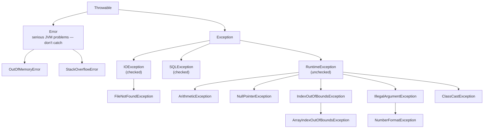

## What Is an Exception?

> An **exception** is an **event that disrupts the normal flow of a program** at run time — dividing by zero, reading past the end of an array, converting `"abc"` to a number, opening a file that doesn't exist. In Java, an exception is an **object** that describes what went wrong.

When one occurs and **isn't handled**, the program **crashes** and prints a message:

```java
public class Main {
    static int divide(int a, int b) {
        return a / b;
    }

    public static void main(String[] args) {
        System.out.println("Start");
        System.out.println(divide(10, 0));
        System.out.println("End");            // never reached
    }
}
```

```text
Start
Exception in thread "main" java.lang.ArithmeticException: / by zero
	at Main.divide(Main.java:3)
	at Main.main(Main.java:8)
```

**Reading the stack trace:** the **type** (`ArithmeticException`), the **message** (`/ by zero`), then the **call stack** — the exception happened in `divide` at **line 3**, which was called from `main` at **line 8**. Read it **top-down to find where it happened**, and look for the **first line in your own code**.

**Exception handling** lets the program **detect the problem, respond sensibly** (show a message, use a default, retry) **and keep running**, instead of crashing — essential for anything with real users.

---

## Errors vs Exceptions: The Throwable Hierarchy



| | **Error** | **Exception** |
|---|---|---|
| Meaning | **Serious problems in the JVM/environment** | **Problems a program can reasonably anticipate and handle** |
| Examples | `OutOfMemoryError`, `StackOverflowError` | `IOException`, `NumberFormatException` |
| Should you catch it? | **No** — usually unrecoverable | **Yes**, where you can respond sensibly |

### Checked vs Unchecked Exceptions

| | **Checked** | **Unchecked** |
|---|---|---|
| Classes | `Exception` and subclasses **except** `RuntimeException` | **`RuntimeException`** and its subclasses (and `Error`) |
| Checked by the compiler? | **Yes** — you **must catch it or declare it with `throws`**, or the code won't compile | **No** — handling is optional |
| Usually caused by | **Outside conditions** beyond the program's control | **Programming mistakes** or invalid input |
| Examples | `IOException`, `FileNotFoundException`, `SQLException` | `ArithmeticException`, `NullPointerException`, `NumberFormatException` |

### Common Exceptions

| Exception | Typical cause | Example |
|---|---|---|
| **`ArithmeticException`** | Integer division by zero | `10 / 0` |
| **`NullPointerException`** | Using a `null` reference | `String s = null; s.length();` |
| **`ArrayIndexOutOfBoundsException`** | Index outside `0 … length − 1` | `arr[arr.length]` |
| **`NumberFormatException`** | Converting a non-numeric String | `Integer.parseInt("3a")` |
| **`InputMismatchException`** | `Scanner.nextInt()` reads non-numeric input | user types "three" |
| **`ClassCastException`** | Invalid downcast | `(Dog) someCat` |
| **`IllegalArgumentException`** | A method rejects an argument | `setCgpa(9.7)` in our encapsulated class |
| **`FileNotFoundException`** *(checked)* | Opening a missing file | `new FileReader("x.txt")` |

> **Note:** `10.0 / 0` does **not** throw — floating-point division gives **`Infinity`** (and `0.0 / 0` gives **`NaN`**). Only **integer** division by zero throws `ArithmeticException`.

---

## try–catch

Put code that **might** throw inside **`try`**; handle the problem in **`catch`**:

```java
try {
    // code that might throw an exception
} catch (ExceptionType e) {
    // what to do if it does
}
```

<CodeTrace title="How control flows through try–catch">

```java
public static void main(String[] args) {
    String[] inputs = {"3", "abc", "4"};
    int total = 0;
    for (String s : inputs) {
        try {
            int units = Integer.parseInt(s);
            total += units;
            System.out.println("Added " + units);
        } catch (NumberFormatException e) {
            System.out.println("Skipped '" + s + "': not a number");
        }
    }
    System.out.println("Total = " + total);
}
```

```trace
2 | inputs=[3; abc; 4] | | main | Three pieces of text, e.g. typed into a form.
3 | inputs=[3; abc; 4], total=0 | | main | 
4 | s=3, total=0 | | main | First item: "3".
6 | s=3, total=0, units=3 | | main > Integer.parseInt | parseInt("3") succeeds → 3.
7 | s=3, total=3, units=3 | | main | 
8 | s=3, total=3 | Added 3\n | main | The try block completes normally; the catch block is skipped.
4 | s=abc, total=3 | | main | Second item: "abc".
6 | s=abc, total=3 | | main > Integer.parseInt | parseInt("abc") THROWS NumberFormatException. The rest of the try block (lines 7–8) is skipped…
10 | s=abc, total=3 | Skipped 'abc': not a number\n | main | …and control jumps to the matching catch block. total is unchanged.
4 | s=4, total=3 | | main | The loop carries on — the program did NOT crash.
8 | s=4, total=7 | Added 4\n | main | 
13 | total=7 | Total = 7\n | main | 
```

</CodeTrace>

**Useful methods on the exception object `e`:**

| Method | Returns |
|---|---|
| `e.getMessage()` | The detail message, e.g. `For input string: "abc"` |
| `e.toString()` | Type and message: `java.lang.NumberFormatException: For input string: "abc"` |
| `e.printStackTrace()` | Prints the full stack trace — handy while debugging |

### Multiple catch Blocks

Different problems can be handled differently. Java checks the `catch` blocks **in order** and runs the **first one that matches**:

```java
try {
    int[] units = {3, 3, 2};
    int i = Integer.parseInt(indexField.getText());
    System.out.println(12 / units[i]);
} catch (NumberFormatException e) {
    System.out.println("Please type a whole number.");
} catch (ArrayIndexOutOfBoundsException e) {
    System.out.println("There is no course at that position.");
} catch (ArithmeticException e) {
    System.out.println("A course has zero units.");
}
```

**Order matters: catch the most specific exceptions first.** A superclass `catch` placed before a subclass one makes the subclass one unreachable — a **compile error**:

```java
try { … }
catch (Exception e) { … }
catch (NumberFormatException e) { … }   // ✗ error: exception NumberFormatException has already been caught
```

### Multi-catch

When several exceptions need the **same** handling, combine them with **`|`** (Java 7+):

```java
catch (NumberFormatException | ArrayIndexOutOfBoundsException e) {
    System.out.println("Invalid course selection: " + e.getMessage());
}
```

### finally

A **`finally`** block **always runs** — whether the `try` finished normally, an exception was caught, or even if the `try` or `catch` executed a `return`. Use it for **clean-up**: closing files, database connections or network sockets.

```java
Scanner input = null;
try {
    input = new Scanner(new File("courses.txt"));
    while (input.hasNextLine()) System.out.println(input.nextLine());
} catch (FileNotFoundException e) {
    System.out.println("courses.txt not found");
} finally {
    if (input != null) input.close();     // always release the file
}
```

### try-with-resources

Since Java 7, resources that implement **`AutoCloseable`** (files, scanners, database connections) can be declared **in brackets after `try`** — Java **closes them automatically**, even if an exception occurs. It's shorter and safer than `finally`:

```java
try (Scanner input = new Scanner(new File("courses.txt"))) {
    while (input.hasNextLine()) System.out.println(input.nextLine());
} catch (FileNotFoundException e) {
    System.out.println("courses.txt not found");
}                                           // input.close() is called automatically
```

---

## throw and throws

| | **`throw`** | **`throws`** |
|---|---|---|
| What it does | **Raises** (creates and fires) an exception **now** | **Declares** that a method **might** pass an exception to its caller |
| Where | Inside a method body | In the method **header** |
| Followed by | **One exception object**: `throw new IllegalArgumentException("...")` | **One or more exception classes**: `throws IOException, SQLException` |
| Needed for | Signalling that something is wrong | **Checked** exceptions you don't catch inside the method |

```java
static void registerCourse(String code, int units) {
    if (units < 1 || units > 6)
        throw new IllegalArgumentException("Credit units must be 1–6, got " + units);   // raise
    // … register …
}

static String readFirstLine(String fileName) throws IOException {   // declare: the caller must handle it
    try (BufferedReader br = new BufferedReader(new FileReader(fileName))) {
        return br.readLine();
    }
}
```

### Custom Exceptions

Create your own exception type by **extending `Exception`** (checked) or **`RuntimeException`** (unchecked). A meaningful name makes code and error messages self-explanatory:

```java
// A checked exception for the CGPA project's rule
class InsufficientCoursesException extends Exception {
    public InsufficientCoursesException(String message) {
        super(message);
    }
}

class Student {
    private ArrayList<Course> courses = new ArrayList<>();

    public double calculateCgpa() throws InsufficientCoursesException {
        if (courses.size() < 5)
            throw new InsufficientCoursesException(
                "A student must register at least 5 courses before CGPA can be calculated.");
        // … compute …
        return 0.0;
    }
}

// Caller:
try {
    double cgpa = student.calculateCgpa();
} catch (InsufficientCoursesException e) {
    JOptionPane.showMessageDialog(null, e.getMessage());
}
```

---

## Exception Propagation

**If a method doesn't catch an exception, it propagates:** the method stops immediately, and the exception is passed **up the call stack** to the method that called it — and on up, **frame by frame**, until some method catches it. If **no one** catches it, the JVM prints the stack trace and the thread ends.

<CodeTrace title="An exception travelling up the call stack">

```java
static int readUnits(String text) {
    return Integer.parseInt(text);
}

static int totalUnits(String[] texts) {
    int total = 0;
    for (String t : texts) total += readUnits(t);
    return total;
}

public static void main(String[] args) {
    try {
        System.out.println(totalUnits(new String[] {"3", "two", "2"}));
    } catch (NumberFormatException e) {
        System.out.println("Bad input: " + e.getMessage());
    }
    System.out.println("Program continues");
}
```

```trace
13 | | | main | main calls totalUnits inside a try block.
6 | total=0 | | main > totalUnits | 
7 | total=3, t=3 | | main > totalUnits > readUnits("3") | readUnits("3") returns 3.
7 | total=3, t=two | | main > totalUnits > readUnits("two") > parseInt("two") | parseInt("two") throws NumberFormatException.
2 | total=3, t=two | | main > totalUnits > readUnits("two") | readUnits has no catch: it stops immediately and passes the exception up…
7 | total=3, t=two | | main > totalUnits | …totalUnits has no catch either: its loop is abandoned and it passes it up too. The "2" is never read.
15 | | Bad input: For input string: "two"\n | main | main's catch matches NumberFormatException — propagation stops here.
17 | | Program continues\n | main | Execution continues normally after the try–catch.
```

</CodeTrace>

This is why one `try–catch` near the **top** (e.g. in a button's event handler) can protect a whole chain of method calls — and why the stack trace lists **every** method the exception passed through.

---

## Robust Input Validation (for the GUI Project)

The course project requires **all fields validated before processing** and **granular `try–catch` blocks that catch specific runtime exceptions (e.g. `NumberFormatException`) rather than relying only on a generic `catch (Exception e)`**:

```java
private void addCourse() {
    String code = codeField.getText().trim();
    String grade = gradeBox.getSelectedItem().toString();
    if (code.isEmpty()) {
        JOptionPane.showMessageDialog(this, "Course code is required.");
        return;
    }
    try {
        int units = Integer.parseInt(unitsField.getText().trim());   // may throw
        if (units <= 0)
            throw new IllegalArgumentException("Credit units must be a positive whole number.");
        student.registerCourse(new Course(code, titleField.getText().trim(), units, grade));
        JOptionPane.showMessageDialog(this, code + " registered.");
    } catch (NumberFormatException e) {
        JOptionPane.showMessageDialog(this, "Credit units must be a whole number, e.g. 3.");
    } catch (IllegalArgumentException e) {
        JOptionPane.showMessageDialog(this, e.getMessage());
    }
}
```

`NumberFormatException` **is a subclass** of `IllegalArgumentException`, so it **must come first** — otherwise the general catch would swallow it and the specific message would never show.

### Best Practices

- **Catch specific exceptions**, not a blanket `catch (Exception e)` — you handle what you understand, and bugs aren't hidden.
- **Never swallow exceptions silently** (`catch (Exception e) { }`) — at least log or report them.
- Give **meaningful messages** to users; keep technical details (stack traces) for logs.
- **Validate input first** where you can (`isEmpty()`, ranges); use exceptions for genuinely exceptional situations, not normal control flow.
- **Release resources** with **try-with-resources** or `finally`.
- **Throw early, catch where you can respond** — often at the user-interface level.

---

## Check Your Understanding

<MCQ question="Which of these is a CHECKED exception that the compiler forces you to catch or declare?">
<Option>NullPointerException</Option>
<Option>ArithmeticException</Option>
<Option correct>FileNotFoundException</Option>
<Option>NumberFormatException</Option>
<Explain>
**`FileNotFoundException`** is a subclass of `IOException`, which is **checked**. The others extend **`RuntimeException`** and are **unchecked** — the compiler doesn't require handling them.
</Explain>
</MCQ>

<MCQ question="What does this print?  try — print A; then int x = 5 / 0; then print B — catch (ArithmeticException e) — print C — finally — print D.">
<Option>A B D</Option>
<Option correct>A C D</Option>
<Option>A C</Option>
<Option>A B C D</Option>
<Explain>
"A" prints; `5 / 0` throws, so the rest of the `try` ("B") is **skipped**; the matching `catch` prints "C"; **`finally` always runs**, printing "D".
</Explain>
</MCQ>

<MCQ question="Which statement about throw and throws is correct?">
<Option>throws raises an exception; throw declares one.</Option>
<Option correct>throw raises an exception object inside a method; throws lists exceptions a method may pass to its caller.</Option>
<Option>Both can only be used with checked exceptions.</Option>
<Option>throw is used in the method header.</Option>
<Explain>
**`throw new X(...)`** fires an exception **now**, inside the body. **`throws X, Y`** in the **header** declares what the method may propagate — required for checked exceptions it doesn't catch.
</Explain>
</MCQ>

## Practice Questions

<Reveal question="Define an exception and distinguish between checked and unchecked exceptions, with two examples of each.">
An exception is an **event (object) that disrupts the normal flow of a program at run time**. **Checked** exceptions (subclasses of `Exception` other than `RuntimeException`) are verified by the **compiler**: code must **catch** them or **declare** them with `throws` — e.g. `IOException`, `FileNotFoundException`, `SQLException`. **Unchecked** exceptions (`RuntimeException` and subclasses) aren't enforced by the compiler and usually signal programming errors or bad input — e.g. `NullPointerException`, `ArithmeticException`, `NumberFormatException`, `ArrayIndexOutOfBoundsException`.
</Reveal>

<Reveal question="Explain try, catch, finally, throw and throws.">
**try** encloses code that may throw an exception. **catch** handles a specific exception type if it's thrown in the try block (the first matching catch runs). **finally** contains code that **always executes** afterwards, used for clean-up. **throw** creates and raises an exception object (`throw new IllegalArgumentException("...")`). **throws** in a method header declares exceptions the method may pass to its caller (`void read() throws IOException`).
</Reveal>

<Reveal question="Write a Java program that reads two numbers as Strings, divides them, and handles NumberFormatException and ArithmeticException separately.">
```java
public class SafeDivide {
    public static void main(String[] args) {
        String a = "84", b = "0";
        try {
            int x = Integer.parseInt(a);
            int y = Integer.parseInt(b);
            System.out.println(x + " / " + y + " = " + (x / y));
        } catch (NumberFormatException e) {
            System.out.println("Both values must be whole numbers.");
        } catch (ArithmeticException e) {
            System.out.println("Cannot divide by zero.");
        } finally {
            System.out.println("Calculation finished.");
        }
    }
}
```
```text
Cannot divide by zero.
Calculation finished.
```
</Reveal>

<Reveal question="What is exception propagation?">
When a method doesn't catch an exception, it **terminates immediately** and the exception is **passed to its caller**; this continues **up the call stack** until a method with a matching `catch` handles it. If it reaches the top (e.g. `main`) uncaught, the JVM prints the **stack trace** and the thread terminates. Propagation lets you handle errors at the level best able to respond — for example in a GUI event handler.
</Reveal>

<Takeaway>
An **exception** is an object representing an event that **disrupts normal flow** at run time; unhandled, it crashes the program with a **stack trace** (type, message, then the call chain — find the first line of your code). **`Throwable`** splits into **`Error`** (serious JVM problems — don't catch) and **`Exception`**; **checked** exceptions (e.g. `IOException`) must be **caught or declared**, **unchecked** ones (`RuntimeException`: `ArithmeticException`, `NullPointerException`, `ArrayIndexOutOfBoundsException`, `NumberFormatException`…) needn't be. Handle with **`try`–`catch`** (skips the rest of `try`, runs the **first matching** catch — **specific before general**), **multi-catch** `A | B`, **`finally`** (always runs) and **try-with-resources** (auto-close). **`throw`** raises; **`throws`** declares. Create **custom exceptions** by extending `Exception`/`RuntimeException`. Uncaught exceptions **propagate** up the call stack until caught. Validate input, catch specifically (e.g. `NumberFormatException` for text fields), never swallow errors.
</Takeaway>

## Exam Tips

**What lecturers test:**
- Definition; errors vs exceptions; **checked vs unchecked** with examples
- The **Throwable hierarchy**
- **try, catch, finally, throw, throws** — definitions and code
- Predicting output of try–catch–finally
- Writing a custom exception; exception propagation

**Common mistakes:**
- Catching `Exception` before specific exceptions (compile error)
- Thinking `finally` is skipped when an exception is caught (it always runs)
- Confusing `throw` and `throws`
- Expecting `10.0 / 0` to throw

**Likely question:**
> "Distinguish between checked and unchecked exceptions. Write a Java method that converts a String to an integer credit unit, throwing a custom InvalidUnitException if the value is not between 1 and 6, and show how the caller handles both this exception and NumberFormatException." (15 marks)
