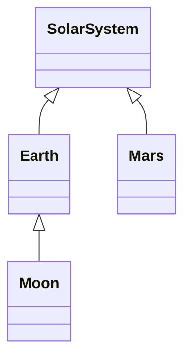
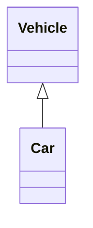
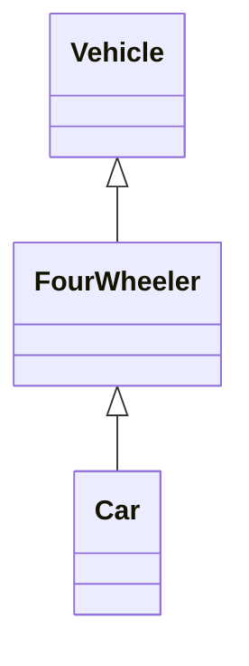
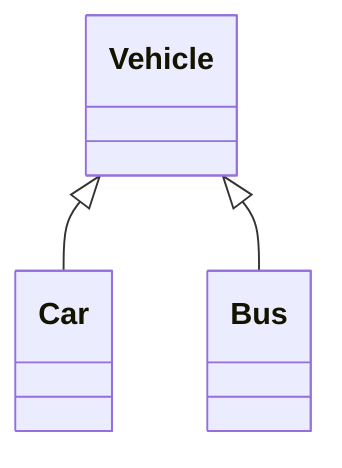
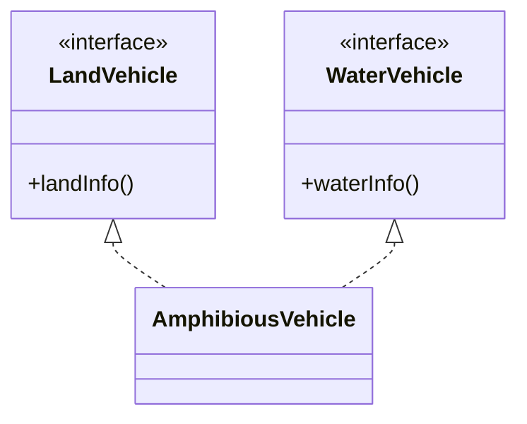
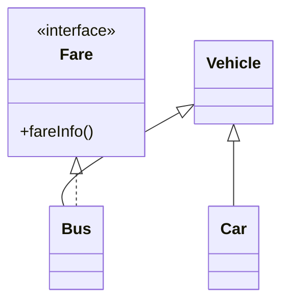
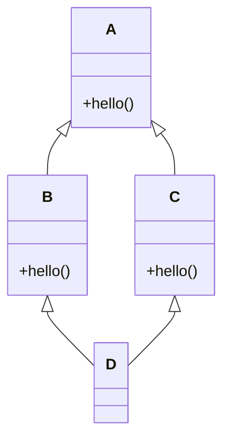

## What Is Inheritance?

> **Definition:** **Inheritance** is a core OOP concept that allows a class to **acquire the fields and methods of another class**, promoting **code reusability** and better organisation. It represents an **"IS-A" relationship**.

- A **subclass** can **reuse** the fields and methods of the parent class **without rewriting the code**.
- A subclass can **add its own** fields and methods, or **modify (override)** existing ones, to extend functionality.

| Term | Meaning |
|---|---|
| **Class** | A blueprint for objects |
| **Superclass** (parent, base class) | The class whose properties are **inherited** |
| **Subclass** (child, derived class) | The class that **inherits** from another class |
| **`extends`** | The keyword used to inherit |

```java
class Parent {
    // fields and methods
}

class Child extends Parent {
    // additional fields and methods
}
```

<Analogy>
Every **Toyota Corolla** *is a* **car**: it inherits everything a car has — wheels, engine, steering, the ability to drive — and adds its own features. Designers don't reinvent the car for each model; they **extend** the general design. That's inheritance: the specific type reuses the general one and adds to it.
</Analogy>

### A First Example

```java
class Animal {
    void sound() { System.out.println("Animal makes a sound"); }
}

class Dog extends Animal {
    void sound() { System.out.println("Dog barks"); }
}

class Cat extends Animal {
    void sound() { System.out.println("Cat meows"); }
}

class Cow extends Animal {
    void sound() { System.out.println("Cow moos"); }
}

public class Geeks {
    public static void main(String[] args) {
        Animal a;
        a = new Dog(); a.sound();
        a = new Cat(); a.sound();
        a = new Cow(); a.sound();
    }
}
```

```text
Dog barks
Cat meows
Cow moos
```

`Animal` is the base class; `Dog`, `Cat` and `Cow` **extend** it and **override** `sound()`. A variable of type `Animal` can refer to any of them, and **at run time Java calls the version that matches the object's actual type** — this is **runtime polymorphism**, the subject of the next lesson.

---

## The IS-A Relationship

**IS-A represents inheritance: "this object is a type of that object."**

```java
public class SolarSystem { }
public class Earth extends SolarSystem { }
public class Mars extends SolarSystem { }
public class Moon extends Earth { }
```



- **`SolarSystem` is the superclass** of `Earth` and `Mars`.
- **`Earth` and `Mars` are subclasses** of `SolarSystem`.
- **`Moon` is a subclass of `Earth`** — and, **transitively, of `SolarSystem`** too.

So: Moon IS-A Earth ✓, Moon IS-A SolarSystem ✓, Earth IS-A SolarSystem ✓ — but Mars IS-A Earth ✗. You can test it with **`instanceof`**:

```java
Moon moon = new Moon();
System.out.println(moon instanceof Earth);        // true
System.out.println(moon instanceof SolarSystem);  // true
```

*(In UML class diagrams, a hollow-headed arrow `◁—` points **from the subclass to the superclass**.)*

> **Every class IS-A `Object`.** A class with no `extends` implicitly extends **`java.lang.Object`**, the root of all Java classes. That's why every object has `toString()`, `equals()` and `hashCode()` — they're inherited from `Object`.

---

## What Can Be Done in a Subclass?

| You can… | Example |
|---|---|
| **Use inherited fields directly**, like any other field | `speed` from `Vehicle` |
| **Declare new fields** not in the superclass | `numberOfSeats` in `Bus` |
| **Use inherited methods directly**, as they are | `vehicleType()` |
| **Override** an inherited **instance method** with the **same signature** | `Dog.sound()` replaces `Animal.sound()` |
| **Hide** an inherited **static** method with the same signature | a `static` method of the same name |
| **Declare new methods** not in the superclass | `Bus.busType()` |
| **Write a constructor that invokes the superclass constructor**, implicitly or with **`super`** | `super(color);` |

> **Private members are not accessible in the subclass.** A subclass object still *contains* the parent's private fields, but its code can't touch them directly — it must use the parent's public/protected methods (e.g. getters). Use **`protected`** for members subclasses need.

---

## The super Keyword

**`super`** refers to the **superclass part** of the current object. It has two uses:

| Use | Syntax | Purpose |
|---|---|---|
| **Call a superclass constructor** | `super(arguments);` | Initialise the inherited fields — must be the **first statement** in the constructor |
| **Call a superclass method (or field)** | `super.method()` | Reuse the parent's version, especially inside an **overriding** method |

```java
class Person {
    protected String name;
    Person(String name) { this.name = name; }
    String describe() { return "Name: " + name; }
}

class Student extends Person {
    private String matricNo;

    Student(String name, String matricNo) {
        super(name);                              // initialise the Person part first
        this.matricNo = matricNo;
    }

    @Override
    String describe() {
        return super.describe() + ", Matric: " + matricNo;   // extend the parent's version
    }
}

// new Student("Ada", "UI/CSC/2026/001").describe()
// → "Name: Ada, Matric: UI/CSC/2026/001"
```

### The Order Constructors Run In

Creating a subclass object **always runs the superclass constructor first**. If you don't write `super(...)`, Java inserts **`super()`** (a call to the parent's no-argument constructor) automatically. With a chain of classes, constructors run **from the top of the hierarchy down**. Step through the lecture's multilevel example:

<CodeTrace title="Constructor chaining in multilevel inheritance">

```java
class Vehicle {
    Vehicle() { System.out.println("This is a Vehicle"); }
}
class FourWheeler extends Vehicle {
    FourWheeler() { System.out.println("4 Wheeler Vehicles"); }
}
class Car extends FourWheeler {
    Car() { System.out.println("This 4 Wheeler Vehicle is a Car"); }
}
public class Geeks {
    public static void main(String[] args) {
        Car obj = new Car();      // triggers all constructors in order
    }
}
```

```trace
12 | | | main > Car() | new Car() calls the Car constructor…
8 | | | main > Car() > FourWheeler() | …but before its body runs, Java calls super() — the FourWheeler constructor…
5 | | | main > Car() > FourWheeler() > Vehicle() | …which first calls super() — the Vehicle constructor (after Object's).
2 | | This is a Vehicle\n | main > Car() > FourWheeler() > Vehicle() | The TOP of the hierarchy finishes first.
5 | | 4 Wheeler Vehicles\n | main > Car() > FourWheeler() | Then FourWheeler's body runs…
8 | | This 4 Wheeler Vehicle is a Car\n | main > Car() | …and finally Car's own body.
12 | obj=→ Car | | main | The fully built Car object is assigned to obj.
```

</CodeTrace>

```text
This is a Vehicle
4 Wheeler Vehicles
This 4 Wheeler Vehicle is a Car
```

<ExamTip>
If the superclass has **only parameterised constructors**, the automatic `super()` fails to compile (*"constructor Vehicle in class Vehicle cannot be applied to given types"*). The subclass constructor must then call the right one explicitly — e.g. `super(color);` — as its **first** statement.
</ExamTip>

---

## Types of Inheritance in Java

The types describe **the different ways a class can inherit** properties and behaviour from one or more classes.

<Tabs>
<Tab label="1. Single">

### Single Inheritance

**A subclass is derived from only one superclass.**



```java
class Vehicle {
    Vehicle() { System.out.println("This is a Vehicle"); }
}
class Car extends Vehicle {
    Car() { System.out.println("This Vehicle is Car"); }
}
public class Test {
    public static void main(String[] args) {
        Car obj = new Car();
    }
}
```

```text
This is a Vehicle
This Vehicle is Car
```

</Tab>
<Tab label="2. Multilevel">

### Multilevel Inheritance

**A derived class inherits from a base class, and that derived class also acts as the base class for another class** — a chain.



`Car` → `FourWheeler` → `Vehicle` (→ `Object`). A `Car` has everything from both ancestors. Output traced above:

```text
This is a Vehicle
4 Wheeler Vehicles
This 4 Wheeler Vehicle is a Car
```

</Tab>
<Tab label="3. Hierarchical">

### Hierarchical Inheritance

**More than one subclass is derived from a single base class** — e.g. cars and buses are both vehicles.



```java
class Vehicle {
    Vehicle() { System.out.println("This is a Vehicle"); }
}
class Car extends Vehicle {
    Car() { System.out.println("This Vehicle is Car"); }
}
class Bus extends Vehicle {
    Bus() { System.out.println("This Vehicle is Bus"); }
}
public class Test {
    public static void main(String[] args) {
        Car obj1 = new Car();
        Bus obj2 = new Bus();
    }
}
```

```text
This is a Vehicle
This Vehicle is Car
This is a Vehicle
This Vehicle is Bus
```

Each object runs the `Vehicle` constructor for **its own** Vehicle part.

</Tab>
<Tab label="4. Multiple (interfaces)">

### Multiple Inheritance — Through Interfaces Only

**Java does not support multiple inheritance with classes** (`class C extends A, B` is illegal). **Multiple inheritance is achieved only through interfaces:**



```java
interface LandVehicle {
    default void landInfo() { System.out.println("This is a LandVehicle"); }
}
interface WaterVehicle {
    default void waterInfo() { System.out.println("This is a WaterVehicle"); }
}
class AmphibiousVehicle implements LandVehicle, WaterVehicle {
    AmphibiousVehicle() { System.out.println("This is an AmphibiousVehicle"); }
}
public class Test {
    public static void main(String[] args) {
        AmphibiousVehicle v = new AmphibiousVehicle();
        v.landInfo();
        v.waterInfo();
    }
}
```

```text
This is an AmphibiousVehicle
This is a LandVehicle
This is a WaterVehicle
```

*(A dashed arrow `◁..` in UML means "implements an interface". `default` methods are covered in the Modern Interface Features lesson.)*

</Tab>
<Tab label="5. Hybrid">

### Hybrid Inheritance

**A mix of two or more types.** In Java, when multiple inheritance is involved, hybrid inheritance is achieved **through interfaces**.



```java
class Vehicle {
    void vehicleType() { System.out.println("This is a Vehicle"); }
}
interface Fare {
    default void fareInfo() { System.out.println("Fare information"); }
}
class Car extends Vehicle {
    void carType() { System.out.println("This is a Car"); }
}
class Bus extends Vehicle implements Fare {
    void busType() { System.out.println("This is a Bus"); }
}
public class GFG {
    public static void main(String[] args) {
        Car car = new Car();
        car.vehicleType();   // inherited
        car.carType();       // specific to Car
        Bus bus = new Bus();
        bus.vehicleType();   // inherited
        bus.busType();       // specific to Bus
        bus.fareInfo();      // from the Fare interface
    }
}
```

```text
This is a Vehicle
This is a Car
This is a Vehicle
This is a Bus
Fare information
```

`Car extends Vehicle` is **single** inheritance; `Car` and `Bus` together are **hierarchical**; `Bus extends Vehicle implements Fare` adds interface-based **multiple** inheritance — so the whole design is **hybrid**.

</Tab>
</Tabs>

| Type | Shape | Supported with classes? |
|---|---|---|
| **Single** | A → B | ✅ |
| **Multilevel** | A → B → C | ✅ |
| **Hierarchical** | A → B, A → C | ✅ |
| **Multiple** | A, B → C | ❌ classes — ✅ **interfaces** |
| **Hybrid** | A combination | ✅ **with interfaces** when multiple inheritance is involved |

### Why No Multiple Inheritance of Classes? The Diamond Problem



If `B` and `C` both override `A`'s `hello()` differently, and `D` could extend **both**, then `new D().hello()` would be **ambiguous** — which version should run? And would `D` contain **two copies** of `A`'s fields? Java avoids this **"diamond problem"** by allowing only **one superclass**. Interfaces are allowed because they traditionally carry **no state** — and if two interfaces supply conflicting `default` methods, Java **forces the class to override** the method and choose (e.g. `LandVehicle.super.info()`), so there's never hidden ambiguity.

---

## Advantages and Limitations of Inheritance

| Advantages | Limitations |
|---|---|
| **Code reusability** — write common code once in the superclass | **Complexity** — deep hierarchies are hard to follow → keep them shallow, or prefer composition |
| **Enables abstraction** — general superclasses, specific subclasses | **Tight coupling** — a change in the superclass can break subclasses → prefer loose coupling (interfaces, composition) |
| **Supports class hierarchies** that mirror the real world | Wrong hierarchies ("Stack extends Vector") expose methods that don't belong |
| **Enables polymorphism** — treat subclasses through the superclass type | |

### IS-A vs HAS-A (Composition)

**Use inheritance only for a true IS-A relationship.** When one thing merely **has** another, use a **field** instead — **composition**:

| Relationship | Test | Java |
|---|---|---|
| **IS-A** (inheritance) | "A Student **is a** Person" ✓ | `class Student extends Person` |
| **HAS-A** (composition) | "A Student **has** Courses" ✓ — but "a Student **is a** Course" ✗ | `class Student { ArrayList<Course> courses; }` |

---

## Exercises (Week 7)

<Reveal question="Exercise 2: Multilevel inheritance Employee → Manager → SeniorManager, each adding one field.">
```java
class Employee {
    protected String name;
    Employee(String name) { this.name = name; }
}

class Manager extends Employee {
    protected String department;
    Manager(String name, String department) {
        super(name);
        this.department = department;
    }
}

class SeniorManager extends Manager {
    private double bonus;
    SeniorManager(String name, String department, double bonus) {
        super(name, department);
        this.bonus = bonus;
    }

    void show() {
        System.out.println(name + " | " + department + " | bonus: " + bonus);
    }

    public static void main(String[] args) {
        new SeniorManager("Mrs. Okafor", "Operations", 150000).show();
        // Mrs. Okafor | Operations | bonus: 150000.0
    }
}
```
Each constructor passes the inherited values **up** with `super(...)`, then sets its own new field.
</Reveal>

<Reveal question="Exercise 3: Hierarchical inheritance — Shape with Triangle, Square and Pentagon.">
```java
class Shape {
    String name() { return "Shape"; }
    int sides() { return 0; }
    void describe() { System.out.println(name() + " has " + sides() + " sides"); }
}
class Triangle extends Shape {
    String name() { return "Triangle"; }
    int sides() { return 3; }
}
class Square extends Shape {
    String name() { return "Square"; }
    int sides() { return 4; }
}
class Pentagon extends Shape {
    String name() { return "Pentagon"; }
    int sides() { return 5; }
}
public class Main {
    public static void main(String[] args) {
        Shape[] shapes = { new Triangle(), new Square(), new Pentagon() };
        for (Shape s : shapes) s.describe();
    }
}
```
```text
Triangle has 3 sides
Square has 4 sides
Pentagon has 5 sides
```
`describe()` is written **once** in `Shape`; each subclass overrides only what differs.
</Reveal>

<Reveal question="Exercise 4: A Duck class implementing Flyable and Swimmable, each with a default method.">
```java
interface Flyable {
    default void fly() { System.out.println("Flying"); }
}
interface Swimmable {
    default void swim() { System.out.println("Swimming"); }
}
class Duck implements Flyable, Swimmable {
    void quack() { System.out.println("Quack!"); }
}
public class Pond {
    public static void main(String[] args) {
        Duck d = new Duck();
        d.fly();
        d.swim();
        d.quack();
    }
}
```
A `Duck` IS-A `Flyable` **and** IS-A `Swimmable` — multiple inheritance of type through interfaces.
</Reveal>

---

## Check Your Understanding

<MCQ question="Which declaration is NOT legal Java?">
<Option>class B extends A</Option>
<Option>class D implements X, Y</Option>
<Option correct>class C extends A, B</Option>
<Option>class E extends A implements X, Y</Option>
<Explain>
A class may **extend only one class** (single inheritance of implementation) but **implement any number of interfaces**. `extends A, B` is a compile error — this is how Java avoids the diamond problem.
</Explain>
</MCQ>

<MCQ question="class A prints 'A' in its constructor; class B extends A prints 'B'; class C extends B prints 'C'. What does new C() print?">
<Option>C B A</Option>
<Option correct>A B C</Option>
<Option>C</Option>
<Option>A C</Option>
<Explain>
Each constructor first calls its superclass constructor (implicitly `super()`), so construction **starts at the top of the hierarchy**: **A**, then **B**, then **C**.
</Explain>
</MCQ>

<MCQ question="A subclass method tries to use a field declared private in its superclass. What happens?">
<Option>It works, because the field is inherited.</Option>
<Option correct>Compile error — private members aren't accessible in the subclass.</Option>
<Option>It works only if the subclass is in the same package.</Option>
<Option>A runtime exception is thrown.</Option>
<Explain>
**Private members are visible only inside the class that declares them**, even to subclasses and even in the same package. Make the field **`protected`**, or give the superclass a public/protected **getter**.
</Explain>
</MCQ>

## Practice Questions

<Reveal question="Define inheritance and list its advantages.">
Inheritance is an OOP mechanism by which a **subclass acquires the fields and methods of a superclass** (using `extends`), representing an **IS-A** relationship; the subclass can reuse, add to and override the inherited members. Advantages: **code reusability**, **abstraction** (general and specific classes), **class hierarchies** that mirror the problem domain, and **polymorphism**.
</Reveal>

<Reveal question="Explain the types of inheritance in Java with a diagram of each.">
**Single** (one subclass ← one superclass: `Car → Vehicle`); **multilevel** (a chain: `Car → FourWheeler → Vehicle`); **hierarchical** (several subclasses ← one superclass: `Car`, `Bus → Vehicle`); **multiple** (one class inheriting from several types — only via **interfaces**: `AmphibiousVehicle implements LandVehicle, WaterVehicle`); **hybrid** (a combination, achieved with interfaces when multiple inheritance is involved: `Bus extends Vehicle implements Fare`). *(Draw each as boxes with arrows pointing to the parent.)*
</Reveal>

<Reveal question="What are the two uses of super?">
1) **`super(args)`** — call a **superclass constructor** to initialise the inherited part; must be the **first statement** of the subclass constructor (Java inserts `super()` if omitted). 2) **`super.method()`** / **`super.field`** — access the **superclass's version** of a member, typically inside an overriding method to extend rather than replace the behaviour.
</Reveal>

<Reveal question="Why does Java disallow multiple inheritance with classes but allow it with interfaces?">
Because of the **diamond problem**: if a class inherited from two classes that both define (or override) the same method or hold state from a common ancestor, it would be **ambiguous** which implementation — and which copy of the fields — applies. Interfaces traditionally contain **no instance state**, and if two interfaces supply conflicting `default` methods, Java **requires the implementing class to override** the method and resolve the conflict explicitly, so the ambiguity never arises silently.
</Reveal>

<Takeaway>
**Inheritance** lets a **subclass** (`extends`) acquire the fields and methods of a **superclass**, modelling **IS-A**; it can use inherited members, **add** new ones, **override** instance methods and call up with **`super`** (`super(...)` first in constructors, `super.method()` to reuse). **Constructors run top-down** (Java inserts `super()` if you don't). **Private members** aren't accessible in subclasses. Every class ultimately extends **`Object`**. Types: **single**, **multilevel**, **hierarchical** (all with classes), **multiple** — **only via interfaces**, and **hybrid** (with interfaces). Java forbids multiple class inheritance to avoid the **diamond problem**. Benefits: **reuse, abstraction, hierarchies, polymorphism**; drawbacks: **complexity** and **tight coupling** — use inheritance for true IS-A, **composition (HAS-A)** otherwise.
</Takeaway>

## Exam Tips

**What lecturers test:**
- Definition of inheritance; superclass/subclass/`extends`; IS-A
- **Types of inheritance** with diagrams and code (the Vehicle examples) — and which need interfaces
- **Output of constructor chains** (multilevel/hierarchical)
- What can be done in a subclass; `super`
- Advantages and limitations; the diamond problem

**Common mistakes:**
- Writing `extends A, B`
- Drawing UML arrows from parent to child (they point **to the parent**)
- Forgetting that the parent's constructor output appears **first**

**Likely question:**
> "Explain inheritance in Java and describe, with diagrams and code, three types of inheritance supported with classes. Why does Java not support multiple inheritance with classes, and how can it be achieved?" (20 marks)
