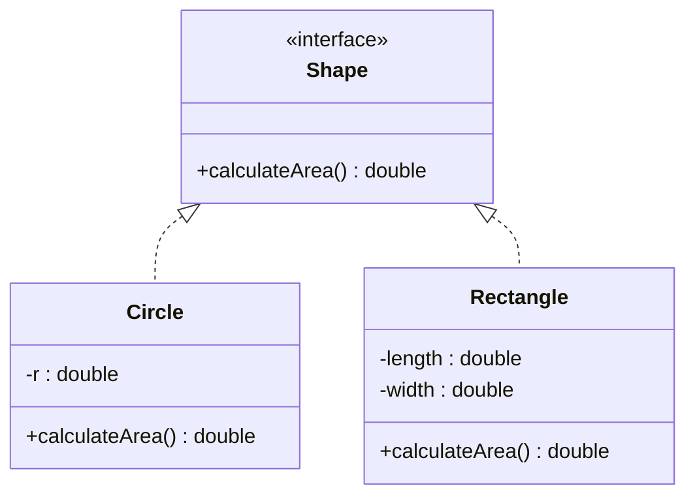

## What Is an Interface?

> **Definition:** An **interface** defines a **contract** that specifies the **behaviour a class should provide**. A class **implements** an interface and supplies implementations for its abstract methods. Interfaces can also contain **default** and **static** methods with implementations.

- A class uses the **`implements`** keyword to implement an interface.
- **A class can implement multiple interfaces**, supporting **multiple inheritance of type**.
- **All variables in an interface are `public`, `static` and `final` by default** — they're constants.
- Abstract methods in an interface are **`public` and `abstract` by default**, so you just write the signature.

<Analogy>
An interface is like the **job description for "Class Representative"**: it lists what any class rep **must do** — take attendance, pass on announcements, collect assignments — without saying **how**. Ada and Musa can both be class reps and do the duties in their own way. A student can also hold **several roles at once** (class rep **and** hostel prefect), just as a class can implement several interfaces.
</Analogy>

### Declaring and Implementing an Interface

```java
interface Shape {
    double calculateArea();                         // implicitly public abstract
}

class Circle implements Shape {
    private double r;
    public Circle(double r) { this.r = r; }
    public double calculateArea() { return Math.PI * r * r; }
}

class Rectangle implements Shape {
    private double length, width;
    public Rectangle(double length, double width) {
        this.length = length;
        this.width = width;
    }
    public double calculateArea() { return length * width; }
}

public class Main {
    public static void main(String[] args) {
        Shape cir = new Circle(5.0);
        Shape rect = new Rectangle(4.0, 6.0);
        System.out.println("Area of Circle: " + cir.calculateArea());
        System.out.println("Area of Rectangle: " + rect.calculateArea());
    }
}
```

```text
Area of Circle: 78.53981633974483
Area of Rectangle: 24.0
```

**Explanation:** `Shape` declares `calculateArea()`. `Circle` and `Rectangle` **implement the interface** and provide their own area calculations. The references `cir` and `rect` have the **interface type `Shape`**, so the program uses both objects **through the same interface** — and **Java decides which method to call at run time**. This is **dynamic method dispatch**, exactly as with overriding in inheritance.



*(In UML, a **dashed** line with a hollow arrowhead means **implements**; a solid line means **extends**.)*

### The Implementing Methods Must Be public

Because interface methods are implicitly **`public`**, the implementing method **must be `public` too** — you can't reduce visibility:

```java
class Square implements Shape {
    double calculateArea() { return 4; }   // ✗ error: attempting to assign weaker access privileges; was public
}
```

And a class that implements an interface **must implement all its abstract methods** — otherwise it must be declared `abstract`.

---

## Class vs Interface

| Use a **class** when… | Use an **interface** when… |
|---|---|
| You need to represent a **real-world entity** with attributes and behaviours | You need a **contract for behaviour** that **multiple classes can implement** |
| You need objects that **hold state and perform actions** | You want to achieve **abstraction** and **multiple inheritance** (of type) |
| You need a **template for objects** with specific functionality | Unrelated classes should be usable **in the same way** |

**Who can extend or implement what:**

| Relationship | Keyword | How many |
|---|---|---|
| Class → class | **`extends`** | **One** |
| Interface → interface | **`extends`** | **Many** (`interface C extends A, B`) |
| Class → interface | **`implements`** | **Many** |
| Interface → class | — | **Never**: an interface cannot implement or extend a class |

---

## Modelling with Interfaces: Vehicles

An interface captures what **every vehicle can do**; each class decides **how**:

```java
interface Vehicle {
    void changeGear(int a);
    void speedUp(int a);
    void applyBrakes(int a);
}

class Bicycle implements Vehicle {
    int speed, gear;
    @Override public void changeGear(int newGear) { gear = newGear; }
    @Override public void speedUp(int inc) { speed += inc; }
    @Override public void applyBrakes(int dec) { speed -= dec; }
    public void printStates() {
        System.out.println("speed: " + speed + " gear: " + gear);
    }
}

class Bike implements Vehicle {
    int speed, gear;
    @Override public void changeGear(int newGear) { gear = newGear; }
    @Override public void speedUp(int inc) { speed += inc; }
    @Override public void applyBrakes(int dec) { speed -= dec; }
    public void printStates() {
        System.out.println("speed: " + speed + " gear: " + gear);
    }
}

class Main {
    public static void main(String[] args) {
        Bicycle bicycle = new Bicycle();
        bicycle.changeGear(2); bicycle.speedUp(3); bicycle.applyBrakes(1);
        bicycle.printStates();

        Bike bike = new Bike();
        bike.changeGear(1); bike.speedUp(4); bike.applyBrakes(3);
        bike.printStates();
    }
}
```

<CodeTrace title="Tracing the Vehicle example">

```java
Bicycle bicycle = new Bicycle();
bicycle.changeGear(2); bicycle.speedUp(3); bicycle.applyBrakes(1);
bicycle.printStates();

Bike bike = new Bike();
bike.changeGear(1); bike.speedUp(4); bike.applyBrakes(3);
bike.printStates();
```

```trace
1 | bicycle.speed=0, bicycle.gear=0 | | | int fields start at 0.
2 | bicycle.speed=2, bicycle.gear=2 | | | changeGear(2) → gear 2; speedUp(3) → speed 3; applyBrakes(1) → speed 3 − 1 = 2.
3 | bicycle.speed=2, bicycle.gear=2 | speed: 2 gear: 2\n | | 
5 | bicycle.speed=2, bicycle.gear=2, bike.speed=0, bike.gear=0 | | | A separate object with its own fields.
6 | bicycle.speed=2, bicycle.gear=2, bike.speed=1, bike.gear=1 | | | gear 1; speed 0 + 4 − 3 = 1.
7 | bicycle.speed=2, bicycle.gear=2, bike.speed=1, bike.gear=1 | speed: 1 gear: 1\n | | 
```

</CodeTrace>

```text
speed: 2 gear: 2
speed: 1 gear: 1
```

---

## Multiple Interfaces

**To implement multiple interfaces, separate them with a comma:**

```java
interface FirstInterface {
    void myMethod();
}
interface SecondInterface {
    void myOtherMethod();
}
class DemoClass implements FirstInterface, SecondInterface {
    public void myMethod() { System.out.println("Some text.."); }
    public void myOtherMethod() { System.out.println("Some other text..."); }
}
```

### Multiple Inheritance Using Interfaces

```java
interface Add { int add(int a, int b); }
interface Sub { int sub(int a, int b); }

class Cal implements Add, Sub {
    public int add(int a, int b) { return a + b; }
    public int sub(int a, int b) { return a - b; }
}

class GFG {
    public static void main(String[] args) {
        Cal x = new Cal();
        System.out.println("Addition : " + x.add(2, 1));
        System.out.println("Substraction : " + x.sub(2, 1));
    }
}
```

```text
Addition : 3
Substraction : 1
```

*(The program prints the string exactly as written — "Substraction" is a typo in the source for "Subtraction".)* A `Cal` object **IS-A** `Add` **and** **IS-A** `Sub`: `Add a = x;` and `Sub s = x;` both compile. That's **multiple inheritance of type**.

### When Two Interfaces Clash

If two interfaces both provide a **`default` method with the same signature**, the implementing class **must override it** and choose — the compiler won't guess:

```java
interface Camera { default String info() { return "I take photos"; } }
interface Phone  { default String info() { return "I make calls"; } }

class SmartPhone implements Camera, Phone {
    @Override
    public String info() {
        return Camera.super.info() + " and " + Phone.super.info();   // pick or combine explicitly
    }
}
// new SmartPhone().info() → "I take photos and I make calls"
```

Without the override: *"class SmartPhone inherits unrelated defaults for info() from types Camera and Phone"*. This is how Java keeps multiple inheritance of interfaces free of the **diamond problem**.

---

## Interface Constants Can't Be Reassigned

```java
interface Config {
    int MAX_COURSES = 12;           // implicitly public static final
}

class Registration implements Config {
    void change() {
        MAX_COURSES = 15;           // ✗ error: cannot assign a value to final variable MAX_COURSES
    }
}
```

Every interface field is automatically **`public static final`** — shared, unchangeable constants (Week 9 Assignment 6).

---

## Abstract Class or Interface?

| | **Abstract class** | **Interface** |
|---|---|---|
| Keyword | `abstract class`, used with **`extends`** | `interface`, used with **`implements`** |
| A class can use | **One** | **Many** |
| Methods | Abstract **and** concrete | Abstract; plus `default`, `static` (Java 8) and `private` (Java 9) |
| Fields | Any instance or static fields | Only **`public static final` constants** |
| Constructors | **Yes** | **No** |
| Method access | Any | Abstract methods are **public** |
| Relationship expressed | **IS-A** within a family of related classes | **CAN-DO** — a capability (Comparable, Runnable, Payable) |
| Choose it when | Related classes **share state and code** | Unrelated classes must offer the **same behaviour**, or a class needs **several** types |

**Often both are used together:** an interface defines the contract, and an abstract class provides a partial, reusable implementation of it (e.g. Java's `List` interface and `AbstractList` class).

---

## Exercises (Week 9)

<Reveal question="Exercise 1: An interface Payable with double amountDue(), implemented by Invoice and Subscription.">
```java
interface Payable {
    double amountDue();
}

class Invoice implements Payable {
    private int quantity;
    private double unitPrice;
    Invoice(int quantity, double unitPrice) { this.quantity = quantity; this.unitPrice = unitPrice; }
    public double amountDue() { return quantity * unitPrice; }
}

class Subscription implements Payable {
    private double monthlyFee;
    private int months;
    Subscription(double monthlyFee, int months) { this.monthlyFee = monthlyFee; this.months = months; }
    public double amountDue() { return monthlyFee * months; }
}

public class Billing {
    public static void main(String[] args) {
        Payable[] bills = { new Invoice(3, 12500), new Subscription(4500, 6) };
        double total = 0;
        for (Payable p : bills) total += p.amountDue();
        System.out.printf("Total due: N%,.2f%n", total);   // Total due: N64,500.00
    }
}
```
Two **unrelated** classes are handled by **one loop** because both are `Payable`.
</Reveal>

<Reveal question="Exercise 3: Interfaces Readable and Writable, and a FileHandler that implements both.">
```java
interface Readable { String read(); }
interface Writable { void write(String text); }

class FileHandler implements Readable, Writable {
    private StringBuilder contents = new StringBuilder();

    public void write(String text) { contents.append(text).append("\n"); }
    public String read() { return contents.toString(); }

    public static void main(String[] args) {
        FileHandler f = new FileHandler();
        f.write("IFT 302");
        f.write("COS 202");
        System.out.print(f.read());
    }
}
```
```text
IFT 302
COS 202
```
(Java's own `java.lang.Readable` exists too; a class in your file named `Readable` takes priority within that file.)
</Reveal>

<Reveal question="Exercise 4: Extend the Vehicle example with a Truck that also tracks loadCapacity.">
```java
class Truck implements Vehicle {
    int speed, gear;
    private final double loadCapacity;          // tonnes

    Truck(double loadCapacity) { this.loadCapacity = loadCapacity; }

    @Override public void changeGear(int newGear) { gear = newGear; }
    @Override public void speedUp(int inc) { speed += inc; }
    @Override public void applyBrakes(int dec) { speed = Math.max(0, speed - dec); }

    public void printStates() {
        System.out.println("speed: " + speed + " gear: " + gear + " load capacity: " + loadCapacity + "t");
    }
}
// Truck t = new Truck(30); t.changeGear(3); t.speedUp(40); t.applyBrakes(10); t.printStates();
// → speed: 30 gear: 3 load capacity: 30.0t
```
</Reveal>

<Reveal question="Assignment 5: A library interface hierarchy (Borrowable, Returnable) for Book and DVD.">
```java
interface Borrowable {
    boolean borrow(String memberId);
}
interface Returnable {
    void giveBack();
}

abstract class LibraryItem implements Borrowable, Returnable {
    protected final String title;
    protected String borrowedBy = null;

    LibraryItem(String title) { this.title = title; }

    public boolean borrow(String memberId) {
        if (borrowedBy != null) return false;     // already out
        borrowedBy = memberId;
        return true;
    }
    public void giveBack() { borrowedBy = null; }
    abstract int loanDays();                       // differs per item type
}

class Book extends LibraryItem {
    Book(String title) { super(title); }
    int loanDays() { return 14; }
}

class DVD extends LibraryItem {
    DVD(String title) { super(title); }
    int loanDays() { return 3; }
}
```
The **interfaces** define the capabilities; the **abstract class** shares the borrowing logic; the **concrete classes** supply what differs (loan period) — interfaces and abstract classes working together.
</Reveal>

---

## Check Your Understanding

<MCQ question="Which is TRUE of a field declared in an interface as int LIMIT = 10;?">
<Option>Each implementing object gets its own copy that it can change.</Option>
<Option correct>It is implicitly public static final — a shared constant.</Option>
<Option>It must be initialised in a constructor.</Option>
<Option>It is private to the interface.</Option>
<Explain>
Interface variables are automatically **`public static final`**: one shared value that can never be reassigned. Interfaces have no constructors.
</Explain>
</MCQ>

<MCQ question="Which declaration is legal?">
<Option>interface A extends SomeClass</Option>
<Option>class B implements SomeClass</Option>
<Option correct>interface C extends A, B</Option>
<Option>class D extends A, B (where A and B are classes)</Option>
<Explain>
An **interface can extend several interfaces**. Interfaces can't extend or implement classes, classes can only **implement** interfaces, and a class can extend only **one** class.
</Explain>
</MCQ>

## Practice Questions

<Reveal question="Define an interface and state four of its properties.">
An interface is a **contract** declaring behaviour (methods) that implementing classes must provide. Properties: methods are **implicitly public abstract** (unless default/static/private); variables are **implicitly public static final**; it **cannot be instantiated** and has **no constructors**; a class **implements** it (and can implement **many**), which provides **multiple inheritance of type**; an interface can **extend** other interfaces.
</Reveal>

<Reveal question="How does Java achieve multiple inheritance, and why is this safe?">
Through **interfaces**: a class may `implements` any number of interfaces (`class Cal implements Add, Sub`), becoming a subtype of each. It's safe because interfaces carry **no instance state**, and if two interfaces supply conflicting **default** methods, the compiler **forces the class to override** and resolve the conflict (e.g. `Camera.super.info()`), so the diamond problem's ambiguity can't occur.
</Reveal>

<Reveal question="Compare abstract classes and interfaces, and say when you'd choose each.">
Abstract classes: used with `extends` (only one), can have **state, constructors and concrete methods** of any access level; interfaces: used with `implements` (many), contain abstract methods plus default/static/private methods and **only constants**, no constructors. Choose an **abstract class** when **related** classes share code and state (IS-A); choose an **interface** to define a **capability** that **unrelated** classes provide (CAN-DO), or when a class needs several types.
</Reveal>

<Takeaway>
An **interface** is a **contract**: abstract methods are implicitly **`public abstract`**, fields are implicitly **`public static final`** constants, there are **no constructors**, and it can't be instantiated. A class **`implements`** it — and must implement **every** abstract method, as **`public`**. Using the **interface type** (`Shape cir = new Circle(5)`) gives **dynamic method dispatch**. A class **extends one class** but **implements many interfaces** → **multiple inheritance of type**; interfaces can **extend** other interfaces; an interface can never implement a class. Conflicting `default` methods must be **overridden** and resolved with `X.super.method()`, avoiding the diamond problem. Choose an **abstract class** for related classes sharing **state and code** (IS-A); an **interface** for a **capability** shared by unrelated classes (CAN-DO) — often both together.
</Takeaway>

## Exam Tips

**What lecturers test:**
- Definition and properties of interfaces; `implements`
- **Output** of the Shape and Vehicle examples
- Implementing **multiple interfaces**; how Java achieves multiple inheritance
- **Class vs interface** and **abstract class vs interface** tables

**Common mistakes:**
- Declaring the implementing method without `public`
- Trying to change an interface constant
- `interface X implements Y` (should be `extends`)

**Likely question:**
> "What is an interface in Java? Write an interface Shape with a method calculateArea() and two classes that implement it; use them through Shape references and state the output. Explain how interfaces support multiple inheritance and compare them with abstract classes." (20 marks)
