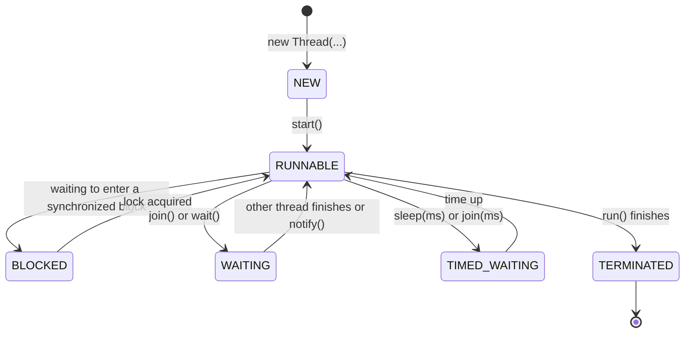
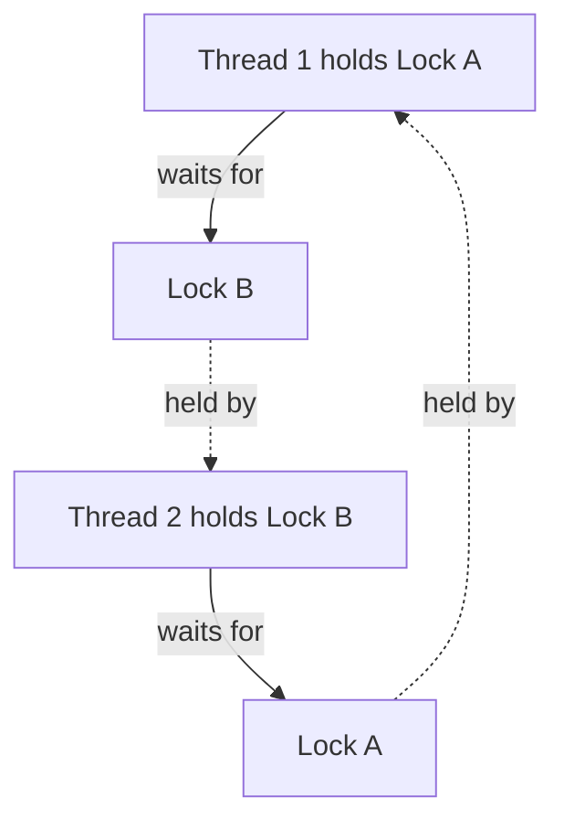

## Programs, Processes and Threads

| Term | Meaning | Example |
|---|---|---|
| **Program** | Code stored on disk | `StudentPortal.jar` |
| **Process** | A **running program**, with its **own memory**, managed by the operating system | The JVM running the portal |
| **Thread** | A **single path of execution *within* a process**. A process can have **many threads**, which **share the process's memory** (objects on the heap) but each has **its own call stack** | One thread repaints the window while another downloads results |

**Multithreading** means running **several threads concurrently** inside one program. On a multi-core processor they can truly run **at the same time**; on a single core, the OS **switches** between them so fast that they appear simultaneous.

Every Java program already has at least one thread — the **main thread** that runs `main()`. (A Swing program also has the **Event Dispatch Thread**.)

### Why Multithreading?

- **Responsiveness** — a GUI stays usable while a long task (download, report, big calculation) runs in the background.
- **Performance** — split work across the **cores** of a modern CPU (e.g. process 10,000 student records in four parallel chunks).
- **Servers** — a web or chat server handles **many clients at once**, one thread (or task) per request.
- **Natural modelling** — a game with independent timers, a music player that plays while you browse.

<Analogy>
A **restaurant** (process) with one kitchen (shared memory). A single cook (one thread) must finish each dish before starting the next. With several cooks (threads) many dishes progress at once — but they **share** the fridge, stove and knives. Without rules about who uses what when, two cooks grab the same pan at the same moment and ruin both dishes. Multithreading gives speed; **synchronisation** is the kitchen's rules.
</Analogy>

---

## Creating Threads

<Tabs>
<Tab label="Implement Runnable ✓">

**Implement `Runnable`** (one method, `run()`), then pass it to a `Thread`. **Preferred**, because your class can still **extend another class**, and the task is separate from the thread that runs it:

```java
class CountDown implements Runnable {
    private final String name;
    CountDown(String name) { this.name = name; }

    @Override
    public void run() {                      // the code the thread executes
        for (int i = 3; i >= 1; i--) {
            System.out.println(name + ": " + i);
        }
    }
}

Thread t1 = new Thread(new CountDown("A"));
Thread t2 = new Thread(new CountDown("B"));
t1.start();                                   // start the new threads
t2.start();
```

</Tab>
<Tab label="Lambda">

`Runnable` is a **functional interface**, so a **lambda** works:

```java
Thread t = new Thread(() -> {
    for (int i = 1; i <= 3; i++) System.out.println("Working " + i);
});
t.start();
```

</Tab>
<Tab label="Extend Thread">

**Extend `Thread`** and override `run()` — simple, but the class can't extend anything else:

```java
class Worker extends Thread {
    @Override
    public void run() {
        System.out.println("Running in " + getName());
    }
}

new Worker().start();
```

</Tab>
</Tabs>

**The output interleaves unpredictably.** The two countdowns above might print:

```text
A: 3
B: 3
A: 2
A: 1
B: 2
B: 1
```

…or in a different order on the next run. **The thread scheduler decides** when each thread runs — you can't rely on any particular interleaving.

### start() vs run()

| | `t.start()` | `t.run()` |
|---|---|---|
| Creates a new thread? | **Yes** — the JVM starts a new thread which then calls `run()` | **No** — it's an ordinary method call |
| Runs where? | **Concurrently**, on the new thread | On the **current** thread, which waits for it to finish |
| Can be called again? | No — `IllegalThreadStateException` | Yes (it's just a method) |

<ExamTip>
A favourite trap: calling **`run()`** instead of **`start()`** compiles and "works", but **no new thread is created** — everything runs sequentially on the calling thread.
</ExamTip>

---

## The Thread Life Cycle

A thread is always in one of the states of **`Thread.State`**:



| State | Meaning |
|---|---|
| **NEW** | Created but `start()` not yet called |
| **RUNNABLE** | Running, or ready to run as soon as the scheduler gives it a CPU |
| **BLOCKED** | Waiting to acquire a **lock** held by another thread |
| **WAITING** | Waiting **indefinitely** for another thread (`join()`, `wait()`) |
| **TIMED_WAITING** | Waiting for a **fixed time** (`sleep(ms)`, `join(ms)`) |
| **TERMINATED** | `run()` has finished |

### Useful Thread Methods

| Method | Does |
|---|---|
| `start()` | Starts the thread |
| `Thread.sleep(ms)` | Pauses the **current** thread for `ms` milliseconds — throws the **checked** `InterruptedException` |
| `join()` | **Waits for that thread to finish** before continuing |
| `interrupt()` / `isInterrupted()` | Politely asks a thread to stop (wakes it from `sleep`/`wait`) |
| `getName()`, `setName()`, `Thread.currentThread()` | Identify threads |
| `isAlive()` | Has it started and not yet finished? |
| `setPriority(1–10)` | A **hint** to the scheduler (not a guarantee) |

```java
Thread download = new Thread(() -> {
    try {
        for (int p = 0; p <= 100; p += 25) {
            System.out.println("Downloaded " + p + "%");
            Thread.sleep(500);                       // simulate slow work
        }
    } catch (InterruptedException e) {
        System.out.println("Download cancelled");
    }
});
download.start();
download.join();                                     // main waits here until the download thread ends
System.out.println("Download complete");             // (main must also handle InterruptedException)
```

---

## Race Conditions

Threads **share objects** in memory. When two threads **update the same variable at the same time**, the result can depend on the **unpredictable timing** of the threads — a **race condition**.

The classic example is `count++`. It looks like one step, but the CPU does **three**:

1. **READ** the current value of `count` into a temporary register,
2. **ADD** 1 to the temporary value,
3. **WRITE** the result back to `count`.

If Thread B reads `count` **after** Thread A has read it but **before** A writes it back, both write the **same** new value — and **one increment is lost**.

**Be the scheduler.** Run A's READ, then B's READ, then let both finish — the counter ends lower than it should. Then tick **synchronized** and try the same order:

<RaceConditionDemo />

### Seeing It in Real Java

```java
public class Race {
    static int count = 0;

    public static void main(String[] args) throws InterruptedException {
        Runnable task = () -> {
            for (int i = 0; i < 100_000; i++) count++;
        };
        Thread a = new Thread(task);
        Thread b = new Thread(task);
        a.start(); b.start();
        a.join(); b.join();                      // wait for both
        System.out.println("count = " + count);  // expected 200000
    }
}
```

Run it several times and you'll typically see **different values below 200000** — e.g. `count = 137452`. The bug **doesn't show every time**, which is what makes race conditions so dangerous (a bank balance, stock count or seat booking that's "usually" right).

---

## Fixing It: Synchronisation

### synchronized

**`synchronized`** lets **only one thread at a time** execute a method or block **on a given object**. A thread must acquire the object's **lock** (monitor) to enter; others trying to enter are **BLOCKED** until it's released. This makes the read-modify-write **indivisible**:

```java
class Counter {
    private int count = 0;

    public synchronized void increment() {   // one thread at a time per Counter object
        count++;
    }

    public synchronized int get() {
        return count;
    }
}
```

Or lock only the critical part with a **synchronized block**:

```java
private final Object lock = new Object();

void deposit(double amount) {
    // … validation that doesn't touch shared data …
    synchronized (lock) {
        balance += amount;                     // the critical section
    }
}
```

With `Counter.increment()` used in the program above, the result is **always 200000** — at the cost of some speed, since threads now wait for each other.

### volatile

**`volatile`** (from the modifiers lesson) guarantees that every read of a field sees the **latest value written by any thread** — without it, a thread may keep using a stale **cached** copy. It's ideal for a **stop flag**:

```java
class Downloader implements Runnable {
    private volatile boolean running = true;
    public void stop() { running = false; }          // called from another thread

    public void run() {
        while (running) { /* download the next chunk */ }
    }
}
```

**But `volatile` does NOT make `count++` safe** — the three steps can still interleave. Use `synchronized` or…

### Atomic Variables

The classes in **`java.util.concurrent.atomic`** perform read-modify-write in **one indivisible hardware step**, with no locks:

```java
AtomicInteger count = new AtomicInteger(0);
count.incrementAndGet();        // atomic count++
```

### Deadlock

Locks introduce a new danger. A **deadlock** happens when two threads each hold a lock the other needs, so **both wait forever**:



**Prevention:** always acquire multiple locks **in the same order** in every thread, hold locks for as **short** a time as possible, and avoid calling unknown code while holding a lock.

---

## Thread Pools

Creating a new thread for every small task is wasteful. An **`ExecutorService`** keeps a **pool** of reusable threads and a **queue** of tasks:

```java
ExecutorService pool = Executors.newFixedThreadPool(4);   // 4 worker threads
for (Student s : students) {
    pool.submit(() -> s.calculateCgpa());                  // tasks are queued and shared among the 4 threads
}
pool.shutdown();                                           // accept no new tasks; finish the queued ones
```

---

## Multithreading in Swing: Keep the GUI Responsive

Swing listeners run on the **Event Dispatch Thread**. A long task in a listener **freezes the window**. And Swing components are **not thread-safe**, so other threads must **not** update them directly. **`SwingWorker`** handles both rules:

```java
generateButton.addActionListener(e -> {
    generateButton.setEnabled(false);
    new SwingWorker<String, Void>() {
        @Override
        protected String doInBackground() {       // runs on a BACKGROUND thread
            return buildTranscriptForAllStudents();   // slow work
        }

        @Override
        protected void done() {                    // runs back on the EDT
            try {
                outputArea.setText(get());         // safe to update Swing here
            } catch (Exception ex) {
                outputArea.setText("Failed: " + ex.getMessage());
            }
            generateButton.setEnabled(true);
        }
    }.execute();
});
```

The window stays responsive (you can scroll, move it, even cancel) while the transcript is built.

---

## A Simple Multithreading Application

**Learning outcome: write simple multithreading applications.** Two threads print multiplication tables concurrently, and `main` waits for both:

```java
public class Tables {
    static void printTable(int n) {
        for (int i = 1; i <= 5; i++) {
            System.out.println(Thread.currentThread().getName() + ": " + n + " x " + i + " = " + (n * i));
            try {
                Thread.sleep(100);
            } catch (InterruptedException e) {
                return;
            }
        }
    }

    public static void main(String[] args) throws InterruptedException {
        Thread seven = new Thread(() -> printTable(7), "Seven");
        Thread nine = new Thread(() -> printTable(9), "Nine");
        seven.start();
        nine.start();
        seven.join();
        nine.join();
        System.out.println("Both tables done.");
    }
}
```

The lines from "Seven" and "Nine" interleave (roughly alternating because both sleep 100 ms), and **"Both tables done." always prints last** because of the `join()` calls.

---

## Check Your Understanding

<MCQ question="A program calls t.run() instead of t.start() on a Thread. What happens?">
<Option>A new thread runs the task concurrently.</Option>
<Option correct>The task runs on the current thread, like a normal method call — no new thread is created.</Option>
<Option>A compile error.</Option>
<Option>An IllegalThreadStateException.</Option>
<Explain>
Only **`start()`** asks the JVM to create a new thread (which then calls `run()`). Calling `run()` directly is just an ordinary method call on the current thread.
</Explain>
</MCQ>

<MCQ question="Two threads each execute count++ 1,000 times on a shared int without synchronisation. What final values are possible?">
<Option>Always exactly 2,000</Option>
<Option correct>Any value up to 2,000 — often less, varying between runs</Option>
<Option>Always 1,000</Option>
<Option>A compile error</Option>
<Explain>
`count++` is **read–add–write**; interleaved threads can overwrite each other's updates (**lost updates**), so the result is often **below 2,000** and **varies** from run to run. Making the increment `synchronized` or using `AtomicInteger` guarantees 2,000.
</Explain>
</MCQ>

<MCQ question="Which is the best tool for a boolean 'keep running' flag set by one thread and read by another?">
<Option>A plain boolean field</Option>
<Option correct>A volatile boolean field</Option>
<Option>A static final boolean</Option>
<Option>A transient boolean</Option>
<Explain>
**`volatile`** ensures the reading thread always sees the **latest** value written by another thread. A plain field may be cached, so the loop might never see `false`; `final` can't change; `transient` is about serialisation.
</Explain>
</MCQ>

## Practice Questions

<Reveal question="Differentiate between a process and a thread, and state three advantages of multithreading.">
A **process** is a **running program** with its **own memory space**, managed by the OS. A **thread** is a **path of execution within a process**; a process can have several threads that **share its memory** but each has its **own call stack**. Advantages: **responsiveness** (GUIs don't freeze during long tasks), **better use of multi-core CPUs** (performance), **serving many clients concurrently**, and simpler modelling of independent activities.
</Reveal>

<Reveal question="Describe two ways of creating a thread in Java, with code.">
1) **Implement `Runnable`** and pass it to a `Thread`:
```java
class Task implements Runnable {
    public void run() { System.out.println("Task running"); }
}
new Thread(new Task()).start();
```
(or with a lambda: `new Thread(() -> System.out.println("Task running")).start();`)

2) **Extend `Thread`** and override `run()`:
```java
class MyThread extends Thread {
    public void run() { System.out.println("Thread running"); }
}
new MyThread().start();
```
Implementing `Runnable` is preferred because the class can still extend another class.
</Reveal>

<Reveal question="Explain the thread life cycle.">
**NEW** (created, not started) → `start()` → **RUNNABLE** (running or ready). From RUNNABLE a thread may become **BLOCKED** (waiting for a lock), **WAITING** (indefinitely, e.g. `join()`/`wait()`) or **TIMED_WAITING** (e.g. `sleep(ms)`), returning to RUNNABLE when the lock is acquired, it's notified, or the time elapses. When `run()` completes it is **TERMINATED**.
</Reveal>

<Reveal question="What is a race condition and how does synchronized prevent it?">
A **race condition** occurs when the correctness of a result depends on the **unpredictable interleaving** of threads accessing **shared data** — e.g. two threads doing `count++` (read–add–write) at once, losing an update. **`synchronized`** makes a method or block accessible to **only one thread at a time** per object lock, so the whole read–modify–write completes **without interruption**; other threads are **blocked** until the lock is released.
</Reveal>

<Takeaway>
A **process** is a running program with its own memory; a **thread** is a path of execution inside it — threads **share memory** but have their **own stacks**. **Multithreading** gives **responsiveness**, **multi-core performance** and **concurrent servers**. Create threads by **implementing `Runnable`** (preferred; lambdas work) or **extending `Thread`**, and call **`start()`** — `run()` just runs on the current thread. Life cycle: **NEW → RUNNABLE ⇄ BLOCKED / WAITING / TIMED_WAITING → TERMINATED**; use `sleep`, `join`, `interrupt`. Shared data + concurrency → **race conditions** (`count++` is read-add-write → **lost updates**). Fix with **`synchronized`** methods/blocks (one thread at a time), **atomic** classes (`AtomicInteger`); use **`volatile`** for visibility of simple flags (not for `count++`). Beware **deadlock** (lock in a consistent order). Use **thread pools** (`ExecutorService`) for many tasks, and **`SwingWorker`** so long tasks don't freeze the Swing EDT.
</Takeaway>

## Exam Tips

**What lecturers test:**
- Process vs thread; benefits of multithreading
- Two ways to create threads (code); **start() vs run()**
- The **life cycle** of a thread (draw it)
- **Race conditions** and **`synchronized`**; `synchronized` vs `volatile`
- Writing a simple two-thread program

**Common mistakes:**
- Calling `run()` instead of `start()`
- Believing `volatile` makes `count++` safe
- Forgetting that `Thread.sleep` throws the checked `InterruptedException`
- Assuming thread output appears in a fixed order

**Likely question:**
> "Define a thread and explain two ways of creating threads in Java. Describe the life cycle of a thread with a diagram. What is a race condition? Show how the synchronized keyword prevents it." (20 marks)
