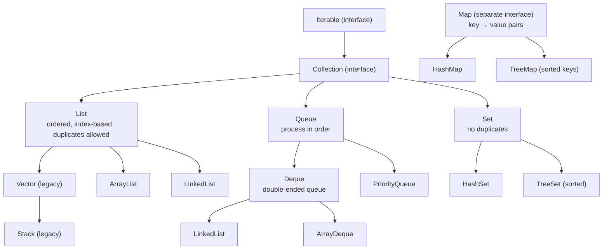

## What Is the Java API?

An **API (Application Programming Interface)** is a **ready-made library of classes and methods** you can use in your programs instead of writing everything yourself. The **Java API** (the "Java Class Library") ships with the JDK and contains **thousands of classes** — for text, maths, collections, files, networking, dates, databases and GUIs — organised into **packages** (`java.lang`, `java.util`, `java.io`…).

**Using an API well means reading its documentation.** The official **Javadoc** pages (docs.oracle.com → Java SE → API) list, for every class:

| Section | Tells you |
|---|---|
| **Package and class hierarchy** | Where the class lives (for `import`) and what it extends/implements |
| **Constructors** | How to create objects |
| **Method summary** | Each method's **name, parameters and return type**, and what it does |
| **Exceptions** | What each method throws and when |

For example, the entry `boolean add(E e)` for `ArrayList` tells you: method `add`, takes one element of the list's type `E`, returns `true` if the list changed.

---

## Wrapper Classes and Autoboxing

**Collections can only hold objects, not primitives.** Every primitive type has a **wrapper class** in `java.lang`:

| Primitive | Wrapper | Useful static methods |
|---|---|---|
| `int` | `Integer` | `Integer.parseInt("42")`, `Integer.MAX_VALUE` |
| `double` | `Double` | `Double.parseDouble("4.35")` |
| `char` | `Character` | `Character.isDigit('7')`, `Character.toUpperCase('a')` |
| `boolean` | `Boolean` | `Boolean.parseBoolean("true")` |
| `long`, `short`, `byte`, `float` | `Long`, `Short`, `Byte`, `Float` | … |

Java converts automatically between them:

```java
ArrayList<Integer> scores = new ArrayList<>();
scores.add(75);            // autoboxing: int 75 → Integer object
int first = scores.get(0); // unboxing: Integer → int
```

---

## The Collections Framework

The **Java Collections Framework** (package `java.util`) is a set of **interfaces** (what a collection can do) and **classes** (ready implementations):



### Generics: Type-Safe Collections

The **`<Type>`** in `ArrayList<String>` is a **generic type parameter**: it tells the compiler what the collection holds, so mistakes are caught **at compile time** and you never need casts:

```java
ArrayList<String> names = new ArrayList<>();   // <> "diamond": type inferred from the left
names.add("Ada");
names.add(42);            // ✗ compile error: int cannot be converted to String
String n = names.get(0);  // no cast needed
```

---

## ArrayList

An **`ArrayList`** is a **resizable array**: it **grows automatically** as you add elements — unlike a plain array, whose size is fixed.

```java
import java.util.ArrayList;

ArrayList<String> courses = new ArrayList<>();
courses.add("COS 202");                // [COS 202]
courses.add("IFT 302");                // [COS 202, IFT 302]
courses.add(0, "CSC 272");             // insert at index 0 → [CSC 272, COS 202, IFT 302]
System.out.println(courses.get(1));    // COS 202
courses.set(2, "INS 204");             // replace → [CSC 272, COS 202, INS 204]
courses.remove("CSC 272");             // by value → [COS 202, INS 204]
System.out.println(courses.size());    // 2
System.out.println(courses.contains("INS 204"));  // true
System.out.println(courses);           // [COS 202, INS 204]  — toString() is built in
```

| Method | Does | Returns |
|---|---|---|
| `add(e)` | Append to the end | `true` |
| `add(i, e)` | Insert at index `i`, shifting later elements right | — |
| `get(i)` | Element at index `i` | the element |
| `set(i, e)` | Replace the element at `i` | the **old** element |
| `remove(i)` / `remove(obj)` | Remove by index / by value (first match) | removed element / `true` if found |
| `size()` | Number of elements | `int` |
| `contains(e)` / `indexOf(e)` | Search | `boolean` / index or −1 |
| `isEmpty()`, `clear()` | Check empty / remove all | |

> **Gotcha with `ArrayList<Integer>`:** `list.remove(1)` removes the element at **index 1**, not the value 1. To remove the value, write `list.remove(Integer.valueOf(1))`.

### Array vs ArrayList

| | Array | ArrayList |
|---|---|---|
| Size | **Fixed** at creation | **Grows and shrinks** automatically |
| Holds | Primitives **or** objects | **Objects only** (wrappers for primitives) |
| Length | `arr.length` (field) | `list.size()` (method) |
| Access | `arr[i]` | `list.get(i)` / `list.set(i, x)` |
| Insert/remove in the middle | Manual shifting | `add(i, x)` / `remove(i)` |
| Print contents | `Arrays.toString(arr)` | `println(list)` |

The course's CGPA project **must** store courses in an `ArrayList<Course>` because a student's number of courses varies.

### Program to the List Interface

It's good practice to declare the variable with the **interface type** and choose the implementation on the right:

```java
List<String> names = new ArrayList<>();   // could later become new LinkedList<>() without other changes
```

| | `ArrayList` | `LinkedList` |
|---|---|---|
| Stored as | A resizable **array** | A chain of **nodes** linked to each other |
| `get(i)` | **Fast** (direct index) | Slow (walks the chain) |
| Insert/remove at the **ends** | Fast at the end | **Fast at both ends** |
| Insert/remove in the **middle** | Shifts elements | Fast once positioned |
| Also implements | `List` | `List` **and `Deque`** (so it works as a queue) |

---

## Stack: Last In, First Out

A **stack** is **LIFO — Last In, First Out**: you can only add or remove at the **top**, like a pile of plates.

| Method | Does | On an empty stack |
|---|---|---|
| `push(e)` | Put `e` on the **top** | — |
| `pop()` | **Remove and return** the top | throws **`EmptyStackException`** |
| `peek()` | **Return** the top **without removing** it | throws `EmptyStackException` |
| `empty()` / `isEmpty()` | Is it empty? | `true` |
| `search(e)` | 1-based position from the top, or −1 | |

```java
import java.util.Stack;

Stack<Integer> stack = new Stack<>();
stack.push(10);
stack.push(20);
stack.push(30);
System.out.println(stack.pop());    // 30 — the last one in comes out first
System.out.println(stack.peek());   // 20 — looked at, not removed
System.out.println(stack);          // [10, 20]
```

**Where stacks are used:** the **method call stack** (recursion!), **undo** in editors, the browser's **back** button, evaluating expressions, and checking **balanced brackets**:

<CodeTrace title="Checking balanced brackets with a Stack">

```java
static boolean balanced(String s) {
    Stack<Character> stack = new Stack<>();
    for (char c : s.toCharArray()) {
        if (c == '(' || c == '[' || c == '{') stack.push(c);
        else {
            if (stack.isEmpty()) return false;
            char open = stack.pop();
            if (c == ')' && open != '(') return false;
            if (c == ']' && open != '[') return false;
            if (c == '}' && open != '{') return false;
        }
    }
    return stack.isEmpty();
}
// balanced("{[()]}")
```

```trace
2 | s={[()]}, stack=[] | | balanced | Start with an empty stack.
4 | s={[()]}, c={, stack=[{] | | balanced | An opening bracket: push it.
4 | s={[()]}, c=[, stack=[{; [] | | balanced | Push [ on top.
4 | s={[()]}, c=(, stack=[{; [; (] | | balanced | Push ( on top.
7 | s={[()]}, c=), stack=[{; [], open=( | | balanced | A closing bracket: pop the most recent opener, (.
8 | s={[()]}, c=), stack=[{; [], open=( | | balanced | ) matches ( — carry on.
7 | s={[()]}, c=], stack=[{], open=[ | | balanced | Pop [ — it matches ].
7 | s={[()]}, c=}, stack=[], open={ | | balanced | Pop { — it matches }.
13 | s={[()]}, stack=[] | | balanced | End of string and the stack is empty: every opener was closed in the right order → true.
```

</CodeTrace>

> Java's documentation now recommends **`ArrayDeque`** over the legacy `Stack` class for new code (`Deque<Integer> stack = new ArrayDeque<>(); stack.push(10);` — same method names). `Stack` remains common in teaching and exams.

---

## Queue: First In, First Out

A **queue** is **FIFO — First In, First Out**: items join at the **rear** and leave from the **front**, like the queue at a bank or the registration desk.

`Queue` is an **interface**; common implementations are **`LinkedList`** and **`ArrayDeque`**:

```java
import java.util.LinkedList;
import java.util.Queue;

Queue<String> queue = new LinkedList<>();
queue.offer("Ada");
queue.offer("Musa");
queue.offer("Chioma");
System.out.println(queue.poll());   // Ada — first in, first out
System.out.println(queue.peek());   // Musa — next in line, not removed
System.out.println(queue);          // [Musa, Chioma]
```

**Two sets of methods — they differ only in how they fail:**

| Operation | Throws an exception if it fails | Returns a special value if it fails |
|---|---|---|
| Add at the rear | `add(e)` | **`offer(e)`** → `false` |
| Remove from the front | `remove()` → `NoSuchElementException` | **`poll()`** → **`null`** |
| Look at the front | `element()` → `NoSuchElementException` | **`peek()`** → **`null`** |

**Where queues are used:** printer queues, customer-service lines, **task scheduling**, message processing, and breadth-first search. A **`PriorityQueue`** is a variant that always removes the **smallest** (highest-priority) element first rather than the oldest.

### Try Them

Use the buttons to call the real methods — including on an **empty** stack or queue, and with a bad index in the list — and watch both the structure and the value each call returns:

<CollectionsDemo />

---

## Iterators and Enumerations

An **iterator** is an object that lets you **visit the elements of any collection one at a time**, without knowing how the collection is stored. Every collection has an `iterator()` method.

| `Iterator<E>` method | Does |
|---|---|
| `hasNext()` | Is there another element? |
| `next()` | Return the next element and move on |
| `remove()` | Remove the element last returned by `next()` — **safely** |

```java
import java.util.*;

List<String> names = new ArrayList<>(List.of("Ada", "Musa", "Chioma"));
Iterator<String> it = names.iterator();
while (it.hasNext()) {
    String name = it.next();
    System.out.println(name);
}
```

**The for-each loop uses an iterator behind the scenes** — `for (String name : names)` is shorthand for the loop above.

### Removing While Iterating

Removing from a collection **inside a for-each loop** breaks its hidden iterator and throws **`ConcurrentModificationException`**. Use the **iterator's own `remove()`** (or `removeIf`):

<CodeTrace title="Safe removal with Iterator.remove()">

```java
List<Integer> scores = new ArrayList<>(List.of(72, 38, 55, 29, 81));
Iterator<Integer> it = scores.iterator();
while (it.hasNext()) {
    int s = it.next();
    if (s < 40) it.remove();
}
System.out.println(scores);
```

```trace
1 | scores=[72; 38; 55; 29; 81] | | main | Five scores; we want to remove the failures (below 40).
2 | scores=[72; 38; 55; 29; 81], it=before 72 | | main | The iterator starts before the first element.
4 | scores=[72; 38; 55; 29; 81], it=after 72, s=72 | | main | next() returns 72. Not below 40 — keep it.
4 | scores=[72; 38; 55; 29; 81], it=after 38, s=38 | | main | next() returns 38.
5 | scores=[72; 55; 29; 81], it=before 55, s=38 | | main | 38 < 40: it.remove() deletes the element just returned — safely.
4 | scores=[72; 55; 29; 81], it=after 55, s=55 | | main | Keep 55.
4 | scores=[72; 55; 29; 81], it=after 29, s=29 | | main | next() returns 29.
5 | scores=[72; 55; 81], it=before 81, s=29 | | main | Remove 29.
4 | scores=[72; 55; 81], it=after 81, s=81 | | main | Keep 81. hasNext() is now false.
7 | scores=[72; 55; 81] | [72, 55, 81]\n | main | Only the passes remain.
```

</CodeTrace>

```java
// ✗ throws ConcurrentModificationException
for (Integer s : scores) {
    if (s < 40) scores.remove(s);
}

// ✓ the modern one-liner (Java 8)
scores.removeIf(s -> s < 40);
```

### ListIterator

For lists, **`ListIterator`** can move **both ways** and modify as it goes: `hasPrevious()`, `previous()`, `set(e)`, `add(e)`, `nextIndex()`.

```java
ListIterator<String> li = names.listIterator();
while (li.hasNext()) {
    li.set(li.next().toUpperCase());   // [ADA, MUSA, CHIOMA]
}
```

### Enumeration (Legacy)

Before the Collections Framework (Java 1.2), the older classes **`Vector`** and **`Hashtable`** used **`Enumeration`** — the "enumerator" named in the course outline:

| `Enumeration<E>` | `Iterator<E>` equivalent |
|---|---|
| `hasMoreElements()` | `hasNext()` |
| `nextElement()` | `next()` |
| *(no removal)* | `remove()` |

```java
Vector<String> v = new Vector<>(List.of("A", "B", "C"));
Enumeration<String> e = v.elements();
while (e.hasMoreElements()) {
    System.out.print(e.nextElement() + " ");   // A B C
}
```

New code uses **`Iterator`** (shorter names, supports removal, works with every collection).

---

## Sorting Collections

```java
List<String> names = new ArrayList<>(List.of("Musa", "Ada", "Chioma"));
Collections.sort(names);                         // natural (alphabetical) order → [Ada, Chioma, Musa]
names.sort(Comparator.reverseOrder());           // [Musa, Chioma, Ada]

List<Student> students = …;
students.sort(Comparator.comparing(Student::getCgpa).reversed());   // highest CGPA first
```

Objects are sorted by their **natural order** if their class implements **`Comparable`** (`compareTo`), or by a **`Comparator`** you pass in. How sorting algorithms actually work is the next lesson.

## HashMap: Key → Value

A **`HashMap`** stores **pairs**: a unique **key** mapped to a **value** — perfect for lookups such as grade → points:

```java
Map<String, Integer> points = new HashMap<>();
points.put("A", 5);
points.put("B", 4);
points.put("C", 3);
points.put("D", 2);
points.put("E", 1);
points.put("F", 0);

System.out.println(points.get("B"));             // 4
System.out.println(points.containsKey("G"));     // false
System.out.println(points.getOrDefault("G", 0)); // 0
```

---

## Check Your Understanding

<MCQ question="A Stack holds (bottom to top) 5, 9, 2. After push(7), pop(), pop(), what does peek() return?">
<Option>7</Option>
<Option>2</Option>
<Option correct>9</Option>
<Option>5</Option>
<Explain>
After `push(7)`: 5, 9, 2, **7**. `pop()` removes 7; `pop()` removes 2. The top is now **9** — `peek()` returns it without removing it.
</Explain>
</MCQ>

<MCQ question="On an EMPTY Queue created with new LinkedList, which call throws an exception?">
<Option>queue.poll()</Option>
<Option>queue.peek()</Option>
<Option correct>queue.remove()</Option>
<Option>queue.offer("x")</Option>
<Explain>
`poll()` and `peek()` return **`null`** on an empty queue; `remove()` (and `element()`) throw **`NoSuchElementException`**. `offer` just adds.
</Explain>
</MCQ>

<MCQ question="ArrayList of Integer holds [10, 20, 30]. What does it hold after list.remove(1)?">
<Option>[20, 30]</Option>
<Option correct>[10, 30]</Option>
<Option>[10, 20, 30] — 1 isn't in the list</Option>
<Option>An exception</Option>
<Explain>
With an `int` argument, `remove(int index)` is chosen: it removes the element **at index 1**, which is 20. To remove the *value* 1 you'd call `remove(Integer.valueOf(1))`.
</Explain>
</MCQ>

## Practice Questions

<Reveal question="Differentiate between an array and an ArrayList.">
An **array** has a **fixed size**, can hold **primitives or objects**, uses `arr[i]` and `arr.length`. An **ArrayList** is a **resizable** list from `java.util` that **grows and shrinks automatically**, holds **objects only** (using wrapper classes for primitives), and uses methods — `add`, `get`, `set`, `remove`, `size()` — with built-in `toString()`, searching and insertion.
</Reveal>

<Reveal question="Explain LIFO and FIFO with the Java Stack and Queue methods for each.">
**LIFO (Last In, First Out)** — the last element added is the first removed: **Stack** with `push(e)` (add to top), `pop()` (remove top), `peek()` (view top), `isEmpty()`. **FIFO (First In, First Out)** — elements leave in the order they arrived: **Queue** (e.g. `LinkedList`) with `offer(e)` (add at rear), `poll()` (remove from front, `null` if empty), `peek()` (view front); or `add`/`remove`/`element`, which throw exceptions on failure.
</Reveal>

<Reveal question="What is an iterator? Write code that uses one to print and then remove all names shorter than 4 letters.">
An iterator is an object that **traverses a collection element by element** (`hasNext()`, `next()`) and can **safely remove** the current element (`remove()`), independent of how the collection is stored.
```java
List<String> names = new ArrayList<>(List.of("Ada", "Musa", "Oke", "Chioma"));
Iterator<String> it = names.iterator();
while (it.hasNext()) {
    String n = it.next();
    System.out.println(n);
    if (n.length() < 4) it.remove();
}
System.out.println(names);   // [Musa, Chioma]
```
</Reveal>

<Reveal question="What is the difference between an Iterator and an Enumeration?">
Both traverse elements one by one. **Enumeration** is the **legacy** interface used by `Vector` and `Hashtable`, with `hasMoreElements()` and `nextElement()`, and **cannot remove** elements. **Iterator** (Collections Framework) works with **all collections**, has shorter names `hasNext()`/`next()`, and supports **`remove()`**.
</Reveal>

<Takeaway>
The **Java API** is a library of ready-made classes in packages — read the **Javadoc** for constructors, methods, return types and exceptions. Collections hold **objects**, so primitives use **wrapper classes** with **autoboxing**; **generics** (`ArrayList<String>`) give compile-time type safety. **ArrayList** is a **resizable array** (`add`, `get`, `set`, `remove`, `size`, `contains`); declare variables as **`List`**. **Stack = LIFO** (`push`, `pop`, `peek`; `EmptyStackException`). **Queue = FIFO** (`offer`/`poll`/`peek` return `false`/`null`; `add`/`remove`/`element` throw). An **Iterator** (`hasNext`, `next`, `remove`) traverses any collection — for-each uses one; remove with `it.remove()` or `removeIf`, never inside for-each (**ConcurrentModificationException**). **ListIterator** goes both ways; **Enumeration** is the legacy version. Sort with `Collections.sort` / `Comparator`; map keys to values with **HashMap**.
</Takeaway>

## Exam Tips

**What lecturers test:**
- Meaning of an API; using `java.util` classes
- **ArrayList** operations and array vs ArrayList
- **Stack (LIFO)** and **Queue (FIFO)** — methods and tracing a sequence of operations
- **Iterators/Enumerations** — methods and why they're used

**Common mistakes:**
- `pop()` on an empty Stack; confusing `poll()` (null) with `remove()` (exception)
- `list.length` or `list[i]` on an ArrayList
- Removing inside a for-each loop

**Likely question:**
> "Distinguish between a stack and a queue. Using the Java API, write code that pushes five numbers onto a Stack and adds them to a Queue, then removes and prints all elements from each, stating the output. Explain the use of an Iterator." (15 marks)
