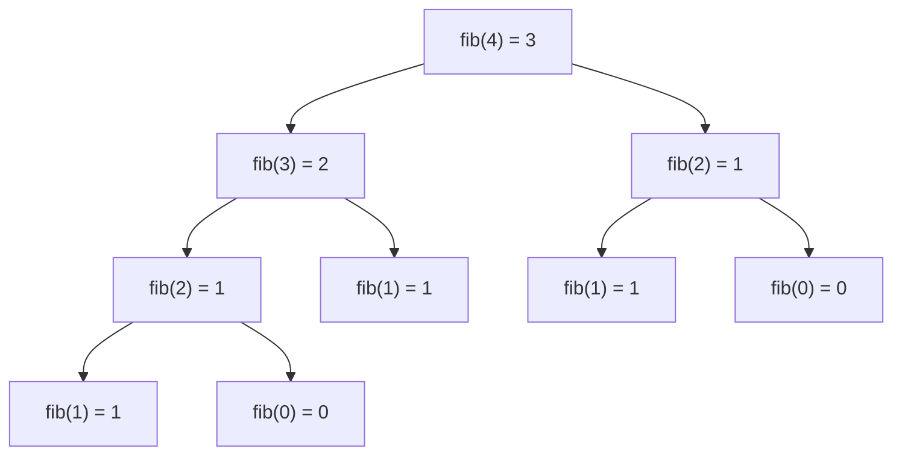

## What Is a Method?

> **Definition:** A **method** is a **block of code that only runs when it is called**. Methods are also known as **functions**.

- You can **pass data into a method** as **parameters**.
- Methods **perform actions** and let you **reuse code**: **define once, use many times**.
- In Java, **a method must be declared within a class**.

**Why methods?** They break a big program into small, named, testable pieces (**decomposition**), remove repetition, and make code easier to read ("`calculateCGPA()`" says what it does).

### Anatomy of a Method

```java
public static int add(int x, int y) {
    return x + y;
}
```

| Part | Here | Meaning |
|---|---|---|
| **Access modifier** | `public` | Who can call it (see the modifiers lesson) |
| **`static`** | `static` | The method **belongs to the class**, not to an object — so `main` can call it directly |
| **Return type** | `int` | The type of value sent back; **`void`** means nothing is returned |
| **Name** | `add` | **camelCase**, usually a verb: `printReport`, `computeAverage` |
| **Parameter list** | `(int x, int y)` | Inputs, each with a **type** and a **name**, separated by commas |
| **Body** | `{ return x + y; }` | The statements that run when the method is called |

The **method signature** is the **name plus the parameter types** — `add(int, int)`. It's what Java uses to tell methods apart.

---

## Creating and Calling a Method

```java
public class Main {
    static void myMethod() {                   // a method with no return value
        System.out.println("I just got executed!");
    }

    public static void main(String[] args) {
        myMethod();                              // call it
        myMethod();                              // it can be called many times
        myMethod();
    }
}
```

```text
I just got executed!
I just got executed!
I just got executed!
```

- **`static`**: the method belongs to the **class**, not an object.
- **`void`**: the method **returns no value**.
- **Call** it with the **method name, parentheses and a semicolon**: `myMethod();`

## Parameters and Arguments

**Parameters act as variables inside the method.** Separate multiple parameters with commas:

```java
public class Main {
    static void myMethod(String fname) {
        System.out.println(fname + " Ayinla");
    }

    public static void main(String[] args) {
        myMethod("Babatunde");         // Babatunde Ayinla
        myMethod("Oluwasemilore");     // Oluwasemilore Ayinla
    }
}
```

| Parameter | Argument |
|---|---|
| The **variable in the method definition** | The **actual value passed** in a call |
| `fname` in `myMethod(String fname)` | `"Babatunde"` in `myMethod("Babatunde")` |

Arguments must match the parameters in **number, type and order**: a method `greet(String name, int age)` must be called as `greet("Ada", 20)`, not `greet(20, "Ada")`.

## Return Values

Use a **data type instead of `void`**, and the **`return`** keyword:

```java
public class Main {
    static int myMethod(int x, int y) {
        return x + y;
    }

    public static void main(String[] args) {
        int z = myMethod(5, 3);        // store the result in a variable
        System.out.println(z);         // 8
    }
}
```

**`return` ends the method immediately** and hands the value back to the caller. A method with a return type **must return a value on every path**:

```java
static String grade(int score) {
    if (score >= 70) return "A";
    if (score >= 50) return "C";
    // ✗ compile error: "missing return statement" — what if score < 50?
}
```

### Pass-by-Value: Primitives vs References

**Java always passes arguments by value — it copies them.** For a primitive, the **value** is copied, so the method can't change the caller's variable. For an array or object, the **reference** is copied — both copies point to the **same** array, so changes to its **contents** are visible to the caller:

<CodeTrace title="What can a method change?">

```java
static void change(int x, int[] arr) {
    x = 100;
    arr[0] = 100;
}

public static void main(String[] args) {
    int n = 5;
    int[] data = {5, 5};
    change(n, data);
    System.out.println(n + " " + data[0]);
}
```

```trace
7 | n=5 | | main | main creates n = 5.
8 | n=5, data=→ [5; 5] | | main | data refers to an array {5, 5}.
9 | x=5, arr=→ same array as data | | main > change | Calling change copies n's VALUE into x and data's REFERENCE into arr.
2 | x=100, arr=→ same array as data | | main > change | x is a separate copy — changing it does NOT touch n.
3 | x=100, arr=→ [100; 5] (shared) | | main > change | arr points at the SAME array as data, so this change is shared.
9 | n=5, data=→ [100; 5] | | main | change returns; its frame (x, arr) disappears.
10 | n=5, data=→ [100; 5] | 5 100\n | main | n is still 5, but data[0] is now 100.
```

</CodeTrace>

### Local Variables and Scope

Variables declared **inside** a method (including its parameters) are **local**: they exist only **while that call is running**, and each call gets **its own fresh copies**. `x` and `arr` above vanish when `change` returns. That's also why two methods can both use a variable called `i` without interfering.

---

## Method Overloading

**Multiple methods can share the same name if their parameter lists differ.**

```java
static int plusMethod(int x, int y) {
    return x + y;
}

static double plusMethod(double x, double y) {
    return x + y;
}

public static void main(String[] args) {
    int myNum1 = plusMethod(8, 5);           // calls the int version
    double myNum2 = plusMethod(4.3, 6.26);   // calls the double version
    System.out.println("int: " + myNum1);
    System.out.println("double: " + myNum2);
}
```

```text
int: 13
double: 10.559999999999999
```

> **Why not 10.56?** The slide's comment says `10.56`, but `double` values are stored in **binary**, and neither 4.3 nor 6.26 can be represented exactly — their sum comes out a hair below 10.56. To *display* a rounded value, format it: `System.out.printf("double: %.2f%n", myNum2);` prints `double: 10.56`. (For money, professionals use `BigDecimal`, which stores decimal digits exactly.)

### The Rules

Overloaded methods must differ in their **parameter lists** — the **number**, **types** or **order** of parameters:

| Pair of methods | Valid overload? | Why |
|---|---|---|
| `area(int side)` and `area(double radius)` | ✅ | Different parameter **type** |
| `area(double l, double w)` and `area(double r)` | ✅ | Different **number** of parameters |
| `show(int a, String b)` and `show(String b, int a)` | ✅ | Different **order** of types |
| `int total(int a)` and `double total(int a)` | ❌ **compile error** | **Return type alone is not enough** — the call `total(5)` would be ambiguous |
| `sum(int a, int b)` and `sum(int x, int y)` | ❌ | Parameter **names** don't count — same signature |

**Overloading is resolved at compile time**: the compiler looks at the **argument types** in each call and picks the **best-matching** signature. That's why it's called **compile-time (static) polymorphism** — you'll meet it again in the Polymorphism lesson.

You already use overloading constantly: `System.out.println` has versions for `int`, `double`, `char`, `String`, `boolean`, `Object` and more.

> **Type promotion:** if there's no exact match, Java may **widen** an argument (`int` → `long` → `float` → `double`). With only `plusMethod(double, double)` defined, `plusMethod(8, 5)` would still compile and return `13.0`.

### Exercise 3: Overloaded Area Calculator

Write an overloaded `area()` that returns the area of a **square** (one `int` side), a **rectangle** (two `double` sides) and a **circle** (one `double` radius):

<Reveal question="Show a solution — and explain how Java chooses between area(int) and area(double)">
```java
public class AreaCalculator {
    static int area(int side) {                       // square
        return side * side;
    }

    static double area(double length, double width) { // rectangle
        return length * width;
    }

    static double area(double radius) {               // circle
        return Math.PI * radius * radius;
    }

    public static void main(String[] args) {
        System.out.println("Square: " + area(4));
        System.out.println("Rectangle: " + area(3.5, 2.0));
        System.out.printf("Circle: %.2f%n", area(1.5));
    }
}
```
```text
Square: 16
Rectangle: 7.0
Circle: 7.07
```
`area(4)` has an **int** argument, so the compiler chooses the **exact match** `area(int)` — the square. `area(1.5)` has a **double** argument, which can't go to `area(int)`, so it matches **`area(double)`** — the circle. `area(3.5, 2.0)` has **two** arguments → rectangle. (π × 1.5² = 7.0686…, printed as 7.07.)
</Reveal>

---

## Recursion

> **Definition:** **Recursion** is the technique of **a method calling itself** to break a complicated problem into **simpler sub-problems**.

Every recursive method has two parts:

| Part | Role |
|---|---|
| **Base case** | The simplest version of the problem, answered **directly, without recursion**. **It stops the calls.** |
| **Recursive case** | Solves the problem using the answer to a **smaller** version of itself, moving **towards** the base case |

### Example: Sum 1 to N

```java
public class Main {
    public static int sum(int k) {
        if (k > 0) {
            return k + sum(k - 1);     // recursive case
        } else {
            return 0;                  // base case
        }
    }

    public static void main(String[] args) {
        int result = sum(10);
        System.out.println(result);    // 55
    }
}
```

**Tracing `sum(10)`:** when `sum(k)` is called, it adds `k` to the sum of all the numbers smaller than `k`. When `k` reaches 0 it returns 0, and the calls stop:

```text
10 + sum(9)
10 + (9 + sum(8))
10 + (9 + (8 + sum(7)))
...
10 + 9 + 8 + 7 + 6 + 5 + 4 + 3 + 2 + 1 + sum(0)
10 + 9 + 8 + 7 + 6 + 5 + 4 + 3 + 2 + 1 + 0 = 55
```

### Inside the Machine: The Call Stack

Java keeps a **call stack**: each time a method is called, a new **frame** (holding that call's own parameters and local variables) is **pushed** on top; when the method returns, its frame is **popped**. Each recursive call is **suspended** until the deeper call returns. Step through `sum(3)` and watch the stack **grow** to the base case, then **unwind** as the results combine on the way back up:

<CodeTrace title="sum(3) on the call stack">

```java
public class Main {
    public static int sum(int k) {
        if (k > 0) {
            return k + sum(k - 1);
        } else {
            return 0;
        }
    }

    public static void main(String[] args) {
        int result = sum(3);
        System.out.println(result);
    }
}
```

```trace
11 | | | main | main calls sum(3) and waits for its answer.
3 | k=3 | | main > sum(3) | A new frame for sum with its own k = 3. Is 3 > 0? Yes.
4 | k=3 | | main > sum(3) | It needs 3 + sum(2), so sum(3) pauses and calls sum(2).
3 | k=2 | | main > sum(3) > sum(2) | Another frame, with its own k = 2. 2 > 0.
4 | k=2 | | main > sum(3) > sum(2) | Needs 2 + sum(1): pause and call.
3 | k=1 | | main > sum(3) > sum(2) > sum(1) | k = 1. 1 > 0.
4 | k=1 | | main > sum(3) > sum(2) > sum(1) | Needs 1 + sum(0).
3 | k=0 | | main > sum(3) > sum(2) > sum(1) > sum(0) | k = 0. Is 0 > 0? No…
6 | k=0 | | main > sum(3) > sum(2) > sum(1) > sum(0) | BASE CASE: return 0. No more calls — now the stack unwinds.
4 | k=1 | | main > sum(3) > sum(2) > sum(1) | sum(0) gave 0, so sum(1) returns 1 + 0 = 1.
4 | k=2 | | main > sum(3) > sum(2) | sum(1) gave 1, so sum(2) returns 2 + 1 = 3.
4 | k=3 | | main > sum(3) | sum(2) gave 3, so sum(3) returns 3 + 3 = 6.
11 | result=6 | | main | Back in main with the answer: result = 6.
12 | result=6 | 6\n | main | Prints 6.
```

</CodeTrace>

<Analogy>
Recursion is like a queue of students passing a question back: *"How many people are behind you?"* Each student can't answer until they ask the person behind them. The **last** student (the **base case**) says "zero". Then the answers travel forward — "one", "two", "three" — each student adding themselves, until the answer reaches the front.
</Analogy>

### Factorial

$n! = n \times (n-1) \times \dots \times 1$, with $0! = 1$. Recursively: $n! = n \times (n-1)!$.

```java
static long factorial(int n) {
    if (n <= 1) return 1;              // base case: 0! = 1! = 1
    return n * factorial(n - 1);       // recursive case
}
```

`factorial(5)` = 5 × 4 × 3 × 2 × 1 = **120**. The method returns **`long`** because factorials grow fast: 13! = 6,227,020,800 is already too big for an `int` (maximum 2,147,483,647) and would silently **overflow**.

### Fibonacci and the Recursion Tree

The Fibonacci sequence is 0, 1, 1, 2, 3, 5, 8, 13, … — each term is the sum of the two before it. It has **two base cases** and makes **two** recursive calls:

```java
static int fibonacci(int n) {
    if (n == 0) return 0;              // base case
    if (n == 1) return 1;              // base case
    return fibonacci(n - 1) + fibonacci(n - 2);
}
```

Calling `fibonacci(4)` branches into a **recursion tree**:



**9 calls** to compute `fib(4)` — and `fib(2)` is computed **twice**. The number of calls roughly **doubles** with each extra level, so `fibonacci(40)` makes over **300 million** calls. Recursion is elegant, but **not always efficient**: a simple loop (or remembering computed values — *memoisation*) is far faster here.

### When There's No Base Case: StackOverflowError

```java
static int broken(int k) {
    return k + broken(k - 1);          // no base case!
}
```

Each call adds a frame; nothing ever returns; the stack runs out of memory and Java throws **`java.lang.StackOverflowError`**. **Every recursive method needs a base case, and every recursive call must move closer to it.**

### Exercise 4: Factorial and Fibonacci

<Reveal question="Print the first 10 values of each — show the program and output">
```java
public class RecursionDemo {
    static long factorial(int n) {
        if (n <= 1) return 1;                       // base case
        return n * factorial(n - 1);
    }

    static int fibonacci(int n) {
        if (n <= 1) return n;                       // base cases: fib(0) = 0, fib(1) = 1
        return fibonacci(n - 1) + fibonacci(n - 2);
    }

    public static void main(String[] args) {
        for (int i = 0; i < 10; i++) System.out.print(factorial(i) + " ");
        System.out.println();
        for (int i = 0; i < 10; i++) System.out.print(fibonacci(i) + " ");
        System.out.println();
    }
}
```
```text
1 1 2 6 24 120 720 5040 40320 362880
0 1 1 2 3 5 8 13 21 34
```
(Each line also ends with a trailing space from `print(... + " ")`.) Base cases: **`n <= 1`** for factorial; **`n == 0` and `n == 1`** (combined as `n <= 1` returning `n`) for Fibonacci.
</Reveal>

### Recursion vs Iteration

| | Recursion | Iteration (loops) |
|---|---|---|
| How it repeats | A method **calls itself** | `for` / `while` loops |
| Stops when | The **base case** is reached | The loop **condition** becomes false |
| Memory | A **stack frame per call** — can overflow | Constant extra memory |
| Speed | Some call overhead; can repeat work (Fibonacci) | Usually faster |
| Best for | Naturally recursive problems: **trees**, **divide and conquer** (binary search, merge sort, quick sort), nested structures | Simple repetition over ranges and lists |

Anything recursive can be written iteratively (and vice versa); choose whichever is **clearer** for the problem. You'll use recursion for **searching and sorting** later in the course.

---

## Check Your Understanding

<MCQ question="Which pair is NOT a legal overload?">
<Option>void print(int a) and void print(String a)</Option>
<Option>int max(int a, int b) and int max(int a, int b, int c)</Option>
<Option correct>int size(int a) and long size(int a)</Option>
<Option>void log(String s, int n) and void log(int n, String s)</Option>
<Explain>
Overloads must differ in their **parameter lists**. `size(int)` and `size(int)` have the **same signature**; differing only in **return type** is a compile error, because a call like `size(3)` can't tell them apart.
</Explain>
</MCQ>

<MCQ question="What does mystery(4) return?  static int mystery(int n) — if n equals 0 it returns 0, otherwise it returns n * 2 + mystery(n - 1).">
<Option>8</Option>
<Option>16</Option>
<Option correct>20</Option>
<Option>StackOverflowError</Option>
<Explain>
mystery(4) = 8 + mystery(3) = 8 + 6 + mystery(2) = 8 + 6 + 4 + mystery(1) = 8 + 6 + 4 + 2 + mystery(0) = 8 + 6 + 4 + 2 + 0 = **20**. The base case `n == 0` is reached, so there's no overflow.
</Explain>
</MCQ>

<MCQ question="A method void twice(int x) sets x = x * 2. After calling twice(n) with n = 7, what does n hold?">
<Option>14</Option>
<Option correct>7</Option>
<Option>0</Option>
<Option>It depends on the return type</Option>
<Explain>
Java passes primitives **by value**: the method gets a **copy** of 7. Doubling the copy doesn't change `n`. To get the doubled value, the method must **return** it — `static int twice(int x) { return x * 2; }` — and the caller must store it: `n = twice(n);`.
</Explain>
</MCQ>

## Practice Questions

<Reveal question="Differentiate between a parameter and an argument, and between a void method and a method that returns a value.">
A **parameter** is the variable listed in a method's **definition** (`fname` in `myMethod(String fname)`); an **argument** is the **actual value** supplied when the method is **called** (`"Babatunde"`). A **`void`** method performs an action and returns **nothing**; a method with a return type (e.g. `int`) must use **`return`** to send a value of that type back to the caller.
</Reveal>

<Reveal question="What is method overloading, and when is the correct version chosen?">
Overloading is defining **several methods with the same name but different parameter lists** (number, types or order). The compiler chooses the version whose parameters **best match the argument types** in each call — at **compile time** (compile-time polymorphism). Return type alone cannot distinguish overloads.
</Reveal>

<Reveal question="Explain the base case and recursive case using a recursive power(base, exp) method.">
```java
static long power(int base, int exp) {
    if (exp == 0) return 1;                   // base case: anything to the power 0 is 1
    return base * power(base, exp - 1);       // recursive case: smaller exponent
}
```
The **base case** (`exp == 0`) returns an answer directly and stops the recursion. The **recursive case** reduces the problem (`exp - 1`), moving towards the base case. `power(2, 5)` = 2 × 2 × 2 × 2 × 2 × 1 = **32**.
</Reveal>

<Reveal question="Why does a recursive method without a base case fail, and what error does Java report?">
Without a base case the method keeps calling itself; each call pushes a new **stack frame**, none ever returns, and the call stack runs out of space. Java throws **`java.lang.StackOverflowError`**.
</Reveal>

<Takeaway>
A **method** is a named block of code, declared **inside a class**, that runs **when called** and can be reused. Its **signature** is the name plus parameter types; **`static`** = belongs to the class; **`void`** = returns nothing; otherwise **`return`** a value on every path. **Parameters** are the variables in the definition; **arguments** are the values passed. Java is **pass-by-value**: primitives are copied (the caller's variable can't change), references are copied (the shared object's contents can). **Overloading** = same name, different parameter lists (number/type/order — **not** return type), chosen at **compile time**. **Recursion** = a method calling itself: a **base case** stops it, a **recursive case** moves towards it; each call gets a **stack frame**, suspended until deeper calls return, then results combine while **unwinding**. No base case → **`StackOverflowError`**. Recursion suits divide-and-conquer; loops are often faster (e.g. Fibonacci).
</Takeaway>

## Exam Tips

**What lecturers test:**
- Definition of a method; parts of a method header; void vs returning methods
- Parameters vs arguments
- **Overloading** rules, with examples (Exercise 3)
- **Recursion**: definition, base case, **tracing** (`sum(10)` expansion), factorial and Fibonacci (Exercise 4)

**Common mistakes:**
- Forgetting the base case, or a recursive call that doesn't move towards it
- Trying to overload by return type only
- Expecting a method to change a primitive argument
- Using `int` for large factorials (overflow)

**Likely question:**
> "Define recursion and explain the importance of the base case. Write a recursive Java method to compute the factorial of n and trace its execution for n = 4. What is method overloading? Illustrate with an example." (15 marks)
