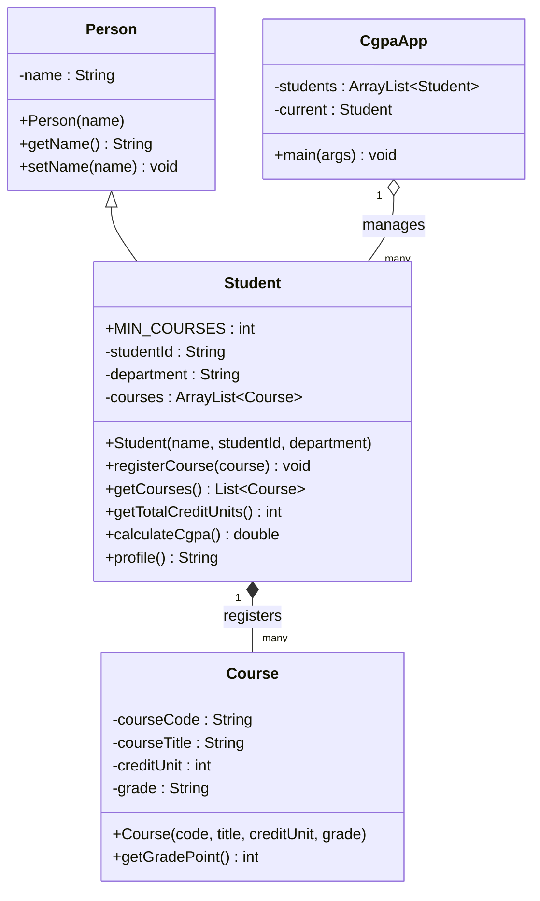

## The Assignment

**Develop a Java GUI application that allows a user to enter student information, register courses for each student, enter course grades, and calculate the student's Cumulative Grade Point Average (CGPA).**

Your implementation must demonstrate a clear understanding of:
- ✓ **Classes and objects, constructors, inheritance and encapsulation**
- ✓ **ArrayList** data structures and custom methods
- ✓ **Java Swing** GUI components and **event listeners**
- ✓ **Conditional statements, loops, robust input validation and exception handling**

This lesson walks through a complete model solution. **Understand every line before you submit your own** — your lecturer will expect you to explain your design.

### Requirements at a Glance

| # | Requirement | Where it's met |
|---|---|---|
| 1 | **`Person` base class** with a **private `name`**, a constructor, getter and setter | `Person.java` |
| 2 | **`Student extends Person`** with `studentId`, `department` and **`ArrayList<Course> courses`**; constructors, getters/setters, **course registration** and a **dedicated CGPA method**; all fields **encapsulated** | `Student.java` |
| 3 | **`Course`** with **private** `courseCode`, `courseTitle`, `creditUnit` (`int`), `grade` (`String`), constructors, getters, setters | `Course.java` |
| 4 | Courses stored in an **`ArrayList<Course>`** (not a fixed array); **at least 5 courses**; **block CGPA calculation with fewer than 5**, showing *"A student must register at least 5 courses before CGPA can be calculated."* | `Student.calculateCgpa()` |
| 5 | **Three `Student` objects** from **Computer Science, Mathematics and Physics**, with UI-style IDs (e.g. `UI/CSC/2026/001`), courses, grades and CGPAs | `CgpaApp.loadSampleStudents()` |
| 6 | A **Swing GUI** using `JFrame`, `JLabel`, `JTextField`, `JComboBox`, `JButton`, `JTextArea`, `JOptionPane`: enter details, register courses, calculate CGPA, display profiles, clear the form, exit | `CgpaApp.java` |
| 7 | CGPA on the **5-point scale** | `Course.getGradePoint()`, `Student.calculateCgpa()` |
| 8 | **Validate every field**; **granular `try–catch`** for specific runtime exceptions such as `NumberFormatException`, not only `catch (Exception e)` | setters + `CgpaApp` listeners |
| 9 | **Formatted student profile** in a `JTextArea` with the University of Ibadan header | `Student.profile()` |

---

## Design

### Class Diagram



- **Inheritance (IS-A):** a `Student` **is a** `Person` — it inherits `name`, `getName()` and `setName()`.
- **Composition (HAS-A):** a `Student` **has** many `Course`s, stored in an `ArrayList<Course>`.
- **Encapsulation:** every field is `private` (`-`); access is through public methods (`+`) that **validate**.
- **Separation of concerns:** `Person`, `Student` and `Course` hold the **data and rules**; `CgpaApp` is only the **user interface**. The model classes could be reused unchanged in a web or console version.

### The CGPA Model

The University of Ibadan **5-point scale**:

| Grade | A | B | C | D | E | F |
|---|---|---|---|---|---|---|
| **Grade point** | **5** | **4** | **3** | **2** | **1** | **0** |

$$
\text{CGPA} = \frac{\sum (\text{Grade Point} \times \text{Credit Unit})}{\sum \text{Credit Units}}
$$

**Worked example** — the sample profile in the handout (John Ade, Computer Science):

| Course | Title | CU | Grade | GP | GP × CU |
|---|---|---|---|---|---|
| CSC201 | Data Structures | 3 | A | 5 | 15 |
| CSC203 | Computer Architecture | 3 | B | 4 | 12 |
| MTH201 | Mathematics II | 3 | A | 5 | 15 |
| CSC205 | Programming II | 3 | B | 4 | 12 |
| STA201 | Statistics | 2 | C | 3 | 6 |
| **Total** | | **14** | | | **60** |

$$
\text{CGPA} = \frac{60}{14} = 4.2857\ldots \approx \mathbf{4.29}
$$

<ExamTip>
**Check the handout's sample:** it shows **CGPA : 4.07** for these five courses, but the grades and units listed give **60 ÷ 14 = 4.29**. The sample output shows the *layout* to follow; your program must **compute** the CGPA — don't hard-code or copy the number. (If your program prints 4.07 for these courses, something is wrong.)
</ExamTip>

---

## Try the Finished Application

This is a working model of the required GUI, with the same fields, rules and output format. Press **Load sample** and **Display Profile** to see the handout's student, then enter your own courses to check the numbers your Java program should produce. Try the error cases too — letters in the credit units, fewer than 5 courses, a duplicate course code:

<CgpaCalculator />

---

## Step 1: Person.java

```java
public class Person {
    private String name;                                   // encapsulated: private

    public Person(String name) {
        setName(name);                                     // reuse the validation
    }

    public String getName() {
        return name;
    }

    public void setName(String name) {
        if (name == null || name.trim().isEmpty())
            throw new IllegalArgumentException("Name cannot be empty.");
        this.name = name.trim();
    }
}
```

The constructor calls the **setter**, so even a newly created `Person` can't have an empty name.

## Step 2: Course.java

```java
public class Course {
    private String courseCode;
    private String courseTitle;
    private int creditUnit;
    private String grade;

    public Course(String courseCode, String courseTitle, int creditUnit, String grade) {
        setCourseCode(courseCode);
        setCourseTitle(courseTitle);
        setCreditUnit(creditUnit);
        setGrade(grade);
    }

    public String getCourseCode()  { return courseCode; }
    public String getCourseTitle() { return courseTitle; }
    public int getCreditUnit()     { return creditUnit; }
    public String getGrade()       { return grade; }

    public void setCourseCode(String courseCode) {
        if (courseCode == null || courseCode.trim().isEmpty())
            throw new IllegalArgumentException("Course code is required.");
        this.courseCode = courseCode.trim().toUpperCase();
    }

    public void setCourseTitle(String courseTitle) {
        if (courseTitle == null || courseTitle.trim().isEmpty())
            throw new IllegalArgumentException("Course title is required.");
        this.courseTitle = courseTitle.trim();
    }

    public void setCreditUnit(int creditUnit) {
        if (creditUnit <= 0)
            throw new IllegalArgumentException("Credit units must be a positive integer.");
        this.creditUnit = creditUnit;
    }

    public void setGrade(String grade) {
        if (grade == null || !grade.trim().toUpperCase().matches("[A-F]"))
            throw new IllegalArgumentException("Grade must be A, B, C, D, E or F.");
        this.grade = grade.trim().toUpperCase();
    }

    /** The grade point on the University's 5-point scale. */
    public int getGradePoint() {
        switch (grade) {
            case "A": return 5;
            case "B": return 4;
            case "C": return 3;
            case "D": return 2;
            case "E": return 1;
            default:  return 0;        // F
        }
    }
}
```

`matches("[A-F]")` is a **regular expression**: exactly one character from A to F — anything else is rejected.

## Step 3: Student.java

```java
import java.util.ArrayList;
import java.util.Collections;
import java.util.List;

public class Student extends Person {                     // inheritance: Student IS-A Person
    public static final int MIN_COURSES = 5;

    private String studentId;
    private String department;
    private final ArrayList<Course> courses = new ArrayList<>();   // ArrayList, not a fixed array

    public Student(String name, String studentId, String department) {
        super(name);                                      // Person's constructor sets and validates the name
        setStudentId(studentId);
        setDepartment(department);
    }

    public String getStudentId()  { return studentId; }
    public String getDepartment() { return department; }

    public void setStudentId(String studentId) {
        if (studentId == null || !studentId.trim().matches("UI/[A-Z]{3}/\\d{4}/\\d{3}"))
            throw new IllegalArgumentException("Student ID must look like UI/CSC/2026/001.");
        this.studentId = studentId.trim();
    }

    public void setDepartment(String department) {
        if (department == null || department.trim().isEmpty())
            throw new IllegalArgumentException("Department is required.");
        this.department = department.trim();
    }

    /** A read-only view, so other classes can't add or remove courses behind our back. */
    public List<Course> getCourses() {
        return Collections.unmodifiableList(courses);
    }

    public void registerCourse(Course course) {
        for (Course c : courses)
            if (c.getCourseCode().equals(course.getCourseCode()))
                throw new IllegalArgumentException(course.getCourseCode() + " is already registered.");
        courses.add(course);
    }

    public int getTotalCreditUnits() {
        int total = 0;
        for (Course c : courses) total += c.getCreditUnit();
        return total;
    }

    /** CGPA = sum(grade point x credit unit) / sum(credit units), on the 5-point scale. */
    public double calculateCgpa() {
        if (courses.size() < MIN_COURSES)
            throw new IllegalStateException(
                "A student must register at least 5 courses before CGPA can be calculated.");
        int totalPoints = 0;
        for (Course c : courses) totalPoints += c.getGradePoint() * c.getCreditUnit();
        return (double) totalPoints / getTotalCreditUnits();
    }

    /** The formatted profile, in the layout the handout specifies. */
    public String profile() {
        String line = "=".repeat(47);
        String dash = "-".repeat(63);
        StringBuilder sb = new StringBuilder();
        sb.append(line).append('\n')
          .append("UNIVERSITY OF IBADAN - FACULTY OF COMPUTING\n")
          .append("STUDENT PROFILE\n")
          .append(line).append('\n')
          .append(String.format("Student ID : %s%n", studentId))
          .append(String.format("Name       : %s%n", getName()))        // inherited getter
          .append(String.format("Department : %s%n", department))
          .append(String.format("Courses Registered: %d%n", courses.size()))
          .append(dash).append('\n')
          .append(String.format("%-12s %-28s %-4s %s%n", "Course Code", "Course Title", "CU", "Grade"))
          .append(dash).append('\n');
        for (Course c : courses)
            sb.append(String.format("%-12s %-28s %-4d %s%n",
                    c.getCourseCode(), c.getCourseTitle(), c.getCreditUnit(), c.getGrade()));
        sb.append(dash).append('\n')
          .append(String.format("Total Credit Units : %d%n", getTotalCreditUnits()))
          .append(String.format("CGPA               : %.2f%n", calculateCgpa()))
          .append(line);
        return sb.toString();
    }
}
```

**Key decisions:**
- **`(double) totalPoints / getTotalCreditUnits()`** — without the cast, `60 / 14` is **integer division** and gives **4**.
- The **5-course rule** lives in the **model** (`calculateCgpa`), so *every* caller — button, profile, future report — obeys it. It throws **`IllegalStateException`**: the object isn't in a state where CGPA makes sense yet.
- `%-12s` = a String **left-aligned in 12 characters**; `%-4d` = an integer left-aligned in 4; `%.2f` = a double to **2 decimal places**; `%n` = a new line. That's how the profile's columns line up.
- `getCourses()` returns an **unmodifiable view** — callers can read the list but must use `registerCourse()` to add, so the duplicate check can't be bypassed.

## Step 4: CgpaApp.java (the Swing GUI)

```java
import javax.swing.*;
import java.awt.*;
import java.util.ArrayList;

public class CgpaApp extends JFrame {
    private final ArrayList<Student> students = new ArrayList<>();
    private Student current;                                        // the student being edited

    private final JTextField idField = new JTextField(15);
    private final JTextField nameField = new JTextField(15);
    private final JComboBox<String> deptBox =
            new JComboBox<>(new String[] {"Computer Science", "Mathematics", "Physics"});
    private final JTextField codeField = new JTextField(8);
    private final JTextField titleField = new JTextField(15);
    private final JTextField unitsField = new JTextField(3);
    private final JComboBox<String> gradeBox =
            new JComboBox<>(new String[] {"A", "B", "C", "D", "E", "F"});
    private final JTextArea output = new JTextArea(18, 64);

    public CgpaApp() {
        super("UI Student Course Registration & CGPA Calculator");

        // --- Student details panel ---
        JPanel studentPanel = new JPanel(new GridLayout(3, 2, 6, 6));
        studentPanel.setBorder(BorderFactory.createTitledBorder("Student details"));
        studentPanel.add(new JLabel("Student ID:"));  studentPanel.add(idField);
        studentPanel.add(new JLabel("Name:"));        studentPanel.add(nameField);
        studentPanel.add(new JLabel("Department:"));  studentPanel.add(deptBox);

        // --- Course panel ---
        JPanel coursePanel = new JPanel(new GridLayout(4, 2, 6, 6));
        coursePanel.setBorder(BorderFactory.createTitledBorder("Course"));
        coursePanel.add(new JLabel("Course code:"));   coursePanel.add(codeField);
        coursePanel.add(new JLabel("Course title:"));  coursePanel.add(titleField);
        coursePanel.add(new JLabel("Credit units:"));  coursePanel.add(unitsField);
        coursePanel.add(new JLabel("Grade:"));         coursePanel.add(gradeBox);

        // --- Buttons ---
        JButton newStudentBtn = new JButton("New Student");
        JButton registerBtn = new JButton("Register Course");
        JButton cgpaBtn = new JButton("Calculate CGPA");
        JButton profileBtn = new JButton("Display Profiles");
        JButton clearBtn = new JButton("Clear");
        JButton exitBtn = new JButton("Exit");
        JPanel buttons = new JPanel(new FlowLayout());
        for (JButton b : new JButton[] {newStudentBtn, registerBtn, cgpaBtn, profileBtn, clearBtn, exitBtn})
            buttons.add(b);

        JPanel top = new JPanel(new GridLayout(1, 2, 8, 8));
        top.add(studentPanel);
        top.add(coursePanel);

        output.setEditable(false);
        output.setFont(new Font(Font.MONOSPACED, Font.PLAIN, 12));   // monospaced so columns line up

        setLayout(new BorderLayout(8, 8));
        add(top, BorderLayout.NORTH);
        add(buttons, BorderLayout.CENTER);
        add(new JScrollPane(output), BorderLayout.SOUTH);

        // --- Event listeners ---
        newStudentBtn.addActionListener(e -> createStudent());
        registerBtn.addActionListener(e -> registerCourse());
        cgpaBtn.addActionListener(e -> showCgpa());
        profileBtn.addActionListener(e -> showProfiles());
        clearBtn.addActionListener(e -> clearForm());
        exitBtn.addActionListener(e -> System.exit(0));

        loadSampleStudents();
        setDefaultCloseOperation(JFrame.EXIT_ON_CLOSE);
        pack();
        setLocationRelativeTo(null);
    }

    private void createStudent() {
        try {
            current = new Student(nameField.getText(), idField.getText(), (String) deptBox.getSelectedItem());
            students.add(current);
            output.setText("Created " + current.getName() + " (" + current.getStudentId()
                    + "). Now register at least " + Student.MIN_COURSES + " courses.");
        } catch (IllegalArgumentException ex) {
            showError(ex.getMessage());
        }
    }

    private void registerCourse() {
        if (current == null) {
            showError("Create the student first (New Student).");
            return;
        }
        try {
            int units = Integer.parseInt(unitsField.getText().trim());     // may throw NumberFormatException
            current.registerCourse(new Course(codeField.getText(), titleField.getText(),
                    units, (String) gradeBox.getSelectedItem()));
            output.setText(codeField.getText().trim().toUpperCase() + " registered. Courses so far: "
                    + current.getCourses().size());
            codeField.setText("");
            titleField.setText("");
            unitsField.setText("");
        } catch (NumberFormatException ex) {                              // specific first…
            showError("Credit units must be a whole number, e.g. 3.");
        } catch (IllegalArgumentException ex) {                           // …then the more general
            showError(ex.getMessage());
        }
    }

    private void showCgpa() {
        if (current == null) {
            showError("No student selected. Create one with New Student.");
            return;
        }
        try {
            output.setText(String.format("CGPA of %s: %.2f", current.getName(), current.calculateCgpa()));
        } catch (IllegalStateException ex) {
            JOptionPane.showMessageDialog(this, ex.getMessage(), "Not enough courses",
                    JOptionPane.WARNING_MESSAGE);
        }
    }

    private void showProfiles() {
        StringBuilder all = new StringBuilder();
        for (Student s : students) {
            try {
                all.append(s.profile()).append("\n\n");
            } catch (IllegalStateException ex) {
                all.append(s.getStudentId()).append(" - ").append(ex.getMessage()).append("\n\n");
            }
        }
        output.setText(all.toString());
        output.setCaretPosition(0);                                  // scroll back to the top
    }

    private void clearForm() {
        for (JTextField f : new JTextField[] {idField, nameField, codeField, titleField, unitsField})
            f.setText("");
        deptBox.setSelectedIndex(0);
        gradeBox.setSelectedIndex(0);
        current = null;
        output.setText("");
    }

    private void showError(String message) {
        JOptionPane.showMessageDialog(this, message, "Invalid input", JOptionPane.ERROR_MESSAGE);
    }

    /** Requirement 5: three students from Computer Science, Mathematics and Physics. */
    private void loadSampleStudents() {
        Student john = new Student("John Ade", "UI/CSC/2026/001", "Computer Science");
        john.registerCourse(new Course("CSC201", "Data Structures", 3, "A"));
        john.registerCourse(new Course("CSC203", "Computer Architecture", 3, "B"));
        john.registerCourse(new Course("MTH201", "Mathematics II", 3, "A"));
        john.registerCourse(new Course("CSC205", "Programming II", 3, "B"));
        john.registerCourse(new Course("STA201", "Statistics", 2, "C"));

        Student amina = new Student("Amina Bello", "UI/MTH/2026/002", "Mathematics");
        amina.registerCourse(new Course("MTH201", "Linear Algebra I", 3, "B"));
        amina.registerCourse(new Course("MTH203", "Real Analysis I", 3, "A"));
        amina.registerCourse(new Course("MTH205", "Differential Equations", 3, "C"));
        amina.registerCourse(new Course("STA201", "Statistics", 2, "B"));
        amina.registerCourse(new Course("CSC201", "Data Structures", 3, "C"));

        Student tunde = new Student("Tunde Okafor", "UI/PHY/2026/003", "Physics");
        tunde.registerCourse(new Course("PHY201", "Mechanics", 3, "A"));
        tunde.registerCourse(new Course("PHY203", "Electromagnetism", 3, "B"));
        tunde.registerCourse(new Course("PHY205", "Thermal Physics", 2, "A"));
        tunde.registerCourse(new Course("PHY207", "Physics Practical", 1, "A"));
        tunde.registerCourse(new Course("MTH201", "Mathematics II", 3, "D"));
        tunde.registerCourse(new Course("CSC205", "Programming II", 3, "B"));

        students.add(john);
        students.add(amina);
        students.add(tunde);
    }

    public static void main(String[] args) {
        SwingUtilities.invokeLater(() -> new CgpaApp().setVisible(true));
    }
}
```

**Compile and run** (all four files in one folder):

```bash
javac Person.java Course.java Student.java CgpaApp.java
java CgpaApp
```

### The Three Student Records

| Student | ID | Department | Σ(GP × CU) | Σ CU | CGPA |
|---|---|---|---|---|---|
| John Ade | UI/CSC/2026/001 | Computer Science | 15 + 12 + 15 + 12 + 6 = **60** | **14** | 60 ÷ 14 = **4.29** |
| Amina Bello | UI/MTH/2026/002 | Mathematics | 12 + 15 + 9 + 8 + 9 = **53** | **14** | 53 ÷ 14 = **3.79** |
| Tunde Okafor | UI/PHY/2026/003 | Physics | 15 + 12 + 10 + 5 + 6 + 12 = **60** | **15** | 60 ÷ 15 = **4.00** |

Clicking **Display Profiles** prints (first student shown):

```text
===============================================
UNIVERSITY OF IBADAN - FACULTY OF COMPUTING
STUDENT PROFILE
===============================================
Student ID : UI/CSC/2026/001
Name       : John Ade
Department : Computer Science
Courses Registered: 5
---------------------------------------------------------------
Course Code  Course Title                 CU   Grade
---------------------------------------------------------------
CSC201       Data Structures              3    A
CSC203       Computer Architecture        3    B
MTH201       Mathematics II               3    A
CSC205       Programming II               3    B
STA201       Statistics                   2    C
---------------------------------------------------------------
Total Credit Units : 14
CGPA               : 4.29
===============================================
```

---

## Validation and Exception Handling

| Input problem | Detected by | Exception | Message shown |
|---|---|---|---|
| Credit units "three" or "3.5" | `Integer.parseInt` | **`NumberFormatException`** | "Credit units must be a whole number, e.g. 3." |
| Credit units 0 or −2 | `Course.setCreditUnit` | `IllegalArgumentException` | "Credit units must be a positive integer." |
| Empty course code/title | `Course` setters | `IllegalArgumentException` | "Course code is required." |
| Grade not A–F | `Course.setGrade` | `IllegalArgumentException` | "Grade must be A, B, C, D, E or F." (the combo box already prevents this; the setter protects the class if it's reused) |
| Same course twice | `Student.registerCourse` | `IllegalArgumentException` | "CSC201 is already registered." |
| Bad ID format | `Student.setStudentId` | `IllegalArgumentException` | "Student ID must look like UI/CSC/2026/001." |
| Fewer than 5 courses | `Student.calculateCgpa` | **`IllegalStateException`** | "A student must register at least 5 courses before CGPA can be calculated." |
| Registering before creating a student | `CgpaApp` check | — (an `if`) | "Create the student first." |

**Granular catching:** `registerCourse()` catches **`NumberFormatException` first**, then `IllegalArgumentException` — the specific problem gets a specific message, and no generic `catch (Exception e)` hides unexpected bugs. (`NumberFormatException` is a subclass of `IllegalArgumentException`, so the order is required.)

---

## The Written Explanation You Must Submit

<Reveal question="Where does the program demonstrate inheritance?">
`Student extends Person` (**IS-A**): `Student` inherits the private `name` field's public accessors `getName()`/`setName()`, and its constructor calls **`super(name)`** so `Person` initialises and validates the name. `Student.profile()` uses the inherited `getName()`. `CgpaApp extends JFrame`, inheriting all window behaviour from Swing.
</Reveal>

<Reveal question="Where does it demonstrate encapsulation?">
Every field of `Person`, `Student` and `Course` is **`private`**; access is through **public getters and setters that validate** (non-empty names and codes, positive credit units, grades A–F, UI-style IDs). `getCourses()` returns an **unmodifiable** view, so courses can only be added through `registerCourse()`, which rejects duplicates. `MIN_COURSES` is a **`public static final`** constant — readable by all, changeable by none.
</Reveal>

<Reveal question="Where does it use ArrayList?">
`Student` stores its registered courses in **`ArrayList<Course> courses`**, which grows as courses are registered (a student may take 5, 6 or more). `registerCourse()` adds with `add()`, and `getTotalCreditUnits()`, `calculateCgpa()` and `profile()` traverse it with for-each loops. `CgpaApp` also keeps all students in an **`ArrayList<Student>`**.
</Reveal>

<Reveal question="Where does it use exception handling?">
Setters **throw `IllegalArgumentException`** for invalid data; `calculateCgpa()` **throws `IllegalStateException`** when fewer than 5 courses are registered. In the GUI, `registerCourse()` **catches `NumberFormatException`** (non-numeric credit units) **before** `IllegalArgumentException`; `createStudent()` catches invalid details; `showCgpa()` and `showProfiles()` catch `IllegalStateException` and show the required message with **`JOptionPane`** — so invalid input never crashes the application.
</Reveal>

---

## Testing Checklist

| Test | Expected result |
|---|---|
| Create John Ade with ID `UI/CSC/2026/001` | "Created John Ade…" |
| ID `CSC001` | "Student ID must look like UI/CSC/2026/001." |
| Register 4 courses, click Calculate CGPA | Warning: "A student must register at least 5 courses…" |
| Register the 5th, Calculate CGPA | "CGPA of John Ade: 4.29" |
| Credit units `abc` | "Credit units must be a whole number…" (no crash) |
| Credit units `0` | "Credit units must be a positive integer." |
| Register CSC201 twice | "CSC201 is already registered." |
| Display Profiles | Three formatted profiles; CGPAs 4.29, 3.79, 4.00 |
| Clear | All fields empty |
| Exit / close window | Program ends |

**Submission:** `Person.java`, `Student.java`, `Course.java`, `CgpaApp.java` (and any other files needed), **screenshots of the working GUI**, **screenshots of the three formatted profiles**, and the **written explanation** of inheritance, encapsulation, ArrayList and exception handling.

### Ideas for Going Further

- Show the course list in a **`JTable`** instead of text, and let the user remove a course.
- Add a **`JList`** of students so any student can be selected and edited.
- **Save and load** students to a file (Serializable or CSV) so data survives restarts.
- Compute **GPA per semester** as well as CGPA, and a **class of degree** (First Class ≥ 4.50, …).

---

## Practice Questions

<Reveal question="Write the method that calculates CGPA from an ArrayList of courses on the 5-point scale, rejecting fewer than 5 courses.">
```java
public double calculateCgpa() {
    if (courses.size() < 5)
        throw new IllegalStateException(
            "A student must register at least 5 courses before CGPA can be calculated.");
    int totalPoints = 0, totalUnits = 0;
    for (Course c : courses) {
        totalPoints += c.getGradePoint() * c.getCreditUnit();
        totalUnits += c.getCreditUnit();
    }
    return (double) totalPoints / totalUnits;
}
```
</Reveal>

<Reveal question="A student has: 4-unit A, 3-unit C, 2-unit F, 3-unit B, 2-unit D. Compute the CGPA.">
Points: 4 × 5 = 20; 3 × 3 = 9; 2 × 0 = 0; 3 × 4 = 12; 2 × 2 = 4 → **45**. Units: 4 + 3 + 2 + 3 + 2 = **14**. CGPA = 45 ÷ 14 = **3.21** (3.214…).
</Reveal>

<Reveal question="Why is it better to check the 5-course rule inside Student.calculateCgpa() than only in the button's listener?">
Because the **rule belongs to the data**, not the screen. Putting it in the **model** means **every** part of the program that asks for a CGPA — the button, the profile, a future report or web version — enforces it automatically; the GUI only has to **catch** the exception and display the message. Checking only in one listener would let other code bypass the rule.
</Reveal>

<Takeaway>
The project combines the whole course: **`Person`** (private `name`, validated setter) ← **`Student extends Person`** (`super(name)`, private `studentId`, `department`, **`ArrayList<Course>`**, `registerCourse`, `calculateCgpa`, `profile`) which **has** many **`Course`** objects (private code, title, `int` creditUnit, grade, `getGradePoint()`). **CGPA = Σ(GP × CU) ÷ ΣCU** on the 5-point scale (A5 B4 C3 D2 E1 F0), using a **`(double)` cast**; the handout's sample works out to **60 ÷ 14 = 4.29**, not 4.07. The **5-course rule** lives in the model and throws `IllegalStateException`; setters throw `IllegalArgumentException`; the Swing listeners catch **`NumberFormatException` first**, then the general cases, and report with **`JOptionPane`**. The GUI uses **`JFrame`, `JPanel` + layouts, `JLabel`, `JTextField`, `JComboBox`, `JButton`, `JTextArea` (monospaced, in a `JScrollPane`)**; `String.format` (`%-12s`, `%.2f`) builds the aligned profile.
</Takeaway>

## Exam Tips

**What lecturers test (and ask in your defence):**
- The **class design** — why `Student extends Person`, why `ArrayList`, why fields are private
- The **CGPA formula** and computing it by hand
- Where **exception handling** occurs and why `NumberFormatException` is caught specifically
- How a **button click** reaches your code (listener registration, `actionPerformed`)

**Common mistakes:**
- Integer division in the CGPA (`int / int`)
- Using a fixed-size array for courses
- Catching `Exception` everywhere instead of specific exceptions
- Hard-coding the sample output instead of computing it

**Likely question:**
> "Using the classes Person, Student and Course, explain how your CGPA application demonstrates inheritance, encapsulation and exception handling. Write the method calculateCgpa() and compute the CGPA of a student with the courses CSC201 (3, A), CSC203 (3, B), MTH201 (3, A), CSC205 (3, B) and STA201 (2, C)." (20 marks)
