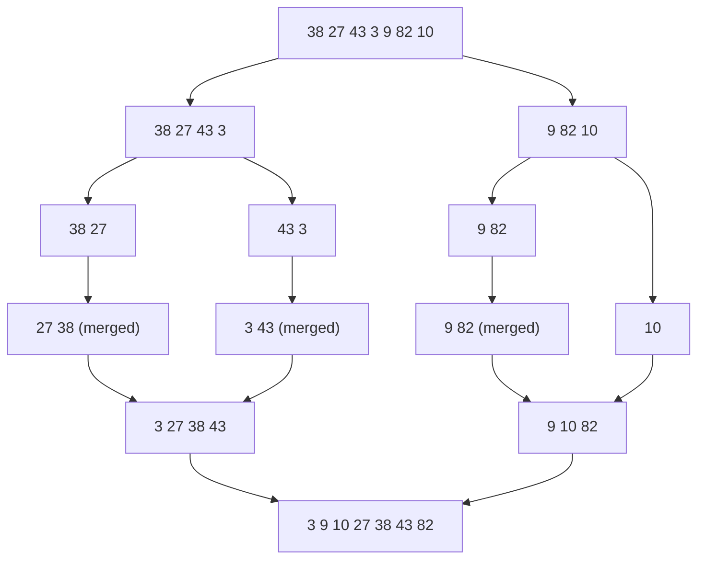

## Why Searching and Sorting?

Two of the most common tasks in computing are **finding** an item (a student by matric number, a product by code) and **ordering** items (results by score, names alphabetically). How you do them makes an enormous difference once there are thousands or millions of items.

One of this course's learning outcomes is to **apply divide-and-conquer to searching and sorting, iteratively or recursively**.

> **Divide and conquer:** **divide** a problem into smaller sub-problems of the same kind, **conquer** each (often recursively), and **combine** the results. Binary search, merge sort and quick sort all work this way.

### Measuring Efficiency: Big-O

We compare algorithms by **how their work grows** as the input size **n** grows, written in **Big-O notation**:

| Big-O | Name | n = 16 | n = 1,000 | n = 1,000,000 |
|---|---|---|---|---|
| **O(1)** | Constant | 1 | 1 | 1 |
| **O(log n)** | Logarithmic | 4 | 10 | 20 |
| **O(n)** | Linear | 16 | 1,000 | 1,000,000 |
| **O(n log n)** | Linearithmic | 64 | ≈10,000 | ≈20,000,000 |
| **O(n²)** | Quadratic | 256 | 1,000,000 | 1,000,000,000,000 |

(Approximate numbers of basic steps.) An O(n²) sort that's instant for 16 items needs **a trillion** steps for a million items; an O(n log n) sort needs about **20 million**.

---

## Linear Search

**Check each element in turn, from the first, until you find the target or run out of elements.**

```java
static int linearSearch(int[] a, int target) {
    for (int i = 0; i < a.length; i++) {
        if (a[i] == target) return i;       // found: return its index
    }
    return -1;                               // not found
}
```

- Works on **any** array — **sorted or not**.
- **Best case:** 1 comparison (target is first). **Worst case:** n comparisons (last or absent). **O(n)**.

**Recursive version** (base cases: ran off the end, or found):

```java
static int linearSearch(int[] a, int target, int i) {
    if (i == a.length) return -1;               // base case: not found
    if (a[i] == target) return i;               // base case: found
    return linearSearch(a, target, i + 1);      // search the rest
}
```

## Binary Search

**For a *sorted* array only.** Look at the **middle** element:
- if it's the target — **done**;
- if the target is **larger**, it can only be in the **right half**;
- if **smaller**, only in the **left half**.

Each comparison **halves** the part still to be searched — divide and conquer.

```java
static int binarySearch(int[] a, int target) {
    int low = 0, high = a.length - 1;
    while (low <= high) {
        int mid = (low + high) / 2;             // safer: low + (high - low) / 2
        if (a[mid] == target) return mid;
        else if (a[mid] < target) low = mid + 1;   // search right half
        else high = mid - 1;                       // search left half
    }
    return -1;                                   // low > high: not present
}
```

**Recursive version:**

```java
static int binarySearch(int[] a, int target, int low, int high) {
    if (low > high) return -1;                          // base case: empty range
    int mid = (low + high) / 2;
    if (a[mid] == target) return mid;                   // base case: found
    if (a[mid] < target) return binarySearch(a, target, mid + 1, high);
    return binarySearch(a, target, low, mid - 1);
}
```

**Worked example:** find **63** in `{3, 8, 12, 17, 21, 26, 30, 34, 39, 45, 52, 58, 63, 71, 77, 84}` (indexes 0–15):

| Step | low | high | mid | a[mid] | Decision |
|---|---|---|---|---|---|
| 1 | 0 | 15 | 7 | 34 | 34 < 63 → low = 8 |
| 2 | 8 | 15 | 11 | 58 | 58 < 63 → low = 12 |
| 3 | 12 | 15 | 13 | 71 | 71 > 63 → high = 12 |
| 4 | 12 | 12 | 12 | **63** | **found at index 12** |

**4 comparisons** — linear search would need **13**. For a million sorted items, binary search needs at most **20**. It's **O(log n)**.

**Try both on the same array.** Search for 63, then 3, then a missing value like 50, and compare the comparison counts:

<SearchVisualizer />

| | Linear search | Binary search |
|---|---|---|
| Requires sorted data? | **No** | **Yes** |
| Approach | Check one by one | Halve the range each step (divide and conquer) |
| Worst case | **O(n)** | **O(log n)** |
| Best for | Small or unsorted data; searching once | Large sorted data searched many times |

<ExamTip>
Binary search on an **unsorted** array gives **wrong answers** — it may miss an element that's there. If data is searched only once, sorting first (O(n log n)) costs more than a single linear search (O(n)); sorting pays off when you'll search **many** times.
</ExamTip>

---

## Simple Sorts: Bubble, Selection and Insertion

These three are **iterative** and easy to understand, but **O(n²)** — fine for small arrays, too slow for large ones.

<Tabs>
<Tab label="Bubble sort">

### Bubble Sort

**Repeatedly compare neighbouring elements and swap them if they're out of order.** After each **pass**, the largest remaining value has "bubbled" to the end.

```java
static void bubbleSort(int[] a) {
    int n = a.length;
    for (int i = 0; i < n - 1; i++) {           // pass i
        boolean swapped = false;
        for (int j = 0; j < n - 1 - i; j++) {   // the last i elements are already in place
            if (a[j] > a[j + 1]) {
                int temp = a[j];                 // swap using a temporary variable
                a[j] = a[j + 1];
                a[j + 1] = temp;
                swapped = true;
            }
        }
        if (!swapped) break;                     // no swaps: already sorted, stop early
    }
}
```

</Tab>
<Tab label="Selection sort">

### Selection Sort

**Find the smallest remaining element and swap it into the next position.** Makes at most **n − 1 swaps** — useful when swapping is expensive.

```java
static void selectionSort(int[] a) {
    for (int i = 0; i < a.length - 1; i++) {
        int min = i;
        for (int j = i + 1; j < a.length; j++) {
            if (a[j] < a[min]) min = j;          // remember the smallest so far
        }
        int temp = a[i];                         // swap it into position i
        a[i] = a[min];
        a[min] = temp;
    }
}
```

</Tab>
<Tab label="Insertion sort">

### Insertion Sort

**Take each element and insert it into its correct place among the already-sorted elements to its left** — like arranging playing cards in your hand. Very fast on **nearly sorted** data.

```java
static void insertionSort(int[] a) {
    for (int i = 1; i < a.length; i++) {
        int key = a[i];
        int j = i - 1;
        while (j >= 0 && a[j] > key) {           // shift larger elements right
            a[j + 1] = a[j];
            j--;
        }
        a[j + 1] = key;                          // drop the key into the gap
    }
}
```

</Tab>
</Tabs>

### Tracing Bubble Sort

<CodeTrace title="Bubble sort on [5, 1, 4, 2]">

```java
static void bubbleSort(int[] a) {
    int n = a.length;
    for (int i = 0; i < n - 1; i++) {
        boolean swapped = false;
        for (int j = 0; j < n - 1 - i; j++) {
            if (a[j] > a[j + 1]) {
                int temp = a[j];
                a[j] = a[j + 1];
                a[j + 1] = temp;
                swapped = true;
            }
        }
        if (!swapped) break;
    }
}
```

```trace
2 | a=[5; 1; 4; 2], n=4 | | bubbleSort | Four elements, so at most 3 passes.
4 | a=[5; 1; 4; 2], i=0, swapped=false | | bubbleSort | Pass 1.
6 | a=[5; 1; 4; 2], i=0, j=0, swapped=false | | bubbleSort | Compare a[0] = 5 and a[1] = 1: 5 > 1.
10 | a=[1; 5; 4; 2], i=0, j=0, swapped=true | | bubbleSort | Swapped (via temp).
6 | a=[1; 5; 4; 2], i=0, j=1, swapped=true | | bubbleSort | Compare 5 and 4: 5 > 4.
10 | a=[1; 4; 5; 2], i=0, j=1, swapped=true | | bubbleSort | Swapped.
6 | a=[1; 4; 5; 2], i=0, j=2, swapped=true | | bubbleSort | Compare 5 and 2: 5 > 2.
10 | a=[1; 4; 2; 5], i=0, j=2, swapped=true | | bubbleSort | Swapped. The largest value, 5, has bubbled to the end.
4 | a=[1; 4; 2; 5], i=1, swapped=false | | bubbleSort | Pass 2 — only positions 0–2 still need checking.
6 | a=[1; 4; 2; 5], i=1, j=0, swapped=false | | bubbleSort | Compare 1 and 4: in order, no swap.
6 | a=[1; 4; 2; 5], i=1, j=1, swapped=false | | bubbleSort | Compare 4 and 2: 4 > 2.
10 | a=[1; 2; 4; 5], i=1, j=1, swapped=true | | bubbleSort | Swapped. 4 is now in place.
4 | a=[1; 2; 4; 5], i=2, swapped=false | | bubbleSort | Pass 3.
6 | a=[1; 2; 4; 5], i=2, j=0, swapped=false | | bubbleSort | Compare 1 and 2: in order.
13 | a=[1; 2; 4; 5], i=2, swapped=false | | bubbleSort | No swaps in this pass → break. Sorted!
```

</CodeTrace>

---

## Recursive Sorts: Divide and Conquer

### Merge Sort

1. **Divide** the array into two halves.
2. **Conquer:** sort each half **recursively** (a single element is already sorted — the **base case**).
3. **Combine:** **merge** the two sorted halves into one sorted array.



```java
static void mergeSort(int[] a, int left, int right) {
    if (left >= right) return;                  // base case: 0 or 1 element
    int mid = (left + right) / 2;
    mergeSort(a, left, mid);                    // sort the left half
    mergeSort(a, mid + 1, right);               // sort the right half
    merge(a, left, mid, right);                 // combine them
}

static void merge(int[] a, int left, int mid, int right) {
    int[] temp = new int[right - left + 1];
    int i = left, j = mid + 1, k = 0;
    while (i <= mid && j <= right)              // take the smaller front element each time
        temp[k++] = (a[i] <= a[j]) ? a[i++] : a[j++];
    while (i <= mid) temp[k++] = a[i++];        // copy any leftovers
    while (j <= right) temp[k++] = a[j++];
    System.arraycopy(temp, 0, a, left, temp.length);
}
// call: mergeSort(a, 0, a.length - 1);
```

**Always O(n log n)**: the array is halved about log₂ n times, and each level of merging touches all n elements. The cost is an **extra array** for merging (O(n) memory).

### Quick Sort

1. Choose a **pivot** (here, the last element).
2. **Partition:** rearrange so everything **smaller than the pivot** is on its left and everything **larger** on its right — the pivot is now in its **final position**.
3. **Recursively** quick-sort the left part and the right part.

```java
static void quickSort(int[] a, int low, int high) {
    if (low < high) {                           // base case: 0 or 1 element does nothing
        int p = partition(a, low, high);
        quickSort(a, low, p - 1);
        quickSort(a, p + 1, high);
    }
}

static int partition(int[] a, int low, int high) {
    int pivot = a[high];
    int i = low - 1;                            // end of the "smaller than pivot" region
    for (int j = low; j < high; j++) {
        if (a[j] < pivot) {
            i++;
            int t = a[i]; a[i] = a[j]; a[j] = t;
        }
    }
    int t = a[i + 1]; a[i + 1] = a[high]; a[high] = t;   // put the pivot in place
    return i + 1;
}
// call: quickSort(a, 0, a.length - 1);
```

**Average O(n log n)** and usually the fastest in practice, sorting **in place** (no extra array). **Worst case O(n²)** — if the pivot is always the smallest or largest element (e.g. an already sorted array with the last element as pivot). Choosing a random or "median-of-three" pivot avoids this.

---

## Watch Them Work

Pick an algorithm and press **Play** or **Step**. Yellow bars are being **compared**, red bars were just **moved**, purple is quick sort's **pivot**, green bars are in their **final place**. In merge and quick sort, the faded bars are outside the part currently being worked on. Compare the **comparison counts** on the same array — then press **New array** and try again:

<SortVisualizer />

### Comparing the Algorithms

| Algorithm | Best | Average | Worst | Extra memory | Stable? | Approach |
|---|---|---|---|---|---|---|
| **Bubble** | O(n)* | O(n²) | O(n²) | O(1) | Yes | Iterative |
| **Selection** | O(n²) | O(n²) | O(n²) | O(1) | No | Iterative |
| **Insertion** | O(n) | O(n²) | O(n²) | O(1) | Yes | Iterative |
| **Merge** | O(n log n) | O(n log n) | O(n log n) | O(n) | Yes | Recursive, divide and conquer |
| **Quick** | O(n log n) | O(n log n) | O(n²) | O(log n) (recursion) | No | Recursive, divide and conquer |

\*With the early-exit check on an already sorted array. **Stable** means equal elements keep their original relative order — important when sorting records by one field after another (e.g. by department, then by name).

---

## Sorting with the Java API

You'll rarely write these algorithms in real projects — the Java API provides highly optimised versions:

```java
import java.util.*;

int[] scores = {72, 38, 55, 91, 64};
Arrays.sort(scores);                                   // [38, 55, 64, 72, 91]
int pos = Arrays.binarySearch(scores, 64);             // 2
int missing = Arrays.binarySearch(scores, 60);         // negative: -(insertion point) - 1 = -3

List<String> names = new ArrayList<>(List.of("Musa", "Ada", "Chioma"));
Collections.sort(names);                               // [Ada, Chioma, Musa]
```

For primitive arrays `Arrays.sort` uses a **dual-pivot quicksort**; for objects (and `Collections.sort`) it uses **TimSort**, a stable hybrid of merge sort and insertion sort.

### Sorting Your Own Objects: Comparable and Comparator

```java
class Student implements Comparable<Student> {
    String name;
    double cgpa;
    Student(String name, double cgpa) { this.name = name; this.cgpa = cgpa; }

    @Override
    public int compareTo(Student other) {          // "natural order": by name
        return this.name.compareTo(other.name);
    }
}

List<Student> list = new ArrayList<>();
list.add(new Student("Musa", 3.82));
list.add(new Student("Ada", 4.61));
list.add(new Student("Chioma", 4.05));

Collections.sort(list);                                        // by name: Ada, Chioma, Musa
list.sort(Comparator.comparingDouble((Student s) -> s.cgpa).reversed());   // by CGPA, highest first: Ada, Chioma, Musa
```

`compareTo` returns a **negative** number if `this` comes first, **zero** if equal, **positive** if `this` comes after. A **Comparator** defines any **other** ordering without changing the class.

---

## Check Your Understanding

<MCQ question="Binary search is run on the sorted array 2, 5, 9, 14, 20, 27, 33 (indexes 0–6) for the target 27. Which elements are compared, in order?">
<Option>2, 5, 9, 14, 20, 27</Option>
<Option correct>14, 27</Option>
<Option>14, 20, 27</Option>
<Option>20, 27</Option>
<Explain>
low = 0, high = 6 → mid = 3 → **14** < 27, so low = 4. mid = (4 + 6) / 2 = 5 → **27** — found. Two comparisons.
</Explain>
</MCQ>

<MCQ question="What is the array after the FIRST pass of bubble sort on 6, 2, 8, 1?">
<Option>1, 2, 6, 8</Option>
<Option correct>2, 6, 1, 8</Option>
<Option>2, 1, 6, 8</Option>
<Option>6, 2, 1, 8</Option>
<Explain>
Compare 6,2 → swap: 2, 6, 8, 1. Compare 6,8 → no swap. Compare 8,1 → swap: **2, 6, 1, 8**. After one pass only the **largest** value (8) is guaranteed to be in place.
</Explain>
</MCQ>

<MCQ question="Which sorting algorithm is O(n log n) even in the worst case?">
<Option>Quick sort</Option>
<Option correct>Merge sort</Option>
<Option>Insertion sort</Option>
<Option>Bubble sort</Option>
<Explain>
**Merge sort** always halves the array and merges in linear time: **O(n log n)** in every case. Quick sort averages O(n log n) but degrades to **O(n²)** with consistently bad pivots; insertion and bubble sort are O(n²) in the worst case.
</Explain>
</MCQ>

## Practice Questions

<Reveal question="Explain the divide-and-conquer strategy and how binary search uses it.">
Divide and conquer **splits a problem into smaller sub-problems of the same type, solves them (often recursively) and combines the results**. Binary search **divides** the sorted search range at the **middle**, **compares** the middle element with the target, and **discards the half that cannot contain it**, repeating on the remaining half until the target is found or the range is empty — O(log n).
</Reveal>

<Reveal question="Write a recursive binary search in Java and identify its base cases.">
```java
static int binarySearch(int[] a, int target, int low, int high) {
    if (low > high) return -1;                          // base case 1: range empty → not found
    int mid = (low + high) / 2;
    if (a[mid] == target) return mid;                   // base case 2: found
    if (a[mid] < target) return binarySearch(a, target, mid + 1, high);
    return binarySearch(a, target, low, mid - 1);
}
```
Each recursive call searches a range **about half as large**, so it always moves towards a base case.
</Reveal>

<Reveal question="Sort 64, 25, 12, 22, 11 using selection sort, showing the array after each pass.">
Pass 1: minimum 11 ↔ 64 → **11, 25, 12, 22, 64**. Pass 2: minimum of the rest is 12 ↔ 25 → **11, 12, 25, 22, 64**. Pass 3: minimum 22 ↔ 25 → **11, 12, 22, 25, 64**. Pass 4: 25 already in place → **11, 12, 22, 25, 64**. Sorted after n − 1 = 4 passes.
</Reveal>

<Reveal question="Compare merge sort and quick sort.">
Both are **recursive divide-and-conquer** sorts. **Merge sort** splits the array into halves, sorts them and **merges**; it's **O(n log n) in all cases** and **stable**, but needs an **extra O(n) array**. **Quick sort** **partitions** around a pivot so the pivot lands in its final place, then sorts each side; it sorts **in place** and is usually faster in practice (average **O(n log n)**), but has an **O(n²) worst case** with poor pivot choices and is **not stable**.
</Reveal>

<Takeaway>
**Divide and conquer** splits a problem, solves the parts (often recursively) and combines them. Efficiency is described with **Big-O**: O(1) < O(log n) < O(n) < O(n log n) < O(n²). **Linear search** checks each element — works on unsorted data, **O(n)**. **Binary search** needs **sorted** data and halves the range each step (low, mid, high) — **O(log n)**, iterative or recursive. **Bubble** (swap neighbours; early exit), **selection** (swap the minimum into place) and **insertion** (insert into the sorted left part) sort are simple, iterative and **O(n²)**. **Merge sort** (split, sort halves recursively, merge) is **O(n log n)** always, stable, extra memory. **Quick sort** (partition around a pivot, recurse) is **O(n log n)** on average, in place, **O(n²)** worst case. In practice use **`Arrays.sort`**, **`Collections.sort`**, **`Arrays.binarySearch`**, with **Comparable**/**Comparator** for objects.
</Takeaway>

## Exam Tips

**What lecturers test:**
- Linear vs binary search — algorithm, code, conditions (sorted!), complexity
- **Tracing** binary search (low/mid/high table) and a sort (array after each pass)
- Writing bubble/selection/insertion sort; describing merge and quick sort
- Iterative vs recursive versions; divide and conquer
- Big-O comparison table

**Common mistakes:**
- Running binary search on unsorted data
- Off-by-one errors: `j < n - 1 - i` in bubble sort, `low <= high` in binary search
- Forgetting the base case in recursive merge/quick sort

**Likely question:**
> "Explain the divide-and-conquer approach. Write an iterative and a recursive binary search in Java, and trace your algorithm searching for 45 in [3, 8, 12, 17, 21, 26, 30, 34, 39, 45]. Show the passes of bubble sort on [5, 1, 4, 2, 8] and state its time complexity." (25 marks)
