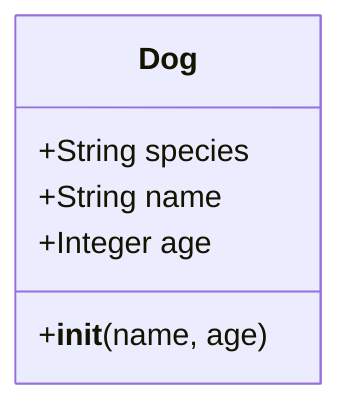

# Object-Oriented Programming: Define a Class

Before diving into Object-Oriented Programming (OOP), it helps to think about how we usually organize information in our code. Normally, if we want to represent something simple, we use primitive data types like integers, strings, or booleans. For instance, if you want to store a person's age, you just use an integer. 

But what if you need to represent something far more complex—like a complete `Employee`? An employee doesn't just have one piece of data. They have a name, an age, a job title, a salary, and a start date. If we try to store all this in a basic list (e.g., `["James", 34, "Captain"]`), we run into major problems. Lists don't tell us what each item means, and it's incredibly easy to make mistakes or accidentally mix up the order of the data.

This is where Object-Oriented Programming comes in to save the day. OOP is a programming paradigm that allows us to create our own custom, complex data types by bundling related data (properties) and behaviors (actions) into a single, cohesive unit. To create these custom data types, we use **Classes**.

## What is a Class?

Think of a class as a **blueprint** or a **template**. 

> **Real World Analogy:** Imagine an architect drawing the blueprints for a house. The blueprint itself isn't a physical house you can live in; you can't open its doors or sleep in its bedrooms. However, the blueprint defines exactly what the house will look like: it dictates that the house will have three bedrooms, two bathrooms, and a front porch. 

Similarly, a class in Python is just the blueprint. It dictates that every "Employee" will have a name, an age, and a salary, but the class itself doesn't hold the specific data for James or Sarah. It just sets the rules.

### Structure of a Class



In the diagram above, you can see the two main components of any class:
1. **Attributes (Data):** These are variables that belong to the class. They represent the "state" or the "properties" of the blueprint (like `species`, `name`, and `age`).
2. **Methods (Behaviors):** These are functions that belong to the class. They represent the "actions" that the blueprint can perform.

## Building Your First Class

Let's build a simple class step by step. We'll create a blueprint for a `Dog`. 

In Python, we define a class using the `class` keyword followed by the name of the class. By convention, class names are written in `PascalCase` (every word is capitalized, with no spaces or underscores).

### Worked Example 1: The Basic Blueprint

```python
# We use the class keyword to define our blueprint
class Dog:
    
    # This is a class attribute. It is shared by EVERY dog we ever create.
    # No matter what dog it is, its species is always "Canis familiaris".
    species = "Canis familiaris"

    # The __init__ method is a special function called a "constructor".
    # It initializes the specific data for an individual dog when it is created.
    def __init__(self, name, age):
        
        # 'self' refers to the specific dog being created right now.
        # Here, we take the 'name' passed in and attach it to the dog.
        self.name = name
        
        # We take the 'age' passed in and attach it to the dog.
        self.age = age
```

### Breaking Down the Magic

There's a lot happening in the code above. Let's explore the critical pieces:

#### 1. The `__init__` Method
The `__init__` method (short for initialize) is one of Python's special "dunder" (double underscore) methods. You can think of it as the setup crew. The absolute split-second a new dog is brought into existence from our blueprint, the `__init__` method runs automatically to set up its unique characteristics. 

#### 2. The `self` Parameter
You will notice that the first parameter of `__init__` (and almost all class methods) is `self`. `self` is a reference to the specific object that is currently being created or used. 

If we use our blueprint to create a dog named "Buddy", `self` represents Buddy. When the code says `self.name = name`, it is literally saying: *"Take the name provided, and attach it to Buddy's personal nametag."* 

#### 3. Class Attributes vs Instance Attributes
- **Class Attributes** (`species = "Canis familiaris"`): These are defined outside of the `__init__` method. They are universal truths for the class. Every dog is a *Canis familiaris*, so it saves memory and typing to define it once for the whole class.
- **Instance Attributes** (`self.name` and `self.age`): These are defined inside the `__init__` method. They are unique to the individual. Not every dog is named Buddy, and not every dog is 5 years old. These attributes vary from instance to instance.

### Worked Example 2: Adding a Bank Account Class

Let's solidify this with another example. We'll model a bank account.

```python
# Define the blueprint for a Bank Account
class BankAccount:
    
    # Class attribute: Every account starts with the same bank name
    bank_name = "Global Trust Bank"

    # The setup crew (constructor)
    def __init__(self, account_holder, initial_balance):
        
        # Attach the account holder's name to this specific account
        self.account_holder = account_holder
        
        # Attach the starting money to this specific account
        self.balance = initial_balance
```

This class perfectly illustrates the difference between class and instance attributes. The `bank_name` applies to everyone. But the `account_holder` and the `balance` are fiercely individual—you wouldn't want someone else having access to your balance!

## Key Takeaways
- **Classes** are blueprints for creating complex, custom data structures that bundle data and behavior.
- The `__init__` method is the constructor. It runs automatically to set up a new object's initial state.
- **`self`** is a mandatory first parameter in instance methods. It acts as a self-reference to the specific object currently being manipulated.
- **Class attributes** are shared universally across the class, while **instance attributes** are unique to the specific individual object.

## Exam Tips
- **Syntax Check:** Always remember the colons after the `class` declaration and method definitions, and ensure your indentation is perfect.
- **The Self Trap:** A very common exam trick is to show you a class method missing the `self` parameter and ask why it throws an error. Remember: instance methods *must* have `self` as their first parameter.
- **Naming Conventions:** If asked to identify a class versus a variable in a block of code, look at the capitalization. `CustomerAccount` is a class (PascalCase), while `customer_account` is a variable (snake_case).
