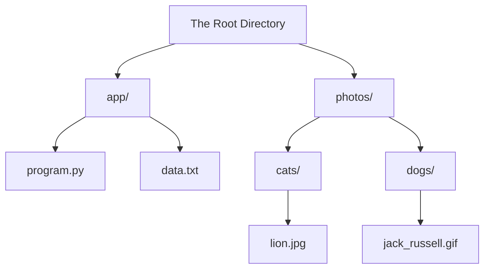

# Files and the File System

Up to this point in your programming journey, the data in your programs has likely been entirely fleeting. When you run a script, it might ask you for your name via an `input()` function, do some calculations, and print a result to the screen. The moment the program finishes running, all of that data evaporates. The next time you run it, it starts from scratch.

This is fine for simple calculators, but it's useless for real-world software. A video game needs to save your progress. A financial app needs to store your transaction history. To make data **persist** (survive after the program closes), we must save it to a physical storage device. We do this using **Files**.

## What Exactly is a File?

We interact with files every day—photos, Word documents, MP3s. But to a computer, a file isn't a picture or a song; a file is nothing more than a sequence of **bytes**. 

A byte is a single unit of data, represented as an integer between 0 and 255. When you save a file, the computer physically etches these sequences of numbers onto a hard drive or solid-state drive. 

> **Real World Analogy:** Imagine a file as a long string of morse code. To anyone looking at the dots and dashes, it's just noise. It only becomes a message if the person reading it knows the code book (how to translate it). Similarly, a computer file is just a string of numbers. It is the programmer's job to tell the computer *how* to translate those numbers—whether they should be read as text characters, pixel colors in an image, or audio waves.

Thankfully, Python handles the incredibly complex math of translating bytes into text automatically. But before Python can translate a file, it has to find it first. This is where the **File System** comes in.

## The File System Hierarchy

Your computer's **File System** is the invisible manager that organizes where data is physically stored on the hardware. It abstracts away the complex hardware communication and gives us a clean, organizational structure: the **Hierarchy**.

The file system organizes files into **directories** (which most people call folders). This hierarchy resembles an upside-down tree.

At the very top of the tree is the **Root Directory**. Every single file and folder on your computer lives somewhere beneath the root. 

## Understanding File Paths

If the file system is a city, a **File Path** is an exact street address. It is a string of text that lists the precise route from the root directory down to a specific file. 

If we want to find the `jack_russell.gif` from the diagram above, the path is:
`root/photos/dogs/jack_russell.gif`

### The Operating System Divide

As a programmer, there is a massive trap you must avoid: **Different Operating Systems write file paths differently.**

If you write a Python script that searches for a file on your Windows computer, and you send that script to a friend using a Mac, it will crash immediately. You must understand how the systems differ.

#### Mac and Linux (POSIX Systems)
Mac and Linux use a **virtual file system**. There is only one single root directory for the entire computer, represented by a forward slash `/`. 
Even if you plug in an external USB drive, it is mounted *under* that single root directory.

- **Path Separator:** Forward Slash (`/`)
- **Example Path:** `/Users/David/Documents/data.txt`

#### Windows
Windows does not have a single root. Instead, every physical drive connected to the computer gets its own root, represented by a **Drive Letter**. The main hard drive is usually `C:\`.

- **Path Separator:** Backslash (`\`)
- **Example Path:** `C:\Users\David\Documents\data.txt`

The backslash in Windows causes immense headaches for Python programmers, because in Python strings, the backslash is an "escape character" (like `\n` for a new line). Attempting to type a Windows path often causes syntax errors.

In the next topic, you will learn how Python solves this cross-platform nightmare using the `pathlib` module.

## Key Takeaways
- **Persistence:** Files allow programs to save data permanently, surviving past the execution of the script.
- **Bytes:** A file is fundamentally just a raw sequence of bytes (numbers 0-255). The programmer must decide how to translate them (e.g., as text or images).
- **The Hierarchy:** File systems organize data in an upside-down tree structure originating from a **Root Directory**.
- **The OS Divide:** Windows uses drive letters (`C:\`) and backslashes (`\`). Mac/Linux use a single root (`/`) and forward slashes (`/`).

## Exam Tips
- **Vocabulary Check:** Be prepared to define the difference between a Root Directory (the very top folder) and a File Path (the full address leading to a specific file).
- **Cross-Platform Awareness:** If an exam asks why a file script works on the developer's machine but crashes on a user's machine, the first suspect should always be hardcoded, OS-specific file paths (like writing `C:\folder\file.txt` in a script meant to run on a Mac).
