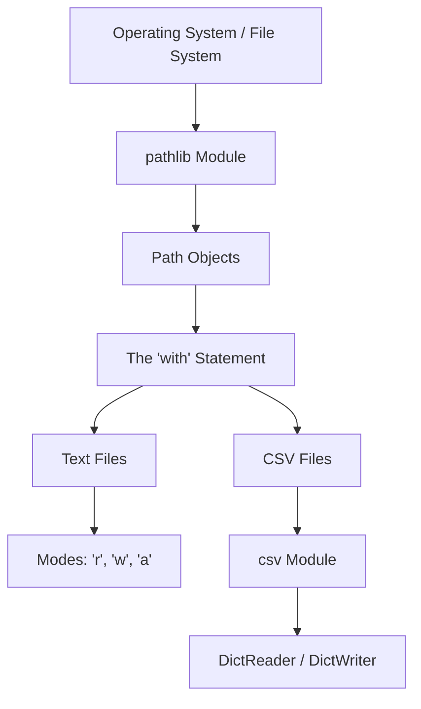

# Summary: File Input and Output (I/O)

In this final chapter, you transcended the boundaries of the script. By learning to interact with the file system, your applications can now interact with the outside world—persisting data, parsing datasets, and automating administrative workflows.

File I/O is a critical skill for any software engineer, data scientist, or systems administrator. 

## The File I/O Architecture Recap

To ensure these concepts are locked into memory, let's review the entire workflow of how Python interacts with physical storage.



### 1. Navigating the File System (`pathlib`)
Hardcoded strings like `"C:\folder"` are brittle and will crash on Mac/Linux. We use `pathlib.Path` objects to dynamically generate robust, cross-platform addresses.
- **Dynamic Locations:** Use `Path.cwd()` and `Path.home()`.
- **Operations:** Use `.mkdir()` and `.touch()` to build structure, and `.rglob()` to recursively search deep directories.

### 2. The Context Manager (`with`)
Never open a file directly. Always use the `with` statement block. This acts as an automated safety net that guarantees the file connection is closed the exact moment you are done with it, preventing memory leaks and file corruption.

### 3. Parsing Data (`csv`)
While you can write raw text to a `.txt` file using `.write()`, real-world data is structured. The `csv` module allows you to parse comma-separated spreadsheets effortlessly. Using `DictReader` transforms complex spreadsheet rows into easily manageable Python dictionaries.

## Capstone Example: A Logging System

Let's look at one final example of a professional, automated logging system that uses everything you've learned.

```python
import csv
from pathlib import Path
from datetime import datetime

def log_system_event(event_type, description):
    # 1. Setup dynamic paths
    log_dir = Path.cwd() / "logs"
    log_file = log_dir / "system_events.csv"
    
    # 2. Build infrastructure safely
    log_dir.mkdir(exist_ok=True)
    
    # 3. Determine if we need to write the header
    # If the file doesn't exist yet, we will need to write the header row.
    needs_header = not log_file.exists()
    
    # 4. Open safely in APPEND mode ("a") so we don't delete past logs
    with log_file.open("a", encoding="utf-8", newline="") as file:
        headers = ["timestamp", "event_type", "description"]
        writer = csv.DictWriter(file, fieldnames=headers)
        
        # Write header only on the first run
        if needs_header:
            writer.writeheader()
            
        # 5. Write the structured data
        event_data = {
            "timestamp": datetime.now().strftime("%Y-%m-%d %H:%M:%S"),
            "event_type": event_type,
            "description": description
        }
        writer.writerow(event_data)

# Test the system!
log_system_event("WARNING", "CPU temperature exceeding limits.")
log_system_event("INFO", "Backup completed successfully.")
```

If you run this script, it dynamically creates a `logs/` folder, safely initializes a CSV file, and gracefully appends structured data to it. This is professional-grade software engineering.

## Additional Resources

You now possess the foundational knowledge to read and write data in Python. To deepen your mastery, we highly recommend exploring:
- **The `json` Module:** While CSV is great for flat spreadsheets, JSON is the global standard for deeply nested data (like API responses). 
- **The `shutil` Module:** Explore this standard library module to learn how to copy files, compress folders into `.zip` archives, and delete complex directory trees.

### Key Takeaways
- **Persistence:** File I/O allows your applications to save state and interact with the real world.
- **Cross-Platform Safety:** Always use `pathlib`, always specify `encoding="utf-8"`, and always use `newline=""` when working with CSVs.
- **The Golden Rule:** Open. Read/Write. Close. (The `with` statement handles the closing automatically).

### Exam Tips
- The difference between `.read()` and `.readlines()` is highly tested. `.read()` returns a single massive string. `.readlines()` returns a list of strings, preserving the `\n` at the end of each line.
- Always remember that the `csv` module parses everything as text. Even if a CSV column contains `100`, Python reads it as `"100"`. You must cast to `int` or `float` if you intend to do mathematics.
