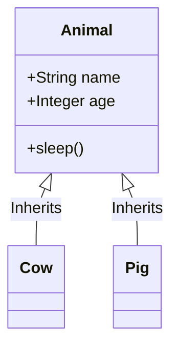

# Inherit From Other Classes

In the world of software engineering, one of our primary goals is **DRY**: *Don't Repeat Yourself*. If you find yourself writing the exact same code in multiple places, there is usually a better way to structure your program.

In Object-Oriented Programming, the most powerful tool for eliminating duplicate code is **Inheritance**. Inheritance allows a new class (the **Child Class**) to absorb, or inherit, all the attributes and methods of an existing class (the **Parent Class**). 

> **Real World Analogy:** Think of genetic inheritance. You inherit baseline traits from your parents—like eye color, height, and bone structure. However, you are not a perfect clone. You might dye your hair (overriding an inherited trait), or you might learn to play the guitar (extending your capabilities with a brand new behavior your parents don't possess). Class inheritance works exactly the same way.

## The Mechanics of Inheritance

Let's imagine we are building a simulation of a farm. We have cows, pigs, and chickens. All of these are animals. They all have names, ages, and the ability to sleep.

Without inheritance, we would have to write the `__init__` and `sleep` methods three separate times. With inheritance, we write the common logic once in a parent class, and the child classes get to use it for free.

### Worked Example 1: The Basic Hierarchy

```python
# 1. We define the Parent Class with the common denominator traits.
class Animal:
    def __init__(self, name, age):
        self.name = name
        self.age = age

    def sleep(self):
        return f"{self.name} is catching some Z's."

# 2. We define the Child Class. 
# We put the Parent Class name inside parentheses to establish inheritance.
class Cow(Animal):
    pass # 'pass' means we aren't adding anything new right now.

class Pig(Animal):
    pass
```



Even though `Cow` and `Pig` look completely empty, they are secretly full of functionality. Because they inherit from `Animal`, they can do everything an `Animal` can do.

```python
# We instantiate a Cow just like we would an Animal
bessie = Cow("Betsy", 5)

# Bessie has a name and can sleep, even though we never explicitly wrote that code in the Cow class!
print(bessie.name)    # Output: Betsy
print(bessie.sleep()) # Output: Betsy is catching some Z's.
```

## Overriding Parent Methods

Sometimes, a child class inherits a behavior from the parent, but the child wants to perform that behavior differently. We can achieve this by **overriding** the method. To override a method, you simply define a method in the child class with the exact same name as the method in the parent class.

### Worked Example 2: Customizing the Behaviors

Let's add a `speak` method to our `Animal` class, and then let the child classes decide how they specifically want to speak.

```python
class Animal:
    def __init__(self, name, age):
        self.name = name
        self.age = age

    def speak(self):
        return "The animal makes a generic noise."

class Cow(Animal):
    # This completely overrides the parent's speak method
    def speak(self):
        return f"{self.name} says MOO!"

class Pig(Animal):
    # This completely overrides the parent's speak method
    def speak(self):
        return f"{self.name} says OINK!"

generic_animal = Animal("Creature", 10)
bessie = Cow("Betsy", 5)

print(generic_animal.speak()) # Output: The animal makes a generic noise.
print(bessie.speak())         # Output: Betsy says MOO!
```

Because Python looks for methods in the child class first, it finds `Cow.speak()` and executes it, completely ignoring the generic `Animal.speak()` method.

## Using `super()`

Overriding is great, but sometimes we don't want to completely destroy the parent's logic—we just want to build on top of it. We can do this using the `super()` function. 

`super()` acts as a direct hotline to the parent class. It allows a child class to explicitly execute the parent's version of a method.

A very common use case for `super()` is when we want to add a new attribute to a child class's `__init__` method, but we still want the parent class to handle the heavy lifting of the shared attributes.

### Worked Example 3: Extending the Constructor

Let's say a `Pig` needs an extra attribute called `mud_level`, which tracks how dirty the pig is.

```python
class Animal:
    def __init__(self, name, age):
        # The parent handles the shared attributes
        self.name = name
        self.age = age

class Pig(Animal):
    # We define a new __init__ that accepts name, age, AND mud_level
    def __init__(self, name, age, mud_level):
        
        # Instead of manually setting self.name and self.age, 
        # we hand those off to the parent class using super()!
        super().__init__(name, age)
        
        # Now we handle the Pig-specific attribute
        self.mud_level = mud_level

porky = Pig("Porky", 3, "Very Dirty")

print(porky.name)      # Handled by Animal: Porky
print(porky.mud_level) # Handled by Pig: Very Dirty
```

By using `super().__init__(name, age)`, the `Pig` class passes the buck to `Animal`, ensuring that if `Animal` ever changes how it handles names and ages, `Pig` will automatically inherit the update. It is the pinnacle of clean, maintainable architecture.

## Checking Types

When using inheritance, it's often useful to check what kind of object you are dealing with. 

- `type(object)` tells you the exact, specific class of an object.
- `isinstance(object, Class)` tells you if the object is an instance of a class, **OR** an instance of any of its parent classes.

```python
bessie = Cow("Betsy", 5)

# type checks for exact matches
print(type(bessie) == Cow)    # True
print(type(bessie) == Animal) # False! Her exact type is Cow, not Animal.

# isinstance checks the whole family tree
print(isinstance(bessie, Cow))    # True
print(isinstance(bessie, Animal)) # True! A Cow is a type of Animal.
```

## Key Takeaways
- **Inheritance** allows a child class to absorb the attributes and methods of a parent class, promoting code reuse (DRY).
- Define inheritance by placing the parent class inside parentheses: `class Child(Parent):`.
- **Overriding** occurs when a child class implements a method with the same name as the parent class, replacing the parent's logic.
- **`super()`** gives the child class a way to call the parent's methods, allowing the child to build upon existing logic rather than rewriting it.
- `isinstance()` is the preferred way to check an object's type, as it respects the inheritance hierarchy.

## Exam Tips
- **The `super()` syntax:** Be very careful with syntax in exams. `super().__init__(args)` requires parentheses after `super`, and you do *not* pass `self` into the parent's `__init__`.
- If an exam asks how to prevent duplicate code across three similar classes, the answer is to abstract the commonalities into a parent class and use inheritance.
- Remember that changes to a parent class automatically cascade down to all child classes (unless the child has overridden the behavior).
