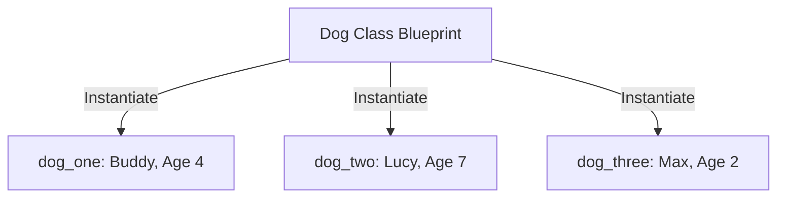

# Instantiate an Object

In the previous topic, we established that a **Class** is merely a blueprint. A blueprint of a house cannot shelter you from the rain, just as a `Dog` class cannot bark. To actually use the blueprint, we have to build the house. In programming, building the house from the blueprint is called **instantiation**.

When you instantiate a class, you create a tangible, usable entity in your computer's memory based on the rules defined in the class. This tangible entity is called an **Object** or an **Instance**.

> **Real World Analogy:** If the class is the recipe for a chocolate chip cookie, the **instance** is the physical, warm cookie that you pull out of the oven. You can use the same recipe (class) to bake fifty different cookies (instances). They all follow the same rules, but they are individual cookies. If you take a bite out of one cookie, the others remain whole.

## How to Create an Instance

To create an object from a class, you type the class name followed by parentheses. If the class's `__init__` method requires arguments, you place them inside the parentheses.

### Worked Example 1: Instantiating Dogs

Let's bring back our `Dog` blueprint and bake some cookies—or rather, spawn some dogs!

```python
# The Blueprint
class Dog:
    species = "Canis familiaris"

    def __init__(self, name, age):
        # Attach the given name and age to the specific dog being created
        self.name = name
        self.age = age

# -----------------------------------------
# The Instantiation (Building the objects)
# -----------------------------------------

# We call the class name and pass in the required arguments (name and age).
# Note: We NEVER pass 'self'. Python handles 'self' automatically in the background.
dog_one = Dog("Buddy", 4)
dog_two = Dog("Lucy", 7)
```

We have now created two completely distinct objects in memory. `dog_one` is a 4-year-old dog named Buddy, and `dog_two` is a 7-year-old dog named Lucy.



### Memory Addresses and Uniqueness

If you create two identical dogs, are they the same dog?

```python
a = Dog("Rex", 3)
b = Dog("Rex", 3)

print(a == b) # This will print False!
```

Even though `a` and `b` have the exact same attributes, they are physically different objects occupying different spaces in the computer's memory. Just like if you have two identical Honda Civics parked next to each other—they look the same, but they have different VIN numbers. They are two distinct cars.

## Accessing and Modifying Attributes

Once you have an active instance, you can look at its data or change it using **dot notation**. Dot notation is literally typing the object's variable name, a period (`.`), and the attribute you want to access.

### Worked Example 2: Managing Bank Accounts

Let's look at how we manipulate an object's state dynamically after it has been created.

```python
class BankAccount:
    def __init__(self, account_holder, initial_balance):
        self.account_holder = account_holder
        self.balance = initial_balance

# 1. Instantiate the object
my_account = BankAccount("Alice", 1000)

# 2. Access attributes using dot notation
print(my_account.account_holder) # Output: Alice
print(my_account.balance)        # Output: 1000

# 3. Modify attributes dynamically using dot notation
# Alice deposits $500
my_account.balance = my_account.balance + 500

print(my_account.balance)        # Output: 1500
```

Because objects are **mutable**, we can reach directly inside them and change their properties at any time.

## Adding Behaviors (Instance Methods)

Objects shouldn't just hold data; they should be able to *do* things with that data. We give objects behaviors by defining **Instance Methods** inside the class. 

An instance method is just a function that belongs to an object. Like the `__init__` constructor, the first parameter of any instance method must be `self`.

```python
class Dog:
    def __init__(self, name, age):
        self.name = name
        self.age = age

    # An instance method defining a behavior
    def speak(self, sound):
        # We use 'self.name' to access the specific dog's name
        return f"{self.name} barks: {sound}!"

# Instantiate the dog
my_dog = Dog("Charlie", 5)

# Call the instance method using dot notation
# We pass "Woof", but we do NOT pass 'self'.
result = my_dog.speak("Woof") 
print(result) # Output: Charlie barks: Woof!
```

When you call `my_dog.speak("Woof")`, Python secretly translates this behind the scenes to `Dog.speak(my_dog, "Woof")`. This is why the `self` parameter is absolutely mandatory in the definition—it's how the method knows *which* dog is doing the barking!

## Dunder Methods (Magic Methods)

If you try to simply print an object, Python gives you a very ugly, unhelpful string indicating the object's location in memory (e.g., `<__main__.Dog object at 0x106702d30>`). 

To fix this, we use a special **dunder** (double underscore) method called `__str__`. If you define `__str__` in your class, Python will automatically execute it whenever you try to convert the object to a string (like when you use `print()`).

```python
class Dog:
    def __init__(self, name, age):
        self.name = name
        self.age = age

    # This magic method controls what happens when we print the object
    def __str__(self):
        return f"A dog named {self.name} who is {self.age} years old."

my_dog = Dog("Charlie", 5)

# Now, printing the object gives us a beautiful, readable string!
print(my_dog) # Output: A dog named Charlie who is 5 years old.
```

## Key Takeaways
- **Instantiation** is the act of creating a living, breathing object from a static class blueprint.
- We interact with objects (accessing attributes and calling methods) using **dot notation** (`object.attribute`).
- Objects are **mutable**; their internal state can be changed at any point during the program.
- **Instance methods** give objects behavior. They must always accept `self` as their first parameter.
- The `__str__` **dunder method** is used to define a human-readable string representation of the object.

## Exam Tips
- **The Implicit Self:** A classic exam question will ask you what arguments to pass when calling `my_obj.my_method(x, y)`. The answer is you only pass `x` and `y`. Python passes `self` implicitly.
- **Dot Notation:** Be intimately familiar with reading and writing dot notation. If a question asks how to update a user's email, the answer will look like `user_object.email = "new@email.com"`.
- **Identity vs Equality:** Remember that two separate instantiations are two distinct objects in memory, even if their data is identical. `Dog("A", 1) == Dog("A", 1)` evaluates to `False`.
