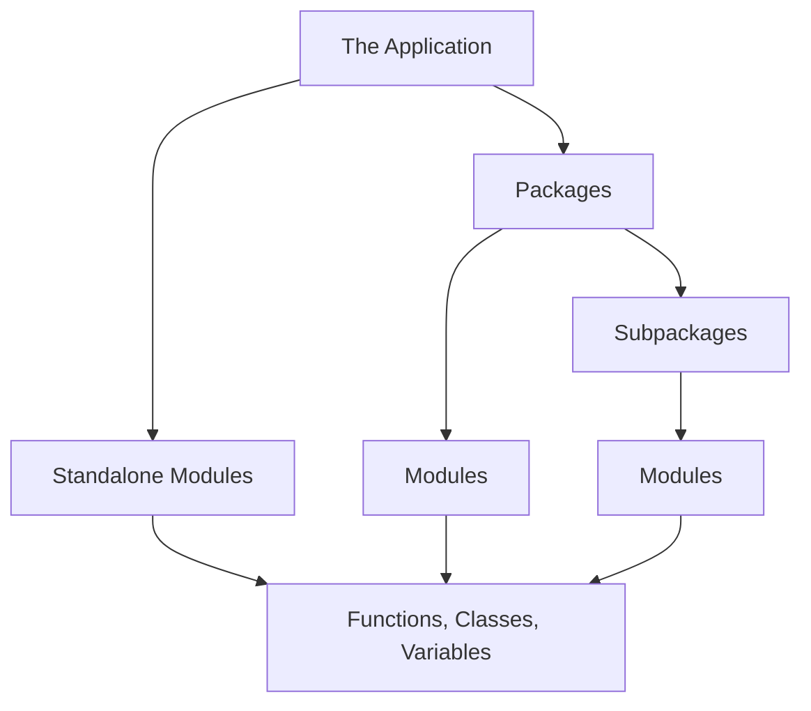

# Summary: Modules and Packages

As software projects expand beyond simple scripts, organization becomes the difference between a successful application and a chaotic, unmaintainable mess. In the last few topics, you learned how to architect your codebase for scale using Modules and Packages.

By mastering these concepts, you have learned how to write code that is modular, reusable, and isolated from unexpected bugs.

## The Architectural Hierarchy Recap

To solidify how these concepts stack together, review the hierarchical flow below:



### 1. Modules (The Files)
A **Module** is a single `.py` file. It solves one specific problem. 
- **Benefits:** They keep files short, making bugs easier to find. They allow you to reuse code across different projects. They create isolated **Namespaces**, ensuring your variables don't overwrite each other.
- **Importing:** Use `import my_module`, then access logic via `my_module.my_function()`.

### 2. Packages (The Folders)
A **Package** is a directory that contains multiple modules. 
- **Requirement:** It should contain an `__init__.py` file so Python recognizes it as a structured package rather than a random computer folder.
- **Importing:** Use dotted syntax to navigate the folders. `from my_package import my_module`.

## Capstone Example: A Real-World Project Structure

Let's look at how a real-world web application might organize its files using modules and packages, and how they would interact.

```text
ecommerce_project/
├── main.py
├── database.py
└── payments/
    ├── __init__.py
    ├── credit_card.py
    └── paypal.py
```

If we are writing the logic for `main.py` to process a user's checkout, we would utilize imports to pull the necessary logic from our structured files:

```python
# main.py

# Importing a standalone module in the same directory
import database

# Importing specific modules from a package
from payments import credit_card
from payments import paypal

def process_checkout(user_data, payment_method):
    # Using the database module
    database.save_user_order(user_data)
    
    # Branching logic using the imported package modules
    if payment_method == "card":
        credit_card.charge(user_data['amount'])
    elif payment_method == "paypal":
        paypal.redirect_to_portal(user_data['amount'])

print("Checkout system ready.")
```

Notice how `main.py` is incredibly short, clean, and readable. All the heavy lifting (database connection logic, API communication with PayPal) is hidden away in their respective modules. This is the true power of modular programming.

## Additional Resources

You now understand the mechanics of importing and structuring code. To take your skills to the professional level, consider researching:
- **Absolute vs. Relative Imports:** Learning how to use `.` and `..` to import modules relative to the current file's location.
- **The Python Standard Library:** Python comes with hundreds of built-in modules (like `math`, `datetime`, `os`, and `random`). Exploring these will save you from reinventing the wheel.

### Key Takeaways
- **Scale Requires Structure:** You cannot build large applications in a single file. Modules and packages are mandatory for professional software engineering.
- **Namespaces Protect Code:** By keeping logic inside imported modules, you prevent accidental variable collisions.
- **Readability:** Using `from X import Y` strikes the best balance between namespace safety and code readability.

### Exam Tips
- When asked how to resolve a `NameError` on an imported function, check if the student used the correct dot notation (e.g., they wrote `add()` instead of `math_tools.add()`).
- Always remember the hierarchy: A Package contains Modules. A Module contains Code. An `__init__.py` file is what separates a Package from a standard folder.
