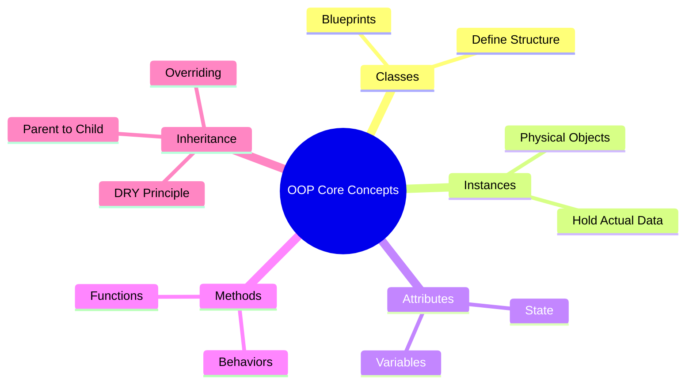

# Summary: Object-Oriented Programming

Over the past few topics, you have transitioned from procedural programming (writing lists of instructions) into **Object-Oriented Programming (OOP)**. This is a massive leap in how you think about software architecture.

OOP is the backbone of modern software engineering. Instead of thinking about programs as a sequence of functions passing primitive data around, OOP teaches you to think of programs as a collection of interacting, intelligent entities called **Objects**.

## The Core Pillars Recap

To ensure these concepts are deeply ingrained, let's review the fundamental architecture of OOP.



### 1. Classes vs. Instances
A **Class** is the static blueprint. It defines what properties and actions an entity *should* have. An **Instance** (or Object) is the actual, tangible realization of that blueprint in the computer's memory. You can bake 1,000 cookies (instances) from a single recipe (class).

### 2. State and Behavior
Objects are powerful because they encapsulate both **State** and **Behavior**.
- **State (Attributes):** The data the object holds. (e.g., A bank account's balance).
- **Behavior (Methods):** The actions the object can perform. (e.g., A bank account's ability to deposit or withdraw funds).

### 3. Inheritance
Inheritance allows us to define universal truths in a **Parent Class** and pass them down to specialized **Child Classes**. This drastically reduces code duplication. If we need to change how a universal behavior works, we change it once in the parent, and the update cascades to every child automatically.

## Capstone Example: Putting It All Together

Let's look at one final, comprehensive example that utilizes everything you've learned.

```python
# 1. The Parent Class
class Vehicle:
    def __init__(self, make, model):
        self.make = make    # State
        self.model = model  # State
        self.is_running = False

    def start_engine(self): # Behavior
        self.is_running = True
        return f"The {self.make} {self.model}'s engine rumbles to life."

# 2. The Child Class (Inheritance)
class ElectricCar(Vehicle):
    def __init__(self, make, model, battery_capacity):
        # 3. Using super() to call the parent constructor
        super().__init__(make, model)
        self.battery_capacity = battery_capacity

    # 4. Overriding a parent method
    def start_engine(self):
        self.is_running = True
        return f"The {self.make} {self.model} powers on silently."

# 5. Instantiation
my_tesla = ElectricCar("Tesla", "Model 3", "82 kWh")

# 6. Interaction via dot notation
print(my_tesla.battery_capacity) # Output: 82 kWh
print(my_tesla.start_engine())   # Output: The Tesla Model 3 powers on silently.
```

## Additional Resources

You now possess the foundational knowledge to read and write OOP Python. To deepen your mastery, we highly recommend exploring:
- **Python's Official Documentation on Classes:** To understand the deepest mechanics of memory management.
- **Advanced Dunder Methods:** Research methods like `__eq__` (for comparing objects) or `__add__` (for combining objects).

### Key Takeaways
- OOP models software around real-world entities, bundling data (attributes) and logic (methods) together.
- Mastery of `self` and dot notation is mandatory for interacting with objects.
- Inheritance and `super()` are your primary tools for writing clean, DRY (Don't Repeat Yourself) code.

### Exam Tips
- Whenever you are asked to design a system, always start by listing out the Nouns (which become your Classes/Attributes) and the Verbs (which become your Methods).
- Be prepared to trace the execution of an overridden method. Always remember: Python checks the Child class for a method first; if it isn't there, it checks the Parent.
