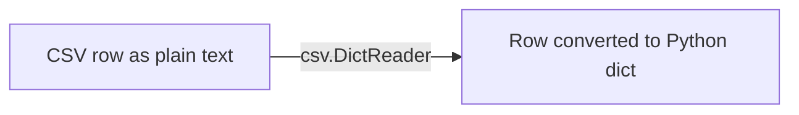

# Read and Write CSV Data

Plain text files (`.txt`) are great for storing raw paragraphs, like a diary entry or an error log. But in the real world of software engineering, data is usually highly structured. We have spreadsheets filled with rows and columns of users, financial transactions, and inventory.

To store tabular, spreadsheet-style data in a plain text file, the software industry uses a format called **CSV (Comma-Separated Values)**. 

## What is a CSV File?

A CSV file is a text file where each line represents a single "row" of a spreadsheet, and the "columns" are separated by commas.

If you had a spreadsheet of employees, the underlying CSV text would look exactly like this:

```text
Name,Department,Salary
Alice,Engineering,85000
Bob,Sales,62000
Charlie,HR,55000
```

> **Real World Analogy:** Think of a CSV file as a cheap, flat-pack bookshelf from IKEA. It doesn't look like a bookshelf when it's in the box (it's just text separated by commas). But because the pieces are cut precisely and separated by cardboard dividers (the commas), it is incredibly easy for you to unpack it and assemble it into a beautiful, structured shelf (a Python dictionary or list).

Technically, you could read a CSV file using standard `.read()` and `.split(",")` string methods. But managing the commas, stripping out whitespace, and ignoring commas that might be inside a person's name (e.g., "Smith, John") is a nightmare. 

Instead, Python provides a built-in `csv` module that handles all the heavy lifting.

## Reading Simple CSV Files

To interact with CSV data, we must first `import csv`. 

If our CSV file does *not* have a header row (e.g., just a list of raw temperatures like `68, 70, 72`), we use `csv.reader`.

```python
import csv
from pathlib import Path

csv_path = Path("temperatures.csv")

# We open the file normally
with csv_path.open(mode="r", encoding="utf-8", newline="") as file:
    
    # We hand the raw file to the csv.reader
    # The reader parses the commas and returns a list for every row!
    reader_object = csv.reader(file)
    
    for row in reader_object:
        print(row) 
        # Output: ['68', '70', '72']
```

> **CRITICAL RULE:** Whenever you open a file to use with the `csv` module, you **must** pass `newline=""` to the `.open()` method. If you forget this on a Windows machine, the `csv` module and Windows will fight over how to handle line-breaks, resulting in double-spaced or corrupted output files.

## Reading Complex CSV Files (DictReader)

If your CSV file *does* have a header row (like our Employee example: `Name,Department,Salary`), using the basic `csv.reader` is annoying because you have to remember that `row[0]` is the name, and `row[2]` is the salary.

Instead, we use the incredibly powerful `csv.DictReader`. It reads the first line of the file, realizes those are column headers, and converts every subsequent row into a Python **Dictionary**!



### Worked Example 1: Reading Employee Data

```python
import csv
from pathlib import Path

employee_path = Path("employees.csv")

with employee_path.open(mode="r", encoding="utf-8", newline="") as file:
    
    # DictReader automatically uses the first row as the Dictionary Keys!
    reader = csv.DictReader(file)
    
    for row in reader:
        # We can access data using the column names! Much easier to read.
        name = row["Name"]
        salary = row["Salary"]
        print(f"{name} makes ${salary}")
```

**Data Type Warning:** The CSV module is a text parser. It does not know if `85000` is a number or a word. It will ALWAYS return strings. If you want to do math on the salary, you must manually convert it: `int(row["Salary"])`.

## Writing Complex CSV Files (DictWriter)

Writing structured data out to a file is just as easy using `csv.DictWriter`. You provide a list of dictionaries, tell it what the column headers should be, and it handles the commas and formatting automatically.

### Worked Example 2: Saving User Data

Let's say we have a list of new users that we need to save to a database file.

```python
import csv
from pathlib import Path

# Our structured data
new_users = [
    {"username": "cool_guy_99", "score": 150},
    {"username": "gamer_girl", "score": 300}
]

output_path = Path("high_scores.csv")

with output_path.open(mode="w", encoding="utf-8", newline="") as file:
    
    # 1. We setup the DictWriter, and we MUST tell it what the column names are.
    headers = ["username", "score"]
    writer = csv.DictWriter(file, fieldnames=headers)
    
    # 2. We command the writer to write the header row at the top of the file
    writer.writeheader()
    
    # 3. We command the writer to dump all our dictionary data into the file
    writer.writerows(new_users)
```

The resulting `high_scores.csv` file will perfectly formatted:
```text
username,score
cool_guy_99,150
gamer_girl,300
```

## Key Takeaways
- **CSV (Comma-Separated Values)** is the global standard for storing tabular spreadsheet data in plain text.
- The built-in `csv` module parses commas and quotes perfectly, saving you from writing brittle string manipulation code.
- Always include `newline=""` in your `.open()` method when using the `csv` module to prevent platform-specific formatting corruption.
- Use `csv.DictReader` and `csv.DictWriter` to process spreadsheet rows as Python Dictionaries, allowing you to access data via column names rather than list indexes.

## Exam Tips
- **The String Trap:** If an exam question shows a script that reads a CSV and attempts to calculate the sum of a column (`total = total + row["Salary"]`), the script will crash. Remember that `DictReader` returns **strings**. You must cast to an integer or float first.
- **Header Order:** When creating a `DictWriter`, the `fieldnames` list determines the left-to-right order of the columns in the final file. You must supply this argument, or the writer won't know how to format the data.
