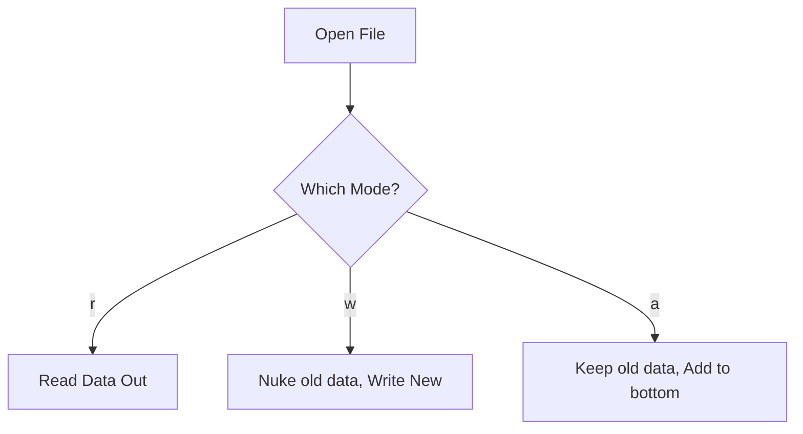

# Reading and Writing Files

In the previous topics, we learned how to interact with the file system—navigating folders, searching for files, and creating empty files. But an empty file isn't very useful. In this topic, we will learn how to open a file up, pour data into it, and read data out of it. 

We will specifically focus on **Text Files** (files that contain plain text, often ending in `.txt`). 

## The Three Steps of File Interaction

Whenever you want to interact with the contents of a file, you must follow a strict three-step process. 

> **Real World Analogy:** Think of reading a file like reading a locked diary. 
> 1. First, you must unlock and **Open** the diary.
> 2. Second, you **Read** the pages or **Write** new entries.
> 3. Third, you must lock and **Close** the diary so the secrets are safe and no one else accidentally writes in it.

If you forget step 3 and leave the file open, your program can lock up system resources, cause memory leaks, or accidentally corrupt the file.

### Worked Example 1: The Manual Way

Let's look at how to perform the three steps manually.

```python
from pathlib import Path

# Step 0: Set up the path
my_path = Path("C:/data/log.txt")

# Step 1: Open the file. 
# "w" stands for "Write Mode". It prepares the file to receive text.
file_object = my_path.open(mode="w", encoding="utf-8")

# Step 2: Write to the file.
file_object.write("Hello, World!")

# Step 3: CLOSE the file! (Critical)
file_object.close()
```

### The Magic of the `with` Statement

Humans are forgetful. Programmers often forget to type `file_object.close()`, which leads to crashed servers and corrupted data. Furthermore, if the program crashes during Step 2, Step 3 will never execute, leaving the file locked open forever.

To solve this, Python gives us the **Context Manager**, built using the `with` statement. The `with` statement automatically handles Step 1 and Step 3 for us. It guarantees that the file will be closed the exact millisecond the block of code finishes—even if the program crashes!

### Worked Example 2: The Pythonic Way (`with` statement)

You should **always** use the `with` statement when opening files.

```python
from pathlib import Path

my_path = Path("C:/data/log.txt")

# We open the file and assign the connection to the variable 'my_file'
with my_path.open(mode="r", encoding="utf-8") as my_file:
    # Inside this indented block, the file is open and ready.
    # "r" stands for "Read Mode". We suck the text out of the file.
    contents = my_file.read()
    print(contents)

# Once we un-indent, Python AUTOMATICALLY closes the file for us!
print("File reading complete and safely closed.")
```

## Opening Modes

When you open a file, you must declare your intentions. Are you reading? Are you writing? You do this by passing a single letter to the `mode` parameter.

| Mode | Name | Description | Warning |
| :--- | :--- | :--- | :--- |
| `"r"` | **Read** | Extracts data from the file. | Will crash if the file does not exist. |
| `"w"` | **Write** | Pours data into the file. | **DESTROYS** any existing data in the file before writing! |
| `"a"` | **Append** | Adds data to the end of the file. | Safe! Keeps existing data intact. |



## Reading Methods

When reading a file (`mode="r"`), you have a few options for how you want to extract the text.

1. **`.read()`**: Sucks out the entire file as one massive, single string. Great for small files.
2. **`.readlines()`**: Reads the file line-by-line, returning a Python List where each item is a line of text. Great if you need to loop over records.

```python
with my_path.open(mode="r", encoding="utf-8") as file:
    # Returns a list: ["Line 1\n", "Line 2\n"]
    lines = file.readlines() 
    
    for line in lines:
        print(line)
```

## Writing Methods

When writing (`mode="w"`) or appending (`mode="a"`), you also have options.

1. **`.write("text")`**: Writes a single string into the file.
2. **`.writelines(list)`**: Takes a list of strings, and writes them all into the file. 

*Warning: `.writelines()` does NOT automatically add new lines. You must manually include `\n` at the end of your strings if you want them on separate lines!*

```python
new_data = ["Line 1\n", "Line 2\n", "Line 3\n"]

# We use "a" to append, so we don't destroy whatever is already there
with my_path.open(mode="a", encoding="utf-8") as file:
    file.writelines(new_data)
```

## The Encoding Parameter

You probably noticed `encoding="utf-8"` in every example. As discussed in the previous topic, files are just numbers. An **Encoding** is the translation dictionary that tells Python how to turn those numbers back into letters. 

`UTF-8` is the global standard for text. If you do not specify an encoding, Windows will often default to an archaic Windows-specific encoding, which will cause your program to crash if it encounters an emoji or a foreign character. Always specify `encoding="utf-8"`.

## Key Takeaways
- The golden rule of file interaction is: **Open, Read/Write, Close.**
- Always use the **`with` statement** to open files. It acts as an automatic safety net that guarantees the file is closed.
- Know your modes: `"r"` (Read), `"w"` (Write/Overwrite), `"a"` (Append).
- Always declare `encoding="utf-8"` to prevent cross-platform character corruption.

## Exam Tips
- **The "W" Trap:** An extremely common exam question asks what happens when you open a file with existing data using `mode="w"`. The answer is that the existing data is immediately and permanently deleted. To save the data, you must use `"a"`.
- **New Lines:** Remember that `.writelines()` does not act like `print()`. It does not add newlines for you. You must manually provide the `\n` characters.
