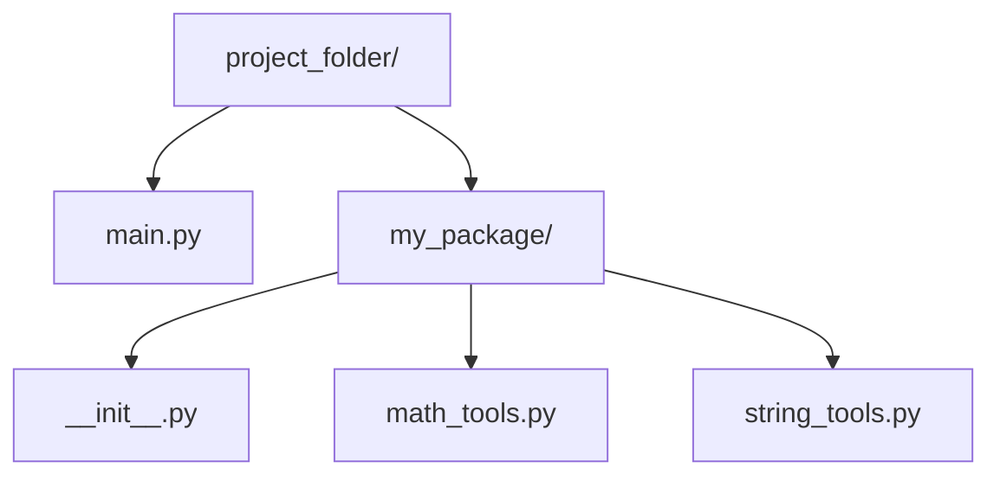

# Working With Packages

In the previous topic, we learned how to break our monolithic code into separate files called **Modules**. This was a massive step forward. But what happens when your application grows so large that you have 50 or 100 different modules? Having 100 `.py` files sitting loose in a single folder is just as chaotic as having all your code in one file.

To solve this, we need a way to group related modules together. We do this using **Packages**. 

If a module is a single file, a package is simply a **folder** (directory) that contains multiple modules. Packages allow us to create a deep, organized, hierarchical structure for our codebase.

> **Real World Analogy:** Imagine your computer's desktop. A single document is a **Module**. If your desktop is covered in 200 loose documents, you can't find anything. So, you create a folder called "Financials" and put all your tax and budget documents inside it. That folder is a **Package**.

## Anatomy of a Python Package

To prove to Python that a folder isn't just a random directory, but an actual Python Package that can be imported, it **must** contain a special file named `__init__.py`. 

*(Note: In Python 3.3+, this file is technically optional for "Namespace Packages," but including it remains standard, best-practice software engineering to ensure compatibility and initialization logic.)*

Let's visualize a standard package architecture:



In the diagram above, `my_package/` is a package because it contains the `__init__.py` file. It groups the `math_tools` and `string_tools` modules together.

## Importing From a Package

Importing a module from inside a package requires us to tell Python the "path" to find the file. We do this using **dotted syntax**, separating the folder name and the file name with a period.

### Worked Example 1: Dotted Syntax Import

Let's assume `math_tools.py` contains a function called `add()`, and `string_tools.py` contains a function called `capitalize_text()`. 

If we are writing code in `main.py` (which sits outside the package folder), here is how we access those tools:

```python
# main.py

# 1. We import the specific modules by typing the package name, a dot, and the module name.
import my_package.math_tools
import my_package.string_tools

# 2. To use the functions, we have to type the FULL dotted path!
sum_result = my_package.math_tools.add(10, 5)
text_result = my_package.string_tools.capitalize_text("hello world")

print(sum_result)  # Output: 15
print(text_result) # Output: Hello World
```

As you can see, typing `my_package.math_tools.add()` over and over again is incredibly tedious. While this method is the most explicit and prevents any naming collisions, it hurts readability. 

### Worked Example 2: The `from` Keyword Shortcut

To make our lives easier, we almost always use the `from` keyword when dealing with packages. This allows us to cut the package name out of the final function call.

```python
# main.py

# "Look inside my_package, and bring out the math_tools module"
from my_package import math_tools

# Now, we only need to use the module's name! The package name is dropped.
result = math_tools.add(50, 50)
print(result) # Output: 100
```

We can take this shortcut one step further. If we don't even want to type the module name, we can import the function directly into our namespace.

```python
# main.py

# "Look inside my_package's math_tools module, and bring out the add function"
from my_package.math_tools import add

# Now we can just use the function directly!
result = add(20, 20)
print(result) # Output: 40
```

## Subpackages (Folders inside Folders)

Just as you can put a folder inside another folder on your computer, you can nest packages inside of packages. These are called **Subpackages**. 

For example, you might have an `audio/` package, and inside it, a `filters/` subpackage, which contains an `echo.py` module.

The structure looks like this:
```
audio/
├── __init__.py
└── filters/
    ├── __init__.py
    └── echo.py
```

To import the `echo.py` module, you just chain the dotted syntax together, following the folders down to the file.

```python
# Importing from a deeply nested subpackage
from audio.filters import echo

# Using a function inside that module
echo.apply_echo_effect("Hello!")
```

## Key Takeaways
- A **Package** is a folder/directory that groups related Python modules together.
- To make a folder recognizable as a package, it should contain an `__init__.py` file.
- We navigate through packages and subpackages using **dotted syntax** (e.g., `package.subpackage.module`).
- Using the `from package import module` syntax is the industry standard way to keep code readable without sacrificing namespace safety.

## Exam Tips
- **The `__init__.py` Requirement:** If a question asks why Python cannot find a module inside a folder, the most likely answer is that the folder is missing its `__init__.py` file.
- **Valid Names:** Remember that package folders must follow Python naming rules. They cannot start with a number, and they cannot contain spaces or dashes (use underscores instead, like `my_package`).
