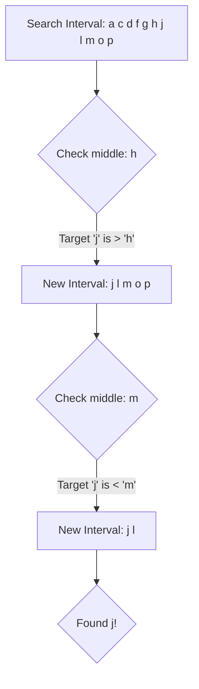

# Algorithms

In computer science, before we can write a program in a language like Python or C++, we first need a plan. That mathematical plan is called an **Algorithm**.

An algorithm is a finite set of precise instructions for performing a computation or for solving a problem. 

> **Real World Analogy:** Think of an algorithm like a recipe for baking a cake. It has specific ingredients you start with (inputs), step-by-step instructions on what to mix and how long to bake (definiteness), and the final cake that comes out of the oven (output). If the recipe is infinite, you'll never eat. If the instructions say "bake until done" instead of "bake for 30 mins", it lacks precision.

## Properties of Algorithms

For a set of instructions to officially qualify as an algorithm, it must possess the following properties:

1. **Input:** Values from a specified set.
2. **Output:** Values from a specified set (the solution).
3. **Definiteness:** Every step must be precisely defined.
4. **Correctness:** It must produce the correct output for every possible input.
5. **Finiteness:** It must terminate after a finite number of steps.
6. **Effectiveness:** Each step must be basic enough that it can be performed exactly and in finite time.
7. **Generality:** It should solve a *class* of problems, not just one specific case.

---

## Representing Algorithms: Pseudocode

We don't want to tie our algorithms to a specific programming language. Instead, we use **Pseudocode**—a plain-English hybrid that looks like code but ignores strict syntax rules. 

### Worked Example 1: Finding the Maximum Element

Let's look at an algorithm that finds the largest integer in an unsorted list.

```pascal
procedure max(a1, a2, ..., an: integers)
max := a1
for i := 2 to n
    if max < ai then max := ai
{max is the largest element}
```
**Explanation:** We assume the first item is the biggest. We then walk down the line, comparing our current max to every other number. If we find a bigger number, we update our record.

---

## Searching Algorithms

Searching for data is one of the most fundamental operations in computer science.

### Linear Search
Linear search simply walks down the line, checking every single element until it finds a match. It works on *unsorted* lists.

```pascal
procedure linear_search(x: integer; a1, a2, ..., an: integers)
i := 1
while (i ≤ n and x ≠ ai)
    i := i + 1
if i ≤ n then location := i
else location := 0
```

### Binary Search
If (and only if) the list is already **sorted**, we can use Binary Search. This algorithm checks the middle element. If the target is smaller, it throws away the entire right half of the list. If it is larger, it throws away the left half. It repeats this division until it finds the target.



Binary search is drastically more efficient than linear search because it eliminates half of the remaining work at every single step.

---

## Complexity and Big-O Notation

If we have two algorithms that solve the same problem (like Linear vs Binary Search), how do we decide which one is "better"? 

We measure **Time Complexity** (how many steps it takes) and **Space Complexity** (how much memory it uses) relative to the input size $n$.

However, we don't care about exactly how fast an algorithm is when $n=10$. Computers are fast enough that small inputs don't matter. We only care about the **Growth** of the algorithm as $n$ approaches infinity. 

To measure this growth, we use **Big-O Notation**.

### Definition of Big-O
Let $f$ and $g$ be functions. We say that $f(x)$ is $O(g(x))$ if there are constants $C$ and $k$ such that:

$|f(x)| \le C|g(x)| \text{ whenever } x > k$

This mathematically establishes an **upper boundary** for the growth of a function. 

### The Formula Game
If you have a complex polynomial representing the exact number of steps an algorithm takes, such as $f(n) = 3n^2 + 5n + 12$, finding the Big-O complexity is simple:
1. Strip away all lower-order terms.
2. Strip away the constants.
3. The result is the Big-O complexity: $O(n^2)$.

### The Hierarchy of Growth

You must memorize this list of common complexity functions, ordered from slowest growth (best performance) to fastest growth (worst performance):

1. **$O(1)$**: Constant
2. **$O(\log n)$**: Logarithmic (Binary Search)
3. **$O(n)$**: Linear (Linear Search)
4. **$O(n \log n)$**: Linearithmic
5. **$O(n^2)$**: Quadratic
6. **$O(n^3)$**: Cubic
7. **$O(2^n)$**: Exponential
8. **$O(n!)$**: Factorial

If a problem can be solved by an algorithm with polynomial complexity ($O(n^k)$ or better), it is considered **tractable** (solvable). If the best algorithm is exponential or worse, the problem is **intractable** (it would take the universe's lifetime to compute for large $n$).

---

### Key Takeaways
- An **Algorithm** must be finite, precise, and guaranteed to produce correct output.
- **Binary Search** is vastly superior to **Linear Search**, but it strictly requires the data to be sorted first.
- **Big-O Notation** evaluates the worst-case scenario for how an algorithm's runtime scales as the input size $n$ approaches infinity.

### Exam Tips
- **Proving Big-O:** If asked to prove $f(x) = x^2 + 2x + 1$ is $O(x^2)$, you must demonstrate that for $x > 1$, $x^2 + 2x + 1 \le x^2 + 2x^2 + x^2 = 4x^2$. Thus, $C=4$ and $k=1$. You only need to find *one* pair of $(C, k)$ to prove it.
- **The Best Bound:** While it is technically true that $n$ is $O(n^3)$ (because $n^3$ is an upper bound), exams will expect you to provide the **tightest** possible bound. The tightest bound for $n$ is $O(n)$.
