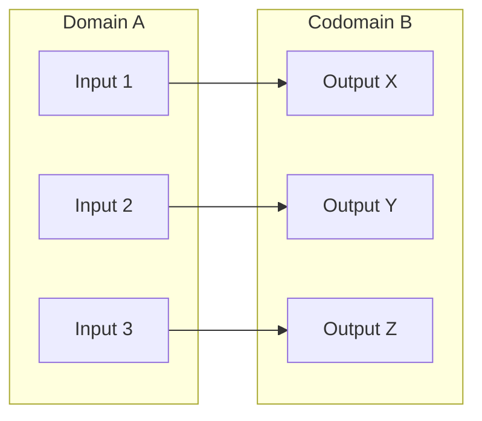

# Functions

If you have ever written a computer program, you have used functions. You give a function an input, it does some processing, and it returns a single output. 

In mathematics, a **Function** $f$ from a set $A$ to a set $B$ is an assignment of **exactly one** element of $B$ to each element of $A$. 

We write this as: $f: A \rightarrow B$

> **Real World Analogy:** Think of a function like a vending machine. Set $A$ is the buttons you can press (A1, B2, C3). Set $B$ is the snacks inside. If you press a single button (input), the machine must drop exactly one snack (output). If you press A1 and it drops both a Snickers and a Twix, it is broken—it is no longer a valid function!

## Function Terminology

Let's assume $f(a) = b$.

- **Domain ($A$):** The set of all possible inputs (all the buttons on the machine).
- **Codomain ($B$):** The set of all potential outputs (all the snacks loaded in the machine).
- **Pre-image ($a$):** The specific input you provided.
- **Image ($b$):** The specific output that was generated.
- **Range:** The set of *actual* images produced by the function. (Some snacks in the machine might never get picked. The range is only the snacks that actually fall out).

---

## Properties of Functions

We classify functions based on how the inputs map to the outputs. Let's look at the three most critical properties.

### 1. Injective (One-to-One)
A function is **Injective** if every output is mapped to by exactly *one* unique input. No two inputs share the same output.
- **Formal Definition:** $\forall x, y \in A \; (f(x) = f(y) \rightarrow x = y)$

### 2. Surjective (Onto)
A function is **Surjective** if every single element in the Codomain gets hit. There are no "leftover" outputs. The Range is exactly equal to the Codomain.
- **Formal Definition:** $\forall b \in B \; \exists a \in A \; (f(a) = b)$

### 3. Bijective (One-to-One Correspondence)
A function is **Bijective** if it is BOTH Injective and Surjective. Every input maps to a unique output, and every output is covered. 

*The diagram above shows a perfect Bijection. One-to-one mapping, with no leftovers in Codomain B.*

---

### Worked Example 1: Evaluating Function Properties

Let $A = \{Linda, Max, Kathy, Peter\}$ and $B = \{Boston, New York, Hong Kong, Moscow, Lubeck\}$.

Let $f$ be defined as:
- $f(Linda) = Boston$
- $f(Max) = New York$
- $f(Kathy) = Hong Kong$
- $f(Peter) = Moscow$

**Is $f$ Injective?** Yes. Every person goes to a different, unique city.
**Is $f$ Surjective?** No. Nobody was assigned to Lubeck, so Lubeck is leftover in the codomain.
**Is $f$ Bijective?** No. It must be both injective and surjective to be bijective.

---

## Inversion and Composition

### Inverse Functions ($f^{-1}$)
If (and only if) a function is a **Bijection**, it can be reversed. If $f(a) = b$, then the inverse function $f^{-1}(b) = a$. 

If a function is not bijective (for example, if two people mapped to Boston), the inverse wouldn't know which person to map Boston back to!

### Composition ($f \circ g$)
We can chain functions together. The **composition** of two functions $g: A \rightarrow B$ and $f: B \rightarrow C$, denoted by $f \circ g$, is defined as:

$(f \circ g)(a) = f(g(a))$

You always evaluate from the **inside out**. First you apply $g$ to $a$, and then you apply $f$ to the result.

### Worked Example 2: Composition Math
Let $f(x) = 7x - 4$ and $g(x) = 3x$. Find $(f \circ g)(5)$.

1. First evaluate the inner function $g(5)$: 
   $g(5) = 3(5) = 15$
2. Pass that result into the outer function $f(15)$:
   $f(15) = 7(15) - 4 = 105 - 4 = 101$
3. **Final Answer:** $(f \circ g)(5) = 101$.

---

## Floor and Ceiling Functions

These are two extremely common mathematical functions used in computer science to force real numbers (decimals) to become integers.

- **Floor $\lfloor x \rfloor$:** Rounds the number **down** to the largest integer less than or equal to $x$.
  - $\lfloor 2.9 \rfloor = 2$
  - $\lfloor -3.5 \rfloor = -4$ *(Be careful with negatives! -4 is lower than -3.5)*
- **Ceiling $\lceil x \rceil$:** Rounds the number **up** to the smallest integer greater than or equal to $x$.
  - $\lceil 2.1 \rceil = 3$
  - $\lceil -3.5 \rceil = -3$

---

### Key Takeaways
- A **Function** must map every input to exactly one output. 
- **Injective** means no shared outputs. **Surjective** means no leftover outputs. **Bijective** means perfect 1-to-1 pairing.
- You can only find the **Inverse** of a function if it is Bijective.
- **Composition** $(f \circ g)(x)$ is evaluated from the inside out: compute $g(x)$, then pass the result to $f$.

### Exam Tips
- **Proving Injectivity:** To prove a mathematical function is injective on an exam, start by assuming $f(x) = f(y)$. Use algebra to simplify the equation. If your final result is $x = y$, you have proven injectivity. If you end up with $x = \pm y$ (like with $f(x) = x^2$), it is NOT injective.
- **Negative Floors:** Lecturers love to test $\lfloor -2.3 \rfloor$. Many students guess $-2$. Remember the number line: rounding *down* from $-2.3$ takes you to $-3$.
