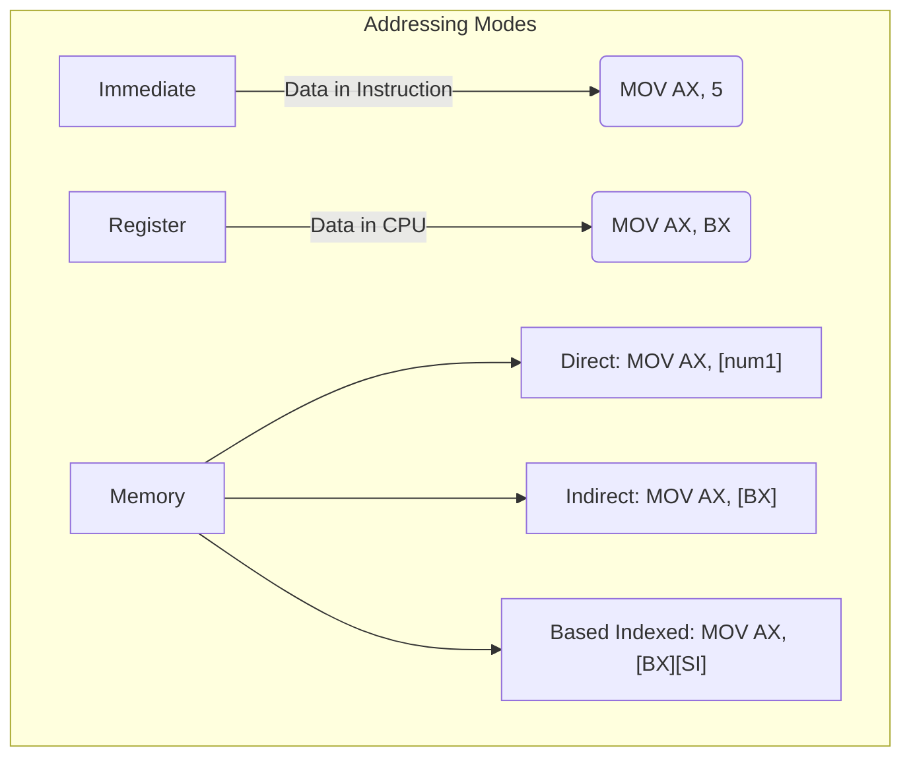

# The 80x86 Addressing Modes

Imagine you are a courier delivering a package. If the package is meant for yourself, you don't need directions—you just keep it (Immediate/Register). If it's for someone else, you might be handed their exact home address (Direct Memory Addressing). Alternatively, you might be handed a map, told to start at a specific intersection, walk 5 blocks north, and find the house (Register Indirect / Indexed Addressing).

In an assembly language program, the CPU needs to know exactly where to find the data it is supposed to work on. The various methods the CPU uses to locate this data are called **Addressing Modes**. Mastering addressing modes is the most important step in mastering 80x86 assembly language.

---

## 1. Immediate Addressing Mode

In immediate addressing, the data is not fetched from memory or a register; the data is hardcoded directly inside the instruction itself. It is a constant value.

```assembly
mov ax, 0035h  ; The constant value 0035h is the immediate data
add ax, 24     ; The constant value 24 is the immediate data
```
**Analogy:** Handing the chef the exact ingredient ("Here are 3 apples") rather than telling them where to find it.

## 2. Register Addressing Mode

Both operands are registers. The CPU copies data from one internal register to another. Because both operands reside inside the CPU, this is the absolute fastest addressing mode—no system bus access is required.

```assembly
mov ax, bx  ; Copies the value from BX into AX
mov dl, al  ; Copies the value from AL into DL
```

## 3. Memory Addressing Modes

When data resides in RAM, we must provide an effective memory address. The physical address is always a combination of a **Segment Register** and an **Offset**. The physical address is calculated as:
$$ \text{Physical Address} = (16 \times \text{Segment}) + \text{Offset} $$
$$ \text{Physical Address (Hex)} = (\text{Segment} \times 10h) + \text{Offset} $$

There are multiple ways to specify the offset:

### 3.1 Direct Addressing Mode
A 16-bit memory offset is explicitly typed into the instruction, usually via a named variable label. We use brackets `[]` to denote memory.

```assembly
mov ax, [num1]    ; Loads the data located at memory variable 'num1' into AX
mov [num1+6], ax  ; Stores AX into the memory location 6 bytes past 'num1'
```
**Memory Breakdown:** If `num1` is defined as `num1 dw 8, 10, 6, 0`. `dw` means "define word" (2 bytes). 
* `num1+0` holds 8.
* `num1+2` holds 10.
* `num1+4` holds 6.
* `num1+6` holds 0.

### 3.2 Register Indirect Addressing Mode
The offset address of the data is stored in a register (specifically BX, SI, or DI). The CPU looks at the register, reads the address inside it, and goes to that location in memory.

```assembly
mov ax, [bx]  ; CPU looks at BX, uses its value as a memory address, and fetches the data
```

### 3.3 Advanced Modes (Indexed & Based Indexed)
*   **Indexed:** Similar to register indirect, but uses an index register (`SI` or `DI`). Example: `mov ax, [si]`
*   **Based Indexed:** Adds a base register (`BX` or `BP`) and an index register (`SI` or `DI`) together to form the address. Example: `mov ax, [bx][si]`
*   **Register Relative:** Adds an immediate constant displacement to a register. Example: `mov ax, 50h[bx]` (Address = BX + 50h).



---

## Worked Examples

### Example 1: Direct Addressing with Multiple Labels
This program adds 8, 10, and 6 together using distinct variables in memory.

```assembly
ORG 100H    
INCLUDE "EMU8086.INC"  

mov ax, [num1]    ; Load 8 into AX (Direct Memory Addressing)
mov [num4], ax    ; Store 8 into num4
mov ax, [num2]    ; Load 10 into AX
add [num4], ax    ; num4 = 8 + 10 = 18
mov ax, [num3]    ; Load 6 into AX
add ax, [num4]    ; AX = 6 + 18 = 24

CALL PRINT_NUM    ; Prints the value in AX (24)
RET               ; Return to OS

DEFINE_PRINT_NUM
DEFINE_PRINT_NUM_UNS

num1 dw 8         ; Define word variables
num2 dw 10
num3 dw 6
num4 dw 0         ; Storage for result
END
```

### Example 2: Effective Address Calculation
Given `DS = 1230h` and `SI = 0045h`, calculate the physical address for the instruction `MOV AX, [SI]`.
1. Formula: $\text{Physical} = (\text{DS} \times 10h) + \text{SI}$
2. Shift DS left by one hex digit: $1230h \times 10h = 12300h$
3. Add the offset: $12300h + 0045h$
4. Result: **$12345h$**

---

## Key Takeaways
*   **Brackets `[]` mean Memory:** `MOV AX, BX` copies the *value* of BX. `MOV AX, [BX]` goes to RAM using the address stored in BX.
*   **Sizes Must Match:** You can't move an 8-bit register into a 16-bit memory word without causing issues.
*   **Segment Defaults:** By default, BX, SI, and DI use the Data Segment (DS). BP and SP use the Stack Segment (SS).

---

## Exam Tips
> 🎓 **What Lecturers Typically Test**
> *   **Identifying Modes:** You will be given a list of instructions and asked to name their addressing mode. (e.g. `MOV AX, [BX]` is Register Indirect, `MOV AX, 50` is Immediate).
> *   **Calculating Physical Addresses:** Memorize the formula `(Segment * 10h) + Offset`. This is guaranteed to appear in exams.
> *   **Invalid Register Combinations:** You can form an effective address with `[BX]` or `[SI]`, but `[CX]` and `[AX]` are completely illegal in 16-bit 8086 mode. Keep an eye out for this trick!
