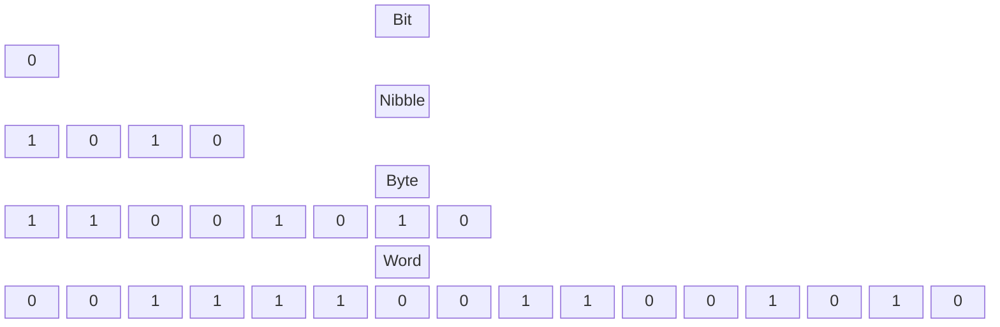

# Data Representation

Before writing assembly code, you need to understand how computers count and represent data. Think of data representation like different languages describing the exact same object. Whether you say "Cat" in English, "Gato" in Spanish, or "Chat" in French, you are describing the same animal. Similarly, a computer can look at the exact same sequence of electronic signals and interpret it as a binary string, a hexadecimal number, a decimal value, or a signed negative number. 

In this topic, we will deeply explore numbering systems (Decimal, Binary, Hexadecimal), how computers organize data (Bits, Bytes, Words), and how positive and negative numbers are distinguished in memory.

---

## 1. Numbering Systems

Computer systems do not naturally use the decimal system (Base 10) because it is difficult to build electronic circuits with 10 distinct states. Instead, they use a binary system with two states: ON (1) and OFF (0).

### Decimal System (Base 10)
Uses 10 digits: `0, 1, 2, 3, 4, 5, 6, 7, 8, 9`. The value of each position is a power of 10.
For the number 754:
$$ (7 \times 10^2) + (5 \times 10^1) + (4 \times 10^0) = 700 + 50 + 4 = 754 $$

### Binary System (Base 2)
Uses 2 digits: `0, 1`. The value of each position is a power of 2. In assembly, we append a `b` to denote a binary number (e.g., `101b`).
Converting `101b` to decimal:
$$ (1 \times 2^2) + (0 \times 2^1) + (1 \times 2^0) = 4 + 0 + 1 = 5 $$

### Hexadecimal System (Base 16)
Binary numbers get extremely long and hard to read. Hexadecimal solves this by grouping bits. It uses 16 digits: `0-9` and `A-F` (where A=10, B=11, C=12, D=13, E=14, F=15). In assembly, we append an `h` (e.g., `5Fh`). **Note:** If a hex number starts with a letter, we must prefix it with a zero so the assembler knows it's a number (e.g., `0E120h`).

Converting `1234h` to decimal:
$$ (1 \times 16^3) + (2 \times 16^2) + (3 \times 16^1) + (4 \times 16^0) = 4096 + 512 + 48 + 4 = 4660 $$

## 2. Binary Data Organization

Data is grouped into standard sizes for processing:
*   **Bit:** A single binary digit (`0` or `1`).
*   **Nibble:** 4 bits. (Exactly one hexadecimal digit).
*   **Byte:** 8 bits. (Can represent 256 unique values).
*   **Word:** 16 bits (2 bytes). 

## 3. Signed vs. Unsigned Numbers

The CPU can represent two types of integers: **Unsigned** (only positive) and **Signed** (positive and negative).

### Unsigned Integers
In an 8-bit byte, unsigned integers use all 8 bits for the value, ranging from `0` to `255` ($2^8 - 1$).

### Signed Integers (Two's Complement)
To represent negative numbers, computers use **Two's Complement**. In an 8-bit byte, the 256 combinations are split:
*   **0 to 127:** Positive numbers. (The highest bit is always `0`).
*   **128 to 255:** Mapped to negative numbers `-128` to `-1`. (The highest bit is always `1`).

To manually calculate the unsigned value that represents a negative number like `-5` in an 8-bit register, subtract the magnitude from 256:
$$ 256 - 5 = 251 $$
So, in memory, the byte `251` (which is `FBh`) represents `-5`.

When adding `-5` (represented as `251`) and `5`:
$$ 251 + 5 = 256 $$
Because an 8-bit register can only hold up to `255`, it overflows back to `0`. This is the mathematical magic of Two's Complement!

---

## Worked Examples

### Example 1: Binary to Hexadecimal Conversion
Convert `10100101b` to Hexadecimal.
1. Split the byte into two nibbles (4 bits each): `1010` and `0101`.
2. Convert the left nibble: `1010b` = $8 + 2 = 10$, which is **A** in hex.
3. Convert the right nibble: `0101b` = $4 + 1 = 5$, which is **5** in hex.
4. Combine them: **A5h**

### Example 2: Negative Number Representation
Find the 8-bit hexadecimal representation of `-24`.
1. Calculate the Two's Complement unsigned equivalent: $256 - 24 = 232$.
2. Convert 232 to hex: $232 \div 16 = 14$ remainder $8$.
3. 14 is **E** in hex. The remainder is **8**.
4. Result: **E8h**.

---

## Key Takeaways
*   The base suffix is crucial in assembly. `35` (decimal) is vastly different from `35h` (hex) or `35b` (binary).
*   Always prefix hex numbers starting with a letter with a zero: `0FFh`, not `FFh`.
*   A Byte is 8 bits. A Word is 16 bits.
*   Two's complement allows the CPU to use the same addition circuitry for both positive and negative numbers.

---

## Exam Tips
> 🎓 **What Lecturers Typically Test**
> *   **Number Base Confusion:** A classic exam question will ask you to add `35h` and `24`. You MUST convert them to the same base first! (`35h` = 53 decimal. $53 + 24 = 77$).
> *   **Hex Notation Rules:** They will intentionally write `MOV AX, A5h` and ask what the error is. The error is the missing leading zero (`0A5h`).
> *   **Two's Complement Math:** You may be asked to explain *why* adding a negative number works in hardware (overflowing past 255 yields 0).
