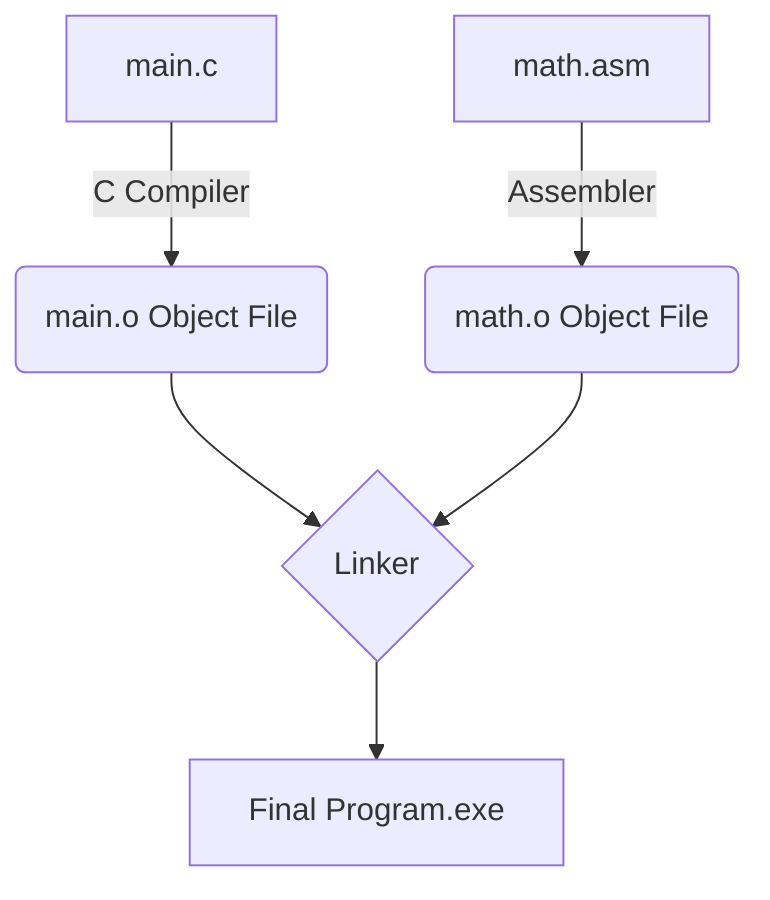

# Interfacing C with Assembly Language

Many programmers write in high-level languages like C because it handles complex details for them and works across different operating systems. However, for time-critical, real-time hardware drivers, Assembly is vastly superior because there is zero ambiguity about how the code compiles and it executes as fast as the hardware physically allows. 

The best solution is often to mix them together: write 95% of your program in C for ease of use, and write the 5% that does heavy, rapid math in Assembly.

There are two primary ways to achieve this: **Inline Assembly** and **Linked Assembly**.

---

## 1. Inline Assembly

Inline assembly allows you to literally type assembly instructions directly inside a C program. The C compiler (like GCC or Microsoft Visual C++) recognizes special keywords like `asm` or `__asm__` and processes the machine code directly.

### Advantages of Inline Assembly:
*   You don't need a separate assembler program (like NASM or MASM).
*   You can directly access C variables within the assembly code without dealing with stack frames.

```c
#include <stdio.h> 
  
void main() { 
   int a = 3, b = 3, c; 
  
   // Using inline assembly to perform the math directly on the CPU
   asm { 
      mov ax, a 
      mov bx, b 
      add ax, bx 
      mov c, ax 
   } 
  
   printf("The result is: %d", c); 
} 
```

## 2. Linked Assembly

In professional, large-scale projects, the C code is saved in a `.c` file and the Assembly code is saved in a completely separate `.s` or `.asm` file. This keeps the codebase clean.

### The Linking Process
1. The C compiler compiles the C code into a binary **Object file** (`.o` or `.obj`).
2. The Assembler compiles the Assembly code into its own **Object file**.
3. A **Linker** program (like `ld`) glues the two object files together into the final Executable (`.exe`).



### Passing Parameters in Linked Assembly
When a C function calls an external Assembly function, it passes its arguments by pushing them onto the **Stack**. The Assembly function must then read the stack to find the inputs, do the math, and return the output (usually by leaving the result in the Accumulator register, `EAX`).

---

## Worked Examples

### Example 1: Calling a C function from Assembly
If you have a standard C function called `printf`, you can call it from a linked Assembly file by pushing the arguments onto the stack and calling the C function name.

```assembly
.globl main 
main: 
    movl $123, %eax     ; Load 123 into eax
    pushl %eax          ; Push 123 onto the stack (C functions look for args here)
    
    call print          ; Call the external C function
    
    addl $4, %esp       ; Clean up the stack after the C function returns
    ret 
```

### Example 2: Calling Assembly from C
**The C File (`main.c`):**
```c
extern int add_numbers(int a, int b); // Tell C this exists elsewhere

int main() {
    int result = add_numbers(5, 10);
    return 0;
}
```

**The Assembly File (`math.asm`):**
```assembly
global add_numbers

add_numbers:
    ; Read arguments from stack
    mov eax, [esp+4]    ; Get first argument (5)
    mov ebx, [esp+8]    ; Get second argument (10)
    add eax, ebx        ; EAX = 15
    ret                 ; Return to C. Result is automatically taken from EAX.
```

---

## Key Takeaways
*   **Inline Assembly** is typed directly into the `.c` file using the `asm{}` block.
*   **Linked Assembly** uses separate source files. They are compiled into Object files and then connected by a Linker.
*   When mixing C and Assembly, arguments are passed back and forth using the Stack, and return values are typically passed back via the `AX` or `EAX` register.

---

## Exam Tips
> 🎓 **What Lecturers Typically Test**
> *   **Interfacing Concepts:** Understand the difference between Inline Assembly and Linked Assembly. Be able to name the three steps of linking: compiling C to an object, assembling ASM to an object, and Linking them together.
> *   **Parameter Passing:** They often ask "How does C send a variable to an external Assembly function?" The answer is: It pushes the variable onto the Stack.
