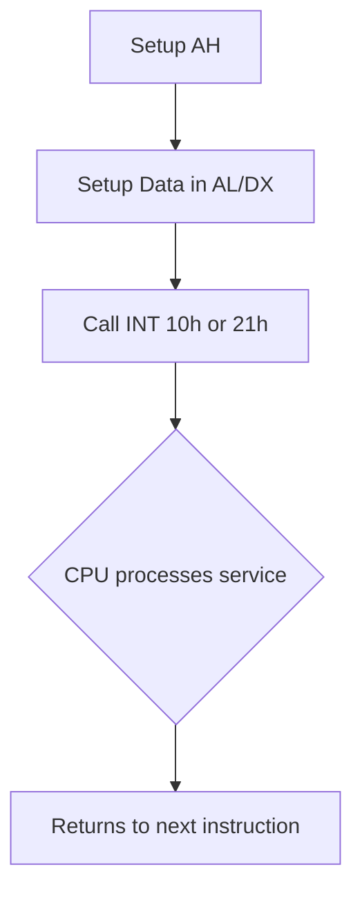

# Interrupts

Imagine you are working in an office, deeply focused on a spreadsheet. Suddenly, the fire alarm rings. No matter what you were doing, you stop immediately, follow the emergency procedures to exit the building, and once the drill is over, you return to your desk and pick up exactly where you left off.

In a computer, an **Interrupt** is that fire alarm. It is a special signal that demands the CPU's immediate attention. When an interrupt fires, the CPU pauses its current program, saves its exact location on the Stack, runs a special routine to handle the event, and then resumes the original program. 

There are two types:
*   **Hardware Interrupts:** Generated by physical devices (like pressing a key on the keyboard or moving the mouse).
*   **Software Interrupts:** Generated by the code itself. We use these to ask the Operating System or BIOS to do complex tasks for us, like printing to the screen or reading a file, without having to write the hundreds of lines of code to control the monitor hardware manually.

---

## 1. Syntax for Interrupts

To trigger a software interrupt, we use the `INT` instruction followed by a hex number (0 to 255).

```assembly
INT value
```

However, a single interrupt number can hold dozens of different sub-functions. To tell the CPU *which* sub-function you want, you almost always load a specific number into the **AH** register right before calling the interrupt. Other registers (like AL, BX, or DX) are used to pass the actual data the function needs.

## 2. Essential BIOS Interrupts (INT 10h & INT 21h)

### INT 10h: Video Services
This interrupt handles everything related to the screen.
*   **AH = 0Eh (Teletype Output):** Prints a single character to the screen and moves the cursor forward. The character must be in the `AL` register (using its ASCII code).
*   **AH = 00h (Set Video Mode):** Changes screen resolution. Mode goes into `AL`.
*   **AH = 0Ch (Write Pixel):** Changes the color of a single pixel in graphics mode.

### INT 21h: DOS Services
This interrupt handles higher-level operating system tasks, specifically standard input and output.
*   **AH = 01h (Read Character):** Waits for the user to press a key. When pressed, the ASCII value of the key is stored in `AL`.
*   **AH = 02h (Write Character):** Prints the character currently sitting in the `DL` register.
*   **AH = 09h (Write String):** Prints a string ending with a `$` character.



---

## Worked Examples

### Example 1: Printing "Hello!" manually using INT 10h
This program prints letters one by one using the raw BIOS video interrupt.

```assembly
ORG 100h 

MOV AH, 0Eh    ; Select sub-function 0Eh (Teletype Output)
               ; Because INT 10h doesn't erase AH, we only have to set it once!

MOV AL, 'H'    ; Load the ASCII code for 'H' into AL
INT 10h        ; Fire the interrupt! Screen prints 'H'

MOV AL, 'e'    
INT 10h        ; Screen prints 'e'

MOV AL, 'l'    
INT 10h        ; Screen prints 'l'

MOV AL, 'l'    
INT 10h        ; Screen prints 'l'

MOV AL, 'o'    
INT 10h        ; Screen prints 'o'

MOV AL, '!'    
INT 10h        ; Screen prints '!'

RET            ; Return to OS
```

### Example 2: Waiting for a Keypress using INT 21h
This program halts execution until the user presses a key.

```assembly
org 100h

mov ah, 01h    ; Set DOS function 01h (Read Key)
int 21h        ; Call DOS interrupt. Execution PAUSES here until a key is pressed.

; The ASCII value of the pressed key is now stored in AL!

ret
```

---

## Key Takeaways
*   Interrupts (`INT`) save us from having to write custom hardware drivers just to put a letter on the screen.
*   The `AH` register is almost universally used as the "Sub-function Selector" before firing an interrupt.
*   `INT 10h` controls Video/Screen. `INT 21h` controls DOS tasks like Keyboard input.

---

## Exam Tips
> 🎓 **What Lecturers Typically Test**
> *   **Interrupt Setup:** You must remember that `AH` determines the action. If a question asks how to read a keypress via INT 21h, you must explicitly state that `AH` must be set to `01h` first.
> *   **Register Destinations:** Know exactly where interrupts put their results. `INT 21h / AH=01h` puts the pressed key into the `AL` register. Mixing these up is a common source of failed exams.
