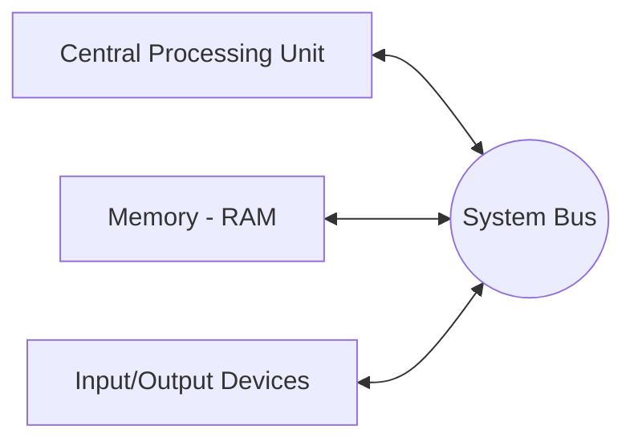

# Introduction to Assembly Language

Before diving directly into assembly code, it is essential to understand the hardware that will run it. Think of a computer system like a busy restaurant. The Central Processing Unit (CPU) is the head chef, making all the important calculations and decisions. The Memory (RAM) is the kitchen counter where the chef keeps ingredients they need for the current recipe. The Input/Output (I/O) devices are the waiters bringing orders in and taking finished meals out to the customers. 

Just as the chef, counter, and waiters need to communicate to keep the restaurant running smoothly, the CPU, memory, and I/O devices need a way to pass information back and forth. They do this using a set of communication pathways called **Buses**. 

In this topic, we will break down the Von Neumann Architecture, the System Bus, and the distinction between machine language and assembly language.

---

## 1. The Von Neumann Architecture

The basic operational design of a computer system is called its architecture. The 80x86 family uses the **Von Neumann Architecture (VNA)**. A typical Von Neumann system has three major components:
1. **The Central Processing Unit (CPU):** The brain of the computer where all computations occur.
2. **Memory:** Random Access Memory (RAM) is where programs and data are loaded to be executed.
3. **Input/Output (I/O):** Devices that allow the system to interact with the outside world.



## 2. The System Bus

The system bus connects the various components of a computer. It is a collection of wires on which electrical signals pass between components. The 80x86 processors rely on three major buses:

### Data Bus
The data bus is used to move data from memory to the processor (a read operation) and from the processor to memory (a write operation). The size of this bus dictates how much data the CPU can shuttle at once, defining the "size" of the processor (e.g., an 8-bit, 16-bit, 32-bit, or 64-bit data bus).

### Address Bus
When the CPU wants to interact with memory or an I/O device, it needs to specify *which* location. The address bus carries this unique memory address. If a processor has $n$ address lines, it can access exactly $2^n$ unique addresses. 
For example, the 8086 has a 20-bit address bus:
$$ \text{Total Memory} = 2^{20} \text{ locations} = 1,048,576 \text{ bytes (1 MB)} $$

### Control Bus
The control bus is an eclectic collection of signals that dictate how the processor communicates with the system. It contains lines like *read* and *write* which specify the direction of the data flow. If the *read* line is active (logic zero), the CPU reads from memory. If the *write* line is active, the CPU sends data to memory.

## 3. Machine Language vs. Assembly Language

### Machine Language
Every CPU understands its own machine language, consisting of instructions encoded as raw binary numbers (stored as bytes). Each instruction starts with an Operation Code (Opcode). Programming directly in machine language (e.g., `03 C3` for addition) is incredibly tedious.

### Assembly Language
Assembly is a low-level programming language that stores its instructions as readable text. Each assembly statement directly corresponds to exactly one machine instruction. We use **mnemonics** (like `ADD`, `MOV`) to represent the machine instructions. An **Assembler** (like Emu8086, MASM, NASM) translates this text into the final machine code.

---

## Worked Examples

### Example 1: Calculating Memory Address Capacity
If an imaginary CPU has a 16-bit address bus, how many unique memory locations can it access?
$$ \text{Capacity} = 2^{n} $$
$$ \text{Capacity} = 2^{16} = 65,536 \text{ locations (64 KB)} $$

### Example 2: The Emu8086 Environment Structure
Here is a barebones assembly structure using `ORG 100h` (required for a simple single-segment `.com` executable file).

```assembly
; This program simply loads a number into AX
org 100h       ; Sets program origin to 100h (required for .COM files)

mov ax, 0035h  ; Load the hex value 35h (which is 53 in decimal) into AX

ret            ; Return control to the operating system
```

---

## Key Takeaways
*   The Von Neumann architecture separates a system into CPU, Memory, and I/O.
*   Buses (Data, Address, Control) act as the communication highways. Address bus size determines maximum accessible memory.
*   Assembly language uses human-readable mnemonics mapped directly to raw machine code instructions.

---

## Exam Tips
> 🎓 **What Lecturers Typically Test**
> *   **System Bus Roles:** Be prepared to define the difference between Address, Data, and Control buses. Expect to calculate addressable memory given an address bus size ($2^n$).
> *   **Architecture Components:** Memorize the three pillars of Von Neumann: CPU, Memory, I/O.
