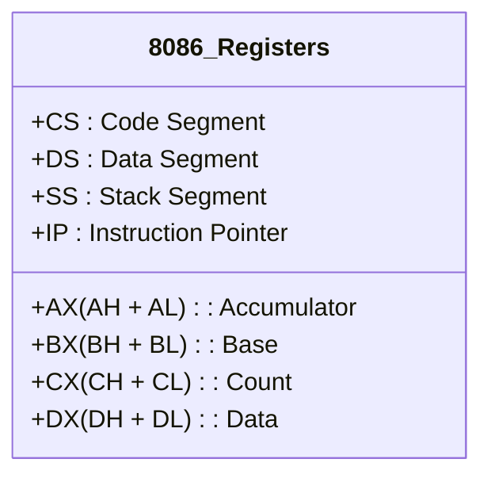

# Mnemonics and Operands

To make processing as fast as possible, the CPU does not always want to travel down the System Bus to fetch data from the main Memory. Instead, it has a very small, ultra-fast personal workspace right inside the processor itself. Think of these like the small pockets on a carpenter's toolbelt—they hold the tools and items needed *right now*. In a CPU, these are called **Registers**.

An assembly language instruction is a command given to the CPU to perform an operation using these registers or memory locations. The instruction consists of a **Mnemonic** (the verb, like "Move" or "Add") and the **Operands** (the nouns, like the specific registers or data).

---

## 1. The Internal Structure of the CPU (Registers)

The 8086 CPU has several 16-bit registers. They are grouped by their specific hardware purposes.

### General Purpose Registers
The 8086 CPU has eight 16-bit general-purpose registers:
*   **AX (Accumulator):** The primary register for mathematical and logical operations.
*   **BX (Base):** Often used for holding memory base addresses.
*   **CX (Count):** Used as a counter for loops and string operations.
*   **DX (Data):** Used for I/O and specific arithmetic operations like multiplication/division.
*   **SI (Source Index) & DI (Destination Index):** Used for array and string operations.
*   **BP (Base Pointer) & SP (Stack Pointer):** Used to manage the stack.

The four main data registers (AX, BX, CX, DX) can be split into two 8-bit registers. For example, AX is made up of **AH** (High byte) and **AL** (Low byte). Modifying AL directly affects the lower half of AX.

### Segment Registers
Segment registers point to 64KB blocks of memory:
*   **CS (Code Segment):** Points to the segment containing the executing program.
*   **DS (Data Segment):** Points to where variables are defined.
*   **ES (Extra Segment):** An extra data segment.
*   **SS (Stack Segment):** Points to the stack.

### Special Purpose Registers
*   **IP (Instruction Pointer):** Works with CS to point to the currently executing instruction. It cannot be accessed directly by the programmer.
*   **Flags Register:** A 16-bit register where individual bits represent the state of the processor after mathematical operations.



## 2. Syntax: Mnemonics and Operands

A standard x86 instruction follows this format:
`[Label:] Mnemonic [Destination], [Source] [; Comment]`

*   **Label:** An optional marker to jump to (e.g., `start:`).
*   **Mnemonic:** The instruction name (e.g., `MOV`, `ADD`, `SUB`).
*   **Destination:** Where the result will be stored.
*   **Source:** The data being used.

### The MOV Instruction
The most common mnemonic is `MOV` (Move). It copies data from the source to the destination.
`MOV AX, 10`  => Copies the number 10 into register AX.
`MOV BX, AX`  => Copies the contents of AX into register BX.

---

## Worked Examples

### Example 1: Understanding Register Splitting
If the 16-bit register AX contains the hexadecimal value `1234h`:
*   What is in AH? `12h` (The high byte)
*   What is in AL? `34h` (The low byte)

If we execute a command to change AL to `00h`:
```assembly
MOV AL, 00h
```
AX now becomes `1200h`.

### Example 2: Invalid Operand Combinations
There are strict rules about what operands you can use together.
```assembly
; LEGAL
MOV AX, BX      ; 16-bit register to 16-bit register
MOV AL, BL      ; 8-bit register to 8-bit register
MOV CX, 500     ; Immediate value to 16-bit register

; ILLEGAL
MOV AX, BL      ; Size mismatch! Cannot move 8-bit into 16-bit
MOV 500, AX     ; Cannot use an immediate value as a destination
MOV DS, CS      ; Cannot move segment register directly to segment register
```

---

## Key Takeaways
*   Registers are ultra-fast memory inside the CPU. 
*   AX, BX, CX, and DX can be divided into 8-bit high and low registers (AH/AL, BH/BL, etc.).
*   The instruction format is always `Mnemonic Destination, Source`.
*   Operands must match in size.

---

## Exam Tips
> 🎓 **What Lecturers Typically Test**
> *   **Register Sizes:** A very common trap is mixing up 8-bit and 16-bit registers. Remember that `AX` is 16-bit, while `AL` and `AH` are 8-bit.
> *   **Accumulator Role:** You will often be asked which register is the central register for math operations. The answer is always the Accumulator (AX/AL).
> *   **Syntax Rules:** They will show you `MOV AX, CH` and ask you to identify the syntax error (Size mismatch).
