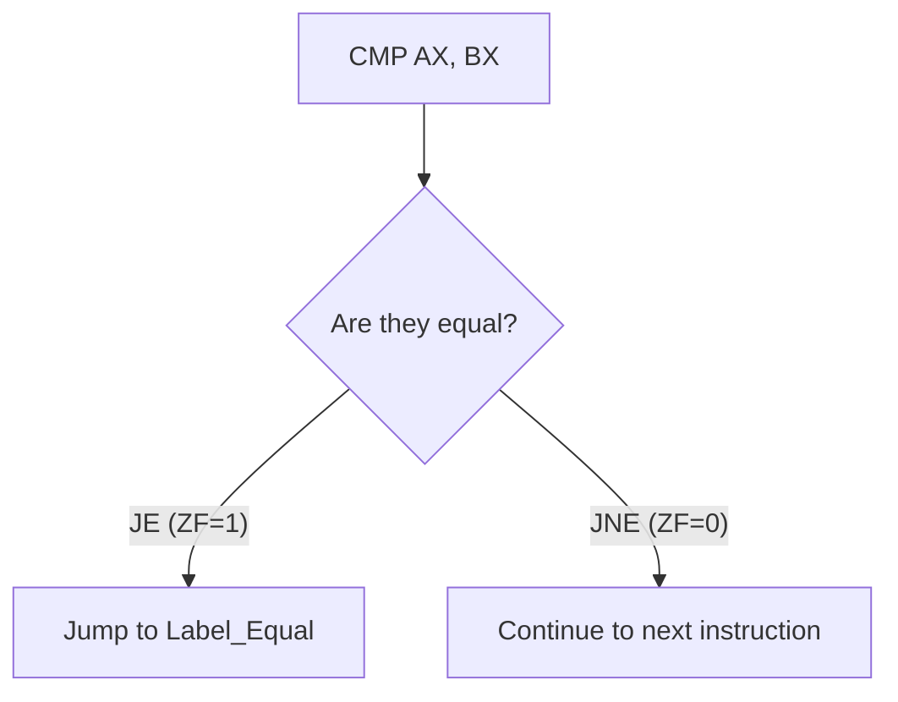

# Program Flow Control

If a computer program could only run in a straight line from top to bottom, it would be incredibly rigid. You couldn't make decisions (like "If the password is correct, log in") or repeat tasks (like "Process all 50 items in this list"). 

Think of reading a "Choose Your Own Adventure" book. You read down the page until you hit a condition: "If you open the door, turn to page 45. If you run away, turn to page 60." In assembly, this is known as **Control Flow**. The CPU uses **Jump (JMP)** instructions to flip to different "pages" (memory addresses) of the code. It makes these decisions based on the current state of the Flags Register, which we learned about in the last topic.

---

## 1. Unconditional Statements (JMP)

The simplest way to change the flow of a program is the unconditional jump. It tells the CPU to immediately stop what it is doing and teleport to a different line of code, no questions asked.

The syntax is: `JMP label`

A **label** is simply a marker in the code created by typing a word followed by a colon (`:`).

```assembly
mov ax, 1
jmp skip_step   ; Jump entirely over the next instruction

mov ax, 2       ; This line will NEVER execute

skip_step:      ; Execution resumes here
mov bx, 5
```

## 2. Conditional Statements (Conditional Jumps)

Conditional jumps only transfer control if a specific condition is met. They look at the **Flags Register** to make their decision. Because they rely on flags, a conditional jump is almost always preceded by a `CMP` (Compare) or `TEST` instruction.

### The Jump Mnemonics
There are many variations of conditional jumps, but they all follow a naming pattern:

*   **JE / JZ:** Jump if Equal / Jump if Zero (ZF = 1)
*   **JNE / JNZ:** Jump if Not Equal / Jump if Not Zero (ZF = 0)
*   **JG / JNLE:** Jump if Greater / Jump if Not Less or Equal (Signed math)
*   **JL / JNGE:** Jump if Less / Jump if Not Greater or Equal (Signed math)
*   **JA:** Jump if Above (Unsigned math equivalent of JG)
*   **JB:** Jump if Below (Unsigned math equivalent of JL)
*   **JLE:** Jump if Less or Equal (Signed)



## 3. Conditional Statements for Looping

Looping is just a combination of variables, subtraction, and a conditional jump backwards. To iterate through an array or repeat a mathematical process, we usually:
1. Put the total number of iterations in the `CX` (Count) register.
2. Do the work.
3. Subtract 1 from `CX`.
4. Use `JNZ` (Jump if Not Zero) to jump back to the start if `CX` hasn't hit 0.

*(Note: The 8086 does have a dedicated `LOOP` instruction that automatically decrements CX and jumps, but writing it out with `SUB` and `JNZ` gives you much finer control and understanding).*

---

## Worked Examples

### Example 1: Basic If-Else Logic
This program checks if `AL` equals 5. If it does, it skips to the `label1` block. If not, it runs the "not equal" block and then uses an unconditional jump (`JMP exit`) to prevent falling into the `label1` code anyway.

```assembly
ORG 100h 
include 'emu8086.inc' 

MOV AL, 5 
CMP AL, 5        ; Compare AL to 5 (Subtracts 5 from 5, ZF becomes 1)
JE  label1       ; Jump if Equal (Jump if ZF=1) to 'label1'

; --- 'Else' Block ---
PRINT 'not equal.' 
JMP exit         ; Unconditionally skip the equal block so they don't overlap

; --- 'If' Block ---
label1: 
PRINT 'equal.' 

exit: 
RET              ; Return to OS
```

### Example 2: Array Looping
This program adds 10 numbers together using an array, a loop counter, and a pointer.

```assembly
org 100h  
include emu8086.inc 

mov bx, 0           ; Initialize array index pointer to 0
mov cx, 10          ; Load loop counter with 10 (we have 10 items)
mov ax, 0           ; Initialize running total to 0

l1: 
add ax, [num1+bx]   ; Add the memory item at (num1 + offset bx) to AX
add bx, 2           ; Advance BX by 2 bytes (because array holds 16-bit Words)
sub cx, 1           ; Decrease loop counter
jnz l1              ; Jump if Not Zero back to 'l1'

call print_num      ; Prints the sum (300)
ret 

define_print_num 
define_print_num_uns 

; The Array in memory
num1: dw 10, 20, 30, 40, 50, 10, 20, 30, 40, 50 
```

---

## Key Takeaways
*   **JMP** is absolute and unconditional. It does not check flags.
*   **Conditional Jumps (JE, JNE, JL, etc.)** are intimately tied to the Flags Register. You must perform an operation that sets the flags (like `CMP` or `SUB`) immediately before the jump.
*   The **CX** register is universally recognized as the loop counter. 
*   Always protect your code blocks! If you have an "if" block followed by an "else" block, you must put an unconditional `JMP` at the end of the "if" block, otherwise execution will simply fall straight through into the "else" block.

---

## Exam Tips
> 🎓 **What Lecturers Typically Test**
> *   **Loop Array Offsets:** In an exam asking you to write an array loop, remember to add `2` to the index register (`add bx, 2`) if you are iterating over an array of Words (`dw`). If it's an array of bytes (`db`), you only add `1`. Many students lose marks here.
> *   **Signed vs Unsigned Jumps:** They may test if you know the difference between signed jumps (`JG`, `JL`) and unsigned jumps (`JA`, `JB`). Use Greater/Less for signed, Above/Below for unsigned.
> *   **Infinite Loops:** Be careful when writing loop conditions. If you accidentally decrement the wrong register, your `CX` will never reach 0, and the program will hang in an infinite loop.
