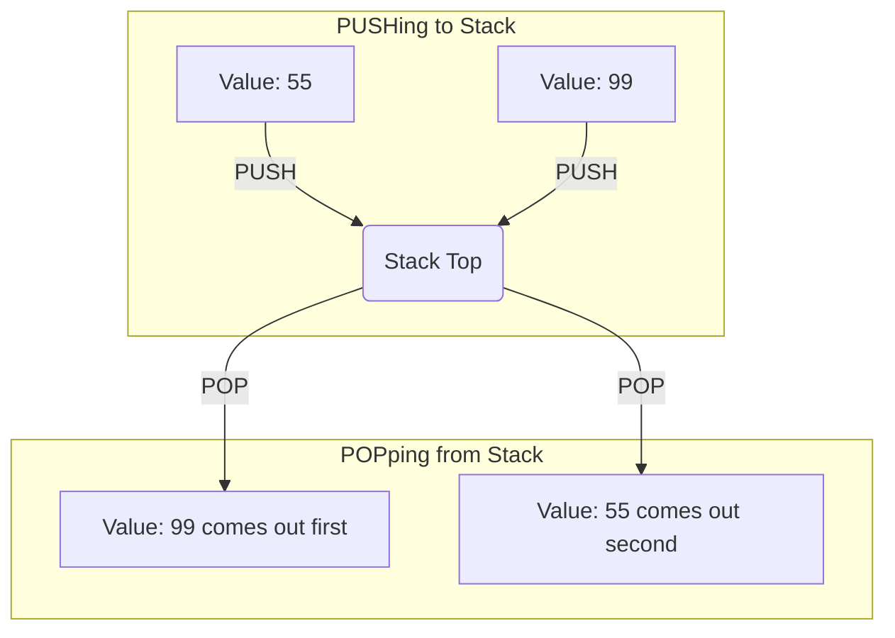

# The Stack

The **Stack** is a special area of memory used to hold temporary data. Think of a stack of heavy plates at a buffet. You can only add a plate to the very top, and you can only remove a plate from the very top. 

If you try to pull a plate from the bottom, the whole stack crashes. This is exactly how the processor stack works. It is a limited-access data structure operating on a strict **Last-In, First-Out (LIFO)** principle. 

---

## 1. Stack Operations: PUSH and POP

There are two primary instructions that work with the stack:
*   **`PUSH src`**: Takes a 16-bit value and places it on the *top* of the stack.
*   **`POP dest`**: Removes the 16-bit value from the *top* of the stack and puts it into the destination.

Because it is LIFO, if you PUSH the numbers `1, 2, 3`, the first time you POP, you will receive the `3`. The next POP gives `2`, and the last gives `1`.



### Why use the Stack?
The CPU has a very limited number of general-purpose registers (AX, BX, CX, DX). If you run out of registers during a complex calculation, you can use the stack as a temporary holding zone:
1. `PUSH AX` (Save the current important value of AX safely on the stack).
2. Do whatever math you want with AX.
3. `POP AX` (Restore the original important value back into AX from the stack).

## 2. The Stack Pointer (SP)

The CPU keeps track of where the top of the stack is using a special register called the **Stack Pointer (SP)**. 
*   When you `PUSH`, the CPU subtracts 2 from SP (the stack grows downwards in memory) and writes the data.
*   When you `POP`, the CPU reads the data and adds 2 to SP.

---

## Worked Examples

### Example 1: Exchanging Values Using the Stack
This program swaps the values of AX and BX without using a third temporary register.

```assembly
ORG 100h 
include emu8086.inc 

MOV AX, 25      ; Store 25 in AX
MOV BX, 30      ; Store 30 in BX 

PUSH AX         ; Stack now holds: [25]
PUSH BX         ; Stack now holds: [30, 25] (30 is on top)

POP AX          ; Removes top (30) and puts it in AX. Stack: [25]
POP BX          ; Removes top (25) and puts it in BX. Stack: Empty.

; AX is now 30. BX is now 25.
call print_num 
ret 
define_print_num 
define_print_num_uns 
END 
```

### Example 2: Reversing a String
Because the stack is LIFO, pushing the letters `A B C` and then popping them will yield `C B A`.

```assembly
mov ax, 'A'
push ax
mov ax, 'B'
push ax
mov ax, 'C'
push ax

pop dx      ; DX gets 'C'
pop dx      ; DX gets 'B'
pop dx      ; DX gets 'A'
```

---

## Key Takeaways
*   **The Stack is LIFO.** The last thing pushed is the first thing popped.
*   **Always balance PUSH and POP.** If you PUSH 3 items but only POP 2 items, the stack is corrupted. If this happens inside a procedure, the `RET` command will crash the program.
*   The stack only works with 16-bit registers or memory (you cannot `PUSH AL`).

---

## Exam Tips
> 🎓 **What Lecturers Typically Test**
> *   **Stack Tracing:** You will be given a sequence of PUSH and POP commands and asked what values are in specific registers at the end. (See Example 1). Draw the stack on paper during the exam to avoid getting confused by the LIFO order!
> *   **Stack Corruption:** They may ask "Why did this program crash?" and show code where a procedure does a PUSH but forgets to POP before calling RET. Understand that `RET` mindlessly pulls whatever is at the top of the stack.
