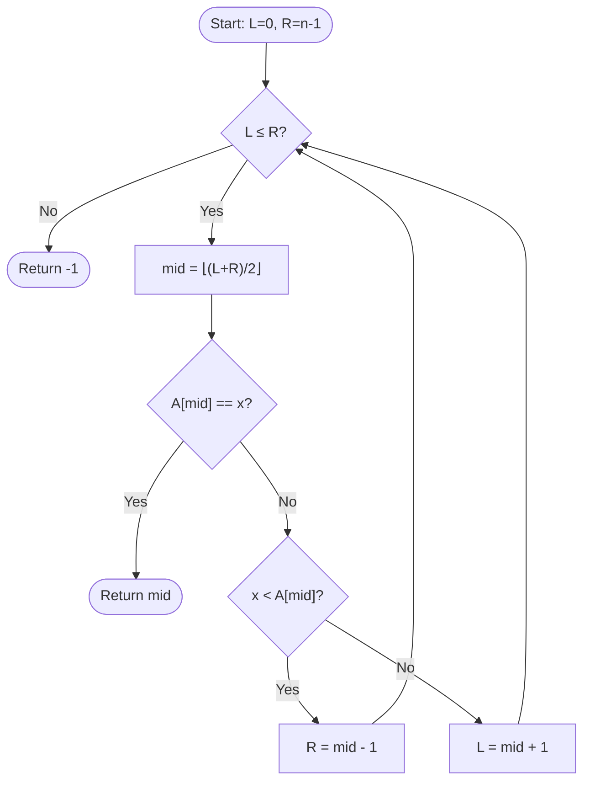

## The Power of Sorted Order

Sequential search does not care whether the array is sorted — it checks every element. But what if the array **is** sorted? Can we do better?

**Analogy:** You are looking up a name in a phone book (sorted alphabetically). You do not start at page 1. You open the book roughly in the middle, see if your name comes before or after the midpoint, then open to the appropriate half, and repeat. With each step, you eliminate half the remaining pages.

This is **binary search**: exploit the sorted order to halve the problem at every step.

---

## Prerequisite: The Array Must Be Sorted

Binary search only works correctly on a **sorted** array. If the array is not sorted, the result is undefined.

$A = [1, 3, 5, 7, 9, 11, 13, 15]$ ← binary search works  
$A = [3, 9, 7, 1, 5]$ ← binary search does NOT work

---

## The Algorithm (Iterative)

**Input:** Sorted array $A[0 \ldots n-1]$, target $x$.  
**Output:** Index $i$ such that $A[i] = x$, or $-1$ if $x \notin A$.

```
ALGORITHM BinarySearch(A, n, x):
  L = 0              // left boundary of search region
  R = n - 1          // right boundary of search region

  WHILE L <= R DO:
    mid = (L + R) / 2          // middle index (floor division)
    IF A[mid] == x THEN
      RETURN mid               // found
    ELSE IF x < A[mid] THEN
      R = mid - 1              // search left half
    ELSE
      L = mid + 1              // search right half

  RETURN -1                    // not found
```



---

## Step-by-Step Trace

**Example 1:** Search for $x = 7$ in $A = [1, 3, 5, 7, 9, 11, 13, 15]$ (indices $0$–$7$)

| Iteration | $L$ | $R$ | $\text{mid}$ | $A[\text{mid}]$ | Decision |
|---|---|---|---|---|---|
| 1 | 0 | 7 | 3 | 7 | $7 = 7$ → **return 3** |

One comparison! Found at index 3.

**Example 2:** Search for $x = 11$ in the same array.

| Iteration | $L$ | $R$ | $\text{mid}$ | $A[\text{mid}]$ | Decision |
|---|---|---|---|---|---|
| 1 | 0 | 7 | 3 | 7 | $11 > 7$ → $L = 4$ |
| 2 | 4 | 7 | 5 | 11 | $11 = 11$ → **return 5** |

Two comparisons. Found at index 5.

**Example 3:** Search for $x = 4$ (not present).

| Iteration | $L$ | $R$ | $\text{mid}$ | $A[\text{mid}]$ | Decision |
|---|---|---|---|---|---|
| 1 | 0 | 7 | 3 | 7 | $4 < 7$ → $R = 2$ |
| 2 | 0 | 2 | 1 | 3 | $4 > 3$ → $L = 2$ |
| 3 | 2 | 2 | 2 | 5 | $4 < 5$ → $R = 1$ |
| 4 | $L=2 > R=1$ | — | — | — | Exit loop → **return -1** |

Four comparisons. Not found.

---

## Recursive Version

Binary search can also be expressed recursively:

```
ALGORITHM BinarySearchRec(A, L, R, x):
  IF L > R THEN
    RETURN -1                          // base case: empty region

  mid = (L + R) / 2
  IF A[mid] == x THEN
    RETURN mid                         // base case: found
  ELSE IF x < A[mid] THEN
    RETURN BinarySearchRec(A, L, mid-1, x)  // search left
  ELSE
    RETURN BinarySearchRec(A, mid+1, R, x)  // search right
```

Initial call: `BinarySearchRec(A, 0, n-1, x)`

---

## Complexity Analysis

### Counting Iterations

Each iteration eliminates half the remaining search region. Starting with $n$ elements:

| After iteration | Search region size |
|---|---|
| 0 (start) | $n$ |
| 1 | $\lfloor n/2 \rfloor$ |
| 2 | $\lfloor n/4 \rfloor$ |
| $k$ | $\lfloor n/2^k \rfloor$ |

The loop terminates when the region has size 0:

$$\frac{n}{2^k} < 1 \implies 2^k > n \implies k > \log_2 n$$

So the loop runs at most $\lceil \log_2 n \rceil + 1$ iterations.

$$T_\text{worst}(n) = O(\log n)$$

### Best and Average Cases

- **Best case:** $x = A[\lfloor n/2 \rfloor]$ — found on the first comparison. $O(1)$.
- **Average case:** $O(\log n)$ — most searches take close to $\log_2 n$ comparisons.
- **Worst case:** Not found, or element is at the far end. $O(\log n)$.

### The Dramatic Difference from Linear Search

| $n$ | Linear Search (worst) | Binary Search (worst) |
|---|---|---|
| 16 | 16 | 4 |
| 1,000 | 1,000 | 10 |
| 1,000,000 | 1,000,000 | 20 |
| 1,000,000,000 | 1,000,000,000 | 30 |

One billion elements. Binary search needs 30 comparisons. Linear search needs a billion.

---

## Recurrence for Binary Search

The recursive version gives us a recurrence:

$$T(n) = T(n/2) + c$$

where $c$ is a constant (the work done per call: one comparison plus some arithmetic).

By the Master Theorem (Case 2 with $f(n) = c = O(1)$ and $n^{\log_b a} = n^{\log_2 1} = n^0 = 1$):

$$T(n) = O(\log n)$$

Alternatively by unrolling:

$$T(n) = T(n/2) + c = T(n/4) + 2c = \cdots = T(1) + c\log_2 n = O(\log n)$$

---

## Worked Example: Exam Question Style

**Problem:** Apply binary search to find $x = 23$ in:

$$A = [2, 5, 8, 12, 16, 23, 38, 56, 72, 91]$$

(10 elements, indices $0$–$9$)

**Solution:**

| Iteration | $L$ | $R$ | $\text{mid}$ | $A[\text{mid}]$ | Action |
|---|---|---|---|---|---|
| 1 | 0 | 9 | 4 | 16 | $23 > 16 \Rightarrow L = 5$ |
| 2 | 5 | 9 | 7 | 56 | $23 < 56 \Rightarrow R = 6$ |
| 3 | 5 | 6 | 5 | 23 | $23 = 23 \Rightarrow$ **return 5** |

Found at index 5 in 3 comparisons. Maximum possible comparisons: $\lceil \log_2 10 \rceil = 4$.

---

## Common Bug: Integer Overflow

In many implementations, `mid = (L + R) / 2` can cause integer overflow when $L$ and $R$ are very large. The safe version is:

$$\text{mid} = L + \lfloor (R - L) / 2 \rfloor$$

This computes the same value but never overflows.

---

## Key Takeaway

> Binary search finds a target in a sorted array of $n$ elements in $O(\log n)$ time by eliminating half the search space at each step. It is dramatically faster than sequential search for large arrays. The trade-off is that the array **must be sorted** first — if you sort and then search, that is $O(n \log n + \log n) = O(n \log n)$ total. For multiple searches on the same data, sort once and binary-search many times.

---

## Exam Tips

**What lecturers test:**
- Trace binary search step by step on a given sorted array — showing $L$, $R$, $\text{mid}$, and $A[\text{mid}]$ at each step
- Derive the $O(\log n)$ complexity from the recurrence $T(n) = T(n/2) + c$
- State the precondition (must be sorted) and what happens if violated

**Common mistakes:**
- Using binary search on an unsorted array — it gives wrong results, not slower results
- Off-by-one errors: `R = mid - 1` (not `R = mid`) when discarding the left half
- Forgetting the base case check `L > R` — without it the algorithm loops forever when the element is absent

**Likely question:**
> "Write the iterative binary search algorithm. Trace it on array $[3, 7, 10, 15, 22, 30]$ searching for 15. How many comparisons does it perform? Prove the worst-case time complexity is $O(\log n)$." (12 marks)
