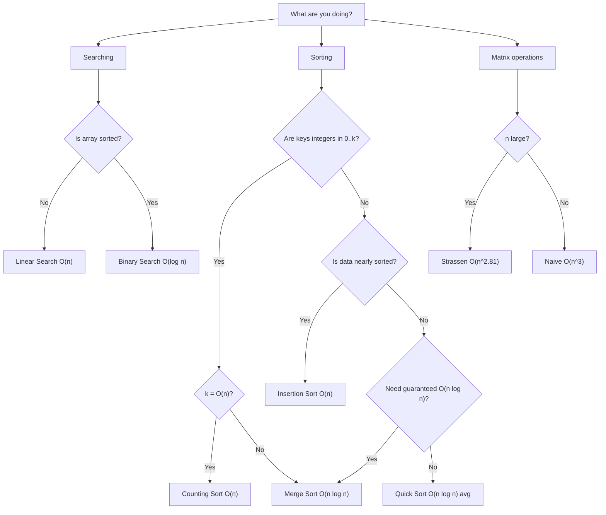

## Your Algorithm Analysis Reference

This topic consolidates every algorithm studied in CSC 236 into comparative tables. Use this as your quick-reference guide before exams and when choosing algorithms for a given problem.

---

## 1. Sorting Algorithms — Complete Comparison

| Algorithm | Best Case | Average Case | Worst Case | Space | Stable? | Method |
|---|---|---|---|---|---|---|
| Bubble Sort | $O(n)$* | $O(n^2)$ | $O(n^2)$ | $O(1)$ | Yes | Exchange |
| Selection Sort | $O(n^2)$ | $O(n^2)$ | $O(n^2)$ | $O(1)$ | No | Selection |
| Insertion Sort | $O(n)$ | $O(n^2)$ | $O(n^2)$ | $O(1)$ | Yes | Insertion |
| Merge Sort | $O(n \log n)$ | $O(n \log n)$ | $O(n \log n)$ | $O(n)$ | Yes | D&C |
| Quick Sort | $O(n \log n)$ | $O(n \log n)$ | $O(n^2)$ | $O(\log n)$ | No | D&C |
| Heap Sort | $O(n \log n)$ | $O(n \log n)$ | $O(n \log n)$ | $O(1)$ | No | Selection |
| Counting Sort | $O(n+k)$ | $O(n+k)$ | $O(n+k)$ | $O(n+k)$ | Yes | Non-cmp |
| Radix Sort | $O(dn)$ | $O(dn)$ | $O(dn)$ | $O(n+k)$ | Yes | Non-cmp |

*With early-exit optimisation

**Key for special conditions:**
- Counting Sort: requires keys in $[0, k]$; most efficient when $k = O(n)$
- Radix Sort: requires $d$-digit keys; each digit in $[0, k]$
- Quick Sort space: $O(\log n)$ for recursion stack in average case; $O(n)$ worst case

---

## 2. Searching Algorithms

| Algorithm | Best Case | Average Case | Worst Case | Prerequisite |
|---|---|---|---|---|
| Linear Search | $O(1)$ | $O(n)$ | $O(n)$ | None |
| Binary Search | $O(1)$ | $O(\log n)$ | $O(\log n)$ | Sorted array |
| Jump Search | $O(1)$ | $O(\sqrt{n})$ | $O(\sqrt{n})$ | Sorted array |

---

## 3. Divide and Conquer Algorithms

| Algorithm | Recurrence | Complexity | Case |
|---|---|---|---|
| Binary Search | $T(n) = T(n/2) + 1$ | $O(\log n)$ | All |
| Merge Sort | $T(n) = 2T(n/2) + n$ | $O(n \log n)$ | All |
| Quick Sort (avg) | $T(n) = 2T(n/2) + n$ | $O(n \log n)$ | Average |
| Quick Sort (worst) | $T(n) = T(n-1) + n$ | $O(n^2)$ | Worst |
| Naive Matrix Mult. | $T(n) = 8T(n/2) + n^2$ | $O(n^3)$ | All |
| Strassen | $T(n) = 7T(n/2) + n^2$ | $O(n^{2.807})$ | All |
| Karatsuba | $T(n) = 3T(n/2) + n$ | $O(n^{1.585})$ | All |

---

## 4. Growth Rate Hierarchy

From fastest to slowest-growing (most to least efficient):

$$O(1) \ll O(\log n) \ll O(\sqrt{n}) \ll O(n) \ll O(n \log n) \ll O(n^2) \ll O(n^3) \ll O(2^n) \ll O(n!)$$

**Practical significance for $n = 10^6$:**

| Class | Operations | Feasible in 1 sec? |
|---|---|---|
| $O(1)$ | 1 | ✅ |
| $O(\log n)$ | ~20 | ✅ |
| $O(\sqrt{n})$ | ~1,000 | ✅ |
| $O(n)$ | 1,000,000 | ✅ |
| $O(n \log n)$ | ~20,000,000 | ✅ |
| $O(n^2)$ | $10^{12}$ | ❌ |
| $O(2^n)$ | $10^{301,030}$ | ❌ |

---

## 5. Master Theorem Quick Reference

For $T(n) = aT(n/b) + f(n)$, compare $f(n)$ to $n^{\log_b a}$:

| Comparison | Case | Solution |
|---|---|---|
| $f(n) = O(n^{\log_b a - \varepsilon})$ | Case 1 (leaves dominate) | $T(n) = \Theta(n^{\log_b a})$ |
| $f(n) = \Theta(n^{\log_b a})$ | Case 2 (equal) | $T(n) = \Theta(n^{\log_b a} \log n)$ |
| $f(n) = \Omega(n^{\log_b a + \varepsilon})$ | Case 3 (root dominates) | $T(n) = \Theta(f(n))$ |

**Quick examples:**

| Recurrence | $n^{\log_b a}$ | $f(n)$ | Case | Answer |
|---|---|---|---|---|
| $T(n) = T(n/2) + 1$ | $n^0=1$ | $1$ | 2 | $\Theta(\log n)$ |
| $T(n) = 2T(n/2)+n$ | $n$ | $n$ | 2 | $\Theta(n\log n)$ |
| $T(n) = 4T(n/2)+n$ | $n^2$ | $n$ | 1 | $\Theta(n^2)$ |
| $T(n) = 4T(n/2)+n^3$ | $n^2$ | $n^3$ | 3 | $\Theta(n^3)$ |
| $T(n) = 7T(n/2)+n^2$ | $n^{2.807}$ | $n^2$ | 1 | $\Theta(n^{2.807})$ |

---

## 6. Randomized Algorithms Summary

| Algorithm | Type | Time | Correctness |
|---|---|---|---|
| Randomized Quick Sort | Las Vegas | $E[T] = O(n \log n)$ | Always correct |
| QuickSelect | Las Vegas | $E[T] = O(n)$ | Always correct |
| Fermat Primality (k trials) | Monte Carlo | $O(k \log n)$ | Error $\leq (1/2)^k$ |
| Freivalds' Verification | Monte Carlo | $O(kn^2)$ | Error $\leq (1/2)^k$ |
| Monte Carlo $\pi$ estimation | Monte Carlo | $O(N)$ | Approximation |

---

## 7. Lower Bounds Reference

| Problem | Lower Bound | Proof Technique |
|---|---|---|
| Comparison-based sorting | $\Omega(n \log n)$ | Decision tree: $n!$ leaves needs height $\geq \log_2(n!)$ |
| Searching in sorted array | $\Omega(\log n)$ | Binary decision: each comparison halves possibilities |
| Finding max element | $\Omega(n)$ | Information-theoretic: must see every element |
| Matrix multiplication (known result) | $\Omega(n^2)$ | Must read $n^2$ entries |

---

## 8. Choosing the Right Algorithm: Decision Guide

---

## 9. Summary of Proof Techniques

| Proof Goal | Technique | Key Tool |
|---|---|---|
| Algorithm correctness | Loop invariant | Init + Maintenance + Termination |
| Upper bound $O(f(n))$ | Count operations, simplify | Summation formulas |
| Tight bound $\Theta(f(n))$ | Count operations exactly | Sum formulas + lower bound argument |
| Solving recurrences | Master Theorem | Compare $f(n)$ vs $n^{\log_b a}$ |
| Solving recurrences | Substitution | Unroll $k$ steps, spot pattern |
| Lower bound proof | Decision tree | $n!$ leaves → height $\geq \log n!$ |
| Probabilistic analysis | Linearity of expectation + indicators | $E[X_i] = P(A_i)$ |

---

## 10. Quick Formulas

$$\sum_{i=1}^{n} i = \frac{n(n+1)}{2}$$

$$\sum_{i=0}^{k} 2^i = 2^{k+1} - 1$$

$$\log_2(n!) = \Omega(n \log n)$$

$$\log_b n = \frac{\log_a n}{\log_a b} \quad \text{(change of base)}$$

$$H_n = \sum_{k=1}^{n} \frac{1}{k} = \ln n + O(1) = O(\log n) \quad \text{(harmonic numbers)}$$

$$\text{2's complement of } x: \text{invert all bits, add 1}$$

---

## Key Takeaway

> The hierarchy $O(\log n) < O(n) < O(n \log n) < O(n^2) < O(n^3) < O(2^n)$ determines algorithm feasibility. For sorting: Merge Sort is the safest all-purpose choice ($O(n \log n)$, stable, correct in all cases); use Counting/Radix Sort when keys are bounded integers for linear time. For searching: Binary Search whenever the array is sorted. The Master Theorem handles most divide-and-conquer recurrences; decision trees prove sorting lower bounds.

---

## Exam Tips

**How to use this topic in exams:**
- When asked to compare two algorithms, use the tables above as your structure
- When asked to justify a choice of algorithm, cite the conditions (sorted? integer keys? nearly sorted?) and match to the table
- When asked for a complexity, state best/average/worst separately unless only one is asked for

**High-value exam areas:**
- Merge Sort vs Quick Sort comparison (all properties)
- Master Theorem application to 3 or more recurrences
- Decision tree lower bound proof
- When does Counting Sort beat Merge Sort?

**Likely question:**
> "Compare Merge Sort and Quick Sort on correctness, time complexity (all three cases), space complexity, and stability. For what input types would you choose each?" (12 marks)
