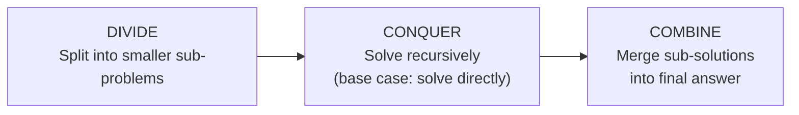

## The Divide and Conquer Paradigm

Some problems become dramatically easier if you split them into smaller, identical sub-problems, solve each, and combine the results. This is the **divide and conquer** strategy — one of the most powerful algorithm design techniques.

**Real-world analogy:** A large company with 10,000 employees wants to find the employee with the highest sales. The CEO does not personally check all 10,000 records. Instead, each department head finds their department's top salesperson, and the CEO compares only those. The problem is divided, solved in pieces, and the results are combined.

**Three steps:**



---

## Part 1: Merge Sort

### The Algorithm

Merge Sort is the prototypical divide-and-conquer sorting algorithm.

**Step 1 — Divide:** Split the $n$-element array into two halves of $\lfloor n/2 \rfloor$ and $\lceil n/2 \rceil$ elements.

**Step 2 — Conquer:** Recursively sort each half (base case: array of size 1 is already sorted).

**Step 3 — Combine (Merge):** Merge the two sorted halves into a single sorted array.

### Pseudocode

```
ALGORITHM MergeSort(A, p, r):
  IF p < r THEN                          // more than one element
    q = floor((p + r) / 2)              // find midpoint
    MergeSort(A, p, q)                   // sort left half
    MergeSort(A, q + 1, r)              // sort right half
    Merge(A, p, q, r)                   // combine
```

Initial call: `MergeSort(A, 0, n-1)`

### The Merge Procedure

The `Merge` step takes two **sorted** sub-arrays and combines them into one sorted sub-array in $O(n)$ time.

```
ALGORITHM Merge(A, p, q, r):
  // Copy into temporary arrays L and R
  Create L[0..q-p] and R[0..r-q-1]
  FOR i FROM 0 TO q - p: L[i] = A[p + i]
  FOR j FROM 0 TO r - q - 1: R[j] = A[q + 1 + j]
  L[q-p+1] = ∞; R[r-q] = ∞   // sentinel values

  i = 0; j = 0
  FOR k FROM p TO r:
    IF L[i] <= R[j] THEN
      A[k] = L[i]; i = i + 1
    ELSE
      A[k] = R[j]; j = j + 1
```

**How Merge works (analogy):** Two piles of sorted cards face up on a table. You repeatedly take the smaller of the two top cards and put it in the output pile. The sentinel $\infty$ acts as a dummy card that is always "larger" — so when one pile is exhausted, the other pile just flows in.

### Full Trace

**Input:** $A = [5, 2, 4, 7, 1, 3, 2, 6]$

```
Split: [5,2,4,7]            [1,3,2,6]
Split: [5,2]  [4,7]         [1,3]  [2,6]
Split: [5][2] [4][7]        [1][3] [2][6]
Merge: [2,5]  [4,7]         [1,3]  [2,6]
Merge:    [2,4,5,7]              [1,2,3,6]
Merge:          [1,2,2,3,4,5,6,7]
```

The merge operations "build up" sorted arrays from single elements.

### Correctness (Loop Invariant of Merge)

**Invariant:** At the start of each iteration of the `for k` loop, sub-array $A[p \ldots k-1]$ contains the $(k-p)$ smallest elements of $L$ and $R$ combined, in sorted order.

- **Initialisation:** Before the loop, $A[p \ldots p-1]$ is empty — contains 0 smallest elements. ✓
- **Maintenance:** We pick the smaller of $L[i]$ and $R[j]$, which is the next smallest. Appending it maintains the invariant. ✓
- **Termination:** When $k = r+1$, $A[p \ldots r]$ contains all $r-p+1$ elements, sorted. ✓

### Complexity Analysis

**Recurrence:**

$$T(n) = \underbrace{2T(n/2)}_{\text{two recursive calls}} + \underbrace{O(n)}_{\text{merge step}}$$

**Recursion tree — "work per level" method:**

| Level | Sub-problems | Size each | Total work |
|---|---|---|---|
| 0 | 1 | $n$ | $cn$ |
| 1 | 2 | $n/2$ | $2 \times cn/2 = cn$ |
| 2 | 4 | $n/4$ | $4 \times cn/4 = cn$ |
| $k$ | $2^k$ | $n/2^k$ | $cn$ |
| $\log_2 n$ | $n$ | $1$ | $cn$ |

Total levels: $\log_2 n + 1$. Work per level: $cn$. Total:

$$T(n) = cn(\log_2 n + 1) = O(n \log n)$$

**This is optimal** — we will prove in Topic 18 that no comparison sort can do better than $\Omega(n \log n)$.

| Case | Complexity |
|---|---|
| Best | $O(n \log n)$ |
| Average | $O(n \log n)$ |
| Worst | $O(n \log n)$ |

Merge Sort is $\Theta(n \log n)$ in all cases — unlike Quick Sort which degrades to $O(n^2)$ in the worst case.

**Space complexity:** $O(n)$ extra space for the temporary arrays $L$ and $R$.

---

## Part 2: Scalar Multiplication and the Divide-and-Conquer Insight

### Naive Approach

Computing $a \times b$ for two large $n$-digit integers (or an $n \times n$ matrix by scalar) using naive long multiplication takes $O(n^2)$ digit operations (each digit of one number multiplied by each digit of the other).

Can divide and conquer do better?

### Karatsuba's Algorithm (Integer Multiplication)

Given two $n$-digit integers $x$ and $y$, split each into two halves:

$$x = x_1 \cdot 10^{n/2} + x_0, \quad y = y_1 \cdot 10^{n/2} + y_0$$

**Naive multiply via components:**
$$xy = x_1 y_1 \cdot 10^n + (x_1 y_0 + x_0 y_1) \cdot 10^{n/2} + x_0 y_0$$

This needs **4 recursive multiplications** ($x_1 y_1$, $x_1 y_0$, $x_0 y_1$, $x_0 y_0$), giving recurrence $T(n) = 4T(n/2) + O(n)$.

By Master Theorem Case 1: $T(n) = O(n^{\log_2 4}) = O(n^2)$. No improvement!

**Karatsuba's trick:** Compute only **3** multiplications:
1. $p = x_1 y_1$
2. $q = x_0 y_0$
3. $r = (x_1 + x_0)(y_1 + y_0)$

Then: $x_1 y_0 + x_0 y_1 = r - p - q$

Recurrence: $T(n) = 3T(n/2) + O(n)$

By Master Theorem Case 1: $a=3$, $b=2$, $\log_2 3 \approx 1.585 > 1$, so $T(n) = O(n^{\log_2 3}) = O(n^{1.585})$.

**Comparison:**
- Naive: $O(n^2)$
- Karatsuba: $O(n^{1.585})$

For $n = 1000$ digits: naive does $10^6$ operations; Karatsuba does about $10^{4.75} \approx 56{,}000$.

---

## Why Divide and Conquer Beats Brute Force

The key insight is the **savings from the combine step**.

If we can reduce the number of recursive calls below what naive splitting would require, the exponent in the complexity shrinks below the naive bound.

| Subproblems | per call | Recurrence | Complexity |
|---|---|---|---|
| 4 | $T(n) = 4T(n/2) + O(n)$ | $O(n^2)$ (no improvement) |
| 3 (Karatsuba) | $T(n) = 3T(n/2) + O(n)$ | $O(n^{1.585})$ |
| 2 (Merge Sort) | $T(n) = 2T(n/2) + O(n)$ | $O(n \log n)$ |
| 1 (Binary Search) | $T(n) = T(n/2) + O(1)$ | $O(\log n)$ |

The fewer sub-problems we create (per level of recursion), the better the asymptotic complexity.

---

## Key Takeaway

> Divide and Conquer solves problems by recursively splitting them into sub-problems, then combining results. Merge Sort achieves $O(n \log n)$ in all cases by spending $O(n)$ time merging two sorted halves — this is optimal for comparison-based sorting. Karatsuba's algorithm shows the same idea applied to multiplication: by saving one recursive call (3 instead of 4), the exponent drops from 2 to 1.585. The power is in the combination step — keep it cheap, keep it $O(n)$ or less.

---

## Exam Tips

**What lecturers test:**
- Trace Merge Sort on a small array (8 elements) — show all split and merge steps
- Derive the recurrence $T(n) = 2T(n/2) + O(n)$ and solve to $O(n \log n)$
- Prove the Merge procedure's loop invariant
- Compare Merge Sort and Insertion Sort: when would you prefer each?

**Common mistakes:**
- Forgetting the `q = floor((p+r)/2)` split (should produce equal halves)
- In the Merge trace, forgetting to copy elements to temporary arrays L and R first
- Confusing the merge with a sort: Merge assumes both halves are already sorted; it only merges

**Likely question:**
> "Write the Merge Sort algorithm and trace it on $[8, 3, 1, 5, 4, 2, 7, 6]$. Derive the time complexity using the recursion tree method." (16 marks)
