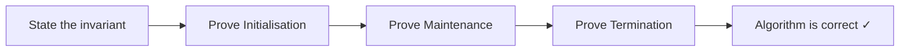

## Why "It Looks Right" Is Not Enough

Suppose you write a sorting algorithm, test it on five examples, and it works every time. Is it correct? Not necessarily. There could be an edge case — a particular input of size 10,000 — where it fails. Testing shows presence of bugs, not absence.

**Loop invariants** give us a way to *prove* correctness for **all inputs**, not just the ones we tested.

**Real-world analogy:** A structural engineer designing a bridge does not just drive across it a few times and say "seems fine." They write mathematical proofs that the bridge can hold a specified load under specified conditions. A loop invariant is the mathematical certificate that a loop is structurally sound.

---

## What is a Loop Invariant?

A **loop invariant** is a property that:

1. Is true **before** the loop starts (initialisation)
2. If true at the **start** of any iteration, remains true at the **end** of that iteration (maintenance)
3. When the loop **terminates**, gives us the result we wanted (termination)

If you can prove all three, the loop is correct for all inputs.

Think of it like a safety harness: if the harness is properly fitted at the start, and each clip holds throughout, you are safe when you reach the end.

---

## The Three-Part Proof Structure

### Initialisation
Show the invariant holds before the first iteration. (Like checking the harness before you start climbing.)

### Maintenance
Assume the invariant holds at the start of some iteration $k$. Show it still holds at the start of iteration $k+1$. (Like checking each clip holds before moving to the next.)

### Termination
When the loop ends, use the invariant (and the loop termination condition) to conclude the algorithm is correct. (The harness kept you safe all the way to the top.)

---

## Example 1: Finding the Maximum Element

```
ALGORITHM FindMax(A, n):
  max = A[0]
  FOR i FROM 1 TO n - 1 DO:
    IF A[i] > max THEN
      max = A[i]
  RETURN max
```

**Claim:** At the start of each iteration $i$, `max` equals the maximum value in $A[0 \ldots i-1]$.

### Initialisation ($i = 1$)
Before the loop starts: `max = A[0]`. The sub-array $A[0 \ldots 0]$ contains just one element, $A[0]$. Its maximum is $A[0]$. The invariant holds. ✓

### Maintenance
Assume at the start of iteration $i$, `max` = maximum of $A[0 \ldots i-1]$.

After the body executes:
- If $A[i] > \text{max}$: `max` is updated to $A[i]$, which is the maximum of $A[0 \ldots i]$. ✓
- If $A[i] \leq \text{max}$: `max` is unchanged, still the maximum of $A[0 \ldots i-1]$, which is also the maximum of $A[0 \ldots i]$ (since $A[i]$ is not larger). ✓

Either way, at the start of iteration $i+1$, `max` = maximum of $A[0 \ldots i]$. ✓

### Termination
The loop ends when $i = n$. At that point, the invariant tells us `max` = maximum of $A[0 \ldots n-1]$, which is the entire array. The algorithm correctly returns the maximum. $\blacksquare$

---

## Example 2: Linear Search

```
ALGORITHM LinearSearch(A, n, x):
  FOR i FROM 0 TO n - 1 DO:
    IF A[i] == x THEN
      RETURN i
  RETURN -1
```

**Invariant:** At the start of iteration $i$, $x \notin \{A[0], A[1], \ldots, A[i-1]\}$ — that is, $x$ has not been found in the elements examined so far.

### Initialisation ($i = 0$)
Before the loop: no elements have been examined, so trivially $x$ is not in the empty set $\{A[0], \ldots, A[-1]\}$. ✓

### Maintenance
If we reach the start of iteration $i$ (meaning we did not return inside the loop yet), then $A[i-1] \neq x$ (otherwise we would have returned). So the invariant still holds: $x \notin \{A[0], \ldots, A[i-1]\}$. ✓

### Termination
If the loop completes all $n$ iterations without returning, the invariant holds for $i = n$: $x \notin \{A[0], \ldots, A[n-1]\}$, meaning $x$ is not in the array. Returning $-1$ is correct. $\blacksquare$

---

## Example 3: Insertion Sort (from CLRS textbook)

This is the classic example of a loop invariant proof used in most algorithms textbooks.

```
ALGORITHM InsertionSort(A, n):
  FOR j FROM 1 TO n - 1 DO:
    key = A[j]
    i = j - 1
    WHILE i >= 0 AND A[i] > key DO:
      A[i + 1] = A[i]
      i = i - 1
    A[i + 1] = key
```

**Invariant (outer loop):** At the start of each iteration of the outer loop (each value of $j$), the sub-array $A[0 \ldots j-1]$ consists of the elements originally in $A[0 \ldots j-1]$ but in **sorted order**.

### Initialisation ($j = 1$)
The sub-array $A[0 \ldots 0]$ has a single element, $A[0]$. A single-element array is trivially sorted. ✓

### Maintenance
Assume at the start of iteration $j$, $A[0 \ldots j-1]$ is sorted.

The inner `WHILE` loop shifts elements of $A[0 \ldots j-1]$ that are greater than `key` one position to the right, then inserts `key` in the correct position. The resulting $A[0 \ldots j]$ contains the original elements of $A[0 \ldots j]$ in sorted order.

At the start of the next iteration ($j+1$), the invariant holds for $A[0 \ldots j]$. ✓

### Termination
The outer loop terminates when $j = n$. The invariant tells us $A[0 \ldots n-1]$ is sorted — the entire array. The algorithm is correct. $\blacksquare$

---

## Example 4: Binary Search Loop Invariant

```
WHILE L <= R DO:
  mid = (L + R) / 2
  IF A[mid] == x THEN RETURN mid
  ELSE IF x < A[mid] THEN R = mid - 1
  ELSE L = mid + 1
RETURN -1
```

**Invariant:** At the start of each iteration, if $x$ is in $A$, then $x \in A[L \ldots R]$.

### Initialisation
$L = 0$, $R = n-1$. $A[0 \ldots n-1]$ is the whole array. If $x$ is in $A$, it is certainly in $A[0 \ldots n-1]$. ✓

### Maintenance
At the start of an iteration, suppose $x \in A[L \ldots R]$.

We compute `mid`. Three cases:
- $A[\text{mid}] = x$: we return `mid` — the algorithm is done correctly.
- $x < A[\text{mid}]$: since $A$ is sorted, $x$ cannot be in $A[\text{mid} \ldots R]$. So if $x$ exists, $x \in A[L \ldots \text{mid}-1]$. We set $R = \text{mid}-1$ and the invariant holds. ✓
- $x > A[\text{mid}]$: similarly, $x \in A[\text{mid}+1 \ldots R]$. Set $L = \text{mid}+1$. ✓

### Termination
If $L > R$, the region $A[L \ldots R]$ is empty. By the invariant, if $x$ were in $A$, it would be in this empty region — which is impossible. So $x$ is not in $A$. Return $-1$. ✓ $\blacksquare$

---

## The MERGE Loop Invariant (Merge Sort)

For completeness, the `MERGE` procedure has a well-known invariant (from CLRS):

**Invariant:** At the start of each iteration of the `for k` loop, the sub-array $A[p \ldots k-1]$ contains the $k-p$ smallest elements of $L$ and $R$, in sorted order. Moreover, $L[i]$ and $R[j]$ are the smallest elements of their arrays not yet copied into $A$.

This invariant drives the full correctness proof of Merge Sort.

---

## Summary: Proving Loop Correctness



| Part | What to show | Analogy |
|---|---|---|
| Initialisation | Invariant holds before first iteration | Harness fitted correctly at start |
| Maintenance | If true at start of iteration $k$, true at start of $k+1$ | Each clip holds as you move up |
| Termination | Invariant + loop condition being false ⇒ correctness | Safely at the top |

---

## Key Takeaway

> A loop invariant is a property that holds before the loop, is maintained by each iteration, and at termination implies correctness. The three-part proof — Initialisation, Maintenance, Termination — is the standard format for proving loop-based algorithms correct. It works for any loop: search, sort, computation.

---

## Exam Tips

**What lecturers test:**
- Write a loop invariant for FindMax, LinearSearch, InsertionSort, or BinarySearch
- Prove all three parts (init, maintenance, termination) in full
- Identify which part of a given flawed proof is wrong

**Common mistakes:**
- Stating the invariant vaguely ("the array is partially sorted") — it must be precise enough to prove
- Proving maintenance by restating the invariant without showing *why* the body maintains it
- Forgetting the termination step — you must combine invariant + exit condition to draw the conclusion

**Likely question:**
> "State a loop invariant for the following loop that finds the minimum of an array. Prove it using the three-part method (Initialisation, Maintenance, Termination)." (12 marks)
