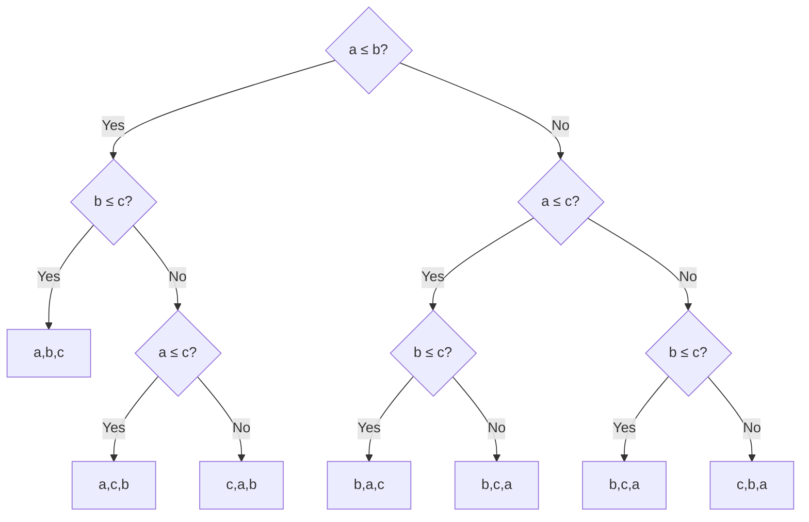

## What Is a Lower Bound?

An upper bound says: "here is an algorithm that solves the problem in time $f(n)$."

A **lower bound** says: "no algorithm — no matter how clever — can solve this problem in less than $g(n)$ time."

Upper bounds come from algorithms. Lower bounds come from **impossibility proofs** — we prove that any algorithm must do at least this much work.

**Real-world analogy:** Suppose you need to find a specific card in a shuffled deck of 52 cards, but you cannot see the faces until you pick up a card. The lower bound is: you must look at least one card. No strategy can find the right card with zero comparisons. The lower bound for sorting is similar — but much more precise.

---

## What Are We Proving?

**Theorem:** Any comparison-based sorting algorithm requires at least $\Omega(n \log n)$ comparisons in the worst case.

**Key phrase: comparison-based.** This means: the only way the algorithm learns about the relative order of elements is by comparing pairs — "is $A[i] < A[j]$?" No other information about the elements is used.

Examples of comparison-based sorts: Bubble, Selection, Insertion, Merge, Quick, Heap.

Examples that are NOT comparison-based: Counting Sort, Radix Sort, Bucket Sort (they use the values directly, not just comparisons).

---

## The Decision Tree Model

To prove this bound, we model any comparison-based sorting algorithm as a **decision tree**.

### What Is a Decision Tree?

A binary tree where:
- Each **internal node** represents a comparison between two elements: "Is $A[i] \leq A[j]$?"
- Each **branch** represents the result: left for "Yes", right for "No"
- Each **leaf** represents a complete sorting decision: one specific permutation of the $n$ elements as the output

**Example for $n = 3$ elements $\{a, b, c\}$:**

Every possible sort of 3 elements corresponds to a path from root to leaf. The depth of the path = number of comparisons.

---

## The Counting Argument

**Claim:** For sorting $n$ elements, the decision tree must have at least $n!$ leaves.

**Why?** Each leaf corresponds to one permutation of the input. If two different permutations led to the same leaf, the algorithm would not distinguish them — and could not sort both correctly. So each of the $n!$ permutations must have its own leaf.

$$\text{Number of leaves} \geq n!$$

**Claim:** A binary tree of height $h$ has at most $2^h$ leaves.

**Why?** At depth $d$, there are at most $2^d$ nodes. The total number of leaves across all depths is at most $2^h$ for a tree of height $h$.

**Combining:**

$$2^h \geq \text{number of leaves} \geq n!$$

$$h \geq \log_2(n!)$$

The height $h$ equals the worst-case number of comparisons. So:

$$T_\text{worst} \geq \log_2(n!)$$

---

## Applying Stirling's Approximation

We need to lower-bound $\log_2(n!)$.

**Stirling's Approximation:** $n! \approx \sqrt{2\pi n} \left(\frac{n}{e}\right)^n$

Taking logarithm:

$$\log_2(n!) = \log_2\left(\sqrt{2\pi n} \left(\frac{n}{e}\right)^n\right) = n\log_2 n - n\log_2 e + \frac{1}{2}\log_2(2\pi n)$$

For large $n$, the dominant term is $n \log_2 n$.

**Formal lower bound:**

$$\log_2(n!) \geq \frac{n}{2} \log_2\frac{n}{2} = \frac{n}{2}(\log_2 n - 1) = \frac{n \log_2 n}{2} - \frac{n}{2} = \Omega(n \log n)$$

**Proof of the last inequality:**

$$\log_2(n!) = \sum_{k=1}^{n} \log_2 k \geq \sum_{k=\lceil n/2 \rceil}^{n} \log_2 k$$

The second half of the product (from $n/2$ to $n$) has $n/2$ terms, each at least $\log_2(n/2)$:

$$\geq \frac{n}{2} \cdot \log_2\frac{n}{2} = \frac{n}{2}(\log_2 n - 1) = \Omega(n \log n)$$

**Therefore:** $T_\text{worst} \geq \log_2(n!) = \Omega(n \log n)$.

$$\boxed{\text{Lower bound for comparison sorting: } \Omega(n \log n)}$$

---

## What This Means

1. **Merge Sort and Heap Sort achieve $O(n \log n)$** — they are asymptotically optimal for comparison-based sorting.

2. **No algorithm can sort faster than $\Omega(n \log n)$ using only comparisons.** This is a mathematical impossibility, not an engineering limitation. It is as fundamental as the fact that you cannot find a name in an $n$-page book faster than $\Omega(\log n)$ using only "earlier/later" comparisons (binary search lower bound).

3. **The proof is information-theoretic:** there are $n!$ possible orderings of $n$ elements. Each comparison gives 1 bit of information (yes/no). To identify one of $n!$ orderings, you need at least $\log_2(n!)$ bits. This is why $n \log n$ is the floor.

---

## The Gap for Small $n$

For $n = 3$, the tree in our example has depth 3. But $\lceil \log_2(3!) \rceil = \lceil \log_2 6 \rceil = 3$. So 3 comparisons are both necessary and sufficient — the lower bound is tight.

For $n = 4$: $\lceil \log_2(4!) \rceil = \lceil \log_2 24 \rceil = 5$. Some sorting algorithms need only 5 comparisons in all cases for $n = 4$.

---

## Key Takeaway

> The $\Omega(n \log n)$ lower bound for comparison-based sorting is proved using the decision tree model. Any comparison sort corresponds to a binary decision tree with at least $n!$ leaves. A binary tree of height $h$ has at most $2^h$ leaves, so $h \geq \log_2(n!) = \Omega(n \log n)$. This means Merge Sort and Heap Sort are asymptotically optimal — no comparison sort can be faster in the worst case.

---

## Exam Tips

**What lecturers test:**
- Explain the decision tree model and what each node, branch, and leaf represents
- State the lower bound theorem and its proof sketch
- Apply Stirling's approximation to bound $\log_2(n!)$
- Explain why this lower bound only applies to comparison-based sorting

**Common mistakes:**
- Thinking the lower bound applies to ALL sorting algorithms — it only applies to comparison-based ones (Counting Sort can beat it because it uses more information than just comparisons)
- Confusing leaves and depth: $n!$ leaves requires height $\geq \log_2(n!)$, not height $= n!$
- Forgetting the proof structure: $2^h \geq$ leaves $\geq n!$ → $h \geq \log_2(n!)$ → worst-case comparisons $= \Omega(n \log n)$

**Likely question:**
> "Prove that any comparison-based sorting algorithm requires $\Omega(n \log n)$ comparisons in the worst case. Use the decision tree model." (14 marks)
