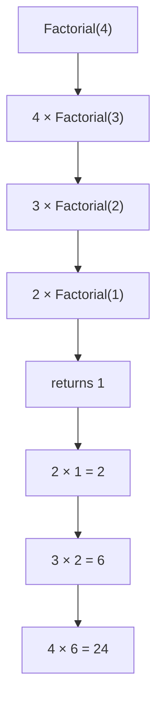
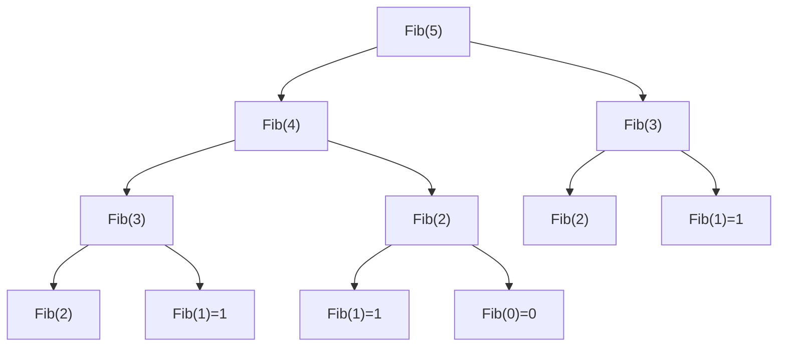

## A Function That Calls Itself

Recursion is one of the most elegant ideas in computer science. A **recursive function** is one that solves a problem by calling itself on a smaller version of the same problem, until the problem is small enough to solve directly.

**Real-world analogy:** Russian nesting dolls (Matryoshka). Each doll contains a smaller version of itself. To find the innermost doll, you open each one in turn — and you know you are done when you reach one that does not open. That innermost doll is the **base case**.

---

## The Two Essential Parts of Every Recursive Function

Every correct recursive function must have:

1. **Base case**: The simplest version of the problem that can be solved directly — no recursive call needed. Without it, the function calls itself forever.

2. **Recursive case**: Reduces the problem to a smaller version and calls itself on that smaller version.

```
IF (base case reached)
    RETURN direct answer
ELSE
    RETURN (recursive call on smaller input) + (any combining work)
```

---

## Example 1: Factorial

The factorial of $n$ is defined as:

$$n! = n \times (n-1) \times (n-2) \times \cdots \times 1, \quad 0! = 1! = 1$$

**Recursive definition:**

$$n! = \begin{cases} 1 & \text{if } n \leq 1 \\ n \times (n-1)! & \text{if } n > 1 \end{cases}$$

**Pseudocode:**

```
ALGORITHM Factorial(n):
  IF n <= 1 THEN          // base case
    RETURN 1
  ELSE
    RETURN n * Factorial(n - 1)    // recursive case
```

**Execution trace for $n = 4$:**



Step by step:
- `Factorial(4)` calls `Factorial(3)`
- `Factorial(3)` calls `Factorial(2)`
- `Factorial(2)` calls `Factorial(1)`
- `Factorial(1)` = 1 (base case — returns immediately)
- `Factorial(2)` = 2 × 1 = 2
- `Factorial(3)` = 3 × 2 = 6
- `Factorial(4)` = 4 × 6 = **24** ✓

**Recurrence:** $T(n) = T(n-1) + c$, solved to $T(n) = O(n)$.

---

## Example 2: Recursive Addition

```
ALGORITHM Add(p, q):
  IF q == 0 THEN          // base case
    RETURN p
  ELSE
    RETURN 1 + Add(p, q - 1)   // recursive case
```

**Trace for Add(3, 2):**
- `Add(3, 2)` = 1 + `Add(3, 1)`
- `Add(3, 1)` = 1 + `Add(3, 0)`
- `Add(3, 0)` = 3 (base case)
- `Add(3, 1)` = 1 + 3 = 4
- `Add(3, 2)` = 1 + 4 = **5** ✓

This proves $3 + 2 = 5$ by making two additions of 1. Inefficient, but illustrates the structure.

---

## Example 3: Fibonacci Numbers

The Fibonacci sequence: $0, 1, 1, 2, 3, 5, 8, 13, 21, 34, \ldots$

$$F(n) = \begin{cases} 0 & \text{if } n = 0 \\ 1 & \text{if } n = 1 \\ F(n-1) + F(n-2) & \text{if } n \geq 2 \end{cases}$$

```
ALGORITHM Fibonacci(n):
  IF n == 0 THEN RETURN 0      // base case 1
  IF n == 1 THEN RETURN 1      // base case 2
  RETURN Fibonacci(n-1) + Fibonacci(n-2)   // recursive case
```

**Trace for $n = 5$:**



**Problem:** `Fib(3)` is computed **twice**, `Fib(2)` three times. For large $n$, this grows exponentially.

**Complexity of naive Fibonacci:** $T(n) = T(n-1) + T(n-2) + O(1)$

This recurrence has solution $T(n) = O(\phi^n)$ where $\phi \approx 1.618$ (golden ratio). That is **exponential** — catastrophically slow.

For $n = 50$: the naive recursion makes over one trillion calls. The iterative version makes 50 iterations.

---

## The Call Stack

When a function calls itself, the computer creates a new **stack frame** for each call, storing:
- The function's local variables
- The return address (where to go when this call finishes)

**Visual for Factorial(4):**

```
| Factorial(1): n=1, returns 1     |  ← top (resolves first)
| Factorial(2): n=2, waiting...    |
| Factorial(3): n=3, waiting...    |
| Factorial(4): n=4, waiting...    |  ← bottom (started first)
```

Each frame is pushed when a recursive call is made and popped when it returns. The stack depth equals the **depth of recursion**.

**Stack overflow:** If recursion is too deep (e.g., no base case, or $n = 100{,}000$ in factorial), the stack runs out of memory. This is why large-$n$ problems are usually solved iteratively.

---

## Iteration vs. Recursion

| Aspect | Iteration | Recursion |
|---|---|---|
| Control mechanism | Loops (for, while) | Recursive calls |
| Termination condition | Loop continuation condition | Base case |
| Memory | Constant — single stack frame | $O(d)$ stack frames where $d$ = recursion depth |
| Readability | Often more verbose | Often mirrors the mathematical definition |
| Risk | Infinite loop if condition never false | Stack overflow if base case missing |
| Performance | Generally faster | Function call overhead per level |

**When to use recursion:**
- The problem is naturally defined recursively (factorials, Fibonacci, trees, divide-and-conquer)
- The recursion depth is manageable ($O(\log n)$ for Merge Sort, $O(n)$ for factorial with small $n$)

**When to prefer iteration:**
- Simple loops with no natural sub-structure
- Large $n$ (millions of recursive calls risk stack overflow)
- Performance-critical code (function call overhead matters)

---

## Worked Example: Power Function

$x^n = x \times x^{n-1}$ for $n \geq 1$, and $x^0 = 1$.

**Naive recursive:**
```
ALGORITHM Power(x, n):
  IF n == 0 THEN RETURN 1
  RETURN x * Power(x, n - 1)
```
Makes $n$ multiplications → $O(n)$.

**Fast recursive (divide and conquer):**
```
ALGORITHM FastPower(x, n):
  IF n == 0 THEN RETURN 1
  IF n is even:
    half = FastPower(x, n/2)
    RETURN half * half
  ELSE:
    RETURN x * FastPower(x, n - 1)
```

For even $n$: $x^n = (x^{n/2})^2$ — one multiplication + one recursive call on half the problem.

Recurrence: $T(n) = T(n/2) + O(1)$, solution: $O(\log n)$.

**Comparing for $n = 1024$:**
- Naive: 1024 multiplications
- Fast: $\log_2 1024 = 10$ multiplications

---

## Common Mistakes with Recursion

**Mistake 1: Missing base case**
```
ALGORITHM BadFactorial(n):
  RETURN n * BadFactorial(n - 1)   // no base case!
```
This calls $n - 1$, then $n - 2$, then $\ldots$, then $-1$, then $-2$, forever. Stack overflow.

**Mistake 2: Base case never reached**
```
ALGORITHM BadFactorial2(n):
  IF n == 0 THEN RETURN 1
  RETURN n * BadFactorial2(n + 1)   // grows, never reaches 0!
```
Same problem.

**Mistake 3: Redundant computation (Fibonacci)**
Covered above — recomputing the same sub-problems. Fixed by Dynamic Programming (memoisation).

---

## Key Takeaway

> Recursion solves problems by reducing them to smaller instances of the same problem. Every recursive function needs a **base case** (direct solution) and a **recursive case** (reduction + call). The call stack grows with recursion depth, so deeply recursive functions can overflow. The efficiency depends entirely on how quickly the recursion reduces the problem — $O(\log n)$ reduction (like Fast Power) is excellent; $O(1)$ reduction (like Fibonacci naive) can be exponential.

---

## Exam Tips

**What lecturers test:**
- Trace a recursive function for small $n$ (show all calls and return values)
- State the base case and recursive case of a given algorithm
- Write a simple recursive function from a mathematical definition
- Explain why naive Fibonacci is slow and state its complexity
- Compare recursion to iteration

**Common mistakes:**
- Forgetting that base case must halt — "returns 0 for $n=0$" is only a valid base case if 0 is actually reached
- Saying recursion is "always slower" — deep recursion is slower; tail recursion and $O(\log n)$ recursions can be very efficient
- Tracing Fibonacci incorrectly by forgetting it branches (two calls, not one)

**Likely question:**
> "Write a recursive function to compute $n!$. Trace it for $n = 4$, showing all recursive calls. Derive the recurrence relation and solve it." (10 marks)
