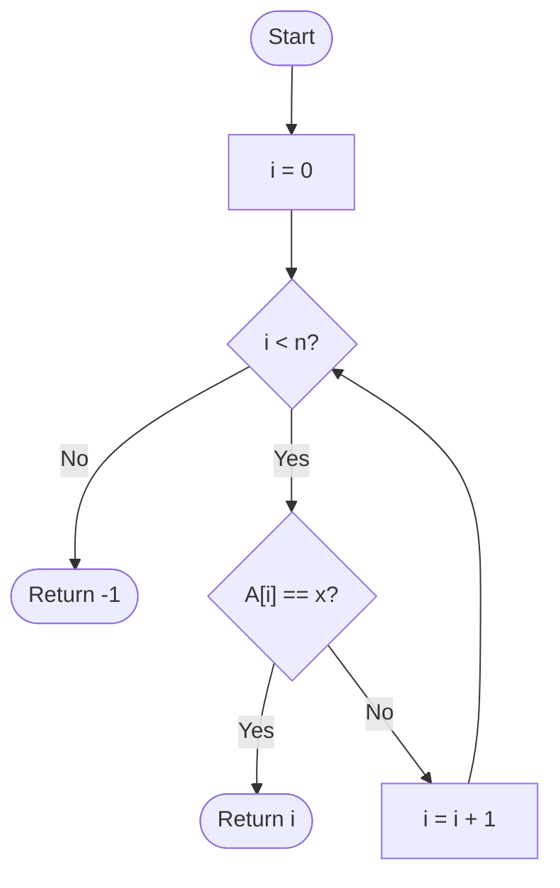

## The Simplest Question in Computing

Searching is one of the most fundamental operations in computing. Given a collection of items and a target, does the target exist in the collection, and if so, where?

Sequential search — also called **linear search** — is the most direct answer: start at the beginning, check each item in turn until you either find the target or reach the end.

**Real-world analogy:** Imagine you have a stack of 100 unlabeled envelopes and you are looking for one containing a specific amount. You open them one by one from the top. That is sequential search. You have no other choice unless the envelopes are sorted and labelled (which is what binary search exploits).

---

## The Algorithm

**Input:** An array $A$ of $n$ elements, and a target value $x$.  
**Output:** The index $i$ such that $A[i] = x$, or $-1$ if $x$ is not in $A$.

```
ALGORITHM SequentialSearch(A, n, x):
  FOR i FROM 0 TO n - 1 DO:
    IF A[i] == x THEN
      RETURN i          // found: return index
  RETURN -1             // not found
```



---

## Step-by-Step Trace

**Example:** Search for $x = 7$ in $A = [3, 9, 7, 1, 5]$

| Step | $i$ | $A[i]$ | $A[i] == 7$? |
|---|---|---|---|
| 1 | 0 | 3 | No |
| 2 | 1 | 9 | No |
| 3 | 2 | 7 | **Yes → return 2** |

Three comparisons needed. Found at index 2.

**Example:** Search for $x = 6$ in $A = [3, 9, 7, 1, 5]$

| Step | $i$ | $A[i]$ | $A[i] == 6$? |
|---|---|---|---|
| 1 | 0 | 3 | No |
| 2 | 1 | 9 | No |
| 3 | 2 | 7 | No |
| 4 | 3 | 1 | No |
| 5 | 4 | 5 | No → loop ends |

Five comparisons. Return $-1$ (not found).

---

## Correctness

How do we know this algorithm is correct? We need to verify two things:

**Completeness:** If $x$ is in $A$, the algorithm will find it.
- Proof: The loop examines every index from $0$ to $n-1$. If $x = A[i]$ for any $i$, the `IF` condition will eventually be true and the algorithm returns $i$. No element is skipped.

**Soundness:** If the algorithm returns an index $i$, then $A[i] = x$.
- Proof: The only return inside the loop is guarded by `IF A[i] == x`, so we only return $i$ when $A[i]$ really does equal $x$.

**No false positives, no missed elements.** The algorithm is correct.

---

## Complexity Analysis

### Counting Comparisons

The cost of each iteration is one comparison: $A[i] == x$.

**Best case:** $x = A[0]$ — found immediately.  

$$T_\text{best}(n) = 1 = O(1)$$

**Worst case:** $x$ is at $A[n-1]$ or not in the array at all.  

$$T_\text{worst}(n) = n = O(n)$$

**Average case:** If $x$ is equally likely to be at any position $0, 1, \ldots, n-1$:

$$T_\text{avg}(n) = \frac{1 + 2 + \cdots + n}{n} = \frac{n+1}{2} = O(n)$$

So in all meaningful cases, sequential search is $O(n)$.

### Why $O(n)$ Matters

For $n = 1{,}000{,}000$ elements, sequential search may need up to $1{,}000{,}000$ comparisons. Binary search (which requires sorted data) would need only about $\log_2(10^6) \approx 20$ comparisons. The choice of search algorithm has enormous practical impact.

---

## Worked Example 1: Finding a Student's Score

**Problem:** An array stores student IDs at even indices and their scores at odd indices:
$A = [1001, 85, 1002, 72, 1003, 91, 1004, 60]$

Find the score of student $1003$.

**Approach:** Search for $1003$ among the elements at even indices (0, 2, 4, 6).

```
FOR i FROM 0 TO 7 STEP 2:
  IF A[i] == 1003 THEN
    RETURN A[i + 1]   // score is the next element
RETURN -1
```

Trace:
- $i=0$: $A[0] = 1001 \neq 1003$
- $i=2$: $A[2] = 1002 \neq 1003$
- $i=4$: $A[4] = 1003 = 1003$ → return $A[5] = 91$

**Answer:** Student 1003 scored 91. Three comparisons.

---

## Worked Example 2: Count All Occurrences

**Problem:** Count how many times $x$ appears in $A$.

```
ALGORITHM CountOccurrences(A, n, x):
  count = 0
  FOR i FROM 0 TO n - 1 DO:
    IF A[i] == x THEN
      count = count + 1
  RETURN count
```

This always runs exactly $n$ iterations (no early exit), so $T(n) = n = \Theta(n)$ in all cases.

**Example:** $A = [4, 7, 2, 7, 7, 1]$, $x = 7$

- $i=0$: $4 \neq 7$
- $i=1$: $7 = 7$ → count = 1
- $i=2$: $2 \neq 7$
- $i=3$: $7 = 7$ → count = 2
- $i=4$: $7 = 7$ → count = 3
- $i=5$: $1 \neq 7$

Return 3. (7 appears three times.)

---

## When to Use Sequential Search

| Situation | Use Sequential Search? |
|---|---|
| Array is unsorted | ✅ Yes — no other option for exact match |
| Array is very small ($n < 20$) | ✅ Yes — overhead of sorting outweighs savings |
| Need to find all occurrences | ✅ Yes (no early exit) |
| Large sorted array, single search | ❌ No — binary search is far better |
| Repeated searches on same data | ❌ No — sort once, binary search repeatedly |

---

## Key Takeaway

> Sequential search is the simplest correct search algorithm. It requires no preprocessing and works on any array regardless of order. Its time complexity is $O(n)$ in the worst and average case. For small arrays or unsorted data, it is the natural choice. For large sorted datasets, it is far too slow compared to binary search ($O(\log n)$).

---

## Exam Tips

**What lecturers test:**
- Trace sequential search step-by-step on a given array (show all comparisons)
- State and justify the best, worst, and average case complexities
- Compare sequential search to binary search: when is each preferred?

**Common mistakes:**
- Confusing "worst case" with "when the element is absent." Actually both "last element" and "not present" give $n$ comparisons — the same worst case.
- Forgetting that average case is $\dfrac{n+1}{2}$, not $\dfrac{n}{2}$.

**Likely question:**
> "Trace sequential search on $A = [8, 3, 5, 1, 9, 2]$ searching for 9. State the number of comparisons. What is the worst-case time complexity and why?" (6 marks)
