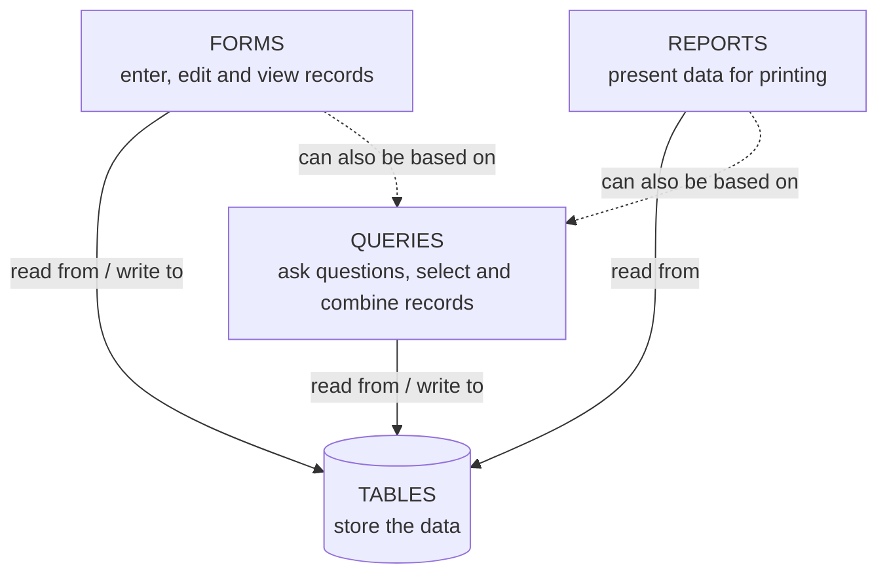

## Four Objects, One Set of Data

Tables **store** all your data; the other three objects — **queries, forms and reports** — are ways of **working with** it. Each of them interacts with the records stored in the tables.

---

## Forms

**Forms** are used for **entering, modifying and viewing records**. You have filled in forms many times — updating your SIM card details, applying for a job, registering for school. Forms are used so often because they are an **easy way to guide people to enter data correctly**. When you enter information into an Access form, the data goes **exactly where the database designer wants it**: into one or more related tables.

Why use forms instead of typing straight into tables?

- **Easier data entry** — one record at a time, with clear labels, instead of a wide, confusing grid.
- **Several tables at once** — with related tables you may need to work with more than one table to enter one set of data; a form can enter data into **multiple tables** in one place.
- **Accuracy and consistency** — designers can set **restrictions** on form controls (drop-down lists, check boxes, required fields, validation) so the needed data is entered **in the correct format**.
- **User-friendly applications** — forms can act as **menus** and **search windows**, turning a data store into an application.

### Creating a simple form

1. In the **Navigation Pane** on the left, **select the Staff table** so it becomes the data source.
2. **CREATE → Forms → Form**.
3. Access builds the form and opens it in **Layout View**. Drag the right border of a highlighted box to **resize** the controls if you want.
4. For more control, switch to **Design View** (HOME → View).
5. **Save** the form (Ctrl+S → name it *Staff*), then switch to **Form View** to use it.

### Entering data in Form View

- Use the **record navigation bar** at the bottom: **First**, **Previous**, the **current record number** ("Record: 3 of 12"), **Next**, **Last**, and **New (blank) record** ▶✱ — or HOME → Records → **New**. Pressing **Tab** past the last field of a record also moves to the next/new record.
- Type the data. **Leave the record** (move to another record) or **save** it (Shift+Enter) — the record is stored in the table.
- The **Search** box on the navigation bar jumps to the first record containing what you type.
- Open the **Staff table** afterwards: the person you added through the form is there.

<ExamTip>
Access creates a form from the table's structure **at that moment**. If you later add a field to the table (say *Phone*), it will **not** magically appear on the existing form — open the form in **Layout View** (or Design View) and use **Add Existing Fields** to place it.
</ExamTip>

### Form Wizard

**CREATE → Form Wizard** gives you more choices:

1. **Tables/Queries** and **fields** — you can pick fields from **several** related tables.
2. **Layout**:

| Layout | Looks like |
|---|---|
| **Columnar** | One record at a time, labels to the left of each field (the classic data-entry form) |
| **Tabular** | Several records, one per row, labels as column headings |
| **Datasheet** | Like the table's datasheet |
| **Justified** | One record at a time, fields side by side with labels above |

3. A **title** → **Open the form to view or enter information** → Finish.

Other form types (CREATE → More Forms / Navigation): **Split Form** (form and datasheet together), **Multiple Items**, **Navigation** forms (menus with tabs).

### Form views, sections and controls

| View | Use it to… |
|---|---|
| **Form View** | Use the form: enter, edit, find and view records |
| **Layout View** | Adjust the design (sizes, positions, themes, add existing fields) **while seeing real data** |
| **Design View** | Full control of the structure: sections, controls, properties (no live data) |

A form's **sections**: **Form Header** (title, logo), **Detail** (the fields — repeats for each record), **Form Footer**. The objects on a form are **controls**: **labels** (fixed text), **text boxes** (bound to fields), **combo boxes/list boxes** (choose from a list), **check boxes** (Yes/No), **command buttons** (run actions). The **Property Sheet** sets each control's properties.

---

## Reports

**Reports** present your data **in print**. A computer printout of your **class schedule** or a printed **invoice** is a database report. Reports put components of your database into an **easy-to-read format**; you can customise their appearance to make them visually appealing — **grouping**, **sorting** and **totals**, page numbers and dates. A report can be based on **any table or query**.

### Creating a simple report

1. Select the **Staff** table in the Navigation Pane.
2. **CREATE → Reports → Report**.
3. The report opens in **Layout View** — adjust the column widths so the data fits.
4. Right-click an empty area → **Print Preview** to see the printed pages.
5. **Close** and **save** it as *Staff*.

### Report Wizard

**CREATE → Report Wizard** builds a more organised report step by step:

1. **Fields** — from one or more tables/queries.
2. **Grouping levels** — e.g. group by **Department**: each department gets a heading with its staff underneath.
3. **Sort order** for the detail records (e.g. by Surname) and **Summary Options** — **Sum, Avg, Min, Max** of number/currency fields per group, *Detail and Summary* or *Summary Only*, *percent of total*.
4. **Layout** — **Stepped**, **Block** or **Outline**; **orientation** — Portrait or **Landscape** (wide reports).
5. **Title** → *Preview the report* → Finish — the report opens in **Print Preview**.

### Report sections and views

| Section | Contents | Printed |
|---|---|---|
| **Report Header** | Title, logo, date | Once, at the start |
| **Page Header** | Column headings | Top of every page |
| **Group Header** | The group value (e.g. *Computer Science*) | Before each group |
| **Detail** | One line per record | For every record |
| **Group Footer** | Group totals (e.g. Sum of Salary) | After each group |
| **Page Footer** | Page numbers ("Page 1 of 3"), date | Bottom of every page |
| **Report Footer** | Grand totals | Once, at the end |

Views: **Report View** (on screen, can filter), **Print Preview** (exactly as printed; Print, Page Setup, export to PDF), **Layout View** (adjust with data), **Design View** (sections and controls).

**Labels** (CREATE → Reports → **Labels**) prints mailing labels from a table (choose the label size, fields and layout); **EXTERNAL DATA → Word Merge** sends the data to a Word mail merge instead.

---

## Try It

Work through the lecture's steps on the Staff table:

1. With **Staff** open, click **CREATE: Form** — the form opens in Layout View. Switch to **Form View**, move through the records with the navigation bar, and edit a salary. Open **▦ Staff** in the Navigation Pane: the table shows the change.
2. In the form click **▶✱ (New record)**, type a new member of staff, then move to another record. Check the table again.
3. Click **Design View: add a Phone field** in the table, then open the form — no Phone! Use **Layout View → Add Existing Fields**.
4. Build a **Form Wizard** form in **Tabular** layout and compare it with Columnar.
5. Click **CREATE: Report**, then build a **Report Wizard** report **grouped by Department**, sorted by Surname, with **Sum** of Salary, in **Landscape**. Compare Report View, **Print Preview** and **Design View** (sections).

<AccessFormReport />

---

## Practice Questions

<MCQ question="Which Form Wizard layout shows one record at a time with the labels to the left of the fields?">
<Option correct>Columnar</Option>
<Option>Tabular</Option>
<Option>Datasheet</Option>
<Option>Justified</Option>
<Explain>Columnar forms show a single record with each field on its own line and its label on the left. Tabular shows many records in rows; Justified places fields side by side with labels above.</Explain>
</MCQ>

<MCQ question="In a report grouped by Department, where would the total salary of each department appear?">
<Option>Report Header</Option>
<Option>Page Header</Option>
<Option correct>Department Footer (group footer)</Option>
<Option>Detail</Option>
<Explain>Group footers print after each group's records, so that is where group totals such as =Sum([Salary]) go. Grand totals go in the Report Footer.</Explain>
</MCQ>

<MCQ question="You added an Email field to a table after creating a form from it. What happens on the form?">
<Option>The Email field appears automatically</Option>
<Option correct>Nothing — you must add it to the form (Add Existing Fields)</Option>
<Option>The form stops working</Option>
<Option>Access rebuilds the form</Option>
<Explain>A form is built from the table's structure at the time it is created; later fields must be added to the form yourself.</Explain>
</MCQ>

<Reveal question="1. What are forms used for in Access? Give three advantages of entering data through a form.">
Forms are used for **entering, modifying and viewing records**. Advantages: they are easier to use than a large datasheet (one record at a time, clear labels); they can enter data into several related tables at once; restrictions on controls (lists, check boxes, required fields) keep data correct and consistent; they can serve as menus/search screens for non-expert users.
</Reveal>

<Reveal question="2. Describe the steps to create a simple form for the Staff table and add a new record with it.">
Select the Staff table in the Navigation Pane → CREATE → **Form** (opens in Layout View; resize if needed) → save it → switch to **Form View** → click **New (blank) record** on the navigation bar (or HOME → Records → New) → type the data → move to another record (or Shift+Enter) to save → open the Staff table to confirm the new record.
</Reveal>

<Reveal question="3. What is a report? Describe how to create one with the Report Wizard.">
A report presents database data in a formatted, printable layout (grouped, sorted, with totals). Report Wizard: CREATE → Report Wizard → choose table/query and fields → add grouping levels → choose sort order and summary options (Sum/Avg…) → choose layout (Stepped/Block/Outline) and orientation → give a title → Finish (opens in Print Preview).
</Reveal>

<Reveal question="4. Name the sections of an Access report and state what each is used for.">
**Report Header** (title, once at the start), **Page Header** (column headings, top of each page), **Group Header** (group value), **Detail** (each record), **Group Footer** (group totals), **Page Footer** (page numbers/date at the bottom of each page), **Report Footer** (grand totals at the end).
</Reveal>

<Reveal question="5. Explain how tables, queries, forms and reports work together.">
All four work with the same data, which is stored only in **tables**. **Queries** select and combine data from tables; **forms** let users enter and edit table data (or query data) conveniently; **reports** print data from tables or queries. Change the data in one place and every object shows the up-to-date information.
</Reveal>

<Takeaway>
- **Forms** = enter, edit and view records; easier, more accurate data entry, can span several tables, can act as menus. CREATE → **Form** (Layout View) or **Form Wizard** (fields, **Columnar/Tabular/Datasheet/Justified**, title).
- Form views: **Form** (use), **Layout** (adjust with data), **Design** (sections: Form Header, Detail, Form Footer; controls: labels, text boxes, combo boxes, check boxes, buttons).
- Navigation bar: First, Previous, record x of y, Next, Last, **New (blank) record**, Search. Records save when you leave them. New table fields must be added to old forms (**Add Existing Fields**).
- **Reports** = printed presentation of table/query data: CREATE → **Report** (Layout View → Print Preview) or **Report Wizard** (grouping, sort, **Sum/Avg** summaries, Stepped/Block/Outline, orientation).
- Report sections: Report Header, Page Header, **Group Header/Footer**, Detail, Page Footer, Report Footer. Views: Report, **Print Preview**, Layout, Design. **Labels** for mailing labels.
- Every object uses the **same table data**.
</Takeaway>

## Exam Tips

- Be ready to **list the Access objects with their uses** and to describe how to create a form and a report (both the one-click button and the wizard).
- The **Form Wizard layouts** and the **report sections** make good short-answer questions.
- In a practical, after creating a form, **add at least one record through it** and show it in the table; for a report, **group** and **summarise** if asked, and check it in **Print Preview** before saving.
- Name objects sensibly (*frmStaff*, *rptStaffByDepartment* or simply *Staff*) and save each one — unsaved forms and reports are lost when the database closes.
