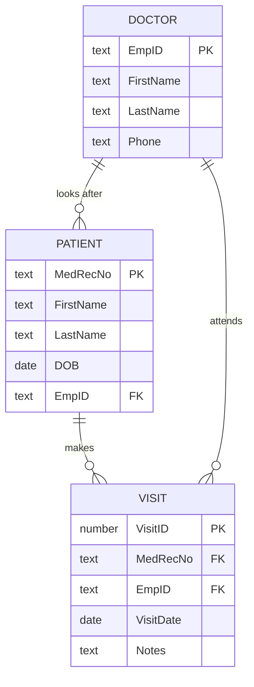
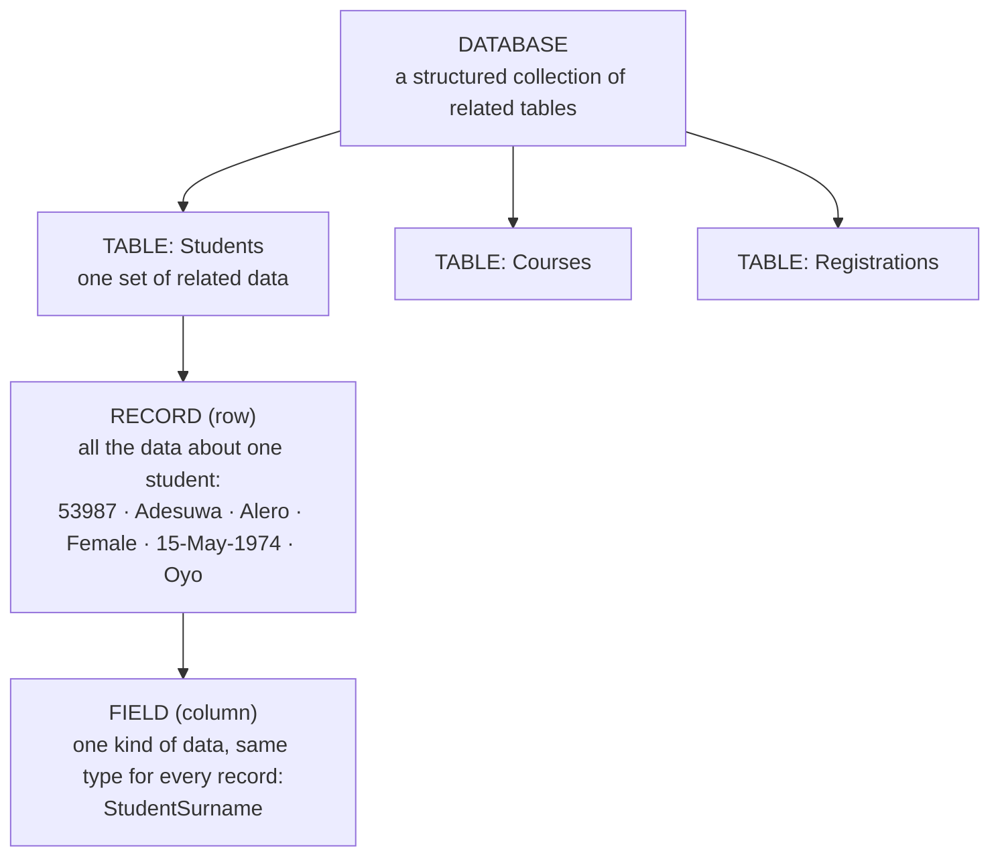
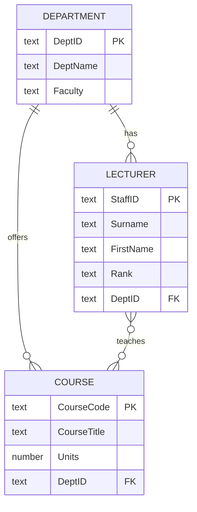

## Getting Started with Access

**Microsoft Access 2013** is the **relational database** application in Office. It lets users **enter, manage and run reports on large amounts of data**. When you start Access, the landing (Start) screen offers templates and — the one you will normally choose — **Blank desktop database**:

1. Click **Blank desktop database**.
2. Type a **File Name** for the database (e.g. `SchoolDB`) and click the folder icon to choose **where to save it**. *Unlike Word and Excel, Access saves the file before you start* — the database exists on disk from the first moment.
3. Click **Create**. Access creates the (empty) database, saved as **.accdb**, and opens a first table, *Table1*, in Datasheet View.

To use Access well you must first understand **databases**.

---

## What Is a Database?

A **database** is a **collection of related data stored in a computer system**, organised so that users can **enter** data, **access** it and **analyse** it quickly and easily. Whenever a shop assistant checks on a computer whether an item is in stock, you are watching a database at work.

The easiest way to think of a database is as a **collection of lists (tables)**. A store's database contains a list of **customers**, a list of **items**, a list of **staff**, a list of **suppliers**…

Excel can store simple lists too, but it is best at numbers. **Access is far stronger at handling non-numerical data** — names, descriptions, addresses — which plays a big role in almost every database, and at relating many lists to one another.

Two simple lists from the lecture — **patients** and **doctors**:

| MedRec# | First Name | Last Name | DOB | Doctor |
|---|---|---|---|---|
| 123-456 | Jack | Okeke | 06/08/72 | Ola |
| 987-654 | Jill | Ade | 08/27/65 | Lewis |
| 753-951 | Mary | Balogun | 12/08/51 | Ola |

| EmpID# | First Name | Last Name | Phone # |
|---|---|---|---|
| 123-333 | Ken | Ola | 555-1234 |
| 123-334 | Laura | Adebisi | 555-4567 |
| 123-335 | Yolanda | Lewis | 555-7890 |

### Relational databases

What really sets a database apart from other ways of storing data is **connectivity**. Access builds **relational databases**: they understand **how lists — and the items in them — relate to one another**. "Relational" means we can **link** sets of data: which doctor each patient sees, when each patient last visited, what happened at each visit — **without repeating** the same details over and over.

*Crow's-foot notation: `||` means "exactly one", `o{` means "zero or many". One doctor looks after many patients; one patient makes many visits.*

---

## The Four Access Objects

Databases in Access are made of four main **objects**. Together they let you **enter, store, analyse and compile** your data however you want.

| Object | Purpose | Views |
|---|---|---|
| **Tables** | **Store the data**. They are the true "base of data" — everything else depends on them. Change the data in a table and every other object shows the newest information | **Design View** (build the structure), **Datasheet View** (see and edit the data in a grid) |
| **Queries** | **Ask questions** of the data: pull records from **one or more tables**, show only the **fields** (columns) you want and limit the **records** (rows) using **criteria** — e.g. give Dr Ken Ola a list of his patients | Design View, **Datasheet View**, SQL View |
| **Forms** | A **user-friendly** way to **view and enter** data one record at a time in a formatted layout; also used to build menus and search windows | Design View, Layout View, **Form View** |
| **Reports** | **Print** data in a formatted structure — **grouped**, sorted and totalled; also form letters and mailing labels | Design View, Layout View, **Report View**, **Print Preview** |

Each object has at least two views: a **Design View**, where you build its structure, and a **"data" view**, which shows the output.

<ExamTip>
"List and give the use of any three (or four) Microsoft Access objects" has appeared in several papers. Name **tables, queries, forms, reports** and give each a one-line use: *tables store data; queries retrieve selected data using criteria; forms enter and view data; reports present data for printing.*
</ExamTip>

---

## Planning the Database

The most important part of creating a relational database is **planning**. Ask:

1. **Input** — What data do I already have for the database?
2. **Output** — What information do I want to get out of it?
3. **Process** — What must I do to get from the input to the output?

It often helps to **plan the final reports first**. If you want a chart of how many patients attended their appointments, do you need to track *cancellations* separately from *no-shows*? *Late arrivals*? *Rescheduled* appointments? If you want to tell them apart later, you must **collect that data** from the start. Planning means predicting the "what ifs" before the data is collected.

---

## Design Rules for Tables

**Tables are the core of your database** — plan them carefully. (This course only scratches the surface of database design; a later course covers the relational model and entity–relationship diagrams in depth.)

| Rule | Meaning | Example |
|---|---|---|
| **Organise data into separate tables** | Don't imitate a spreadsheet with numbered columns | Not *Medication1, Medication2, Medication3* in the Patients table — create a **Medications** table with one row per medication |
| **No derived fields** | Don't store data that can be **looked up** through a relationship | A new Appointment needs only the patient's **MedRec#**; the name and phone number come from the Patients table |
| **Break data into its smallest logical parts** | Putting fields together is easy; pulling them apart needs human effort | Store **FirstName** and **LastName** separately (not one *Name* field); split an address into Street, City, State |
| **Descriptive field names** | Avoid vague abbreviations | Is *DOB* "Date of Birth" or "Department of Babies"? Is *SN* "Surname" or "Serial Number"? |
| **Unique field names** | Don't reuse the same name in different tables | *PatientFirstName* and *DoctorFirstName* instead of *First Name* in both — no confusion when both tables are in one query |
| **No calculated fields** | Tables hold stored data; calculate in **queries, forms and reports** | Don't store *Age* (it changes!) — store *DateOfBirth* and calculate age when needed. (Newer Access has a *Calculated* data type, but it is not always reflected in data-entry forms) |
| **Unique records** | Every table needs a way to tell records apart | Make one field the **Primary Key**; if no natural unique field exists, use an **AutoNumber** |

---

## Fields, Records, Tables, Databases

| Term | Meaning |
|---|---|
| **Field** | **One column** of a table, common to all the records — more than a column: a way of organising information **by its type**. Every entry in a field holds the same kind of data (every *First Name* entry is a name) |
| **Record** | **One row** of a table containing **all the data about one entry** — a unit of information. Each record spans several fields; the record's ID identifies every piece of data on that row |
| **Table** | **One set of related data** — e.g. a bakery's *Customers* table holds each customer's name, phone, address and email. To keep a new kind of information (their birthday) you add a **field** |
| **Database** | A **structured collection of related tables** |

**A collection of fields makes a record; a collection of records makes a table; a collection of tables makes a database.**

---

## Table Design View

**Design View** is where you create or modify a table's structure. For each field you specify:

1. **Field Name** — the column heading (e.g. StudentSurname).
2. **Data Type** — what kind of data the field holds.
3. **Description** (optional) — explanatory text; it appears in the **status bar** when the field is used on a form.
4. **Field Properties** — at the bottom: e.g. **Field Size** (how many characters a Short Text field accepts), **Format** (show a date as 05/05/15 or May 5, 2015), **Required**, **Default Value**, **Validation Rule**.

A **key symbol** beside a field name shows it is the table's **primary key** — its unique identifier.

### Data types (Access 2013)

| Data type | Stores | Example fields |
|---|---|---|
| **Short Text** | Letters, digits, symbols — up to **255** characters | Names, matric numbers, phone numbers, state |
| **Long Text** | Long text (formerly *Memo*) | Course description, notes |
| **Number** | Numbers used in **calculations** (Field Size: Byte, Integer, Long Integer, Single, Double…) | Course unit, quantity, level |
| **Date/Time** | Dates and times | Date of birth, visit date |
| **Currency** | Money (accurate calculations, currency symbol) | Fees, salary, price |
| **AutoNumber** | A **unique number generated automatically** for each new record | StudentID when there is no natural key |
| **Yes/No** | Only two values (Yes/No, True/False, On/Off) — a check box | Fees paid? Hostel resident? |
| **OLE Object** | Objects from other programs (older way to store pictures/documents) | — |
| **Hyperlink** | Web or e-mail addresses | Website, email |
| **Attachment** | Files attached to the record | Passport photograph, scanned certificate |
| **Calculated** | A value calculated from other fields in the same table | Full name (use sparingly — see the design rules) |
| **Lookup Wizard…** | Choose the value from a **list** you type or from **another table** | Gender (Female/Male), Department |

<Analogy>
A data type is like the **label on a drawer**. A drawer labelled *Dates* only accepts dates — try to put "hello" in it and Access refuses ("The value you entered does not match the Date/Time data type in this column"). That strictness is what keeps a database clean.
</Analogy>

### Primary keys (identifiers)

A **primary key** is the field (or fields) whose value **uniquely identifies each record** in a table. When a field is the primary key, **Access will not allow duplicate values or blanks** in it.

**Why every table should have an identifier:**

- to **uniquely identify** each record (two students can share a name, never a matric number),
- to **prevent duplicate** records,
- to **link tables** — the primary key of one table is stored in another as a **foreign key** (a Registrations table stores StudentID and CourseID),
- to let Access **find and sort** records faster (the key is indexed).

Good primary keys are **unique, never blank, and never change** (matric number, staff ID, an AutoNumber). Poor choices: names, phone numbers, ages.

A **foreign key** is a field in one table that holds the primary-key value of a record in **another** table, creating the relationship (e.g. *EmpID* in the Patients table points to the doctor).

---

## Creating a Table and Entering Records

1. CREATE → **Table Design** — a blank Design View opens.
2. Type each **Field Name**, choose its **Data Type**, add a **Description** if useful.
3. Click in the field that will identify records → TABLE TOOLS DESIGN → **Primary Key** (the key symbol appears).
4. Set **Field Properties** (e.g. Field Size 30 for a surname, Format *Medium Date* for a date).
5. **Save** (Ctrl+S) and give the table a name, e.g. *Students*. If you did not set a primary key, Access warns: *"Although a primary key isn't required, it's highly recommended… Do you want to create a primary key now?"* — **Yes** adds an AutoNumber field called ID.
6. Switch to **Datasheet View** (HOME → View) and type the records. Press **Tab** to move to the next field.
7. There is no need to "save" each record — **Access saves a record automatically as soon as you move to another record**. (Only *structural* changes to the design need saving.)

The row marked **✱** is always the place for a **new** record; a pencil ✎ shows the record you are editing.

### Try it: the Students table (lecture post-test)

The lecture's exercise: create a **Students** table with these fields — you decide the data types:

| Field name | Sample data |
|---|---|
| StudentID (PK) | 53987 |
| StudentSurname | Adesuwa |
| StudentFirstName | Alero |
| StudentGender | Female |
| StudentDateofBirth | 15-May-1974 |
| StudentStateofOrigin | Oyo |

1. In **Design View**, set a sensible data type for each field (look at the help under Field Properties). Make **StudentID** the primary key. Try **Lookup Wizard…** for StudentGender with the Row Source `Female;Male`.
2. Switch to **Datasheet View** — Access asks you to save first.
3. Enter the sample record, then two more. Now **break the rules on purpose** and read Access's messages: type `abc` in the date field; leave StudentID blank; repeat an existing StudentID; type *Femal* in a Lookup gender field.

<AccessTableDesigner preset="students" />

The full exercise also asks for a **Courses** table: CourseID (e.g. CSC272), Course title (*Information Management Systems*), Course Unit (3), Course Status (*Required*), CourseDescription (*This course will teach you how to use some Microsoft Apps…*), LevelTaken (200) — with 20 students and 5 courses. Think about the data types: which field needs Long Text? Which should be Number?

---

## Drawing an ERD

A past question: *"Several lecturers and professors belong to different departments; they teach numerous courses in their departments. Represent this in an ERD, with attributes for your entities."*

An **Entity–Relationship Diagram** shows the **entities** (things we keep data about — each becomes a table), their **attributes** (fields; the identifier underlined or marked PK) and the **relationships** between entities with their **cardinality** (one-to-one, one-to-many, many-to-many).

- One **department** has many lecturers; each lecturer belongs to one department (**one-to-many**).
- One department offers many **courses** (**one-to-many**).
- A lecturer teaches many courses and a course may be taught by several lecturers (**many-to-many**) — in Access this becomes a linking table *Teaches* (StaffID, CourseCode, Session) whose key combines both foreign keys.

---

## Practice Questions

<MCQ question="Which Access object would you use to print a list of staff grouped by department with totals?">
<Option>Table</Option>
<Option>Query</Option>
<Option>Form</Option>
<Option correct>Report</Option>
<Explain>Reports present data in a formatted structure for printing, with grouping, sorting and totals.</Explain>
</MCQ>

<MCQ question="A table stores Medication1, Medication2 and Medication3 columns for each patient. Which design rule does this break?">
<Option>Descriptive field names</Option>
<Option correct>Organising data — repeated items belong in a separate table</Option>
<Option>No calculated fields</Option>
<Option>Unique field names</Option>
<Explain>Numbered columns are a spreadsheet habit. In Access create a Medications table (one row per patient-medication), linked to the Patients table.</Explain>
</MCQ>

<MCQ question="What does Access do when you try to save a record whose primary key value already exists?">
<Option>Saves it with a warning</Option>
<Option>Renames the key automatically</Option>
<Option correct>Refuses, because the change would create duplicate values in the primary key</Option>
<Option>Deletes the older record</Option>
<Explain>A primary key must be unique and cannot be blank; Access reports that the change would create duplicate values in the index or primary key.</Explain>
</MCQ>

<Reveal question="1. Define database and relational database.">
A **database** is a structured collection of related data stored on a computer so it can be entered, retrieved and analysed easily. A **relational database** stores data in several related tables and understands how they relate (through keys), so data can be linked without repetition.
</Reveal>

<Reveal question="2. List and give the use of the four Access objects.">
**Tables** — store the data. **Queries** — retrieve/analyse selected data from one or more tables using criteria. **Forms** — user-friendly screens for entering, editing and viewing records. **Reports** — formatted, printable output with grouping and totals.
</Reveal>

<Reveal question="3. What is an identifier (primary key)? For what reasons is it used in a relational database?">
A field (or combination) whose value uniquely identifies each record; it cannot be duplicated or blank. Reasons: to distinguish every record, to prevent duplicate records, to link tables (it becomes a foreign key in related tables), and to speed up searching and sorting.
</Reveal>

<Reveal question="4. Explain any four of the table design rules.">
Any four: organise data into separate tables (no numbered repeating columns); no derived fields (look data up through relationships); break data into its smallest logical parts (first and last names separately); use descriptive field names (not DOB or SN); keep field names unique across tables (PatientFirstName); no calculated fields in tables (calculate in queries/forms/reports); make records unique with a primary key or AutoNumber.
</Reveal>

<Reveal question="5. State the difference between a field and a record.">
A **field** is a column — one kind of information for every record (e.g. Surname). A **record** is a row — all the fields' values for one entity (one student).
</Reveal>

<Reveal question="6. Enumerate four types of data an information management system could capture, with Access data types.">
Text (names — Short Text), numbers (units, quantities — Number), dates (date of birth — Date/Time), money (fees — Currency), true/false facts (fees paid — Yes/No), unique IDs (AutoNumber), long descriptions (Long Text), pictures/files (Attachment), web/email addresses (Hyperlink).
</Reveal>

<Takeaway>
- **Access** = relational database program; file **.accdb** created (and saved) before you start: Blank desktop database → name & location → Create.
- **Database** = collection of related data (lists/tables); **relational** = tables linked so data isn't repeated.
- Four objects: **tables** (store), **queries** (ask/select), **forms** (enter/view), **reports** (print) — each with a Design View and a data view.
- Plan: **input, output, process**; plan the reports first.
- Design rules: separate tables, no derived fields, smallest logical parts, descriptive and unique field names, no calculated fields, unique records (primary key / AutoNumber).
- Field (column) → record (row) → table → database.
- Design View: **field name, data type, description, field properties**. Data types: Short Text, Long Text, Number, Date/Time, Currency, AutoNumber, Yes/No, Hyperlink, Attachment, Lookup Wizard…
- **Primary key** = unique, not blank, identifies records and links tables; a **foreign key** refers to another table's primary key. Records save automatically; design changes must be saved.
</Takeaway>

## Exam Tips

- The **objects and their uses**, the **design rules** and the **primary key** question are the Access theory staples — have short, precise definitions ready.
- In practical tasks: set a **primary key** on every table, pick **sensible data types** (dates as Date/Time, money as Currency, IDs with leading zeros as Short Text) and enter **enough records** (the question usually states how many).
- For an **ERD**, draw each entity as a box listing its attributes with the key marked, and label every relationship line with its cardinality (1 and many / crow's foot).
